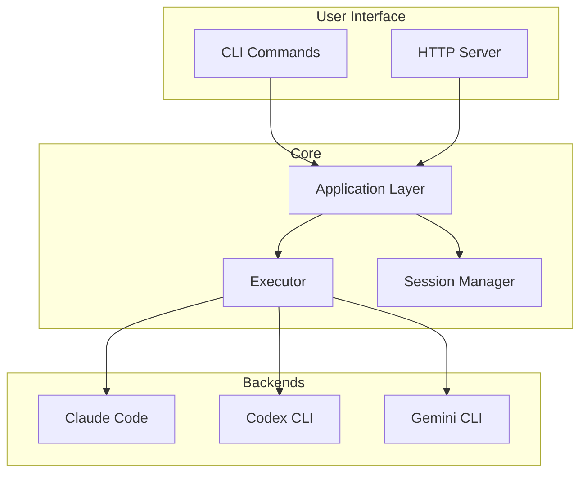

# Architecture

clinvk is designed as a lightweight orchestration layer that wraps existing AI CLI tools, providing unified access and powerful composition capabilities.

## High-Level Design



## Key Principles

### 1. Wrapper, Not Replacement

clinvk doesn't replace AI CLI tools—it wraps them. This means:

- **Zero Lock-in**: You can always use the underlying CLIs directly
- **Automatic Updates**: When backends update, clinvk benefits immediately
- **Full Compatibility**: All backend features remain accessible

### 2. Unified Interface

Despite different backends having different interfaces, clinvk provides:

- **Consistent Commands**: Same syntax for all backends
- **Common Output Format**: Unified JSON structure
- **Shared Configuration**: One config file for all backends

### 3. Composition Over Complexity

Complex workflows are built from simple primitives:

- **Parallel**: Run multiple backends simultaneously
- **Chain**: Pipeline output through backends sequentially
- **Compare**: Get responses from all backends side-by-side

### 4. SDK Compatibility

The HTTP server exposes familiar APIs:

- **OpenAI Compatible**: Use OpenAI SDKs with any backend
- **Anthropic Compatible**: Use Anthropic SDKs with any backend
- **REST API**: Full-featured custom API for all operations

## Components

| Component | Responsibility |
|-----------|---------------|
| **CLI** | Parse commands, handle user interaction |
| **HTTP Server** | REST API, OpenAI/Anthropic compatible endpoints |
| **Executor** | Run backend CLIs, capture output |
| **Session Manager** | Track conversations, enable resume |
| **Config** | Load settings, resolve priorities |

## Data Flow

### Single Prompt

```
User → CLI → Executor → Backend CLI → AI Response → User
```

### Parallel Execution

```
User → CLI → Executor ─┬→ Backend 1 → Response 1 ─┬→ Aggregate → User
                       ├→ Backend 2 → Response 2 ─┤
                       └→ Backend 3 → Response 3 ─┘
```

### Chain Execution

```
User → CLI → Executor → Backend 1 → Output 1 → Backend 2 → Output 2 → User
```

## Learn More

For detailed implementation information, see:

- [Development Architecture](../development/architecture.md) - Full technical details
- [Adding Backends](../development/adding-backends.md) - How to add new backends
- [Contributing](../development/contributing.md) - Contribution guidelines
