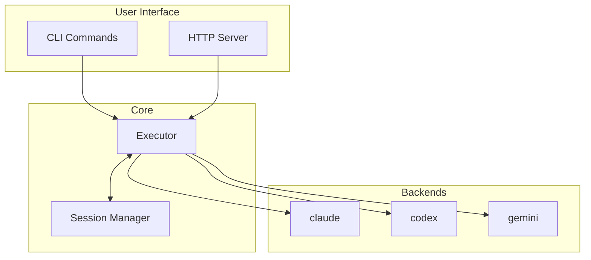
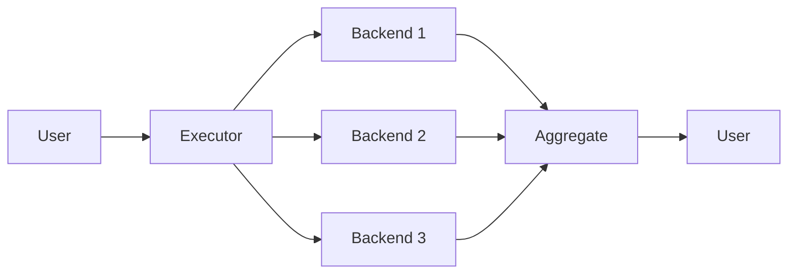
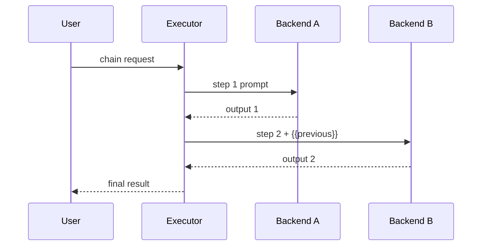

# Architecture

clinvoker is a lightweight orchestration layer that wraps existing AI CLI tools, providing unified access and powerful composition capabilities.

## System Overview



## Key Principles

### 1. Wrapper, Not Replacement

clinvk doesn't replace AI CLI tools—it wraps them:

- **Zero Lock-in**: You can always use the underlying CLIs directly
- **Automatic Updates**: When backends update, clinvk benefits immediately
- **Full Compatibility**: All backend features remain accessible

### 2. Unified Interface

Despite different backends having different interfaces, clinvk provides:

- **Consistent Commands**: Same syntax for all backends
- **Common Output Format**: Unified JSON structure
- **Shared Configuration**: One config file for all backends

### 3. Composition Over Complexity

Complex workflows are built from simple primitives:

- **Parallel**: Run multiple backends simultaneously
- **Chain**: Pipeline output through backends sequentially
- **Compare**: Get responses from all backends side-by-side

## Components

| Component | Responsibility |
|-----------|----------------|
| **CLI** | Parse commands, handle user interaction |
| **HTTP Server** | REST API, SDK-compatible endpoints |
| **Executor** | Run backend CLIs, capture output |
| **Session Manager** | Track conversations, enable resume |
| **Config** | Load settings, resolve priorities |

## Data Flow

### Single Prompt

```
User → CLI → Executor → Backend CLI → AI Response → User
```

### Parallel Execution



### Chain Execution

Chain execution pipelines output from one backend to the next. Each step can use a different backend, with `{{previous}}` placeholder passing the prior result.



## Configuration Cascade

Settings are resolved in priority order:

1. **CLI flags** (highest priority)
2. **Environment variables**
3. **Config file** (`~/.clinvk/config.yaml`)
4. **Default values** (lowest priority)

## Session Storage

Sessions are stored as JSON files:

```
~/.clinvk/sessions/
├── 4f3a2c1d.json
├── 9a8b7c6d.json
└── ...
```

Each session is bound to a single backend and can be resumed with `clinvk resume`.

## Learn More

- [Design Decisions](design-decisions.md) - Why certain choices were made
- [Development Architecture](../development/architecture.md) - Full technical details
- [Adding Backends](../development/adding-backends.md) - How to add new backends
