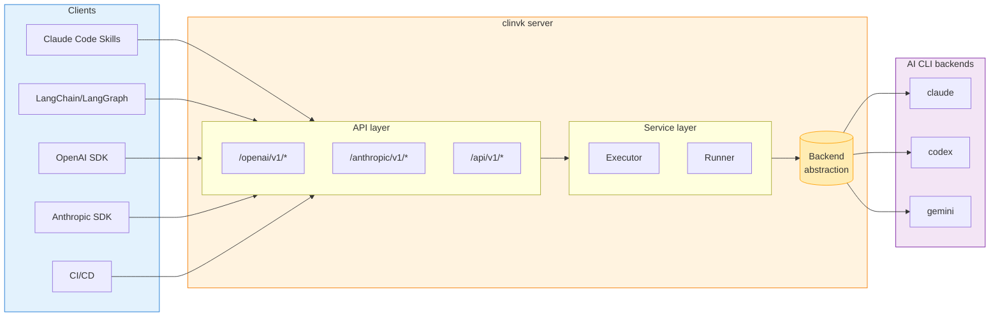
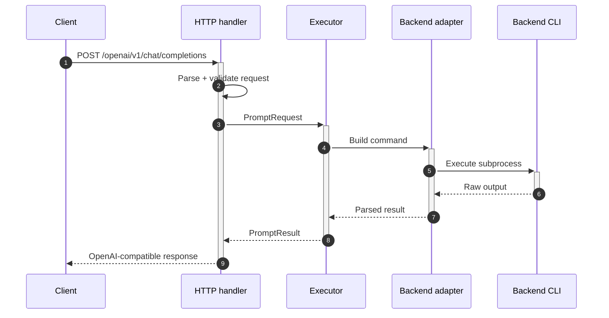
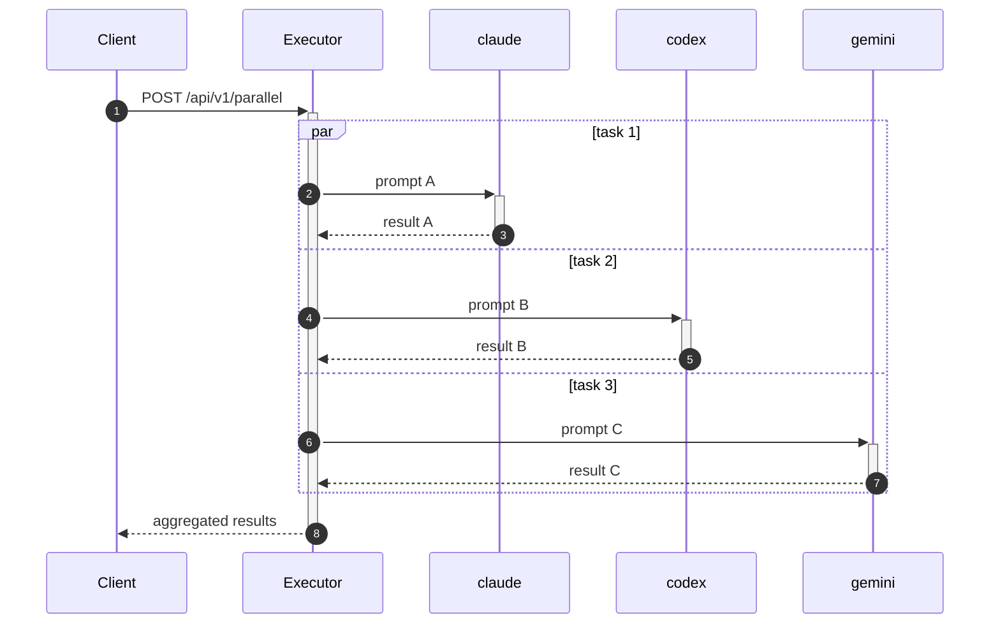
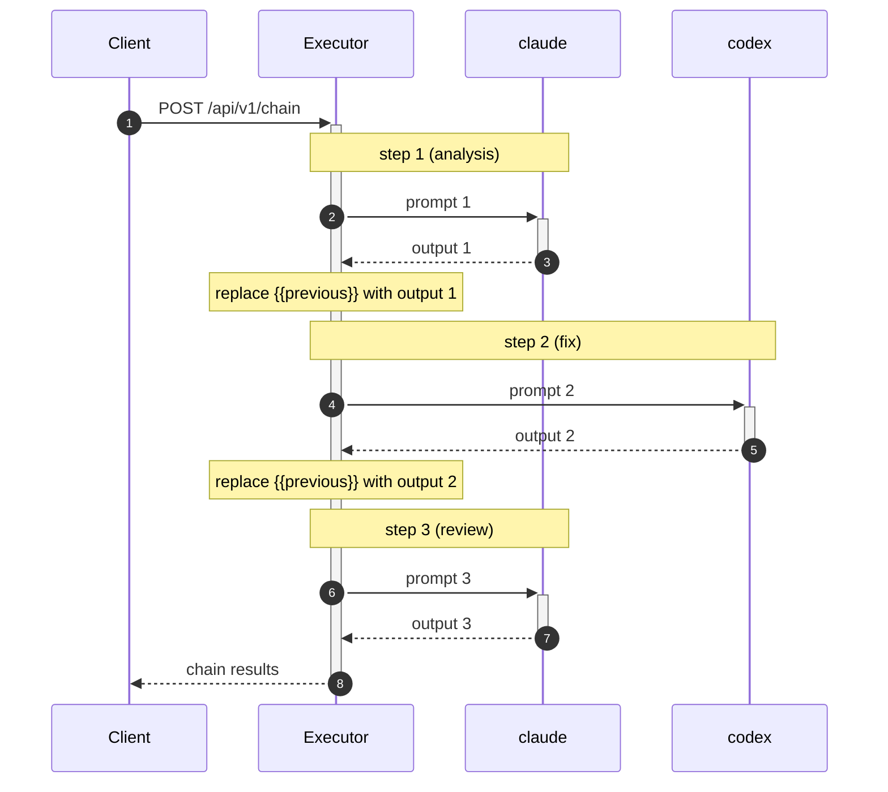
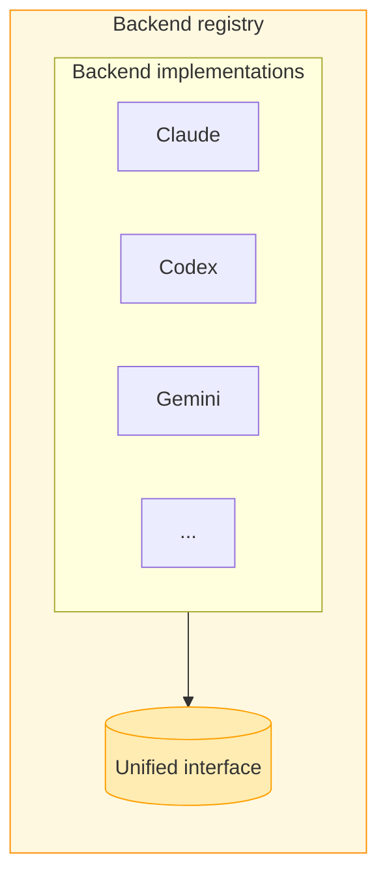
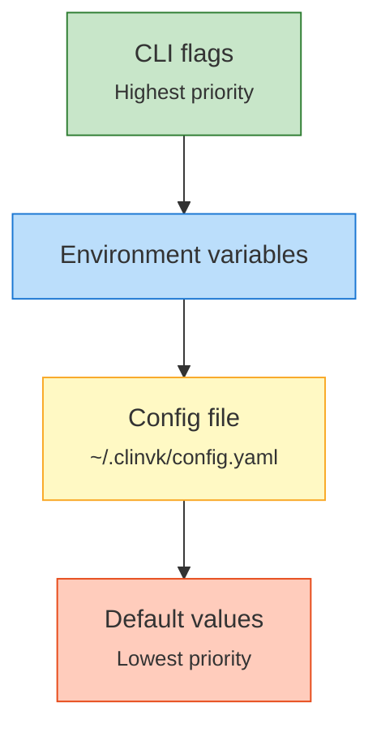
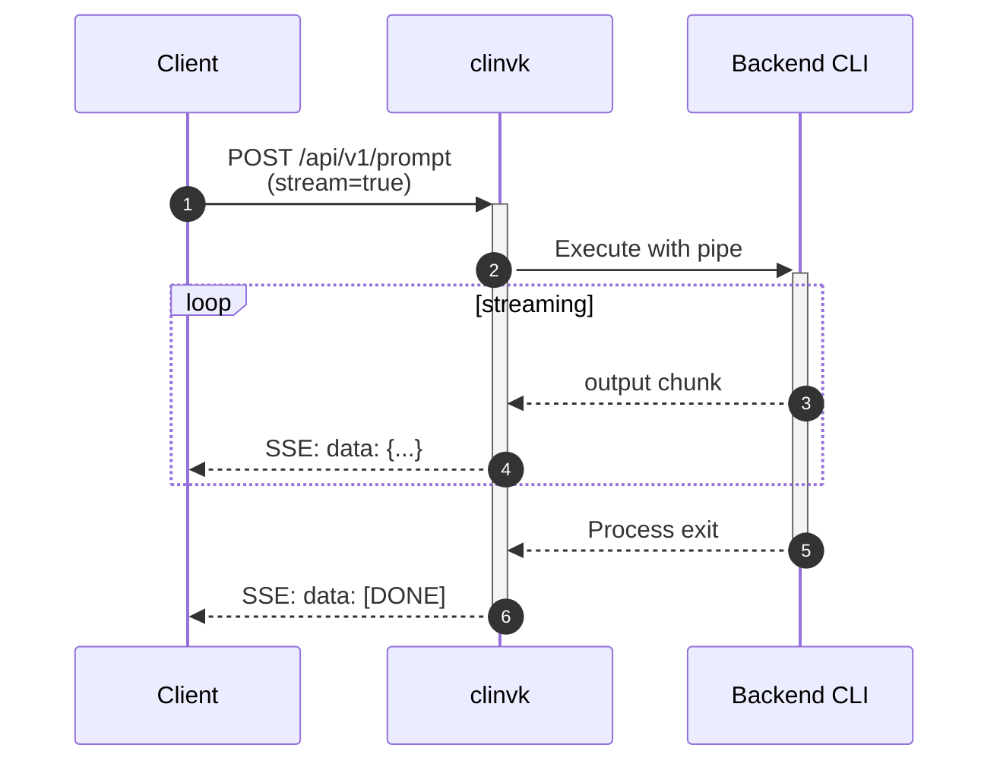

# Architecture

This document describes the internal architecture of clinvk, including system design, request flow, and key components.

## System Architecture



## Layer Overview

### HTTP Layer

The HTTP layer provides multiple API endpoints for different client needs:

| Endpoint | Format | Use Case |
|----------|--------|----------|
| `/openai/v1/*` | OpenAI API format | OpenAI SDK, LangChain |
| `/anthropic/v1/*` | Anthropic API format | Anthropic SDK |
| `/api/v1/*` | Custom REST format | Direct integration, Skills |

### Service Layer

The service layer handles business logic:

- **Executor**: Manages task execution, including parallel and chain modes
- **Runner**: Interfaces with backend abstraction to execute prompts
- **Session Manager**: Handles session persistence and retrieval

### Backend Abstraction

A unified interface for all AI CLI backends:

```go
type Backend interface {
    Name() string
    BuildCommand(req PromptRequest) *exec.Cmd
    ParseResponse(output []byte) (*Response, error)
    SupportsSession() bool
}
```

## Request Flow

### Single Prompt Request



### Parallel Execution Flow



### Chain Execution Flow



## Key Components

### Backend Registry



### Session Management

Sessions are stored as JSON files under `~/.clinvk/sessions/`. Each session is bound to a single backend (Claude, Codex, or Gemini).

```
~/.clinvk/sessions/
├── 4f3a2c1d0e9b8a7c.json
├── 9a8b7c6d5e4f3210.json
└── 4f3a2c1d0e9b8a7c/        # optional artifacts
    └── ...
```

### Configuration Cascade



## Streaming Architecture



## Error Handling

Errors are propagated through the layers with appropriate HTTP status codes:

| Error Type | HTTP Status | Description |
|------------|-------------|-------------|
| Invalid Request | 400 | Malformed request body |
| Backend Not Found | 404 | Unknown backend specified |
| CLI Not Installed | 503 | Backend CLI not available |
| Execution Failed | 500 | CLI returned error |
| Timeout | 504 | Request exceeded timeout |

## Next Steps

- [Design Decisions](design-decisions.md) - Understand why certain choices were made
- [Adding Backends](../development/adding-backends.md) - How to add new backend support
- [REST API Reference](../reference/rest-api.md) - Complete API documentation
