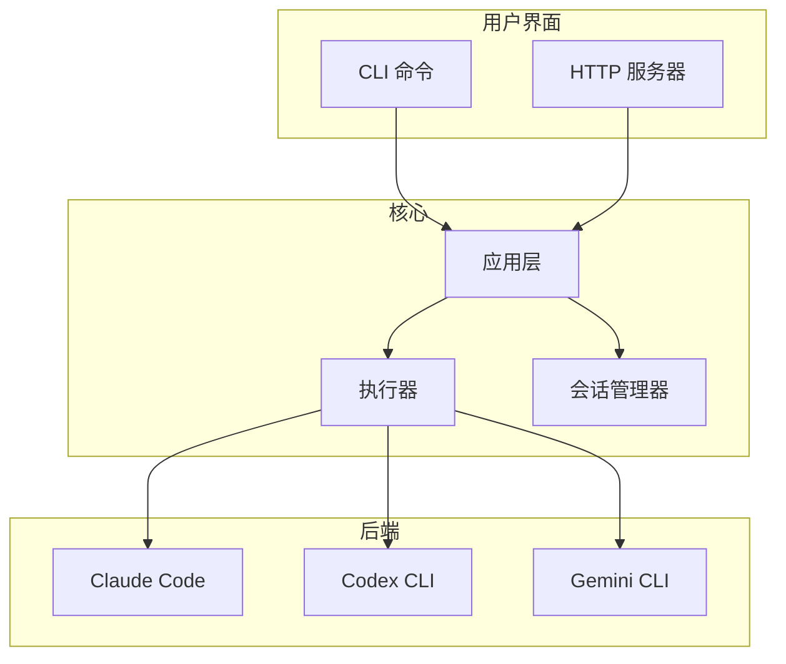

# 架构

clinvk 设计为轻量级编排层，封装现有 AI CLI 工具，提供统一访问和强大的组合能力。

## 高层设计



## 核心原则

### 1. 封装而非替代

clinvk 不替代 AI CLI 工具——而是封装它们。这意味着：

- **零锁定**：你始终可以直接使用底层 CLI
- **自动更新**：后端更新时，clinvk 立即受益
- **完全兼容**：所有后端功能保持可访问

### 2. 统一接口

尽管不同后端有不同接口，clinvk 提供：

- **一致的命令**：所有后端使用相同语法
- **通用输出格式**：统一的 JSON 结构
- **共享配置**：一个配置文件管理所有后端

### 3. 组合优于复杂

复杂工作流由简单原语构建：

- **并行**：同时运行多个后端
- **链式**：顺序通过后端传递输出
- **对比**：并排获取所有后端的响应

### 4. SDK 兼容性

HTTP 服务器暴露熟悉的 API：

- **OpenAI 兼容**：使用 OpenAI SDK 访问任何后端
- **Anthropic 兼容**：使用 Anthropic SDK 访问任何后端
- **REST API**：全功能自定义 API

## 组件

| 组件 | 职责 |
|------|------|
| **CLI** | 解析命令，处理用户交互 |
| **HTTP 服务器** | REST API，OpenAI/Anthropic 兼容端点 |
| **执行器** | 运行后端 CLI，捕获输出 |
| **会话管理器** | 跟踪对话，支持恢复 |
| **配置** | 加载设置，解析优先级 |

## 数据流

### 单个提示

```
用户 → CLI → 执行器 → 后端 CLI → AI 响应 → 用户
```

### 并行执行

```
用户 → CLI → 执行器 ─┬→ 后端 1 → 响应 1 ─┬→ 聚合 → 用户
                     ├→ 后端 2 → 响应 2 ─┤
                     └→ 后端 3 → 响应 3 ─┘
```

### 链式执行

```
用户 → CLI → 执行器 → 后端 1 → 输出 1 → 后端 2 → 输出 2 → 用户
```

## 了解更多

详细实现信息请参见：

- [开发架构](../development/architecture.md) - 完整技术细节
- [添加后端](../development/adding-backends.md) - 如何添加新后端
- [贡献指南](../development/contributing.md) - 贡献指南
