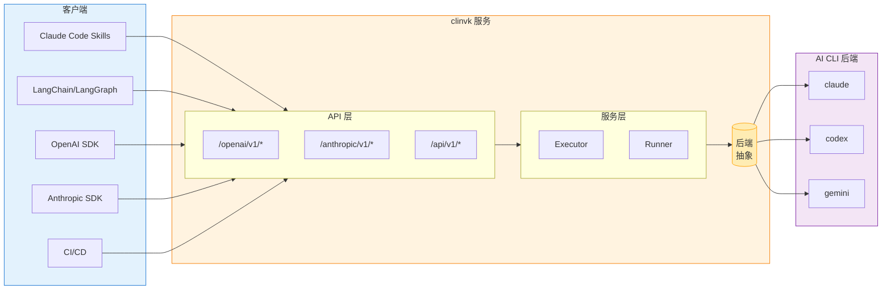
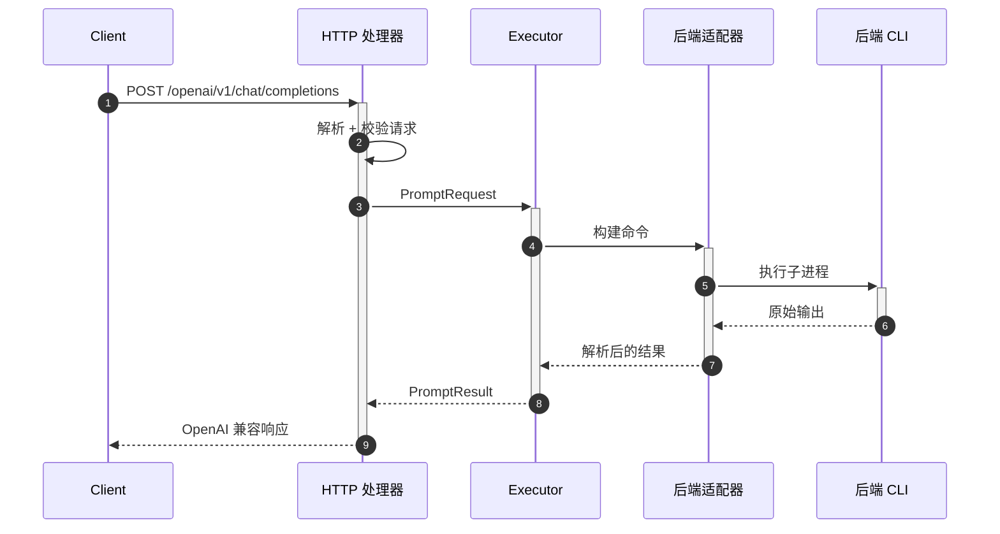
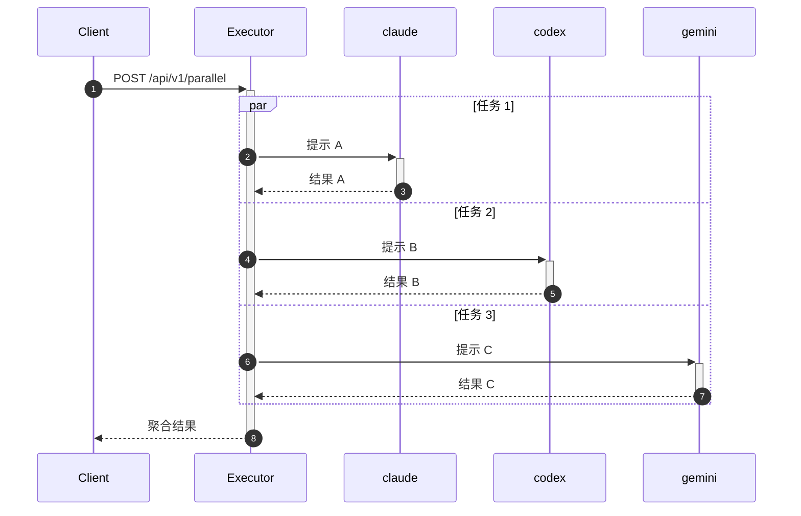
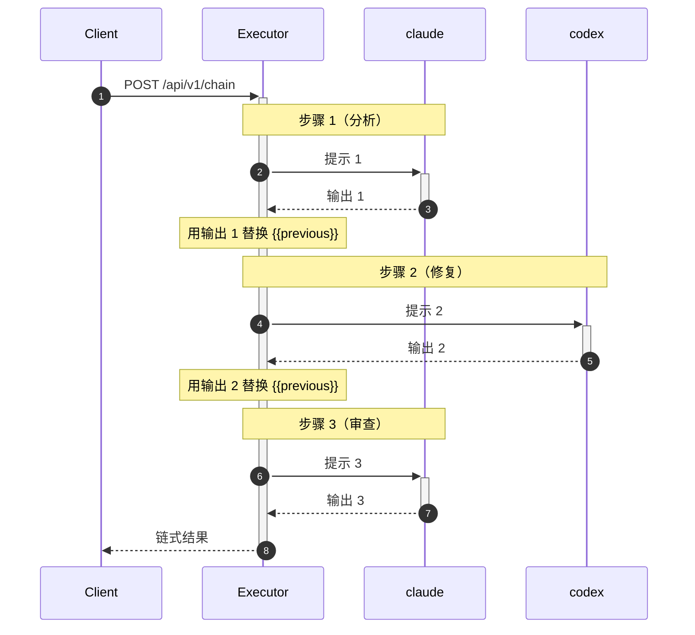
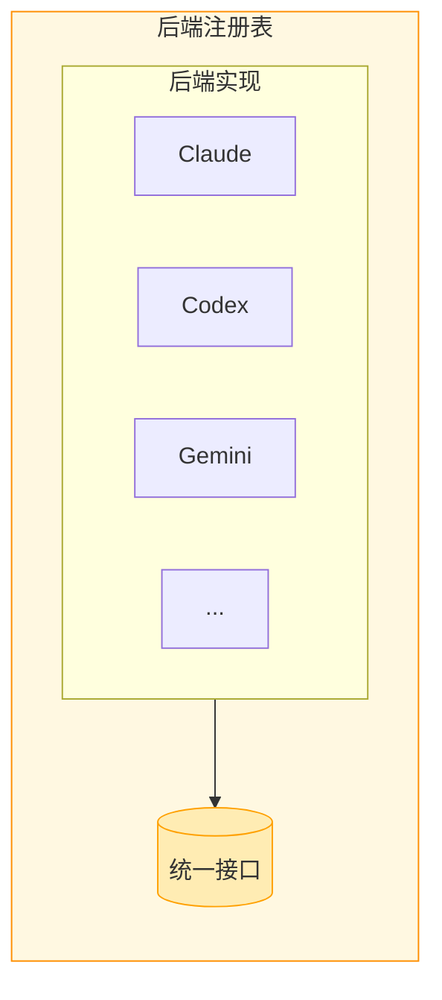
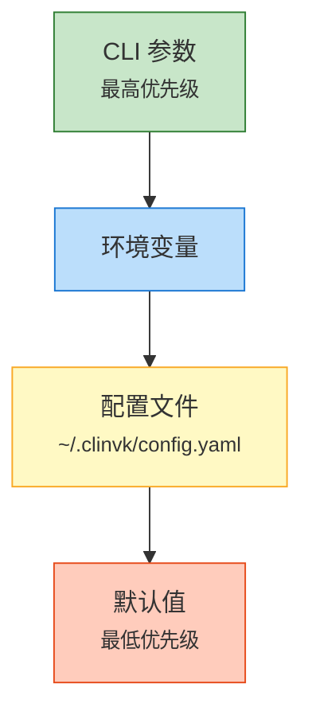
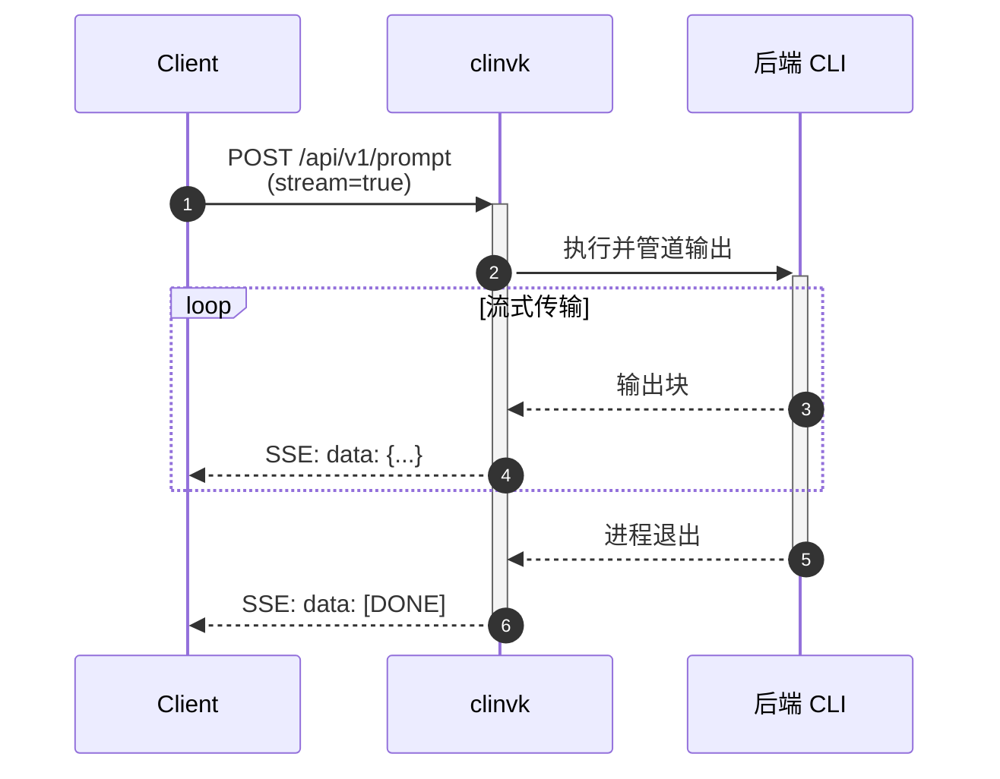

# 架构

本文档描述了 clinvk 的内部架构，包括系统设计、请求流程和关键组件。

## 系统架构



## 层次概览

### HTTP 层

HTTP 层为不同客户端需求提供多个 API 端点：

| 端点 | 格式 | 用例 |
|------|------|------|
| `/openai/v1/*` | OpenAI API 格式 | OpenAI SDK、LangChain |
| `/anthropic/v1/*` | Anthropic API 格式 | Anthropic SDK |
| `/api/v1/*` | 自定义 REST 格式 | 直接集成、Skills |

### 服务层

服务层处理业务逻辑：

- **Executor**：管理任务执行，包括并行和链式模式
- **Runner**：与后端抽象接口交互执行提示
- **Session Manager**：处理会话持久化和检索

### 后端抽象

所有 AI CLI 后端的统一接口：

```go
type Backend interface {
    Name() string
    BuildCommand(req PromptRequest) *exec.Cmd
    ParseResponse(output []byte) (*Response, error)
    SupportsSession() bool
}
```

## 请求流程

### 单个提示请求



### 并行执行流程



### 链式执行流程



## 关键组件

### 后端注册表



### 会话管理

会话以 JSON 文件形式存储在 `~/.clinvk/sessions/` 目录下。每个会话都绑定到一个后端（Claude、Codex 或 Gemini）。

```
~/.clinvk/sessions/
├── 4f3a2c1d0e9b8a7c.json
├── 9a8b7c6d5e4f3210.json
└── 4f3a2c1d0e9b8a7c/        # 可选：会话产物
    └── ...
```

### 配置级联



## 流式架构



## 错误处理

错误通过各层传播，使用适当的 HTTP 状态码：

| 错误类型 | HTTP 状态码 | 描述 |
|----------|-------------|------|
| 无效请求 | 400 | 请求体格式错误 |
| 后端未找到 | 404 | 指定的后端未知 |
| CLI 未安装 | 503 | 后端 CLI 不可用 |
| 执行失败 | 500 | CLI 返回错误 |
| 超时 | 504 | 请求超过超时时间 |

## 下一步

- [设计决策](design-decisions.md) - 了解为什么做出某些选择
- [添加后端](../development/adding-backends.md) - 如何添加新的后端支持
- [REST API 参考](../reference/rest-api.md) - 完整的 API 文档
