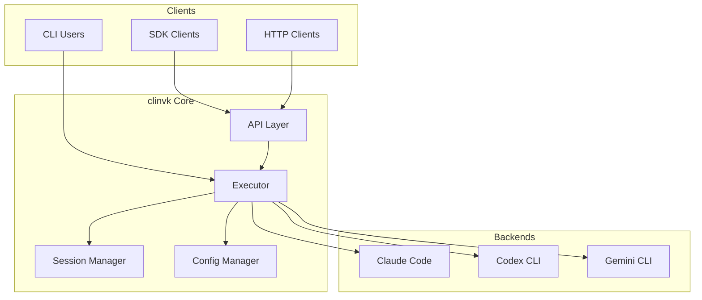

# Architecture

Technical documentation of clinvoker's architecture, design decisions, and system components.

## Architecture Documentation

-   :material-view-dashboard:{ .lg .middle } __Architecture Overview__

    ---

    High-level view of clinvoker's system architecture, components, and data flow.

    [:octicons-arrow-right-24: Read overview](overview.md)

-   :material-server:{ .lg .middle } __Backend System__

    ---

    Deep dive into the backend abstraction layer and how different AI CLIs are unified.

    [:octicons-arrow-right-24: Explore](backend-system.md)

-   :material-folder-account:{ .lg .middle } __Session System__

    ---

    How session persistence works, storage format, and cross-process synchronization.

    [:octicons-arrow-right-24: Explore](session-system.md)

-   :material-api:{ .lg .middle } __API Design__

    ---

    REST API architecture, endpoint design, and compatibility layers.

    [:octicons-arrow-right-24: Explore](api-design.md)

-   :material-lightbulb:{ .lg .middle } __Design Decisions__

    ---

    Rationale behind key architectural choices and trade-offs.

    [:octicons-arrow-right-24: Read more](design-decisions.md)

## System Overview

## Key Components

### CLI Application (`cmd/clinvk`)

The main entry point using Cobra framework:

- Command parsing and validation
- Flag processing
- Configuration initialization

### Internal Packages (`internal/`)

| Package | Purpose |
|---------|---------|
| `app/` | CLI command implementations |
| `backend/` | Backend abstraction and implementations |
| `config/` | Configuration management with Viper |
| `executor/` | Command execution and output handling |
| `output/` | Output formatting and streaming |
| `server/` | HTTP API server |
| `session/` | Session persistence and management |

## Design Principles

1. **Backend Agnosticism** - Unified interface across all AI CLIs
2. **Session Persistence** - Cross-process session management
3. **Streaming Support** - Real-time output for long-running tasks
4. **SDK Compatibility** - Drop-in replacement for OpenAI/Anthropic APIs
5. **Extensibility** - Easy to add new backends

## Related Documentation

- [Development Guide](../development/index.md) - Contributing and development
- [Adding Backends](../development/adding-backends.md) - Extend with new backends
- [API Reference](../reference/index.md) - API documentation
