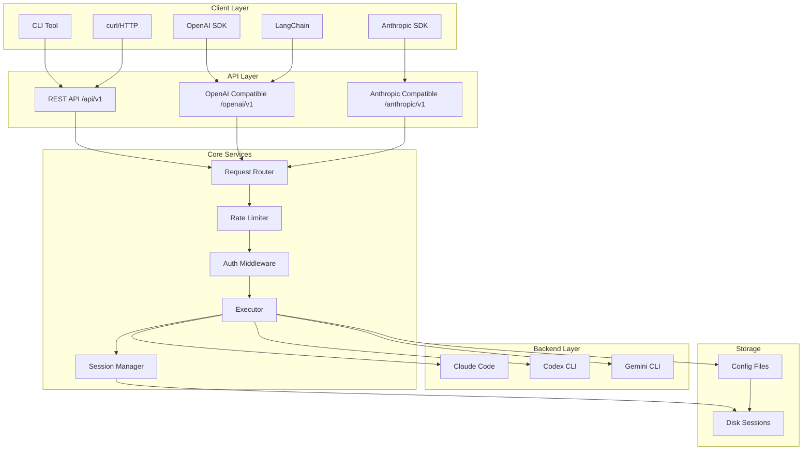
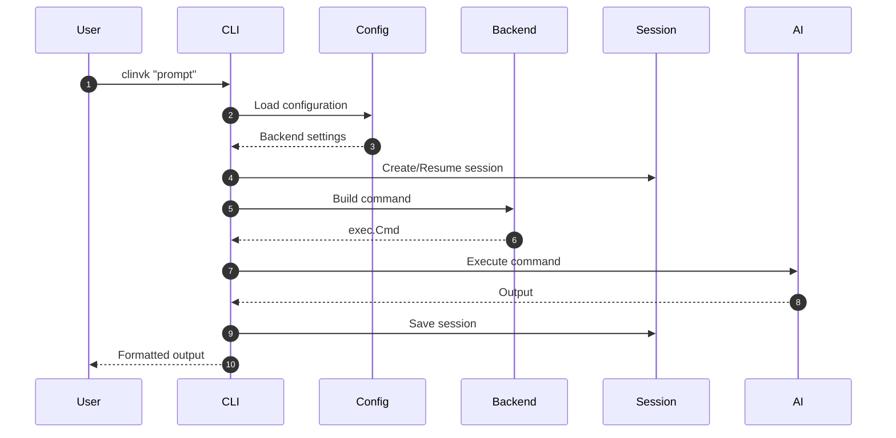
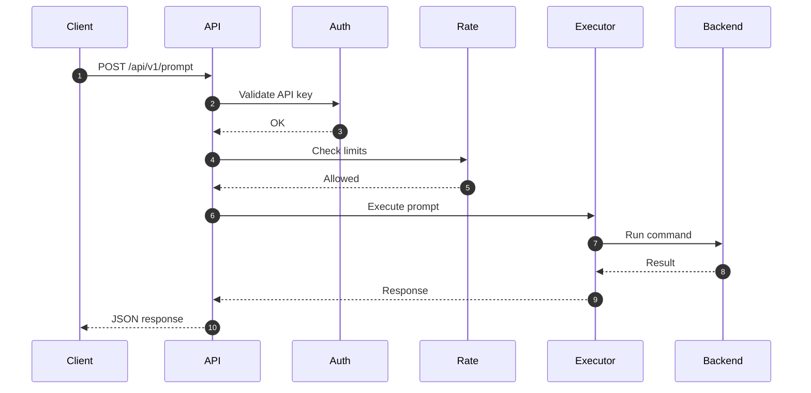
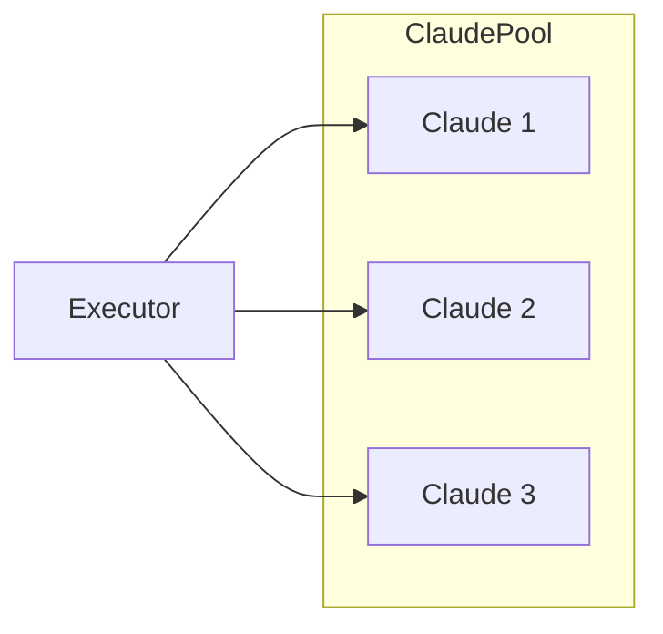

# Architecture Overview

This document provides a high-level view of clinvoker's system architecture, components, and data flow.

## System Architecture

## Component Responsibilities

### CLI Application (`cmd/clinvk`)

- Parses command-line arguments and flags
- Initializes configuration
- Dispatches to appropriate handlers
- Manages lifecycle (sessions, cleanup)

### Backend Layer (`internal/backend/`)

Provides a unified interface for different AI CLI tools:

- **Backend Interface**: Common operations (build command, parse output)
- **Claude Backend**: Claude Code integration
- **Codex Backend**: Codex CLI integration
- **Gemini Backend**: Gemini CLI integration
- **Unified Backend**: Shared logic across backends

### Configuration (`internal/config/`)

Manages configuration using Viper:

- Configuration file loading (YAML)
- Environment variable binding (CLINVK_*)
- Default value management
- Hot reload support

### Session Management (`internal/session/`)

Persists AI conversations across process invocations:

- Session creation and storage
- Session retrieval and resumption
- Metadata tracking (tokens, timing)
- Cross-process file locking

### Executor (`internal/executor/`)

Handles command execution:

- Command building with options
- Execution with timeout
- Output capture and parsing
- Streaming support

### Server (`internal/server/`)

HTTP API server using Chi and Huma:

- RESTful endpoints
- OpenAI/Anthropic compatibility
- Rate limiting
- Authentication
- Metrics

## Data Flow

### CLI Prompt Flow

### HTTP API Flow

## Key Design Decisions

### 1. Backend Abstraction

**Decision**: Abstract all AI CLIs behind a common interface.

**Rationale**:
- Allows seamless switching between backends
- Enables parallel execution across different AIs
- Simplifies client code

**Trade-offs**:
- Some backend-specific features may be hidden
- Need to normalize output formats

### 2. Session Persistence

**Decision**: Persist sessions to disk with cross-process locking.

**Rationale**:
- Enables session resumption across CLI invocations
- Supports CI/CD use cases
- Allows external monitoring of sessions

**Trade-offs**:
- File system dependency
- Need for lock management

### 3. SDK Compatibility

**Decision**: Provide OpenAI and Anthropic compatible endpoints.

**Rationale**:
- Drop-in replacement for existing applications
- Works with LangChain, LlamaIndex, etc.
- Lower barrier to adoption

**Trade-offs**:
- Must maintain compatibility
- Some features may not map cleanly

## Scalability Considerations

### Horizontal Scaling

The server component can be horizontally scaled:

- Statelessness (except session storage)
- No shared in-memory state
- Sessions stored on shared filesystem or database

### Backend Pooling

Future enhancement: pool multiple instances of each backend:

## Security Architecture

### Authentication

- API key validation at entry points
- Support for multiple key sources (env, gopass)
- Per-key rate limiting

### Authorization

- Backend-level permissions
- Work directory restrictions
- Read-only vs. full access modes

### Isolation

- Session isolation
- Working directory restrictions
- Sandbox mode support

## Monitoring and Observability

### Metrics

- Request counts and latency
- Backend availability
- Token usage
- Error rates

### Logging

- Structured JSON logging
- Request/response tracing
- Backend command logging (optional)

### Health Checks

- `/health` endpoint
- Backend availability checks
- Session store health

## Related Documentation

- [Backend System](backend-system.md) - Backend implementation details
- [Session System](session-system.md) - Session persistence
- [API Design](api-design.md) - API architecture
- [Design Decisions](design-decisions.md) - Architectural ADRs
