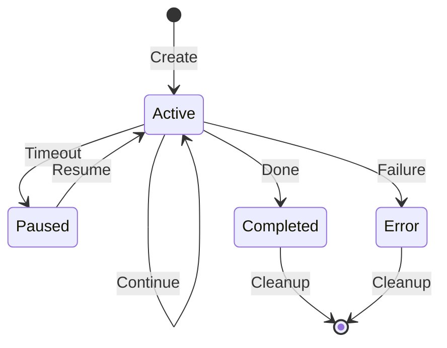

# Session System

How session persistence works, storage format, and cross-process synchronization.

## Session Overview

Sessions enable:

- **Continuity**: Resume conversations across CLI invocations
- **Context**: Maintain working directory and state
- **Audit**: Track usage and token consumption
- **Collaboration**: Share sessions between team members

## Session Structure

```go
type Session struct {
    ID               string            `json:"id"`
    Backend          string            `json:"backend"`
    CreatedAt        time.Time         `json:"created_at"`
    LastUsed         time.Time         `json:"last_used"`
    WorkingDir       string            `json:"working_dir"`
    BackendSessionID string            `json:"backend_session_id"`
    Model            string            `json:"model"`
    InitialPrompt    string            `json:"initial_prompt"`
    Status           SessionStatus     `json:"status"`
    TurnCount        int               `json:"turn_count"`
    TokenUsage       *TokenUsage       `json:"token_usage"`
    Tags             []string          `json:"tags"`
    Title            string            `json:"title"`
    Metadata         map[string]string `json:"metadata"`
}
```

## Storage Format

Sessions are stored as JSON files:

```text
~/.clinvk/sessions/
├── a1b2c3d4e5f6.json
├── b2c3d4e5f6g7.json
└── c3d4e5f6g7h8.json
```

### Session File Example

```json
{
  "id": "a1b2c3d4e5f6789012345678",
  "backend": "claude",
  "created_at": "2025-01-15T10:30:00Z",
  "last_used": "2025-01-15T11:45:00Z",
  "working_dir": "/home/user/projects/myapp",
  "backend_session_id": "claude-sess-abc123",
  "model": "claude-sonnet-4",
  "initial_prompt": "Refactor auth middleware",
  "status": "active",
  "turn_count": 5,
  "token_usage": {
    "input_tokens": 1500,
    "output_tokens": 2300,
    "cached_tokens": 500
  },
  "tags": ["refactoring", "auth"],
  "title": "Auth Middleware Refactoring"
}
```

## Cross-Process Locking

To prevent concurrent modifications:

```go
type SessionStore struct {
    dir string
    mu  sync.RWMutex
}

func (s *SessionStore) Save(sess *Session) error {
    // Acquire file lock
    lockFile := filepath.Join(s.dir, "."+sess.id+".lock")
    flock, err := os.Create(lockFile)
    if err != nil {
        return err
    }
    defer os.Remove(lockFile)
    defer flock.Close()

    // Lock the file
    if err := syscall.Flock(int(flock.Fd()), syscall.LOCK_EX); err != nil {
        return err
    }
    defer syscall.Flock(int(flock.Fd()), syscall.LOCK_UN)

    // Write session
    data, err := json.MarshalIndent(sess, "", "  ")
    if err != nil {
        return err
    }

    return os.WriteFile(s.sessionPath(sess.ID), data, 0600)
}
```

## Session Lifecycle



## Session Operations

### Creating a Session

```go
store := session.NewStore()
sess, err := store.CreateWithOptions("claude", "/work/dir", &session.SessionOptions{
    Model:         "claude-sonnet-4",
    InitialPrompt: "Implement feature X",
    Tags:          []string{"feature", "backend"},
})
```

### Listing Sessions

```go
sessions, err := store.ListWithFilter(&session.ListFilter{
    Backend: "claude",
    Status:  session.StatusActive,
})
```

### Resuming a Session

```go
// Get most recent session
sessions, _ := store.ListWithFilter(&session.ListFilter{})
if len(sessions) > 0 {
    sess := sessions[0]
    // Continue with sess.BackendSessionID
}
```

### Cleaning Up Old Sessions

```go
// Remove sessions older than 30 days
store.Cleanup(30 * 24 * time.Hour)
```

## Configuration

Session behavior is configurable:

```yaml
# ~/.clinvk/config.yaml
session:
  auto_resume: true          # Automatically resume last session
  retention_days: 30         # Keep sessions for 30 days
  default_tags: []           # Tags added to all sessions
  store_token_usage: true    # Track token consumption
```

## Best Practices

### 1. Session Naming

Use descriptive titles:

```bash
# The initial prompt becomes the default title
clinvk "Refactor authentication middleware"
```

### 2. Tagging

Organize with tags:

```go
sess.AddTag("urgent")
sess.AddTag("sprint-12")
```

### 3. Regular Cleanup

Schedule periodic cleanup:

```bash
# Cron job for daily cleanup
0 0 * * * clinvk sessions cleanup --older-than 30d
```

### 4. Backup

Sessions can be backed up:

```bash
# Backup sessions
tar czf sessions-backup-$(date +%Y%m%d).tar.gz ~/.clinvk/sessions/
```

## Security Considerations

### File Permissions

Session files are created with restricted permissions:

```go
// 0600 = owner read/write only
os.WriteFile(path, data, 0600)
```

### Sensitive Data

Sessions may contain sensitive data:

- Prompts with proprietary code
- AI responses with internal details
- Working directory paths

Keep sessions in a secure location and consider encryption for sensitive environments.

## Troubleshooting

### Session Not Found

```bash
# List all sessions
clinvk sessions list

# Check session directory
ls -la ~/.clinvk/sessions/
```

### Corrupted Session

```bash
# Remove corrupted session
rm ~/.clinvk/sessions/corrupted-session.json

# Clean up all sessions
clinvk sessions cleanup
```

### Lock Issues

If a lock file persists:

```bash
# Remove stale lock files
rm ~/.clinvk/sessions/.*.lock
```

## Related Documentation

- [Session Management](../how-to/session-management.md) - User guide
- [Configuration](../reference/configuration.md) - Session configuration options
- [Architecture Overview](overview.md) - High-level architecture
