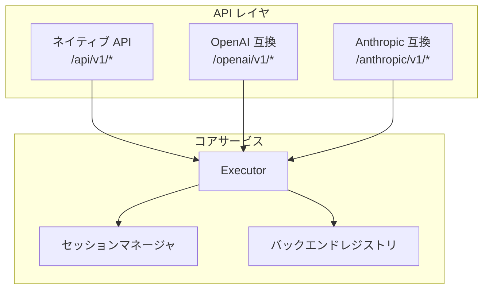
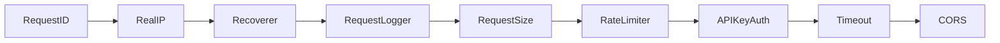
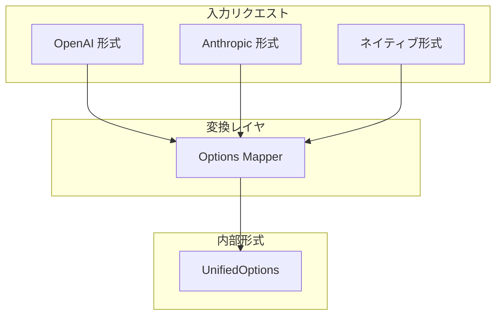

# API 設計

このドキュメントでは、clinvoker の API アーキテクチャ（REST API の設計原則、OpenAI/Anthropic 互換レイヤ、エンドポイントのルーティング、ミドルウェア統合、リクエスト/レスポンス変換）を説明します。

## API アーキテクチャ概要

clinvoker は 3 つの API サーフェスを提供します。



## REST API の設計原則

### リソース指向設計

ネイティブ API は REST 原則に従い、リソース指向の URL を採用します。

| メソッド | エンドポイント | 説明 |
|--------|----------|-------------|
| GET | `/api/v1/health` | ヘルスチェック |
| POST | `/api/v1/prompt` | プロンプトを送信 |
| GET | `/api/v1/sessions` | セッション一覧 |
| GET | `/api/v1/sessions/{id}` | セッション詳細 |
| POST | `/api/v1/sessions/{id}/resume` | セッションを再開 |
| DELETE | `/api/v1/sessions/{id}` | セッションを削除 |

### HTTP ステータスコード

| ステータス | 意味 |
|--------|---------|
| 200 OK | GET/PUT/DELETE 成功 |
| 201 Created | リソース作成 |
| 400 Bad Request | リクエストボディ/パラメータ不正 |
| 401 Unauthorized | API キー欠落/不正 |
| 429 Too Many Requests | レート制限超過 |
| 500 Internal Server Error | サーバーエラー |

### レスポンス形式

すべてのレスポンスは一貫したエンベロープを持ちます。

```json
{
  "data": { ... },
  "meta": {
    "request_id": "req-abc123",
    "timestamp": "2025-01-15T10:30:00Z"
  }
}
```

## OpenAI 互換レイヤ

OpenAI 互換 API（`/openai/v1/*`）は、OpenAI SDK クライアントのドロップイン置換を可能にします。

### エンドポイントマッピング

| OpenAI エンドポイント | clinvoker のハンドラ |
|-----------------|-------------------|
| `POST /v1/chat/completions` | `POST /openai/v1/chat/completions` |
| `GET /v1/models` | `GET /openai/v1/models` |

注: `GET /v1/models/{model}` は未実装です。

### リクエスト変換

```go
// OpenAI のリクエスト形式
{
  "model": "gpt-4",
  "messages": [
    {"role": "system", "content": "You are a helpful assistant."},
    {"role": "user", "content": "Hello!"}
  ],
  "stream": false
}

// clinvoker の内部形式へ変換
{
  "backend": "claude",
  "prompt": "You are a helpful assistant.\n\nHello!",
  "options": {
    "model": "sonnet"
  }
}
```

### レスポンス変換

```go
// clinvoker の内部レスポンス
{
  "content": "Hello! How can I help you today?",
  "session_id": "sess-abc123",
  "usage": {
    "input_tokens": 25,
    "output_tokens": 10
  }
}

// OpenAI のレスポンス形式
{
  "id": "chatcmpl-abc123",
  "object": "chat.completion",
  "created": 1705317600,
  "model": "gpt-4",
  "choices": [
    {
      "index": 0,
      "message": {
        "role": "assistant",
        "content": "Hello! How can I help you today?"
      },
      "finish_reason": "stop"
    }
  ],
  "usage": {
    "prompt_tokens": 25,
    "completion_tokens": 10,
    "total_tokens": 35
  }
}
```

### ストリーミング対応

OpenAI 互換のストリーミングは Server-Sent Events (SSE) を使用します。

```text
data: {"id":"chatcmpl-123","choices":[{"delta":{"content":"Hello"}}]}

data: {"id":"chatcmpl-123","choices":[{"delta":{"content":"!"}}]}

data: {"id":"chatcmpl-123","choices":[{"delta":{},"finish_reason":"stop"}]}

data: [DONE]
```

## Anthropic 互換レイヤ

Anthropic 互換 API（`/anthropic/v1/*`）は、Anthropic SDK クライアントのドロップイン置換を可能にします。

### エンドポイントマッピング

| Anthropic エンドポイント | clinvoker のハンドラ |
|--------------------|-------------------|
| `POST /v1/messages` | `POST /anthropic/v1/messages` |

注: `GET /v1/models` は未実装です。

### リクエスト変換

```go
// Anthropic のリクエスト形式
{
  "model": "claude-3-sonnet-20240229",
  "max_tokens": 1024,
  "messages": [
    {"role": "user", "content": "Hello, Claude!"}
  ]
}

// clinvoker の内部形式へ変換
{
  "backend": "claude",
  "prompt": "Hello, Claude!",
  "options": {
    "model": "sonnet"
  }
}
```

### レスポンス変換

```go
// Anthropic のレスポンス形式
{
  "id": "msg_01XgY...",
  "type": "message",
  "role": "assistant",
  "content": [
    {"type": "text", "text": "Hello! How can I help?"}
  ],
  "model": "claude-3-sonnet-20240229",
  "stop_reason": "end_turn",
  "usage": {
    "input_tokens": 15,
    "output_tokens": 10
  }
}
```

## エンドポイントルーティングのアーキテクチャ

### ルート登録

ルートは `internal/server/routes.go` で登録されます。

```go
func (s *Server) RegisterRoutes() {
    // Register custom RESTful API handlers
    customHandlers := handlers.NewCustomHandlersWithHealthInfo(s.executor, healthInfo)
    customHandlers.Register(s.api)

    // Register OpenAI-compatible API handlers
    openaiHandlers := handlers.NewOpenAIHandlers(service.NewStatelessRunner(s.logger), s.logger)
    openaiHandlers.Register(s.api)

    // Register Anthropic-compatible API handlers
    anthropicHandlers := handlers.NewAnthropicHandlers(service.NewStatelessRunner(s.logger), s.logger)
    anthropicHandlers.Register(s.api)
}
```

### Huma 統合

clinvoker は Huma を利用して OpenAPI 生成とリクエスト/レスポンス検証を行います。

```go
huma.Register(s.api, huma.Operation{
    OperationID: "create-chat-completion",
    Method:      http.MethodPost,
    Path:        "/openai/v1/chat/completions",
    Summary:     "Create chat completion",
    Description: "Creates a completion for the chat message",
    Tags:        []string{"OpenAI"},
}, func(ctx context.Context, input *ChatCompletionRequest) (*ChatCompletionResponse, error) {
    // Handler implementation
})
```

## ミドルウェア統合

### ミドルウェアスタック

ミドルウェアスタックは `internal/server/server.go:58-131` で構成されます。



### Request ID ミドルウェア

トレース用途のユニークな request ID を割り当てます。

```go
func RequestID(next http.Handler) http.Handler {
    return http.HandlerFunc(func(w http.ResponseWriter, r *http.Request) {
        requestID := generateRequestID()
        ctx := context.WithValue(r.Context(), requestIDKey, requestID)
        w.Header().Set("X-Request-ID", requestID)
        next.ServeHTTP(w, r.WithContext(ctx))
    })
}
```

### レート制限ミドルウェア

トークンバケット方式のレート制限を実装します。

```go
type RateLimiter struct {
    rps     float64
    burst   int
    clients map[string]*clientLimiter
    mu      sync.RWMutex
}

func (rl *RateLimiter) Middleware() func(http.Handler) http.Handler {
    return func(next http.Handler) http.Handler {
        return http.HandlerFunc(func(w http.ResponseWriter, r *http.Request) {
            clientID := getClientID(r)
            if !rl.allow(clientID) {
                http.Error(w, "Rate limit exceeded", http.StatusTooManyRequests)
                return
            }
            next.ServeHTTP(w, r)
        })
    }
}
```

### 認証ミドルウェア

複数ソースから API キーを抽出して検証します。

```go
func APIKeyAuth(next http.Handler) http.Handler {
    return http.HandlerFunc(func(w http.ResponseWriter, r *http.Request) {
        apiKey := extractAPIKey(r)
        if apiKey == "" || !isValidAPIKey(apiKey) {
            http.Error(w, "Unauthorized", http.StatusUnauthorized)
            return
        }
        ctx := context.WithValue(r.Context(), apiKeyKey, apiKey)
        next.ServeHTTP(w, r.WithContext(ctx))
    })
}

func extractAPIKey(r *http.Request) string {
    // Check Authorization header
    if auth := r.Header.Get("Authorization"); auth != "" {
        if strings.HasPrefix(auth, "Bearer ") {
            return strings.TrimPrefix(auth, "Bearer ")
        }
    }
    // Check X-Api-Key header
    if key := r.Header.Get("X-Api-Key"); key != "" {
        return key
    }
    return ""
}
```

## 認証設計

### API キーの供給元

API キーは次の方法で提供できます。

1. **HTTP ヘッダー**: `Authorization: Bearer <key>` または `X-Api-Key: <key>`
2. **環境変数**: `CLINVK_API_KEY`
3. **gopass**: セキュアなパスワードストア連携
4. **設定ファイル**: `~/.clinvk/config.yaml`

### キー検証

```go
func (s *Server) validateAPIKey(key string) bool {
    // Check against configured keys
    for _, validKey := range s.config.APIKeys {
        if subtle.ConstantTimeCompare([]byte(key), []byte(validKey)) == 1 {
            return true
        }
    }
    return false
}
```

注: `subtle.ConstantTimeCompare` はタイミング攻撃を避けるために使われます。

## エラーハンドリング戦略

### エラーレスポンス形式

すべてのエラーは一貫した形式に従います。

```json
{
  "error": {
    "code": "invalid_request",
    "message": "The request body is invalid",
    "details": {
      "field": "model",
      "issue": "required"
    }
  }
}
```

### エラー種別

| コード | HTTP ステータス | 説明 |
|------|-------------|-------------|
| `invalid_request` | 400 | リクエスト検証に失敗 |
| `authentication_error` | 401 | API キーが不正/欠落 |
| `rate_limit_exceeded` | 429 | リクエスト過多 |
| `backend_unavailable` | 503 | バックエンドが利用不可 |
| `internal_error` | 500 | 内部サーバーエラー |

### エラーハンドリングミドルウェア

```go
func ErrorHandler(next http.Handler) http.Handler {
    return http.HandlerFunc(func(w http.ResponseWriter, r *http.Request) {
        defer func() {
            if rec := recover(); rec != nil {
                log.Printf("Panic: %v\n%s", rec, debug.Stack())
                respondWithError(w, http.StatusInternalServerError, "internal_error", "Internal server error")
            }
        }()
        next.ServeHTTP(w, r)
    })
}
```

## バージョニング方針

### URL バージョニング

API バージョンは URL パスに含めます。

- `/api/v1/*` - ネイティブ API v1
- `/openai/v1/*` - OpenAI 互換 v1
- `/anthropic/v1/*` - Anthropic 互換 v1

### バージョンネゴシエーション

将来的にはヘッダーによるネゴシエーションをサポートする可能性があります。

```text
Accept-Version: v2
```

### 廃止（deprecation）戦略

1. **告知**: 廃止の 6 か月前に告知
2. **Sunset ヘッダー**: レスポンスに `Sunset` ヘッダーを含める
3. **猶予期間**: 新バージョン公開後 3 か月間は旧版もサポート

## リクエスト/レスポンス変換

### 統一オプションのマッピング



### ストリーミング変換

ストリーミングレスポンスはチャンクごとに変換されます。

```go
func (h *OpenAIHandler) streamResponse(ctx context.Context, input *ChatCompletionRequest, w http.ResponseWriter) {
    w.Header().Set("Content-Type", "text/event-stream")
    w.Header().Set("Cache-Control", "no-cache")
    w.Header().Set("Connection", "keep-alive")

    flusher, ok := w.(http.Flusher)
    if !ok {
        http.Error(w, "Streaming not supported", http.StatusInternalServerError)
        return
    }

    for chunk := range h.executor.Stream(ctx, input) {
        openaiChunk := transformToOpenAI(chunk)
        data, _ := json.Marshal(openaiChunk)
        fmt.Fprintf(w, "data: %s\n\n", data)
        flusher.Flush()
    }

    fmt.Fprint(w, "data: [DONE]\n\n")
    flusher.Flush()
}
```

## 関連ドキュメント

- [アーキテクチャ概要](architecture.md) - システム全体像
- [バックエンドシステム](backend-system.md) - バックエンド抽象化レイヤ
- [セッションシステム](session-system.md) - セッション永続化
- [リファレンス: REST API](../reference/api/rest.md) - API の完全リファレンス
