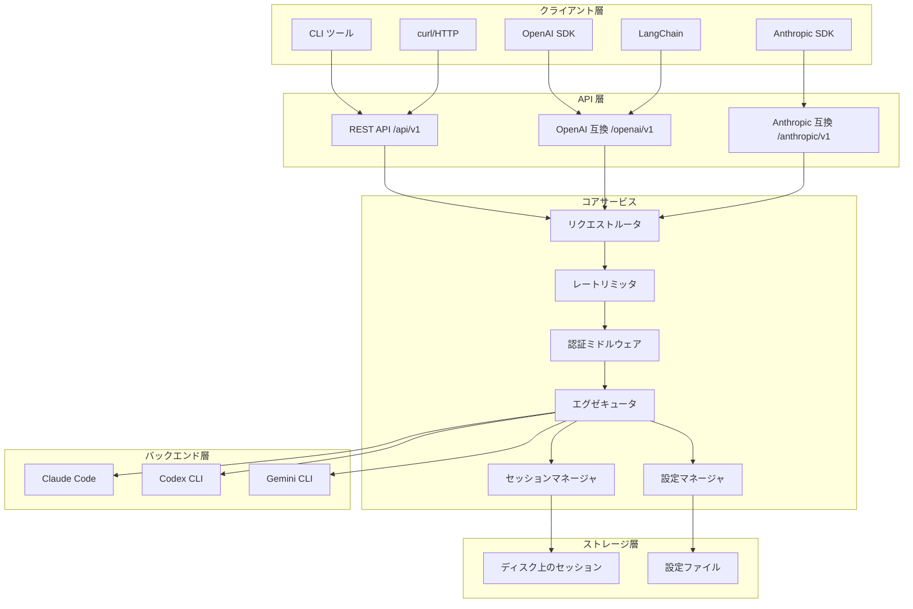
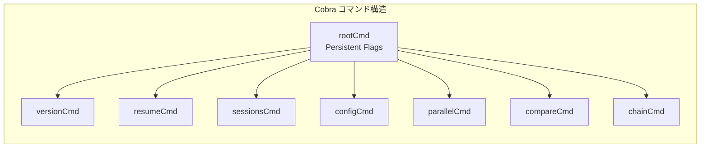
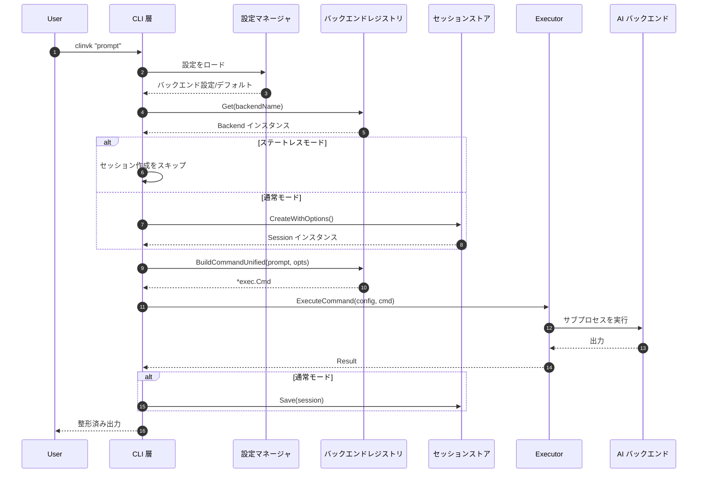
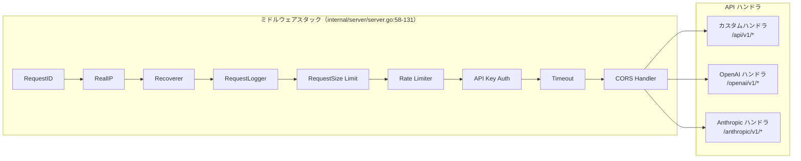
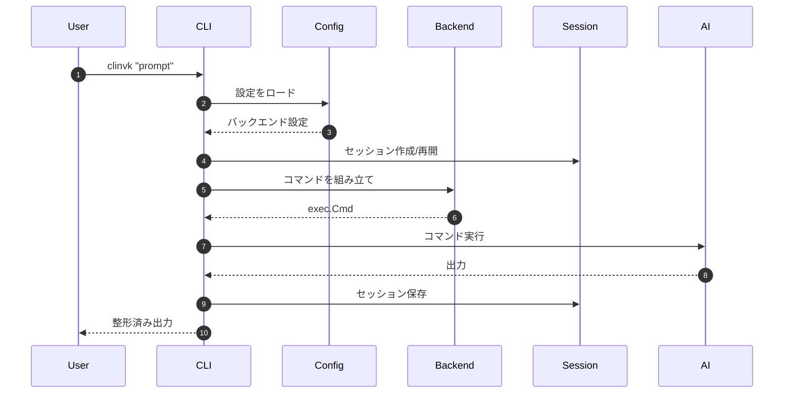
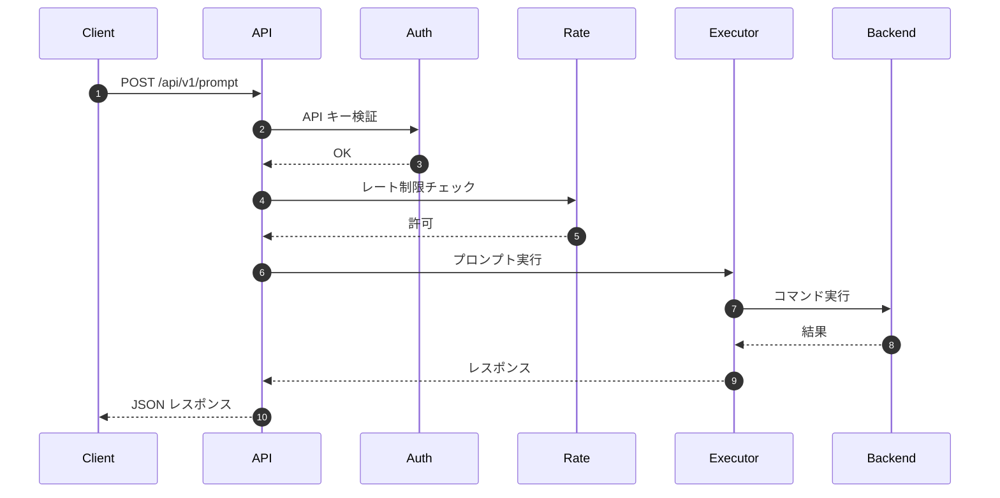
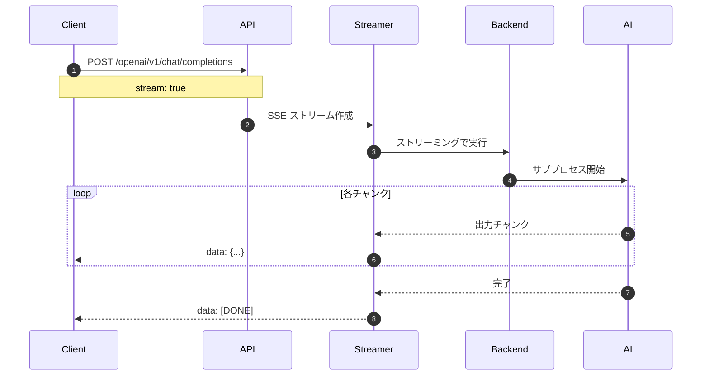
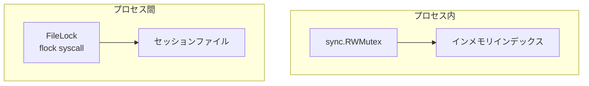
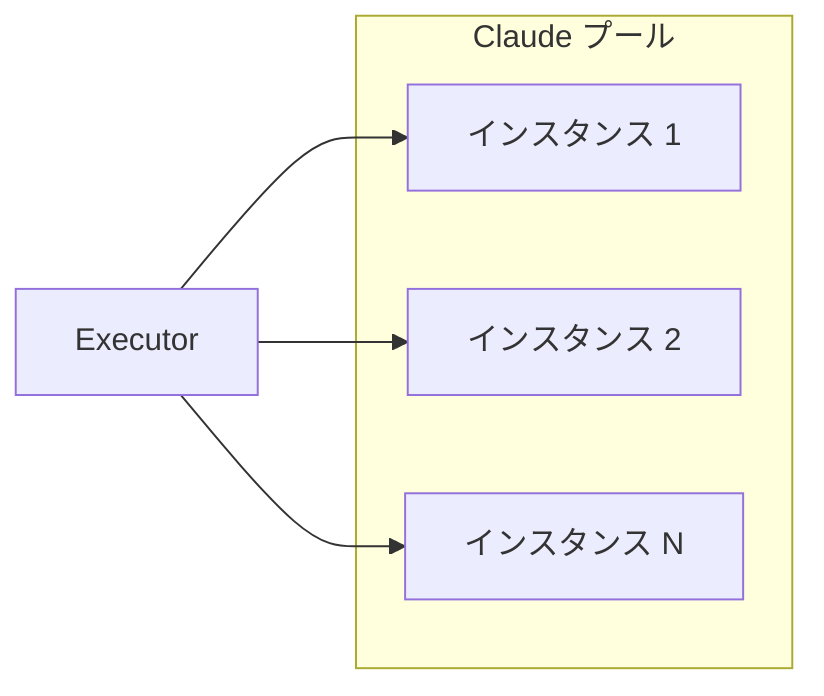

# アーキテクチャ概要

このドキュメントは clinvoker のシステムアーキテクチャを俯瞰し、コンポーネントがどのように連携し、データがどのように流れ、主要機能を支える設計パターンが何かを説明します。

## ハイレベルアーキテクチャ

clinvoker は責務を明確に分離したレイヤードアーキテクチャを採用しています。



## CLI 層の詳細

### エントリポイント（`cmd/clinvk/main.go`）

エントリポイントは Go のベストプラクティスに沿って、意図的に最小化しています。

```go
package main

import (
    "os"
    "github.com/signalridge/clinvoker/internal/app"
)

func main() {
    if err := app.Execute(); err != nil {
        os.Exit(1)
    }
}
```

この設計の狙い:

- main パッケージをクリーンに保つ
- アプリケーションロジックのテストを容易にする
- app パッケージを統合テスト用にインポートできるようにする

### Cobra フレームワーク利用（`internal/app/app.go`）

CLI は Cobra フレームワークでコマンド管理を行います。



主に使っている Cobra 機能:

1. **Persistent Flags**: すべてのサブコマンドで使用可能
   - `--config`: 設定ファイルパス
   - `--backend`: バックエンド選択
   - `--model`: モデル選択
   - `--workdir`: 作業ディレクトリ
   - `--dry-run`: シミュレーションモード
   - `--output-format`: 出力形式
   - `--ephemeral`: ステートレスモード

2. **Local Flags**: 個別コマンド専用
   - `--continue`: 直前セッションの継続（ルートコマンドのみ）

3. **Pre-Run 初期化**: `initConfig()` が実行前に設定をロード

### コマンド実行フロー



## コアコンポーネントの相互作用

### バックエンドレジストリパターン

バックエンドレジストリは、スレッドセーフなレジストリパターンで AI CLI バックエンドを管理します。

```mermaid
flowchart TB
    subgraph Registry["バックエンドレジストリ（internal/backend/registry.go）"]
        RWMUTEX[sync.RWMutex]
        BACKENDS[map[string]Backend]
        CACHE[availabilityCache
        30s TTL]
    end

    subgraph Backends["登録済みバックエンド"]
        CL[Claude バックエンド]
        CO[Codex バックエンド]
        GM[Gemini バックエンド]
    end

    RWMUTEX --> BACKENDS
    BACKENDS --> CL
    BACKENDS --> CO
    BACKENDS --> GM
    BACKENDS --> CACHE
```

レジストリが提供するもの:

- **スレッドセーフなアクセス**: `sync.RWMutex` により読み取り/書き込みを並行制御
- **可用性キャッシュ**: PATH ルックアップ頻度を抑える 30 秒 TTL
- **動的登録**: 実行時にバックエンドの登録/解除が可能

### セッションマネージャのアーキテクチャ

```mermaid
flowchart TB
    subgraph SessionManager["セッションマネージャ（internal/session/）"]
        STORE[Store]
        INDEX[インメモリインデックス
        map[string]*SessionMeta]
        FILELOCK[FileLock
        プロセス間同期]
        RWLOCK[sync.RWMutex
        プロセス内同期]
    end

    subgraph Storage["ファイルシステムストレージ"]
        DIR[~/.clinvk/sessions/]
        SESSION_FILES[*.json files]
        INDEX_FILE[index.json]
    end

    STORE --> INDEX
    STORE --> FILELOCK
    STORE --> RWLOCK
    FILELOCK --> DIR
    RWLOCK --> DIR
    DIR --> SESSION_FILES
    DIR --> INDEX_FILE
```

セッションマネージャは二重ロック戦略を採用します。

1. **プロセス内**: `sync.RWMutex` による goroutine 安全性
2. **プロセス間**: CLI/サーバー併用を想定したファイルロック

### HTTP サーバーのリクエスト処理



ミドルウェアの実行順は重要です。

1. **RequestID**: トレース用のユニーク ID を付与
2. **RealIP**:（プロキシ配下で）実クライアント IP を抽出
3. **Recoverer**: panic から復旧
4. **RequestLogger**: リクエスト詳細をログ
5. **RequestSize**: ボディサイズ上限を強制
6. **RateLimiter**: レート制限を適用
7. **API Key Auth**: リクエスト認証
8. **Timeout**: リクエストタイムアウトを強制
9. **CORS**: クロスオリジン対応

## データフロー

### CLI プロンプトフロー



### HTTP API フロー



### ストリーミングレスポンスフロー



## バックエンド抽象化のアーキテクチャ

### 統一バックエンドインターフェース

すべてのバックエンドは `Backend` インターフェース（`internal/backend/backend.go:16-46`）を実装します。

```go
type Backend interface {
    Name() string
    IsAvailable() bool
    BuildCommand(prompt string, opts *Options) *exec.Cmd
    ResumeCommand(sessionID, prompt string, opts *Options) *exec.Cmd
    BuildCommandUnified(prompt string, opts *UnifiedOptions) *exec.Cmd
    ResumeCommandUnified(sessionID, prompt string, opts *UnifiedOptions) *exec.Cmd
    ParseOutput(rawOutput string) string
    ParseJSONResponse(rawOutput string) (*UnifiedResponse, error)
    SeparateStderr() bool
}
```

### バックエンド実装の構造

```mermaid
flowchart TB
    subgraph Backend_Interface["バックエンドインターフェース"]
        INTERFACE[Backend Interface
        internal/backend/backend.go]
    end

    subgraph Implementations["バックエンド実装"]
        CLAUDE[Claude
        internal/backend/claude.go]
        CODEX[Codex
        internal/backend/codex.go]
        GEMINI[Gemini
        internal/backend/gemini.go]
    end

    subgraph Unified_Layer["統一オプションレイヤ"]
        UNIFIED[UnifiedOptions
        internal/backend/unified.go]
        MAPPER[Flag Mapper
        MapToOptions()]
    end

    INTERFACE --> CLAUDE
    INTERFACE --> CODEX
    INTERFACE --> GEMINI
    UNIFIED --> MAPPER
    MAPPER --> CLAUDE
    MAPPER --> CODEX
    MAPPER --> GEMINI
```

## 並行性パターン

### レジストリの並行性

バックエンドレジストリは read-write mutex パターンを使用します。

```go
// Read operation (concurrent safe)
func (r *Registry) Get(name string) (Backend, error) {
    r.mu.RLock()
    defer r.mu.RUnlock()
    // ... lookup backend
}

// Write operation (exclusive)
func (r *Registry) Register(b Backend) {
    r.mu.Lock()
    defer r.mu.Unlock()
    // ... register backend
}
```

### セッションストアの並行性

セッションストアは複数の同期機構を組み合わせます。



読み取りフロー:

1. 読み取りロック（`RLock`）を取得
2. インメモリインデックスを確認
3. 必要に応じてセッションファイルを読み込み
4. 読み取りロックを解放

書き込みフロー:

1. プロセス間のファイルロックを取得
2. 書き込みロック（`Lock`）を取得
3. セッションをアトミックに書き込み
4. インデックスを更新
5. ロックを解放

## 拡張ポイント

### 新しいバックエンドを追加する

AI CLI バックエンドを追加する手順:

1. **実装ファイル作成**: `internal/backend/newbackend.go`
2. **Backend インターフェース実装**: 必要メソッドをすべて実装
3. **レジストリへ登録**: `registry.go` の `init()` に追加
4. **統一オプションのマッピング**: `unified.go` のフラグマッパを更新

### 新しい CLI コマンドを追加する

1. **コマンドファイル作成**: `internal/app/cmd_newcommand.go`
2. **Cobra コマンド定義**: 既存コマンドをテンプレートにする
3. **ルートコマンドへ追加**: `app.go` の `init()` で追加

### 新しい API エンドポイントを追加する

1. **ハンドラ作成**: 適切なハンドラファイル（`custom.go`, `openai.go`, `anthropic.go` など）
2. **Huma へ登録**: `huma.Register()` と Operation 設定を使用
3. **必要ならミドルウェア追加**: `server.go` のミドルウェアスタックを更新

## スケーラビリティ考慮

### 水平スケーリング

サーバーコンポーネントは水平スケーリングが可能です。

- **ステートレス性**: リクエスト間で共有されるインメモリ状態がない
- **セッションストレージ**: 共有ファイルシステムや DB に保存可能
- **設定**: 起動時にロードし、実行中は変更しない

### バックエンドプーリング（将来）

高スループット用途では、バックエンドをプールできます。



## セキュリティアーキテクチャ

### 認証（Authentication）

- エントリポイントでの API キー検証
- 複数のキー供給元（env, gopass, ヘッダー）
- キー単位のレート制限

### 認可（Authorization）

- 設定によるバックエンド権限
- 作業ディレクトリ制限
- サンドボックスモード対応

### 分離（Isolation）

- セッション分離（セッション間の情報漏洩を防止）
- 作業ディレクトリ制限
- サブプロセス分離

## 監視と可観測性

### メトリクス

- リクエスト数とレイテンシ（Prometheus）
- バックエンド可用性
- トークン使用量
- エラー率

### ロギング

- 構造化 JSON ログ
- リクエスト/レスポンスのトレース
- バックエンドコマンドログ（オプション）

### ヘルスチェック

- ロードバランサ向け `/health` エンドポイント
- バックエンド可用性チェック
- セッションストアのヘルス

## 関連ドキュメント

- [バックエンドシステム](backend-system.md) - バックエンド実装詳細
- [セッションシステム](session-system.md) - セッション永続化の詳細
- [API 設計](api-design.md) - API アーキテクチャ
- [設計判断](design-decisions.md) - アーキテクチャ決定記録（ADR）
