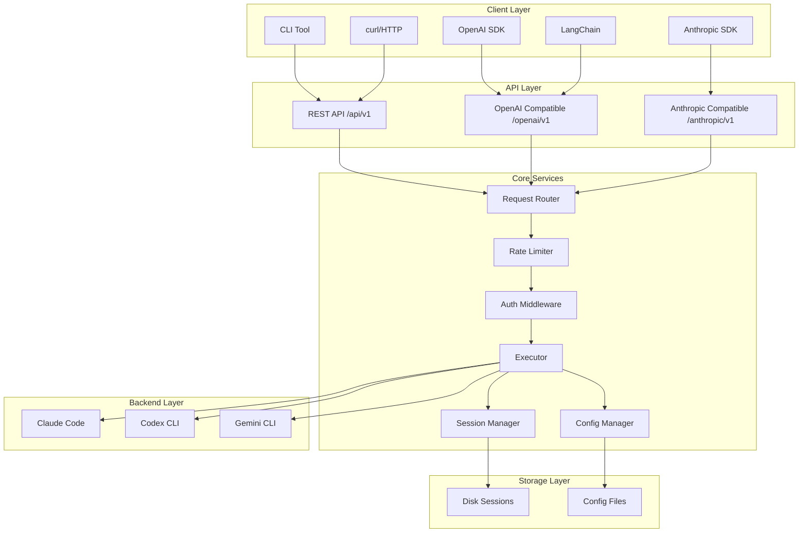
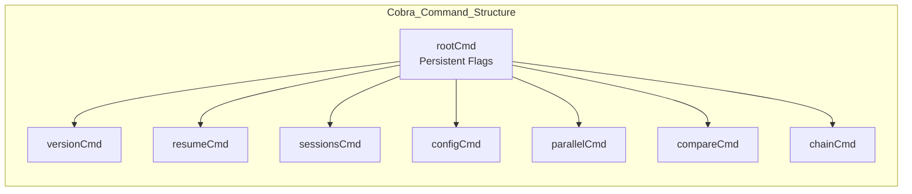
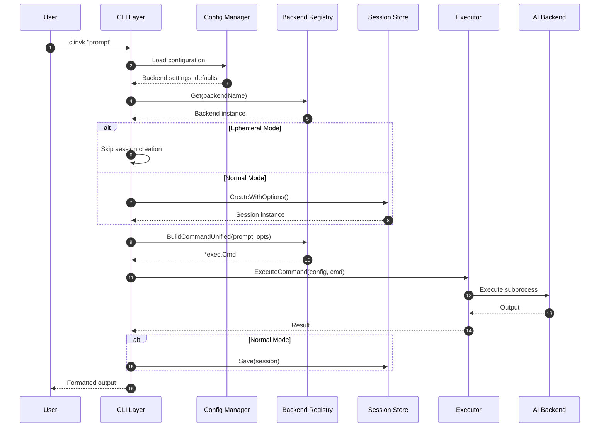
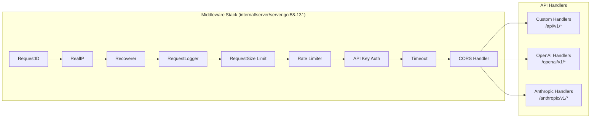
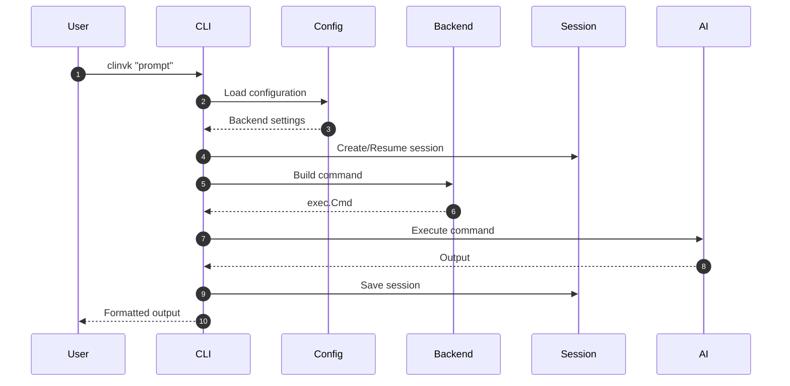
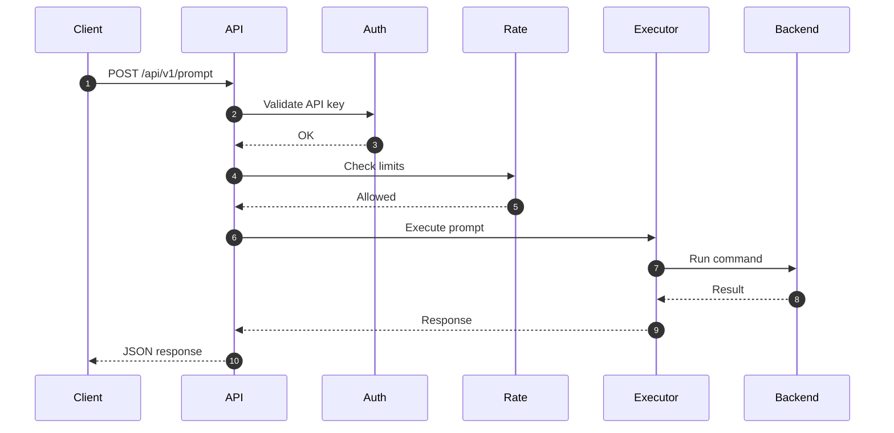
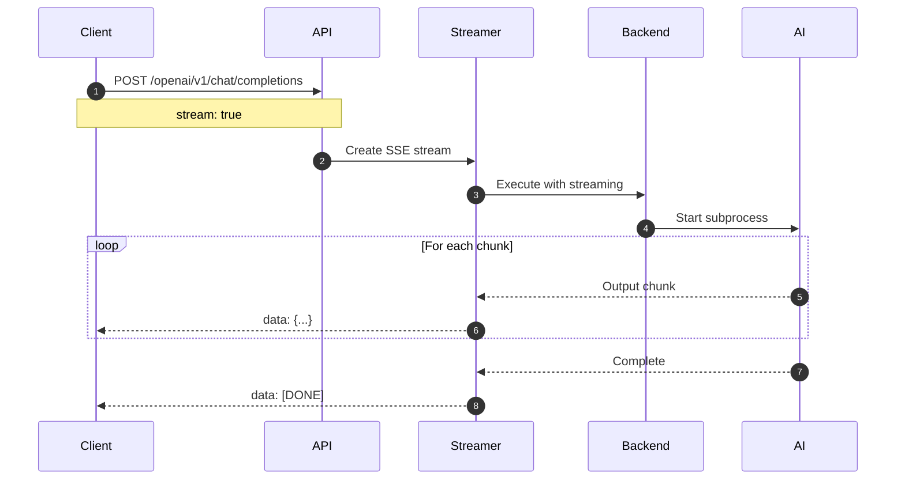
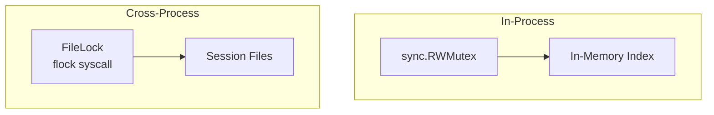
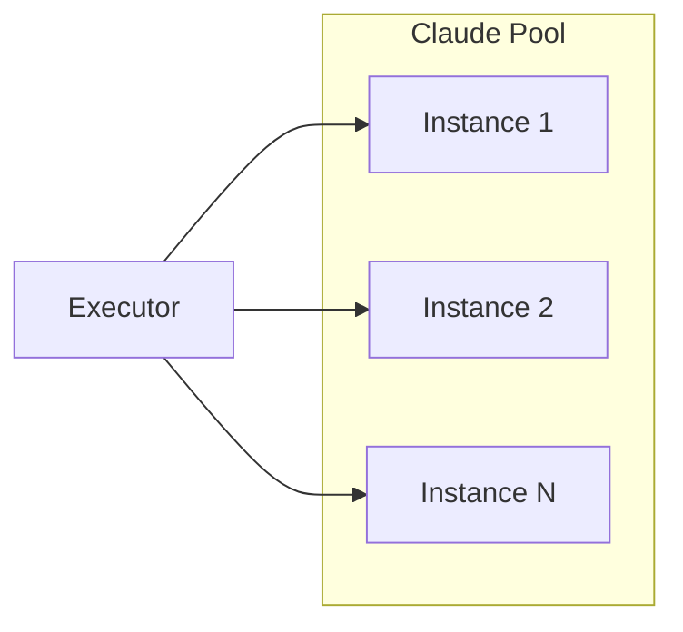

# Architecture Overview

This document provides a comprehensive view of clinvoker's system architecture, explaining how components interact, how data flows through the system, and the design patterns that enable the system's key capabilities.

## High-Level Architecture

clinvoker follows a layered architecture pattern with clear separation of concerns:



## CLI Layer Deep Dive

### Entry Point (`cmd/clinvk/main.go`)

The entry point is intentionally minimal, following Go best practices:

```go
package main

import (
    "os"
    "github.com/signalridge/clinvoker/internal/app"
)

func main() {
    if err := app.Execute(); err != nil {
        os.Exit(1)
    }
}
```

This design:
- Keeps the main package clean and focused
- Enables easy testing of the application logic
- Allows the app package to be imported for integration testing

### Cobra Framework Usage (`internal/app/app.go`)

The CLI uses the Cobra framework for command management:



Key Cobra features used:

1. **Persistent Flags**: Available to all subcommands
   - `--config`: Config file path
   - `--backend`: Backend selection
   - `--model`: Model selection
   - `--workdir`: Working directory
   - `--dry-run`: Simulation mode
   - `--output-format`: Output format
   - `--ephemeral`: Stateless mode

2. **Local Flags**: Specific to individual commands
   - `--continue`: Continue last session (root command only)

3. **Pre-Run Initialization**: `initConfig()` loads configuration before command execution

### Command Execution Flow



## Core Components Interaction

### Backend Registry Pattern

The backend registry manages AI CLI backends using a thread-safe registry pattern:

```mermaid
flowchart TB
    subgraph Registry["Backend Registry (internal/backend/registry.go)"]
        RWMUTEX[sync.RWMutex]
        BACKENDS[map[string]Backend]
        CACHE[availabilityCache
        30s TTL]
    end

    subgraph Backends["Registered Backends"]
        CL[Claude Backend]
        CO[Codex Backend]
        GM[Gemini Backend]
    end

    RWMUTEX --> BACKENDS
    BACKENDS --> CL
    BACKENDS --> CO
    BACKENDS --> GM
    BACKENDS --> CACHE
```

The registry provides:
- **Thread-safe access**: `sync.RWMutex` for concurrent reads/writes
- **Availability caching**: 30-second TTL to avoid frequent PATH lookups
- **Dynamic registration**: Backends can be registered/unregistered at runtime

### Session Manager Architecture

```mermaid
flowchart TB
    subgraph SessionManager["Session Manager (internal/session/)"]
        STORE[Store]
        INDEX[In-Memory Index
        map[string]*SessionMeta]
        FILELOCK[FileLock
        Cross-process sync]
        RWLOCK[sync.RWMutex
        In-process sync]
    end

    subgraph Storage["File System Storage"]
        DIR[~/.clinvk/sessions/]
        SESSION_FILES[*.json files]
        INDEX_FILE[index.json]
    end

    STORE --> INDEX
    STORE --> FILELOCK
    STORE --> RWLOCK
    FILELOCK --> DIR
    RWLOCK --> DIR
    DIR --> SESSION_FILES
    DIR --> INDEX_FILE
```

The session manager uses a dual-locking strategy:
1. **In-process**: `sync.RWMutex` for goroutine safety
2. **Cross-process**: File locks for CLI/server coexistence

### HTTP Server Request Handling



Middleware execution order is critical:
1. **RequestID**: Assign unique request ID for tracing
2. **RealIP**: Extract real client IP (behind proxies)
3. **Recoverer**: Recover from panics
4. **RequestLogger**: Log request details
5. **RequestSize**: Enforce body size limits
6. **RateLimiter**: Apply rate limiting
7. **API Key Auth**: Authenticate requests
8. **Timeout**: Enforce request timeouts
9. **CORS**: Handle cross-origin requests

## Data Flow

### CLI Prompt Flow



### HTTP API Flow



### Streaming Response Flow



## Backend Abstraction Architecture

### Unified Backend Interface

All backends implement the `Backend` interface (`internal/backend/backend.go:16-46`):

```go
type Backend interface {
    Name() string
    IsAvailable() bool
    BuildCommand(prompt string, opts *Options) *exec.Cmd
    ResumeCommand(sessionID, prompt string, opts *Options) *exec.Cmd
    BuildCommandUnified(prompt string, opts *UnifiedOptions) *exec.Cmd
    ResumeCommandUnified(sessionID, prompt string, opts *UnifiedOptions) *exec.Cmd
    ParseOutput(rawOutput string) string
    ParseJSONResponse(rawOutput string) (*UnifiedResponse, error)
    SeparateStderr() bool
}
```

### Backend Implementation Structure

```mermaid
flowchart TB
    subgraph Backend_Interface["Backend Interface"]
        INTERFACE[Backend Interface
        internal/backend/backend.go]
    end

    subgraph Implementations["Backend Implementations"]
        CLAUDE[Claude
        internal/backend/claude.go]
        CODEX[Codex
        internal/backend/codex.go]
        GEMINI[Gemini
        internal/backend/gemini.go]
    end

    subgraph Unified_Layer["Unified Options Layer"]
        UNIFIED[UnifiedOptions
        internal/backend/unified.go]
        MAPPER[Flag Mapper
        MapToOptions()]
    end

    INTERFACE --> CLAUDE
    INTERFACE --> CODEX
    INTERFACE --> GEMINI
    UNIFIED --> MAPPER
    MAPPER --> CLAUDE
    MAPPER --> CODEX
    MAPPER --> GEMINI
```

## Concurrency Patterns

### Registry Concurrency

The backend registry uses a read-write mutex pattern:

```go
// Read operation (concurrent safe)
func (r *Registry) Get(name string) (Backend, error) {
    r.mu.RLock()
    defer r.mu.RUnlock()
    // ... lookup backend
}

// Write operation (exclusive)
func (r *Registry) Register(b Backend) {
    r.mu.Lock()
    defer r.mu.Unlock()
    // ... register backend
}
```

### Session Store Concurrency

The session store combines multiple synchronization mechanisms:



Read flow:
1. Acquire read lock (`RLock`)
2. Check in-memory index
3. Load session file if needed
4. Release read lock

Write flow:
1. Acquire cross-process file lock
2. Acquire write lock (`Lock`)
3. Write session atomically
4. Update index
5. Release locks

## Extension Points

### Adding a New Backend

To add a new AI CLI backend:

1. **Create implementation file**: `internal/backend/newbackend.go`
2. **Implement Backend interface**: All required methods
3. **Register in registry**: Add to `init()` in `registry.go`
4. **Add unified options mapping**: Update `unified.go` flag mapper

### Adding a New CLI Command

1. **Create command file**: `internal/app/cmd_newcommand.go`
2. **Define Cobra command**: Use existing commands as template
3. **Add to root command**: In `app.go` `init()` function

### Adding a New API Endpoint

1. **Create handler**: In appropriate handler file (`custom.go`, `openai.go`, or `anthropic.go`)
2. **Register with Huma**: Use `huma.Register()` with operation configuration
3. **Add middleware if needed**: Update middleware stack in `server.go`

## Scalability Considerations

### Horizontal Scaling

The server component can be horizontally scaled:

- **Statelessness**: No shared in-memory state between requests
- **Session Storage**: Sessions on shared filesystem or database
- **Configuration**: Loaded at startup, no runtime mutations

### Backend Pooling (Future)

For high-throughput scenarios, backends can be pooled:



## Security Architecture

### Authentication

- API key validation at entry points
- Multiple key sources (env, gopass, header)
- Per-key rate limiting

### Authorization

- Backend-level permissions via configuration
- Working directory restrictions
- Sandbox mode support

### Isolation

- Session isolation (no cross-session data leakage)
- Working directory restrictions
- Subprocess isolation

## Monitoring and Observability

### Metrics

- Request counts and latency (Prometheus)
- Backend availability
- Token usage
- Error rates

### Logging

- Structured JSON logging
- Request/response tracing
- Backend command logging (optional)

### Health Checks

- `/health` endpoint for load balancers
- Backend availability checks
- Session store health

## Related Documentation

- [Backend System](backend-system.md) - Backend implementation details
- [Session System](session-system.md) - Session persistence deep dive
- [API Design](api-design.md) - API architecture
- [Design Decisions](design-decisions.md) - Architectural ADRs
