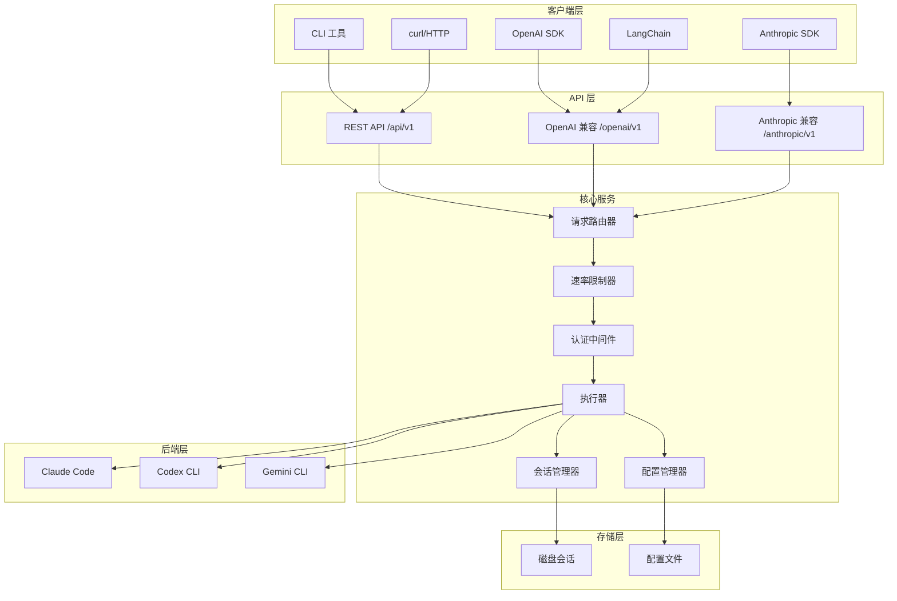
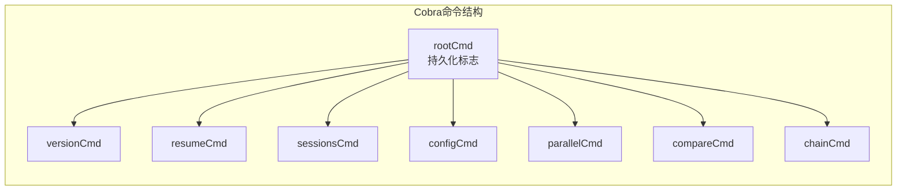
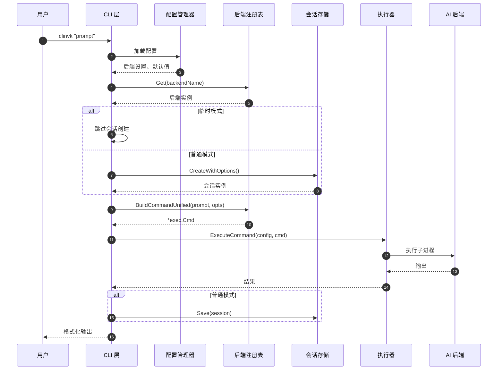
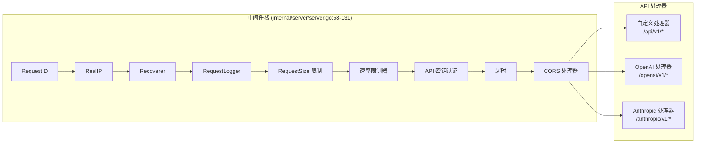
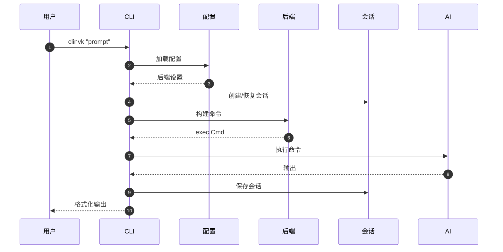
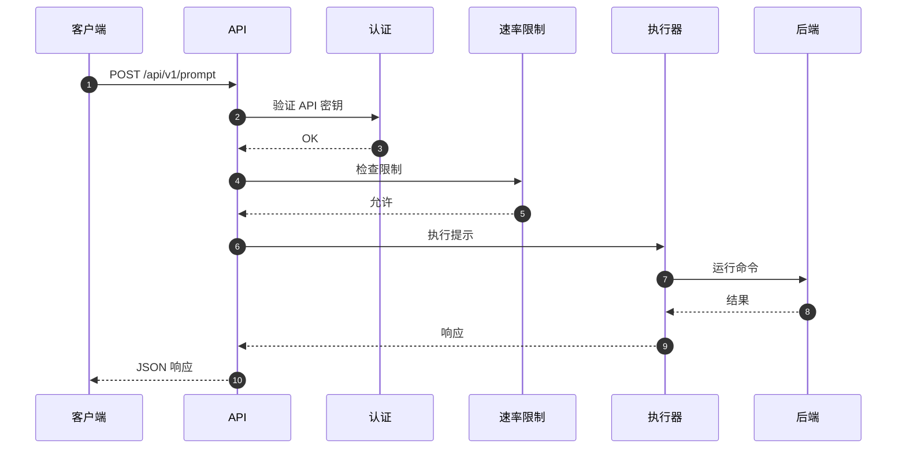
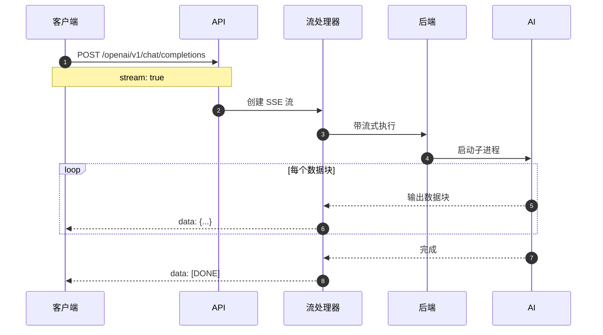
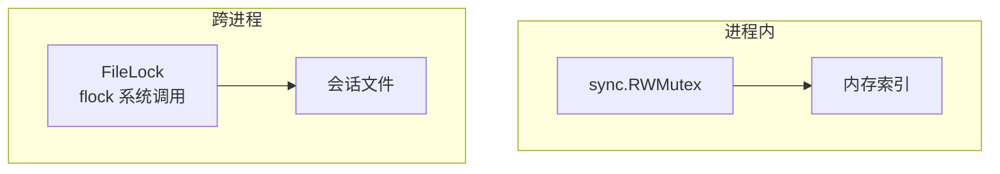
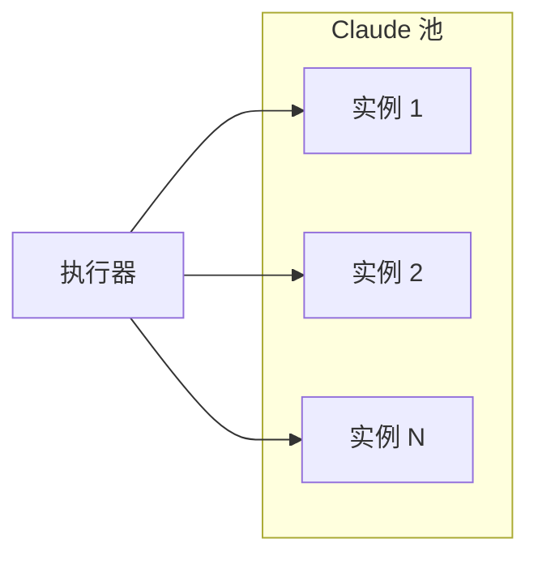

# 架构概述

本文档全面介绍 clinvoker 的系统架构，解释组件如何交互、数据如何在系统中流动，以及使系统关键能力成为可能的设计模式。

## 高级架构

clinvoker 遵循分层架构模式，具有清晰的关注点分离：



## CLI 层深入解析

### 入口点 (`cmd/clinvk/main.go`)

入口点有意保持简洁，遵循 Go 最佳实践：

```go
package main

import (
    "os"
    "github.com/signalridge/clinvoker/internal/app"
)

func main() {
    if err := app.Execute(); err != nil {
        os.Exit(1)
    }
}
```

这种设计：
- 保持 main 包简洁专注
- 便于测试应用逻辑
- 允许导入 app 包进行集成测试

### Cobra 框架使用 (`internal/app/app.go`)

CLI 使用 Cobra 框架进行命令管理：



使用的关键 Cobra 特性：

1. **持久化标志**：对所有子命令可用
   - `--config`：配置文件路径
   - `--backend`：后端选择
   - `--model`：模型选择
   - `--workdir`：工作目录
   - `--dry-run`：模拟模式
   - `--output-format`：输出格式
   - `--ephemeral`：无状态模式

2. **本地标志**：特定于单个命令
   - `--continue`：继续上次会话（仅根命令）

3. **预运行初始化**：`initConfig()` 在命令执行前加载配置

### 命令执行流程



## 核心组件交互

### 后端注册表模式

后端注册表使用线程安全的注册表模式管理 AI CLI 后端：

```mermaid
flowchart TB
    subgraph 注册表["后端注册表 (internal/backend/registry.go)"]
        RWMUTEX[sync.RWMutex]
        BACKENDS[map[string]Backend]
        CACHE[availabilityCache
        30秒 TTL]
    end

    subgraph 后端["已注册后端"]
        CL[Claude 后端]
        CO[Codex 后端]
        GM[Gemini 后端]
    end

    RWMUTEX --> BACKENDS
    BACKENDS --> CL
    BACKENDS --> CO
    BACKENDS --> GM
    BACKENDS --> CACHE
```

注册表提供：
- **线程安全访问**：`sync.RWMutex` 用于并发读/写
- **可用性缓存**：30 秒 TTL 避免频繁的 PATH 查找
- **动态注册**：后端可以在运行时注册/注销

### 会话管理器架构

```mermaid
flowchart TB
    subgraph 会话管理器["会话管理器 (internal/session/)"]
        STORE[存储]
        INDEX[内存索引
        map[string]*SessionMeta]
        FILELOCK[FileLock
        跨进程同步]
        RWLOCK[sync.RWMutex
        进程内同步]
    end

    subgraph 存储["文件系统存储"]
        DIR[~/.clinvk/sessions/]
        SESSION_FILES[*.json 文件]
        INDEX_FILE[index.json]
    end

    STORE --> INDEX
    STORE --> FILELOCK
    STORE --> RWLOCK
    FILELOCK --> DIR
    RWLOCK --> DIR
    DIR --> SESSION_FILES
    DIR --> INDEX_FILE
```

会话管理器使用双重锁定策略：
1. **进程内**：`sync.RWMutex` 用于 goroutine 安全
2. **跨进程**：文件锁用于 CLI/服务器共存

### HTTP 服务器请求处理



中间件执行顺序至关重要：
1. **RequestID**：分配唯一请求 ID 用于跟踪
2. **RealIP**：提取真实客户端 IP（代理后面）
3. **Recoverer**：从 panic 中恢复
4. **RequestLogger**：记录请求详情
5. **RequestSize**：强制执行请求体大小限制
6. **RateLimiter**：应用速率限制
7. **API Key Auth**：认证请求
8. **Timeout**：强制执行请求超时
9. **CORS**：处理跨域请求

## 数据流

### CLI 提示流程



### HTTP API 流程



### 流式响应流程



## 后端抽象架构

### 统一后端接口

所有后端都实现 `Backend` 接口（`internal/backend/backend.go:16-46`）：

```go
type Backend interface {
    Name() string
    IsAvailable() bool
    BuildCommand(prompt string, opts *Options) *exec.Cmd
    ResumeCommand(sessionID, prompt string, opts *Options) *exec.Cmd
    BuildCommandUnified(prompt string, opts *UnifiedOptions) *exec.Cmd
    ResumeCommandUnified(sessionID, prompt string, opts *UnifiedOptions) *exec.Cmd
    ParseOutput(rawOutput string) string
    ParseJSONResponse(rawOutput string) (*UnifiedResponse, error)
    SeparateStderr() bool
}
```

### 后端实现结构

```mermaid
flowchart TB
    subgraph 后端接口["后端接口"]
        INTERFACE[Backend 接口
        internal/backend/backend.go]
    end

    subgraph 实现["后端实现"]
        CLAUDE[Claude
        internal/backend/claude.go]
        CODEX[Codex
        internal/backend/codex.go]
        GEMINI[Gemini
        internal/backend/gemini.go]
    end

    subgraph 统一层["统一选项层"]
        UNIFIED[UnifiedOptions
        internal/backend/unified.go]
        MAPPER[标志映射器
        MapToOptions()]
    end

    INTERFACE --> CLAUDE
    INTERFACE --> CODEX
    INTERFACE --> GEMINI
    UNIFIED --> MAPPER
    MAPPER --> CLAUDE
    MAPPER --> CODEX
    MAPPER --> GEMINI
```

## 并发模式

### 注册表并发

后端注册表使用读写互斥锁模式：

```go
// 读操作（并发安全）
func (r *Registry) Get(name string) (Backend, error) {
    r.mu.RLock()
    defer r.mu.RUnlock()
    // ... 查找后端
}

// 写操作（独占）
func (r *Registry) Register(b Backend) {
    r.mu.Lock()
    defer r.mu.Unlock()
    // ... 注册后端
}
```

### 会话存储并发

会话存储结合多种同步机制：



读流程：
1. 获取读锁（`RLock`）
2. 检查内存索引
3. 如需要加载会话文件
4. 释放读锁

写流程：
1. 获取跨进程文件锁
2. 获取写锁（`Lock`）
3. 原子写入会话
4. 更新索引
5. 释放锁

## 扩展点

### 添加新后端

添加新的 AI CLI 后端：

1. **创建实现文件**：`internal/backend/newbackend.go`
2. **实现 Backend 接口**：所有必需的方法
3. **在注册表中注册**：添加到 `registry.go` 的 `init()`
4. **添加统一选项映射**：更新 `unified.go` 标志映射器

### 添加新 CLI 命令

1. **创建命令文件**：`internal/app/cmd_newcommand.go`
2. **定义 Cobra 命令**：使用现有命令作为模板
3. **添加到根命令**：在 `app.go` 的 `init()` 函数中

### 添加新 API 端点

1. **创建处理器**：在适当的处理器文件中（`custom.go`、`openai.go` 或 `anthropic.go`）
2. **使用 Huma 注册**：使用 `huma.Register()` 和操作配置
3. **如需要添加中间件**：在 `server.go` 中更新中间件栈

## 可扩展性考虑

### 水平扩展

服务器组件可以水平扩展：

- **无状态**：请求之间不共享内存状态
- **会话存储**：会话在共享文件系统或数据库上
- **配置**：启动时加载，运行时不变

### 后端池化（未来）

对于高吞吐量场景，后端可以池化：



## 安全架构

### 认证

- 入口点的 API 密钥验证
- 多个密钥来源（环境变量、gopass、请求头）
- 每个密钥的速率限制

### 授权

- 通过配置的后端级权限
- 工作目录限制
- 沙盒模式支持

### 隔离

- 会话隔离（无跨会话数据泄漏）
- 工作目录限制
- 子进程隔离

## 监控和可观测性

### 指标

- 请求计数和延迟（Prometheus）
- 后端可用性
- Token 使用量
- 错误率

### 日志

- 结构化 JSON 日志
- 请求/响应跟踪
- 后端命令日志（可选）

### 健康检查

- 负载均衡器的 `/health` 端点
- 后端可用性检查
- 会话存储健康

## 相关文档

- [后端系统](backend-system.zh.md) - 后端实现详情
- [会话系统](session-system.zh.md) - 会话持久化深入解析
- [API 设计](api-design.zh.md) - API 架构
- [设计决策](design-decisions.zh.md) - 架构决策记录
