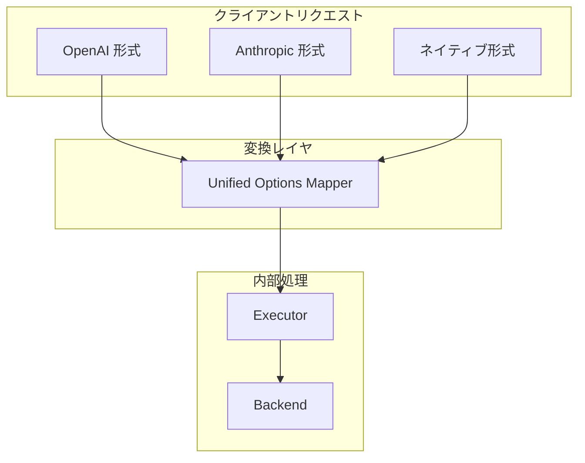

# 設計判断

このドキュメントは、clinvoker 開発で行った主要なアーキテクチャ判断と、その根拠を説明します。これらを理解すると、開発者は効果的に貢献でき、ユーザーはシステムの挙動を理解しやすくなります。

## Go を選んだ理由

### 判断

clinvoker は Go（Golang）で実装しています。

### 根拠

1. **単一バイナリ配布**: Go は単一の静的バイナリにコンパイルでき、実行時依存がほぼ不要で配布が容易です。

2. **優れた並行性**: goroutine と channel は軽量な並行プリミティブで、複数バックエンド/リクエスト処理に適しています。

3. **標準ライブラリの充実**: HTTP サーバー、JSON、サブプロセス管理などが外部依存なしで揃います。

4. **クロスプラットフォーム**: Windows/macOS/Linux を最小限のプラットフォーム固有コードでサポートできます。

5. **高速なコンパイル**: ビルドが速く、開発効率が上がります。

### 検討した代替案

| 言語 | Pros | Cons |
|----------|------|------|
| Python | エコシステム、AI ライブラリ | 配布が複雑、GIL 制約 |
| Rust | 性能、安全性 | 学習コスト、コンパイル時間 |
| Node.js | JavaScript の親しみ | ランタイム依存、コールバックの複雑さ |
| Java | 成熟したエコシステム | JVM が必要、冗長 |

## CLI に Cobra を使う理由

### 判断

CLI フレームワークとして Cobra を採用しています。

### 根拠

1. **業界標準**: Kubernetes/Hugo など主要な Go プロジェクトで採用されています。

2. **機能が豊富**: ヘルプ生成、シェル補完、フラグ解析が組み込みです。

3. **コマンド階層**: Persistent/Local flags を含むサブコマンド構造が自然に表現できます。

4. **ドキュメント**: コードからドキュメントを自動生成できます。

5. **検証**: フラグ検証とエラーハンドリングが組み込みです。

### 実装パターン

```go
var rootCmd = &cobra.Command{
    Use:   "clinvk",
    Short: "Unified AI CLI wrapper",
    Long:  `A unified interface for Claude Code, Codex CLI, and Gemini CLI.`,
    RunE:  runRoot,
}

func init() {
    rootCmd.PersistentFlags().String("backend", "", "AI backend to use")
    rootCmd.PersistentFlags().String("model", "", "Model to use")
    // ...
}
```

## HTTP ルータに Chi を使う理由

### 判断

HTTP ルータとミドルウェアフレームワークとして Chi を採用しています。

### 根拠

1. **軽量**: オーバーヘッドが小さく、Go らしい設計です。

2. **ミドルウェアチェーン**: `Use()` による合成がシンプルです。

3. **Context 対応**: `context.Context` ベースで、リクエストスコープの値を扱いやすいです。

4. **URL パラメータ**: URL パラメータ抽出が分かりやすいです。

5. **互換性**: 標準の `http.Handler` と自然に連携できます。

### ミドルウェアスタック

```go
router := chi.NewRouter()
router.Use(middleware.RequestID)
router.Use(middleware.RealIP)
router.Use(middleware.Recoverer)
router.Use(middleware.Logger)
router.Use(middleware.Timeout(60 * time.Second))
```

## OpenAPI に Huma を使う理由

### 判断

OpenAPI 生成とリクエスト/レスポンス検証に Huma を採用しています。

### 根拠

1. **コードファースト**: 仕様からコードを作るのではなく、Go コードから OpenAPI を生成できます。

2. **型安全**: リクエスト/レスポンスタイプがコンパイル時に検証されます。

3. **自動ドキュメント**: コードから対話ドキュメントを生成できます。

4. **検証**: struct tag を使って自動でリクエスト検証できます。

5. **複数アダプタ**: Chi/Gin など複数のルータで利用できます。

### 使用例

```go
huma.Register(api, huma.Operation{
    OperationID: "create-chat-completion",
    Method:      http.MethodPost,
    Path:        "/openai/v1/chat/completions",
}, func(ctx context.Context, input *ChatRequest) (*ChatResponse, error) {
    // Handler implementation
})
```

## SDK ではなくサブプロセス実行にした理由

### 判断

clinvoker は SDK を直接使うのではなく、AI CLI ツールをサブプロセスとして実行します。

### 根拠

1. **ゼロ設定**: CLI ツールが認証/API キー/設定を自前で扱うため、clinvoker 側の設定が少なくて済みます。

2. **常に最新**: SDK API が変わっても、clinvoker を更新せずに CLI 側で追随できます。

3. **機能パリティ**: CLI には SDK にない機能が含まれることがあります。

4. **セッション管理**: CLI ツール内蔵のセッション機能を活用できます。

5. **単純さ**: 複数 SDK 統合ではなく、1 つの抽象レイヤで済みます。

### トレードオフ

| 観点 | サブプロセス方式 | SDK 方式 |
|--------|---------------------|--------------|
| 起動時間 | やや遅い | 速い |
| 依存関係 | 少ない | ライブラリが増える |
| 保守 | 低い | 高い |
| 機能アクセス | CLI の全機能 | SDK で提供される範囲 |
| 認証 | CLI が処理 | コード側の実装が必要 |

## SDK 互換 API の方針

### 判断

ネイティブ REST API に加えて、OpenAI/Anthropic 互換の API エンドポイントを提供します。

### 根拠

1. **エコシステム互換**: OpenAI SDK を使う既存ツールが修正なしで動きます。

2. **移行パス**: クラウド API からローカル CLI ツールへ移行しやすいです。

3. **フレームワーク対応**: LangChain/LangGraph などがそのまま利用できます。

4. **馴染みあるインターフェース**: 多くの開発者にとって既知の API です。

### 実装戦略



## セッション永続化のトレードオフ

### 判断

セッションはローカルファイルシステムに JSON 形式で保存します。

### 根拠

1. **単純さ**: 外部 DB が不要です。

2. **可搬性**: バックアップ/移行/閲覧が簡単です。

3. **人が読める**: JSON により手作業の確認とデバッグが容易です。

4. **バージョン管理**: 必要ならセッションもバージョン管理できます。

### ファイル vs データベース

| 観点 | ファイル | DB |
|--------|------------|----------|
| セットアップ | 不要 | インストールが必要 |
| 複雑さ | 低い | 高い |
| クエリ | 限定的 | リッチ |
| 競合制御 | ファイルロック | ACID トランザクション |
| スケール | 単一マシン | 分散可能 |
| バックアップ | ファイルコピー | DB バックアップ |

### SQLite を採用しなかった理由

SQLite も検討しましたが、次の理由で見送りました。

- JSON は閲覧/デバッグが容易
- スキーママイグレーションの複雑さがない
- バックアップ/復元が単純
- ファイルロックによりプロセス間アクセスが扱いやすい

## バックエンド抽象化の設計判断

### 判断

共通の `Backend` インターフェースと、統一オプションのマッピングを採用します。

### 根拠

1. **多態性**: コアコードで全バックエンドを同一に扱える

2. **拡張性**: コアを大きく変更せず新バックエンド追加が可能

3. **テスト容易性**: テストではモックバックエンドが使える

4. **一貫性**: バックエンドに関わらず同じ API で扱える

### インターフェース設計

```go
type Backend interface {
    Name() string
    IsAvailable() bool
    BuildCommand(prompt string, opts *Options) *exec.Cmd
    ResumeCommand(sessionID, prompt string, opts *Options) *exec.Cmd
    ParseOutput(rawOutput string) string
    ParseJSONResponse(rawOutput string) (*UnifiedResponse, error)
}
```

## 並行モデルの選択

### 判断

プロセス内の並行性に `sync.RWMutex` を、プロセス間同期にファイルロックを使います。

### 根拠

1. **読み取り中心**: 多くの操作は read（一覧、取得）です。

2. **Go らしい**: 標準的な並行アクセスパターンです。

3. **プロセス間安全性**: ファイルロックで CLI とサーバーが共存できます。

4. **単純さ**: channel ベースより理解しやすいです。

### 並行パターン

```go
// Read operation
func (s *Store) Get(id string) (*Session, error) {
    s.mu.RLock()
    defer s.mu.RUnlock()
    return s.getLocked(id)
}

// Write operation
func (s *Store) Save(sess *Session) error {
    s.mu.Lock()
    defer s.mu.Unlock()
    return s.saveLocked(sess)
}
```

## 設定カスケードの設計

### 判断

設定は次の優先順位でカスケードします: CLI フラグ -> 環境変数 -> 設定ファイル -> デフォルト。

### 根拠

1. **予測可能**: 高優先度が常に勝ちます。

2. **環境適合**: コンテナや CI/CD で扱いやすいです。

3. **ユーザー主導**: ファイルを編集せず上書きできます。

4. **安全なデフォルト**: 何も指定しなくても安全な動作になります。

### 解決例

```yaml
# 設定ファイル: ~/.clinvk/config.yaml
default_backend: claude
backends:
  codex:
    model: o3

# 環境変数
CLINVK_BACKEND=codex
CLINVK_CODEX_MODEL=o3-mini

# CLI
clinvk --backend codex "prompt"

# 結果: backend=codex（CLI）, model=o3-mini（env）
```

## HTTP サーバー設計

### 判断

単一バイナリで全エンドポイントを提供し、graceful shutdown に対応します。

### 主な特徴

1. **標準 HTTP/1.1**: 互換性を最大化します。

2. **ストリーミングに SSE**: リアルタイム出力に Server-Sent Events を利用します。

3. **CORS 設定可能**: ブラウザクライアント向けです。

4. **ヘルスエンドポイント**: ロードバランサ向けに `/health` を提供します。

### gRPC を採用しなかった理由

- HTTP は普遍的にサポートされている
- ブラウザ互換性が重要
- curl でデバッグしやすい
- 多くの AI SDK は HTTP/REST を利用する

## エラーハンドリングの思想

### 判断

コンテキスト付きでエラーを伝播し、可能な限り graceful に失敗します。

### 原則

1. **CLI の終了コードを保持**: バックエンドのエラーを正確に伝播します。

2. **構造化エラー**: 詳細を含む JSON 形式です。

3. **段階的劣化**: 並列モードでは部分結果を返します。

4. **詳細ログ**: 必要に応じてデバッグ情報を出します。

### エラーレスポンス形式

```json
{
  "error": {
    "code": "backend_error",
    "message": "Claude CLI exited with code 1",
    "backend": "claude",
    "details": "rate limit exceeded"
  }
}
```

## サマリ表

| 判断 | 選択 | 主な理由 |
|----------|--------|------------|
| 言語 | Go | 単一バイナリ、優れた並行性 |
| CLI | Cobra | 業界標準、機能が豊富 |
| HTTP ルータ | Chi | 軽量、Go らしい |
| OpenAPI | Huma | コードファースト、型安全 |
| 実行方式 | サブプロセス | ゼロ設定、常に最新 |
| API 形式 | 複数 | フレームワーク互換 |
| セッション | ファイル JSON | 単純、可搬 |
| 並行性 | RWMutex + FileLock | 読み取り中心、プロセス間安全 |
| 設定 | カスケード | 予測可能、環境に適合 |
| サーバー | HTTP/SSE | 普遍的な互換性 |

## 将来の検討

### MCP サーバー対応

`clinvk mcp` により、MCP 対応はすでに実装済みで、`stdio` と `http` の両 transport を利用できます。

現在の機能:

- prompt / parallel / chain / compare / session 操作を MCP tool として公開
- ローカル利用とサーバー運用に応じた transport 切り替え
- HTTP transport での任意の `/health` 公開

今後の MCP 関連改善:

- リモート運用向け認証パターンの拡充
- MCP エコシステム相互運用テストの拡大
- tool 公開に対するより細かなポリシー制御

### 追加バックエンド

バックエンド抽象化により、新しい AI CLI が出てきた場合も追加できます。新バックエンドの要件例:

- CLI が非対話モードをサポート
- 構造化出力（可能なら JSON）
- セッション管理（任意だがあると望ましい）

## 関連ドキュメント

- [アーキテクチャ概要](architecture.md) - システムアーキテクチャ
- [バックエンドシステム](backend-system.md) - バックエンド抽象化の詳細
- [セッションシステム](session-system.md) - セッション永続化設計
