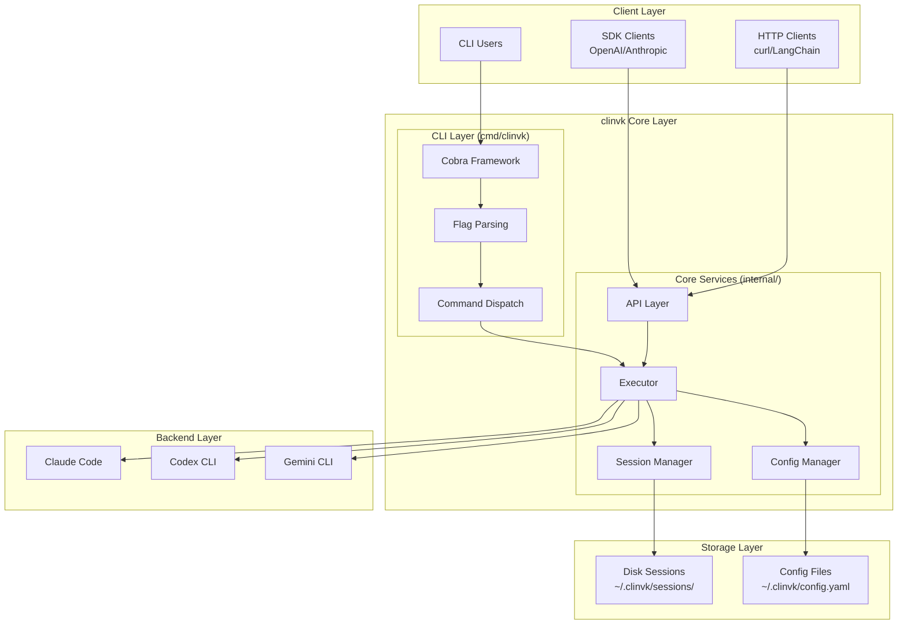

# 概念

このセクションでは、clinvoker のアーキテクチャ、設計判断、システムコンポーネントに関する包括的な技術ドキュメントを提供します。コントリビュートを検討している開発者、システム評価を行うアーキテクト、より深い理解を求めるユーザーなど、どの立場でも役立つよう、clinvoker の設計における「何を」「なぜ」を説明します。

## このセクションで扱う内容

概念セクションは、理解を段階的に深められるよう、焦点を絞ったトピックで構成されています。

- **アーキテクチャ概要**: システム全体の設計とコンポーネント間の相互作用
- **バックエンドシステム**: 異なる AI CLI を共通の抽象化で統合する方法
- **セッションシステム**: プロセス間のセッション永続化と管理
- **API 設計**: REST API のアーキテクチャと SDK 互換レイヤー
- **設計判断**: 主要なアーキテクチャ選択の背景
- **貢献**: 開発ガイドラインとプロジェクト構成
- **トラブルシューティング**: よくある問題と診断の進め方
- **FAQ**: 全体をカバーするよくある質問

## アーキテクチャ関連ドキュメント

<div class="grid cards" markdown>

-   **アーキテクチャ概要**

    ---

    clinvoker のシステムアーキテクチャ、コンポーネント、データフローの俯瞰。CLI レイヤー、コアサービス、バックエンド連携の詳細図も含みます。

    [:octicons-arrow-right-24: 概要を読む](architecture.md)

-   **バックエンドシステム**

    ---

    バックエンド抽象化レイヤー、レジストリパターン、スレッドセーフ設計、そして Claude Code / Codex CLI / Gemini CLI を共通インターフェースで統合する仕組みを深掘りします。

    [:octicons-arrow-right-24: 詳細を見る](backend-system.md)

-   **セッションシステム**

    ---

    セッション永続化の仕組み、アトミック書き込み、プロセス間ファイルロック、メタデータのインメモリ索引、ライフサイクル管理を解説します。

    [:octicons-arrow-right-24: 詳細を見る](session-system.md)

-   **API 設計**

    ---

    REST API のアーキテクチャ、OpenAI/Anthropic 互換レイヤー、エンドポイントルーティング、ミドルウェアスタック、リクエスト/レスポンス変換を解説します。

    [:octicons-arrow-right-24: 詳細を見る](api-design.md)

-   **設計判断**

    ---

    言語選定、フレームワーク判断、SDK 互換の方針、並行処理モデルなど、主要な設計判断の背景を説明します。

    [:octicons-arrow-right-24: さらに読む](design-decisions.md)

</div>

## システム全体像



## 主要コンポーネント

### CLI Application (`cmd/clinvk/main.go`)

メインのエントリポイントは意図的に最小限にしており、機能はすべて `internal/app` パッケージへ委譲しています。

```go
func main() {
    if err := app.Execute(); err != nil {
        os.Exit(1)
    }
}
```

この設計は「関心の分離（Separation of Concerns）」の原則に従っています。

- **cmd/**: エントリポイントとビルド固有のコードのみ
- **internal/app/**: Cobra による CLI コマンド実装一式
- **internal/**: ドメインごとに整理されたビジネスロジック一式

### Internal Package Structure

| パッケージ | 目的 | 主要ファイル |
|---------|---------|-----------|
| `app/` | Cobra を使った CLI コマンド実装 | `app.go`, `cmd_*.go`, `execute.go` |
| `backend/` | バックエンドの抽象化と実装 | `backend.go`, `registry.go`, `claude.go`, `codex.go`, `gemini.go`, `unified.go` |
| `config/` | Viper による設定管理 | `config.go`, `validate.go` |
| `executor/` | コマンド実行と出力処理 | `executor.go`, `signal.go` |
| `output/` | 出力整形とストリーミング | `parser.go`, `writer.go`, `event.go` |
| `server/` | HTTP API サーバー | `server.go`, `routes.go`, `handlers/`, `middleware/`, `service/` |
| `session/` | セッション永続化と管理 | `session.go`, `store.go`, `filelock.go` |
| `auth/` | API キー管理 | `keystore.go` |
| `metrics/` | Prometheus メトリクス | `metrics.go` |
| `resilience/` | サーキットブレーカーパターン | `circuitbreaker.go` |

## 設計原則

### 1. バックエンド非依存

すべての AI CLI は共通の `Backend` インターフェース（`internal/backend/backend.go:16-46`）の背後に抽象化されます。これにより、次が可能になります。

- コード変更なしでバックエンドをシームレスに切り替え
- 異なる AI プロバイダ間での並列実行
- どのバックエンドでも動作するシンプルなクライアントコード
- コアロジックを改変せずに新しいバックエンドを追加

### 2. セッション永続化

セッションはプロセス間同期を伴ってディスクへ永続化されます。

- **アトミック書き込み**: すべてのセッション書き込みはアトミックなファイル操作（`internal/session/store.go:1109-1152`）を使用
- **ファイルロック**: プロセス間ファイルロックで同時更新を防止（`internal/session/filelock.go`）
- **メタデータ索引**: インメモリ索引により、全セッションを読み込まずに高速一覧表示が可能
- **JSON 形式**: 人間が読める・バージョン管理しやすい保存形式

### 3. ストリーミング対応

長時間実行タスクのリアルタイム出力に対応します。

- HTTP ストリーミング向けの Server-Sent Events（SSE）
- CLI 向けの `stream-json` 出力形式
- 逐次結果を扱うイベントベースアーキテクチャ

### 4. SDK 互換性

OpenAI / Anthropic API のドロップイン置換として利用できます。

- OpenAI SDK と互換の `/openai/v1/*` エンドポイント
- Anthropic SDK と互換の `/anthropic/v1/*` エンドポイント
- clinvoker 固有機能向けのネイティブ `/api/v1/*` エンドポイント

### 5. 拡張性

拡張しやすいよう設計されています。

- **新しいバックエンド**: `Backend` インターフェースを実装し、レジストリへ登録
- **新しいコマンド**: `internal/app/` に Cobra サブコマンドを追加
- **新しい API エンドポイント**: Huma でハンドラーを登録
- **ミドルウェア**: 横断的関心事のための Chi ミドルウェアチェーン

## 並行処理パターン

clinvoker はコードベース全体で複数の並行処理パターンを使用しています。

### Registry Thread Safety

バックエンドレジストリは、安全な同時アクセスのために `sync.RWMutex`（`internal/backend/registry.go:12-16`）を使用します。

```go
type Registry struct {
    mu                   sync.RWMutex
    backends             map[string]Backend
    availabilityCache    map[string]*cachedAvailability
    availabilityCacheTTL time.Duration
}
```

### セッションストアの並行性

セッションストアは、インメモリロックとプロセス間ファイルロックを組み合わせます（`internal/session/store.go:41-48`）。

```go
type Store struct {
    mu           sync.RWMutex          // In-memory lock
    dir          string
    index        map[string]*SessionMeta
    fileLock     *FileLock             // Cross-process lock
}
```

### HTTP サーバーの並行性

HTTP サーバーは、設定可能なタイムアウトとともに Chi の組み込み並行処理を利用します（`internal/server/server.go:204-211`）。

## 関連ドキュメント

- [ガイド](../guides/index.md) - clinvoker の実践的な使い方
- [チュートリアル](../tutorials/index.md) - ステップバイステップの学習資料
- [リファレンス](../reference/index.md) - API / CLI の参照ドキュメント
- [貢献](contributing.md) - 開発セットアップとコントリビュート手順
