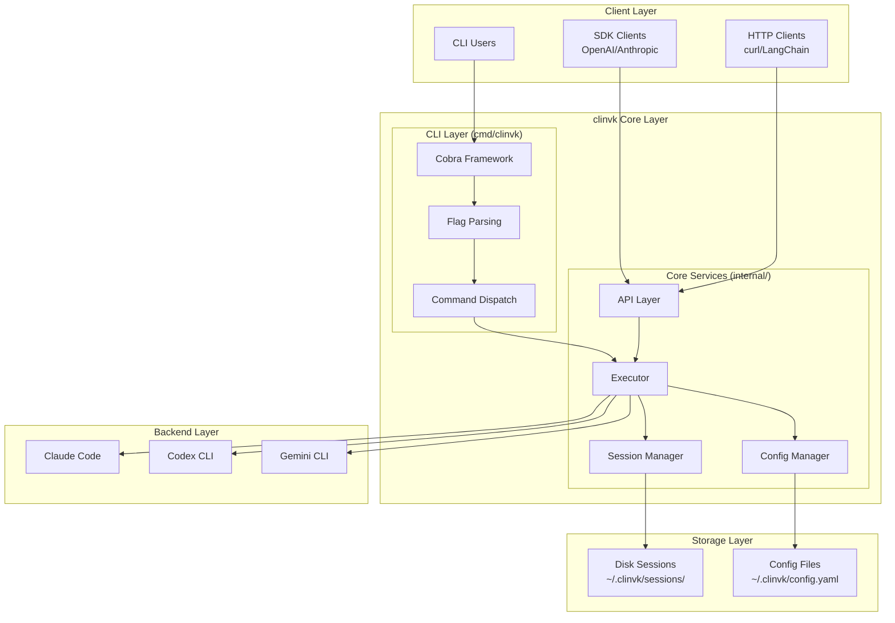

# Concepts

This section provides comprehensive technical documentation about clinvoker's architecture, design decisions, and system components. Whether you are a developer looking to contribute, an architect evaluating the system, or a user seeking deeper understanding, these documents explain the "what" and "why" behind clinvoker's design.

## What This Section Covers

The Concepts section is organized into focused topics that progressively build your understanding of the system:

- **Architecture Overview**: High-level system design and component interactions
- **Backend System**: How different AI CLIs are unified under a common abstraction
- **Session System**: Cross-process session persistence and management
- **API Design**: REST API architecture and SDK compatibility layers
- **Design Decisions**: Rationale behind key architectural choices
- **Contributing**: Development guidelines and project structure
- **Troubleshooting**: Common issues and diagnostic approaches
- **FAQ**: Frequently asked questions covering all aspects

## Architecture Documentation

<div class="grid cards" markdown>

-   **Architecture Overview**

    ---

    High-level view of clinvoker's system architecture, components, and data flow. Includes detailed diagrams of the CLI layer, core services, and backend interactions.

    [:octicons-arrow-right-24: Read overview](architecture.md)

-   **Backend System**

    ---

    Deep dive into the backend abstraction layer, registry pattern, thread-safe design, and how Claude Code, Codex CLI, and Gemini CLI are unified under a common interface.

    [:octicons-arrow-right-24: Explore](backend-system.md)

-   **Session System**

    ---

    Session persistence mechanisms, atomic write operations, cross-process file locking, in-memory metadata indexing, and lifecycle management.

    [:octicons-arrow-right-24: Explore](session-system.md)

-   **API Design**

    ---

    REST API architecture, OpenAI and Anthropic compatibility layers, endpoint routing, middleware stack, and request/response transformation.

    [:octicons-arrow-right-24: Explore](api-design.md)

-   **Design Decisions**

    ---

    Rationale behind key architectural choices including language selection, framework decisions, SDK compatibility approach, and concurrency model.

    [:octicons-arrow-right-24: Read more](design-decisions.md)

</div>

## System Overview



## Key Components

### CLI Application (`cmd/clinvk/main.go`)

The main entry point is intentionally minimal, delegating all functionality to the `internal/app` package:

```go
func main() {
    if err := app.Execute(); err != nil {
        os.Exit(1)
    }
}
```

This design follows the principle of separation of concerns:

- **cmd/**: Contains only entry points and build-specific code
- **internal/app/**: Contains all CLI command implementations using Cobra
- **internal/**: Contains all business logic organized by domain

### Internal Package Structure

| Package | Purpose | Key Files |
|---------|---------|-----------|
| `app/` | CLI command implementations using Cobra | `app.go`, `cmd_*.go`, `execute.go` |
| `backend/` | Backend abstraction and implementations | `backend.go`, `registry.go`, `claude.go`, `codex.go`, `gemini.go`, `unified.go` |
| `config/` | Configuration management with Viper | `config.go`, `validate.go` |
| `executor/` | Command execution and output handling | `executor.go`, `signal.go` |
| `output/` | Output formatting and streaming | `parser.go`, `writer.go`, `event.go` |
| `server/` | HTTP API server | `server.go`, `routes.go`, `handlers/`, `middleware/`, `service/` |
| `session/` | Session persistence and management | `session.go`, `store.go`, `filelock.go` |
| `auth/` | API key management | `keystore.go` |
| `metrics/` | Prometheus metrics | `metrics.go` |
| `resilience/` | Circuit breaker pattern | `circuitbreaker.go` |

## Design Principles

### 1. Backend Agnosticism

All AI CLIs are abstracted behind a common `Backend` interface (`internal/backend/backend.go:16-46`), enabling:

- Seamless switching between backends without code changes
- Parallel execution across different AI providers
- Simplified client code that works with any backend
- Easy addition of new backends without modifying core logic

### 2. Session Persistence

Sessions are persisted to disk with cross-process synchronization:

- **Atomic Writes**: All session writes use atomic file operations (`internal/session/store.go:1109-1152`)
- **File Locking**: Cross-process file locks prevent concurrent modifications (`internal/session/filelock.go`)
- **Metadata Index**: In-memory index enables fast listing without loading all sessions
- **JSON Format**: Human-readable, version-controlled storage format

### 3. Streaming Support

Real-time output for long-running tasks:

- Server-Sent Events (SSE) for HTTP streaming
- Stream-json output format for CLI
- Event-based architecture for progressive results

### 4. SDK Compatibility

Drop-in replacement for OpenAI and Anthropic APIs:

- `/openai/v1/*` endpoints compatible with OpenAI SDK
- `/anthropic/v1/*` endpoints compatible with Anthropic SDK
- Native `/api/v1/*` endpoints for clinvoker-specific features

### 5. Extensibility

Designed for easy extension:

- **New Backends**: Implement the `Backend` interface and register in the registry
- **New Commands**: Add Cobra subcommands in `internal/app/`
- **New API Endpoints**: Register handlers with Huma
- **Middleware**: Chi middleware chain for cross-cutting concerns

## Concurrency Patterns

clinvoker uses several concurrency patterns throughout the codebase:

### Registry Thread Safety

The backend registry uses `sync.RWMutex` for safe concurrent access (`internal/backend/registry.go:12-16`):

```go
type Registry struct {
    mu                   sync.RWMutex
    backends             map[string]Backend
    availabilityCache    map[string]*cachedAvailability
    availabilityCacheTTL time.Duration
}
```

### Session Store Concurrency

The session store combines in-memory locks with cross-process file locks (`internal/session/store.go:41-48`):

```go
type Store struct {
    mu           sync.RWMutex          // In-memory lock
    dir          string
    index        map[string]*SessionMeta
    fileLock     *FileLock             // Cross-process lock
}
```

### HTTP Server Concurrency

The HTTP server uses Chi's built-in concurrency handling with configurable timeouts (`internal/server/server.go:204-211`).

## Related Documentation

- [Guides](../guides/index.md) - Practical how-to guides for using clinvoker
- [Tutorials](../tutorials/index.md) - Step-by-step learning materials
- [Reference](../reference/index.md) - API and CLI reference documentation
- [Contributing](contributing.md) - Development setup and contribution guidelines
