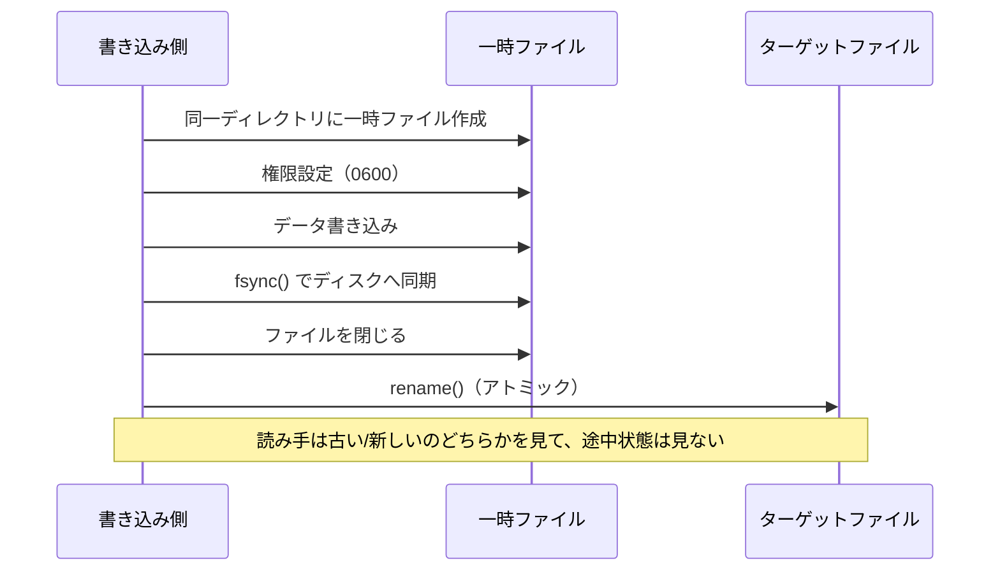
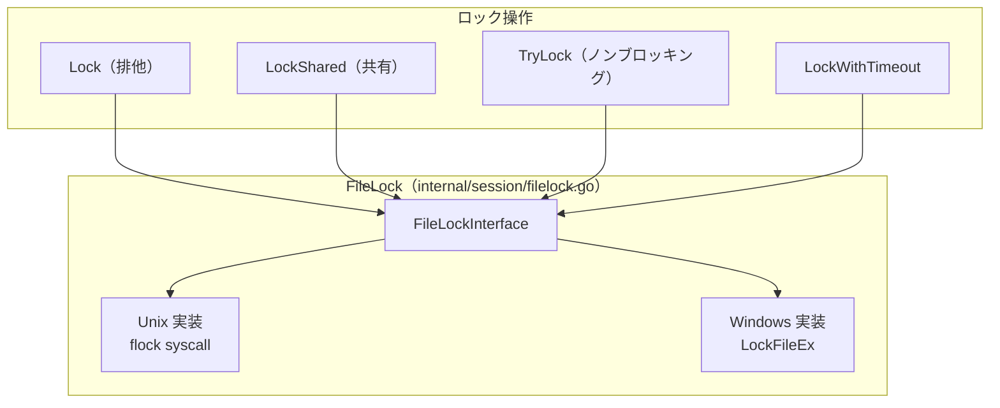
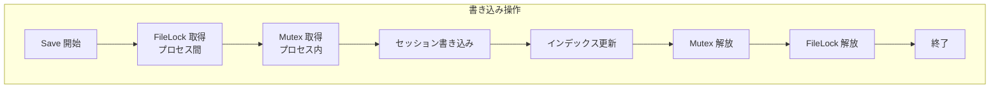
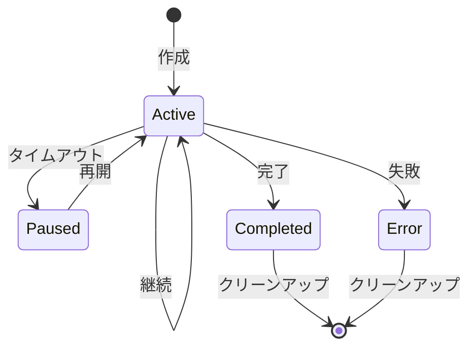

# セッションシステム

このドキュメントでは、clinvoker のセッション永続化システムを包括的に説明します。保存形式、アトミック書き込み、プロセス間ファイルロック、インメモリのメタデータインデックス、ライフサイクル管理を扱います。

## セッション概要

セッションにより次が可能になります。

- **継続性**: CLI 実行をまたいで会話を再開
- **コンテキスト**: 作業ディレクトリや状態を維持
- **監査**: 使用量とトークン消費を追跡
- **共同作業**: チームメンバー間でセッションを共有
- **フォーク**: 既存セッションからブランチを作成

## セッション構造

`Session` 構造体（`internal/session/session.go:45-93`）は、AI とのやり取りのセッション全体を表します。

```go
type Session struct {
    ID               string            `json:"id"`
    Backend          string            `json:"backend"`
    CreatedAt        time.Time         `json:"created_at"`
    LastUsed         time.Time         `json:"last_used"`
    WorkingDir       string            `json:"working_dir"`
    BackendSessionID string            `json:"backend_session_id,omitempty"`
    Model            string            `json:"model,omitempty"`
    InitialPrompt    string            `json:"initial_prompt,omitempty"`
    Status           SessionStatus     `json:"status,omitempty"`
    TurnCount        int               `json:"turn_count,omitempty"`
    TokenUsage       *TokenUsage       `json:"token_usage,omitempty"`
    Tags             []string          `json:"tags,omitempty"`
    Title            string            `json:"title,omitempty"`
    ParentID         string            `json:"parent_id,omitempty"`
    ErrorMessage     string            `json:"error_message,omitempty"`
    Metadata         map[string]string `json:"metadata,omitempty"`
}
```

### セッション ID 生成

セッション ID は crypto/rand による 128-bit エントロピーで生成します。

```go
const SessionIDBytes = 16 // 128-bit entropy

func generateID() (string, error) {
    bytes := make([]byte, SessionIDBytes)
    if _, err := rand.Read(bytes); err != nil {
        return "", err
    }
    return hex.EncodeToString(bytes), nil
}
```

この方式の特徴:

- **衝突耐性**: 50% の衝突確率に 2^64 回程度の試行が必要
- **セキュリティ**: 暗号学的乱数で予測困難
- **長さ**: 32 文字の hex で扱いやすい

## 保存形式

### ファイル構成

セッションは `~/.clinvk/sessions/` に保存されます。

```text
~/.clinvk/sessions/
├── a1b2c3d4e5f6789012345678abcdef01.json
├── b2c3d4e5f6g7890123456789abcdef12.json
├── c3d4e5f6g7h8901234567890abcdef23.json
└── index.json
```

### セッションファイル形式

各セッションは 0600 権限で JSON ファイルとして保存されます。

```json
{
  "id": "a1b2c3d4e5f6789012345678abcdef01",
  "backend": "claude",
  "created_at": "2025-01-15T10:30:00Z",
  "last_used": "2025-01-15T11:45:00Z",
  "working_dir": "/home/user/projects/myapp",
  "backend_session_id": "claude-sess-abc123",
  "model": "claude-sonnet-4",
  "initial_prompt": "Refactor auth middleware",
  "status": "active",
  "turn_count": 5,
  "token_usage": {
    "input_tokens": 1500,
    "output_tokens": 2300,
    "cached_tokens": 500
  },
  "tags": ["refactoring", "auth"],
  "title": "Auth Middleware Refactoring"
}
```

## アトミック書き込み機構

セッションの書き込みは、データ破損を防ぐためにアトミックなファイル操作で行います。

```go
func writeFileAtomic(path string, data []byte, perm os.FileMode) error {
    dir := filepath.Dir(path)
    tmp, err := os.CreateTemp(dir, ".tmp-*")
    if err != nil {
        return err
    }

    tmpName := tmp.Name()
    cleanup := true
    defer func() {
        if cleanup {
            _ = os.Remove(tmpName)
        }
    }()

    if err := tmp.Chmod(perm); err != nil {
        _ = tmp.Close()
        return err
    }

    if _, err := tmp.Write(data); err != nil {
        _ = tmp.Close()
        return err
    }

    if err := tmp.Sync(); err != nil {
        _ = tmp.Close()
        return err
    }

    if err := tmp.Close(); err != nil {
        return err
    }

    if err := os.Rename(tmpName, path); err != nil {
        _ = os.Remove(path)
        if err2 := os.Rename(tmpName, path); err2 != nil {
            return err
        }
    }

    cleanup = false
    return nil
}
```

### アトミック書き込みの流れ



この方式により次が保証されます。

- **原子性**: 読み手は「完全な古い/完全な新しい」しか観測しない
- **永続性**: rename 前に fsync でディスクへ同期
- **権限**: 生成時点から制限された権限（0600）

## プロセス間ファイルロック

セッションストアはプロセス間同期のためにファイルロックを使います。



### Store でのロック利用

```go
func (s *Store) Save(sess *Session) error {
    // Acquire cross-process lock for write operation
    if err := s.fileLock.Lock(); err != nil {
        return fmt.Errorf("failed to acquire store lock: %w", err)
    }
    defer func() {
        _ = s.fileLock.Unlock()
    }()

    s.mu.Lock()
    defer s.mu.Unlock()

    if err := s.saveLocked(sess); err != nil {
        return err
    }

    s.updateIndex(sess)
    _ = s.persistIndex()

    return nil
}
```

### 二重ロック戦略

セッションストアは 2 レベルのロックを使用します。

1. **プロセス内**: goroutine 安全性のための `sync.RWMutex`
2. **プロセス間**: CLI/サーバー併用を想定した `FileLock`



## インメモリのメタデータインデックス

すべてのセッションを毎回読み込むことなく高速操作できるよう、ストアは軽量なインメモリインデックスを保持します。

```go
type SessionMeta struct {
    ID        string
    Backend   string
    Status    SessionStatus
    LastUsed  time.Time
    Model     string
    WorkDir   string
    Title     string
    Tags      []string
    CreatedAt time.Time
}

type Store struct {
    mu           sync.RWMutex
    dir          string
    index        map[string]*SessionMeta // Lightweight metadata cache
    dirty        bool
    fileLock     *FileLock
    indexModTime time.Time
}
```

### インデックスの利点

- **高速な一覧**: フル JSON を読み込まずに一覧表示
- **効率的なフィルタ**: backend/status/tags でディスク I/O なしに絞り込み
- **ページング**: offset/limit を全件読み込みなしで対応
- **メモリ効率**: 必要なときだけフルセッションをロード

### インデックスの永続化

起動を速くするため、インデックスはディスクへ永続化されます。

```go
func (s *Store) persistIndex() error {
    data, err := json.Marshal(&persistedIndex{
        Version: 1,
        Index:   s.index,
    })
    if err != nil {
        return fmt.Errorf("failed to marshal index: %w", err)
    }

    indexPath := filepath.Join(s.dir, indexFileName)
    return writeFileAtomic(indexPath, data, 0600)
}
```

### インデックスの復旧

起動時は永続化インデックスの読み込みを試み、失敗した場合はスキャンへフォールバックします。

```go
func (s *Store) rebuildIndex() error {
    // Fast path: try to load persisted index
    if s.loadPersistedIndex() {
        return nil
    }

    // Slow path: scan session files
    entries, err := os.ReadDir(s.dir)
    // ... build index from files

    // Persist for next startup
    _ = s.persistIndex()
    return nil
}
```

## セッションのライフサイクル状態



### 状態定義

| 状態 | 説明 |
|-------|-------------|
| `active` | 使用中で、再開可能 |
| `paused` | タイムアウトしたが再開可能 |
| `completed` | 正常終了 |
| `error` | エラーで終了 |

### 状態遷移

```go
func (s *Session) MarkUsed() {
    s.LastUsed = time.Now()
}

func (s *Session) SetStatus(status SessionStatus) {
    s.Status = status
}

func (s *Session) SetError(msg string) {
    s.Status = StatusError
    s.ErrorMessage = msg
}

func (s *Session) Complete() {
    s.Status = StatusCompleted
}
```

## 並行制御戦略

### 読み取り操作

```go
func (s *Store) Get(id string) (*Session, error) {
    s.mu.RLock()
    defer s.mu.RUnlock()

    return s.getLocked(id)
}
```

読み取り操作の流れ:

1. 読み取りロック取得
2. インデックスを確認（高速経路）
3. 必要ならセッションファイルをロード
4. 読み取りロック解放

### 書き込み操作

```go
func (s *Store) Create(backend, workDir string) (*Session, error) {
    // Cross-process lock first
    if err := s.fileLock.Lock(); err != nil {
        return nil, err
    }
    defer func() { _ = s.fileLock.Unlock() }()

    s.mu.Lock()
    defer s.mu.Unlock()

    // ... create and save session
}
```

書き込み操作の流れ:

1. プロセス間ファイルロック取得
2. プロセス内の書き込みロック取得
3. 書き込み実行
4. インデックス更新
5. インデックス永続化
6. ロック解放（逆順）

### 読み取り時のインデックス再ロード

ストアは外部変更を検出し、必要ならインデックスを再ロードします。

```go
func (s *Store) indexModifiedExternally() bool {
    if s.indexModTime.IsZero() {
        return true
    }

    indexPath := filepath.Join(s.dir, indexFileName)
    info, err := os.Stat(indexPath)
    if err != nil {
        return true
    }

    return info.ModTime().After(s.indexModTime)
}
```

## 性能面の考慮

### 遅延ロード

フルセッションは必要になったときだけ読み込みます。

```go
func (s *Store) ListMeta() ([]*SessionMeta, error) {
    s.mu.RLock()
    defer s.mu.RUnlock()

    if err := s.ensureIndexLoadedForRead(); err != nil {
        return nil, err
    }

    // Return metadata without loading full sessions
    metas := make([]*SessionMeta, 0, len(s.index))
    for _, meta := range s.index {
        metas = append(metas, meta)
    }
    return metas, nil
}
```

### ページング

インデックスを用いて効率的なページングが可能です。

```go
func (s *Store) ListPaginated(filter *ListFilter) (*ListResult, error) {
    // Filter using index only
    var matchingIDs []string
    for id, meta := range s.index {
        if s.metaMatchesFilter(meta, filter) {
            matchingIDs = append(matchingIDs, id)
        }
    }

    // Apply offset and limit
    if filter.Offset > 0 {
        matchingIDs = matchingIDs[filter.Offset:]
    }
    if filter.Limit > 0 && len(matchingIDs) > filter.Limit {
        matchingIDs = matchingIDs[:filter.Limit]
    }

    // Load full sessions only for matches
    sessions := make([]*Session, 0, len(matchingIDs))
    for _, id := range matchingIDs {
        sess, err := s.getLocked(id)
        if err != nil {
            continue
        }
        sessions = append(sessions, sess)
    }

    return &ListResult{
        Sessions: sessions,
        Total:    total,
        Limit:    filter.Limit,
        Offset:   filter.Offset,
    }, nil
}
```

## フォークとクリーンアップ機構

### セッションのフォーク

セッションはフォークしてブランチを作成できます。

```go
func (s *Session) Fork() (*Session, error) {
    newSess, err := NewSessionWithOptions(s.Backend, s.WorkingDir, &SessionOptions{
        Model:    s.Model,
        ParentID: s.ID,
        Tags:     append([]string{}, s.Tags...),
    })
    if err != nil {
        return nil, err
    }

    // Copy metadata
    for k, v := range s.Metadata {
        newSess.SetMetadata(k, v)
    }

    return newSess, nil
}
```

### クリーンアップ

古いセッションは経過時間に基づいて削除できます。

```go
func (s *Store) Clean(maxAge time.Duration) (int, error) {
    if err := s.fileLock.Lock(); err != nil {
        return 0, err
    }
    defer func() { _ = s.fileLock.Unlock() }()

    s.mu.Lock()
    defer s.mu.Unlock()

    cutoff := time.Now().Add(-maxAge)
    var deleted int

    for id, meta := range s.index {
        if meta.LastUsed.Before(cutoff) {
            if err := s.deleteLocked(id); err == nil {
                s.removeFromIndex(id)
                deleted++
            }
        }
    }

    if deleted > 0 {
        _ = s.persistIndex()
    }

    return deleted, nil
}
```

## セキュリティ考慮

### ファイル権限

セッションファイルは 0600（所有者のみ読み書き）で作成されます。

```go
// Use 0600 to protect potentially sensitive prompt data
if err := writeFileAtomic(path, data, 0600); err != nil {
    return fmt.Errorf("failed to write session file: %w", err)
}
```

### ディレクトリ権限

セッションディレクトリは 0700 です。

```go
func (s *Store) ensureStoreDirLocked() error {
    // Use 0700 for security - only owner can access session data
    return os.MkdirAll(s.dir, 0700)
}
```

### パストラバーサル防止

セッション ID を検証して、パストラバーサルを防ぎます。

```go
func validateSessionID(id string) error {
    if id == "" {
        return fmt.Errorf("session ID cannot be empty")
    }
    // Check for path traversal attempts
    if strings.Contains(id, "/") || strings.Contains(id, "\\") || strings.Contains(id, "..") {
        return fmt.Errorf("invalid session ID: contains path characters")
    }
    // Validate format
    if (len(id) == 16 || len(id) == 32) && !sessionIDPattern.MatchString(id) {
        return fmt.Errorf("invalid session ID format")
    }
    return nil
}
```

## 関連ドキュメント

- [アーキテクチャ概要](architecture.md) - システム全体像
- [バックエンドシステム](backend-system.md) - バックエンド抽象化レイヤ
- [API 設計](api-design.md) - REST API アーキテクチャ
