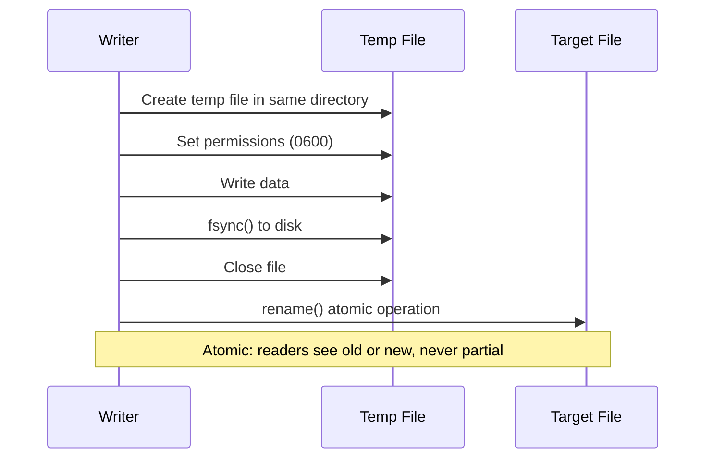
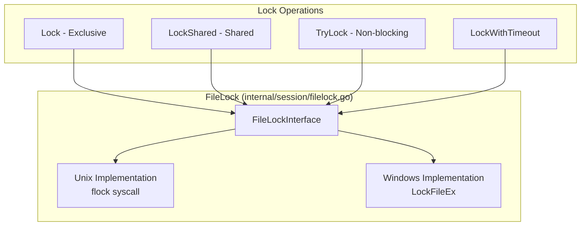
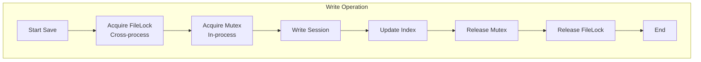
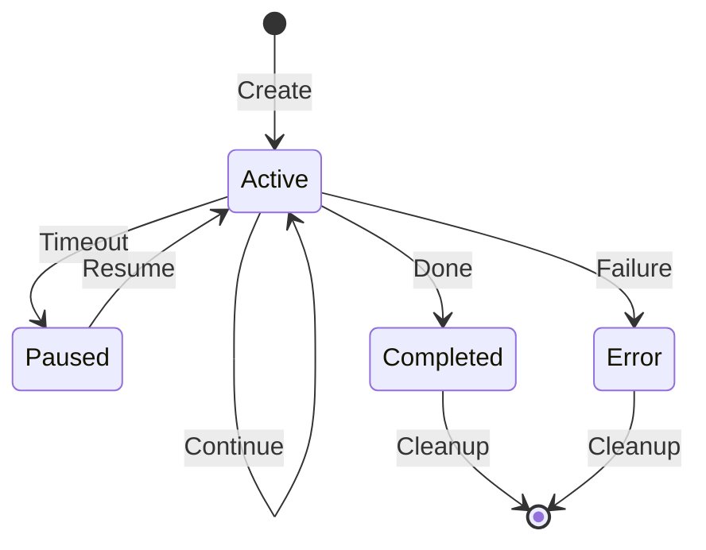

# Session System

This document provides a comprehensive explanation of clinvoker's session persistence system, covering the storage format, atomic write mechanisms, cross-process file locking, in-memory metadata indexing, and lifecycle management.

## Session Overview

Sessions enable:

- **Continuity**: Resume conversations across CLI invocations
- **Context**: Maintain working directory and state
- **Audit**: Track usage and token consumption
- **Collaboration**: Share sessions between team members
- **Forking**: Create branches from existing sessions

## Session Structure

The `Session` struct (`internal/session/session.go:45-93`) represents a complete AI interaction session:

```go
type Session struct {
    ID               string            `json:"id"`
    Backend          string            `json:"backend"`
    CreatedAt        time.Time         `json:"created_at"`
    LastUsed         time.Time         `json:"last_used"`
    WorkingDir       string            `json:"working_dir"`
    BackendSessionID string            `json:"backend_session_id,omitempty"`
    Model            string            `json:"model,omitempty"`
    InitialPrompt    string            `json:"initial_prompt,omitempty"`
    Status           SessionStatus     `json:"status,omitempty"`
    TurnCount        int               `json:"turn_count,omitempty"`
    TokenUsage       *TokenUsage       `json:"token_usage,omitempty"`
    Tags             []string          `json:"tags,omitempty"`
    Title            string            `json:"title,omitempty"`
    ParentID         string            `json:"parent_id,omitempty"`
    ErrorMessage     string            `json:"error_message,omitempty"`
    Metadata         map[string]string `json:"metadata,omitempty"`
}
```

### Session ID Generation

Session IDs are generated with 128-bit entropy using crypto/rand:

```go
const SessionIDBytes = 16 // 128-bit entropy

func generateID() (string, error) {
    bytes := make([]byte, SessionIDBytes)
    if _, err := rand.Read(bytes); err != nil {
        return "", err
    }
    return hex.EncodeToString(bytes), nil
}
```

This provides:
- **Collision resistance**: 2^64 operations needed for 50% collision probability
- **Security**: Cryptographically random, not predictable
- **Length**: 32 hex characters for easy handling

## Storage Format

### File Organization

Sessions are stored in `~/.clinvk/sessions/`:

```text
~/.clinvk/sessions/
├── a1b2c3d4e5f6789012345678abcdef01.json
├── b2c3d4e5f6g7890123456789abcdef12.json
├── c3d4e5f6g7h8901234567890abcdef23.json
└── index.json
```

### Session File Format

Each session is stored as a JSON file with 0600 permissions:

```json
{
  "id": "a1b2c3d4e5f6789012345678abcdef01",
  "backend": "claude",
  "created_at": "2025-01-15T10:30:00Z",
  "last_used": "2025-01-15T11:45:00Z",
  "working_dir": "/home/user/projects/myapp",
  "backend_session_id": "claude-sess-abc123",
  "model": "claude-sonnet-4",
  "initial_prompt": "Refactor auth middleware",
  "status": "active",
  "turn_count": 5,
  "token_usage": {
    "input_tokens": 1500,
    "output_tokens": 2300,
    "cached_tokens": 500
  },
  "tags": ["refactoring", "auth"],
  "title": "Auth Middleware Refactoring"
}
```

## Atomic Write Mechanism

All session writes use atomic file operations to prevent data corruption:

```go
func writeFileAtomic(path string, data []byte, perm os.FileMode) error {
    dir := filepath.Dir(path)
    tmp, err := os.CreateTemp(dir, ".tmp-*")
    if err != nil {
        return err
    }

    tmpName := tmp.Name()
    cleanup := true
    defer func() {
        if cleanup {
            _ = os.Remove(tmpName)
        }
    }()

    if err := tmp.Chmod(perm); err != nil {
        _ = tmp.Close()
        return err
    }

    if _, err := tmp.Write(data); err != nil {
        _ = tmp.Close()
        return err
    }

    if err := tmp.Sync(); err != nil {
        _ = tmp.Close()
        return err
    }

    if err := tmp.Close(); err != nil {
        return err
    }

    if err := os.Rename(tmpName, path); err != nil {
        _ = os.Remove(path)
        if err2 := os.Rename(tmpName, path); err2 != nil {
            return err
        }
    }

    cleanup = false
    return nil
}
```

### Atomic Write Process



This ensures:
- **Atomicity**: Readers always see complete old or new file, never partial writes
- **Durability**: Data is fsynced to disk before rename
- **Permissions**: File created with restricted permissions from the start

## Cross-Process File Locking

The session store uses file locking for cross-process synchronization:



### Lock Usage in Store

```go
func (s *Store) Save(sess *Session) error {
    // Acquire cross-process lock for write operation
    if err := s.fileLock.Lock(); err != nil {
        return fmt.Errorf("failed to acquire store lock: %w", err)
    }
    defer func() {
        _ = s.fileLock.Unlock()
    }()

    s.mu.Lock()
    defer s.mu.Unlock()

    if err := s.saveLocked(sess); err != nil {
        return err
    }

    s.updateIndex(sess)
    _ = s.persistIndex()

    return nil
}
```

### Dual-Locking Strategy

The session store uses two levels of locking:

1. **In-process**: `sync.RWMutex` for goroutine safety
2. **Cross-process**: `FileLock` for CLI/server coexistence



## In-Memory Metadata Index

The store maintains an in-memory index for fast operations without loading all sessions:

```go
type SessionMeta struct {
    ID        string
    Backend   string
    Status    SessionStatus
    LastUsed  time.Time
    Model     string
    WorkDir   string
    Title     string
    Tags      []string
    CreatedAt time.Time
}

type Store struct {
    mu           sync.RWMutex
    dir          string
    index        map[string]*SessionMeta // Lightweight metadata cache
    dirty        bool
    fileLock     *FileLock
    indexModTime time.Time
}
```

### Index Benefits

- **Fast listing**: List sessions without loading full JSON files
- **Efficient filtering**: Filter by backend, status, tags without disk I/O
- **Pagination**: Support offset/limit without loading all sessions
- **Memory efficiency**: Only load full sessions when needed

### Index Persistence

The index is persisted to disk for fast startup:

```go
func (s *Store) persistIndex() error {
    data, err := json.Marshal(&persistedIndex{
        Version: 1,
        Index:   s.index,
    })
    if err != nil {
        return fmt.Errorf("failed to marshal index: %w", err)
    }

    indexPath := filepath.Join(s.dir, indexFileName)
    return writeFileAtomic(indexPath, data, 0600)
}
```

### Index Recovery

On startup, the store tries to load the persisted index, falling back to scanning:

```go
func (s *Store) rebuildIndex() error {
    // Fast path: try to load persisted index
    if s.loadPersistedIndex() {
        return nil
    }

    // Slow path: scan session files
    entries, err := os.ReadDir(s.dir)
    // ... build index from files

    // Persist for next startup
    _ = s.persistIndex()
    return nil
}
```

## Session Lifecycle States



### State Definitions

| State | Description |
|-------|-------------|
| `active` | Session is in use and can be resumed |
| `paused` | Session timed out but can be resumed |
| `completed` | Session finished successfully |
| `error` | Session ended with an error |

### State Transitions

```go
func (s *Session) MarkUsed() {
    s.LastUsed = time.Now()
}

func (s *Session) SetStatus(status SessionStatus) {
    s.Status = status
}

func (s *Session) SetError(msg string) {
    s.Status = StatusError
    s.ErrorMessage = msg
}

func (s *Session) Complete() {
    s.Status = StatusCompleted
}
```

## Concurrency Control Strategies

### Read Operations

```go
func (s *Store) Get(id string) (*Session, error) {
    s.mu.RLock()
    defer s.mu.RUnlock()

    return s.getLocked(id)
}
```

Read operations:
1. Acquire read lock
2. Check index (fast path)
3. Load session file if needed
4. Release read lock

### Write Operations

```go
func (s *Store) Create(backend, workDir string) (*Session, error) {
    // Cross-process lock first
    if err := s.fileLock.Lock(); err != nil {
        return nil, err
    }
    defer func() { _ = s.fileLock.Unlock() }()

    s.mu.Lock()
    defer s.mu.Unlock()

    // ... create and save session
}
```

Write operations:
1. Acquire cross-process file lock
2. Acquire in-process write lock
3. Perform write operation
4. Update index
5. Persist index
6. Release locks (reverse order)

### Index Reload for Reads

The store detects external modifications and reloads the index:

```go
func (s *Store) indexModifiedExternally() bool {
    if s.indexModTime.IsZero() {
        return true
    }

    indexPath := filepath.Join(s.dir, indexFileName)
    info, err := os.Stat(indexPath)
    if err != nil {
        return true
    }

    return info.ModTime().After(s.indexModTime)
}
```

## Performance Considerations

### Lazy Loading

Full sessions are only loaded when needed:

```go
func (s *Store) ListMeta() ([]*SessionMeta, error) {
    s.mu.RLock()
    defer s.mu.RUnlock()

    if err := s.ensureIndexLoadedForRead(); err != nil {
        return nil, err
    }

    // Return metadata without loading full sessions
    metas := make([]*SessionMeta, 0, len(s.index))
    for _, meta := range s.index {
        metas = append(metas, meta)
    }
    return metas, nil
}
```

### Pagination

The store supports efficient pagination using the index:

```go
func (s *Store) ListPaginated(filter *ListFilter) (*ListResult, error) {
    // Filter using index only
    var matchingIDs []string
    for id, meta := range s.index {
        if s.metaMatchesFilter(meta, filter) {
            matchingIDs = append(matchingIDs, id)
        }
    }

    // Apply offset and limit
    if filter.Offset > 0 {
        matchingIDs = matchingIDs[filter.Offset:]
    }
    if filter.Limit > 0 && len(matchingIDs) > filter.Limit {
        matchingIDs = matchingIDs[:filter.Limit]
    }

    // Load full sessions only for matches
    sessions := make([]*Session, 0, len(matchingIDs))
    for _, id := range matchingIDs {
        sess, err := s.getLocked(id)
        if err != nil {
            continue
        }
        sessions = append(sessions, sess)
    }

    return &ListResult{
        Sessions: sessions,
        Total:    total,
        Limit:    filter.Limit,
        Offset:   filter.Offset,
    }, nil
}
```

## Fork and Cleanup Mechanisms

### Session Forking

Sessions can be forked to create branches:

```go
func (s *Session) Fork() (*Session, error) {
    newSess, err := NewSessionWithOptions(s.Backend, s.WorkingDir, &SessionOptions{
        Model:    s.Model,
        ParentID: s.ID,
        Tags:     append([]string{}, s.Tags...),
    })
    if err != nil {
        return nil, err
    }

    // Copy metadata
    for k, v := range s.Metadata {
        newSess.SetMetadata(k, v)
    }

    return newSess, nil
}
```

### Cleanup

Old sessions can be cleaned up based on age:

```go
func (s *Store) Clean(maxAge time.Duration) (int, error) {
    if err := s.fileLock.Lock(); err != nil {
        return 0, err
    }
    defer func() { _ = s.fileLock.Unlock() }()

    s.mu.Lock()
    defer s.mu.Unlock()

    cutoff := time.Now().Add(-maxAge)
    var deleted int

    for id, meta := range s.index {
        if meta.LastUsed.Before(cutoff) {
            if err := s.deleteLocked(id); err == nil {
                s.removeFromIndex(id)
                deleted++
            }
        }
    }

    if deleted > 0 {
        _ = s.persistIndex()
    }

    return deleted, nil
}
```

## Security Considerations

### File Permissions

Session files are created with 0600 permissions (owner read/write only):

```go
// Use 0600 to protect potentially sensitive prompt data
if err := writeFileAtomic(path, data, 0600); err != nil {
    return fmt.Errorf("failed to write session file: %w", err)
}
```

### Directory Permissions

The sessions directory uses 0700 permissions:

```go
func (s *Store) ensureStoreDirLocked() error {
    // Use 0700 for security - only owner can access session data
    return os.MkdirAll(s.dir, 0700)
}
```

### Path Traversal Prevention

Session IDs are validated to prevent path traversal:

```go
func validateSessionID(id string) error {
    if id == "" {
        return fmt.Errorf("session ID cannot be empty")
    }
    // Check for path traversal attempts
    if strings.Contains(id, "/") || strings.Contains(id, "\\") || strings.Contains(id, "..") {
        return fmt.Errorf("invalid session ID: contains path characters")
    }
    // Validate format
    if (len(id) == 16 || len(id) == 32) && !sessionIDPattern.MatchString(id) {
        return fmt.Errorf("invalid session ID format")
    }
    return nil
}
```

## Related Documentation

- [Architecture Overview](architecture.md) - High-level system architecture
- [Backend System](backend-system.md) - Backend abstraction layer
- [API Design](api-design.md) - REST API architecture
