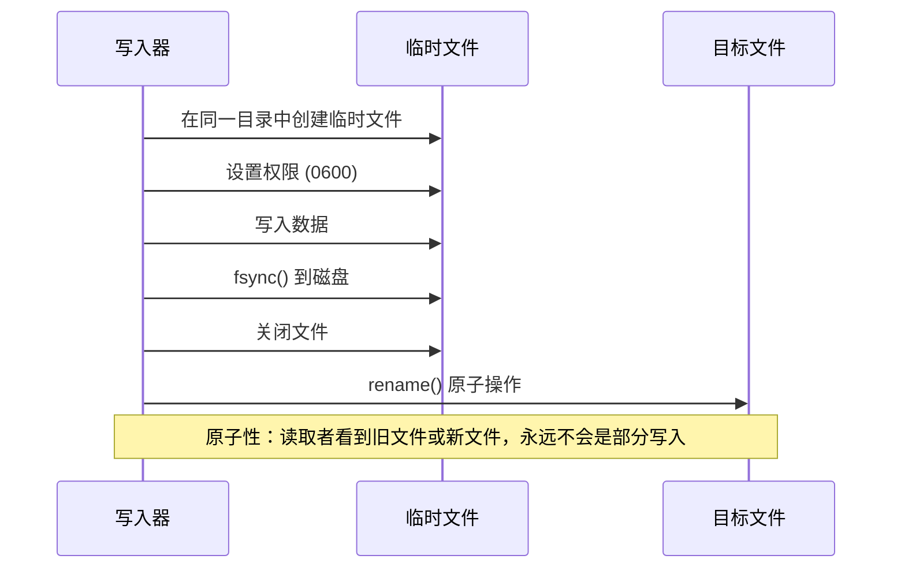
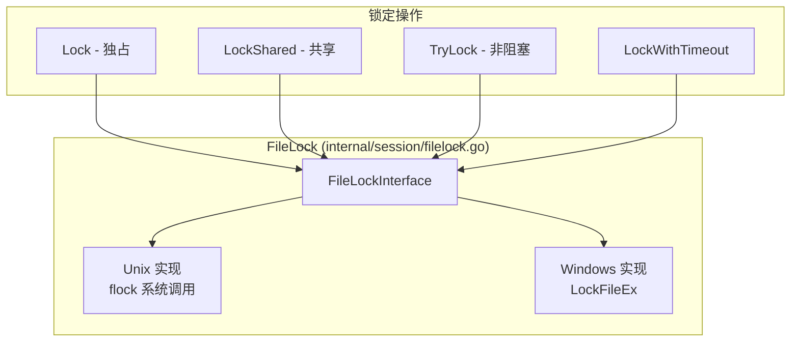
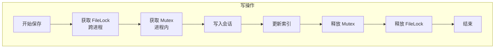
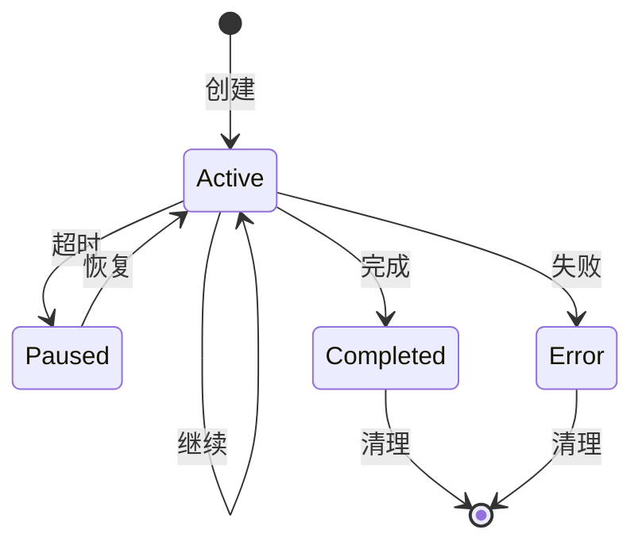

# 会话系统

本文档全面介绍 clinvoker 的会话持久化系统，涵盖存储格式、原子写入机制、跨进程文件锁定、内存元数据索引和生命周期管理。

## 会话概述

会话支持：

- **连续性**：跨 CLI 调用恢复对话
- **上下文**：维护工作目录和状态
- **审计**：跟踪使用情况和 Token 消耗
- **协作**：在团队成员之间共享会话
- **分叉**：从现有会话创建分支

## 会话结构

`Session` 结构体（`internal/session/session.go:45-93`）表示完整的 AI 交互会话：

```go
type Session struct {
    ID               string            `json:"id"`
    Backend          string            `json:"backend"`
    CreatedAt        time.Time         `json:"created_at"`
    LastUsed         time.Time         `json:"last_used"`
    WorkingDir       string            `json:"working_dir"`
    BackendSessionID string            `json:"backend_session_id,omitempty"`
    Model            string            `json:"model,omitempty"`
    InitialPrompt    string            `json:"initial_prompt,omitempty"`
    Status           SessionStatus     `json:"status,omitempty"`
    TurnCount        int               `json:"turn_count,omitempty"`
    TokenUsage       *TokenUsage       `json:"token_usage,omitempty"`
    Tags             []string          `json:"tags,omitempty"`
    Title            string            `json:"title,omitempty"`
    ParentID         string            `json:"parent_id,omitempty"`
    ErrorMessage     string            `json:"error_message,omitempty"`
    Metadata         map[string]string `json:"metadata,omitempty"`
}
```

### 会话 ID 生成

会话 ID 使用 crypto/rand 生成，具有 128 位熵：

```go
const SessionIDBytes = 16 // 128 位熵

func generateID() (string, error) {
    bytes := make([]byte, SessionIDBytes)
    if _, err := rand.Read(bytes); err != nil {
        return "", err
    }
    return hex.EncodeToString(bytes), nil
}
```

这提供了：
- **抗碰撞性**：需要 2^64 次操作才能达到 50% 的碰撞概率
- **安全性**：加密随机，不可预测
- **长度**：32 个十六进制字符，便于处理

## 存储格式

### 文件组织

会话存储在 `~/.clinvk/sessions/`：

```text
~/.clinvk/sessions/
├── a1b2c3d4e5f6789012345678abcdef01.json
├── b2c3d4e5f6g7890123456789abcdef12.json
├── c3d4e5f6g7h8901234567890abcdef23.json
└── index.json
```

### 会话文件格式

每个会话以 JSON 文件形式存储，权限为 0600：

```json
{
  "id": "a1b2c3d4e5f6789012345678abcdef01",
  "backend": "claude",
  "created_at": "2025-01-15T10:30:00Z",
  "last_used": "2025-01-15T11:45:00Z",
  "working_dir": "/home/user/projects/myapp",
  "backend_session_id": "claude-sess-abc123",
  "model": "claude-sonnet-4",
  "initial_prompt": "Refactor auth middleware",
  "status": "active",
  "turn_count": 5,
  "token_usage": {
    "input_tokens": 1500,
    "output_tokens": 2300,
    "cached_tokens": 500
  },
  "tags": ["refactoring", "auth"],
  "title": "Auth Middleware Refactoring"
}
```

## 原子写入机制

所有会话写入使用原子文件操作以防止数据损坏：

```go
func writeFileAtomic(path string, data []byte, perm os.FileMode) error {
    dir := filepath.Dir(path)
    tmp, err := os.CreateTemp(dir, ".tmp-*")
    if err != nil {
        return err
    }

    tmpName := tmp.Name()
    cleanup := true
    defer func() {
        if cleanup {
            _ = os.Remove(tmpName)
        }
    }()

    if err := tmp.Chmod(perm); err != nil {
        _ = tmp.Close()
        return err
    }

    if _, err := tmp.Write(data); err != nil {
        _ = tmp.Close()
        return err
    }

    if err := tmp.Sync(); err != nil {
        _ = tmp.Close()
        return err
    }

    if err := tmp.Close(); err != nil {
        return err
    }

    if err := os.Rename(tmpName, path); err != nil {
        _ = os.Remove(path)
        if err2 := os.Rename(tmpName, path); err2 != nil {
            return err
        }
    }

    cleanup = false
    return nil
}
```

### 原子写入过程



这确保了：
- **原子性**：读取者总是看到完整的旧文件或新文件，永远不会是部分写入
- **持久性**：数据在重命名前已 fsync 到磁盘
- **权限**：文件从一开始就使用受限权限创建

## 跨进程文件锁定

会话存储使用文件锁定进行跨进程同步：



### 存储中的锁使用

```go
func (s *Store) Save(sess *Session) error {
    // 获取跨进程锁进行写操作
    if err := s.fileLock.Lock(); err != nil {
        return fmt.Errorf("failed to acquire store lock: %w", err)
    }
    defer func() {
        _ = s.fileLock.Unlock()
    }()

    s.mu.Lock()
    defer s.mu.Unlock()

    if err := s.saveLocked(sess); err != nil {
        return err
    }

    s.updateIndex(sess)
    _ = s.persistIndex()

    return nil
}
```

### 双重锁定策略

会话存储使用两级锁定：

1. **进程内**：`sync.RWMutex` 用于 goroutine 安全
2. **跨进程**：`FileLock` 用于 CLI/服务器共存



## 内存元数据索引

存储维护内存索引以实现快速操作，无需加载所有会话：

```go
type SessionMeta struct {
    ID        string
    Backend   string
    Status    SessionStatus
    LastUsed  time.Time
    Model     string
    WorkDir   string
    Title     string
    Tags      []string
    CreatedAt time.Time
}

type Store struct {
    mu           sync.RWMutex
    dir          string
    index        map[string]*SessionMeta // 轻量级元数据缓存
    dirty        bool
    fileLock     *FileLock
    indexModTime time.Time
}
```

### 索引优势

- **快速列表**：无需加载完整 JSON 文件即可列出会话
- **高效过滤**：无需磁盘 I/O 即可按后端、状态、标签过滤
- **分页**：支持偏移/限制而无需加载所有会话
- **内存效率**：仅在需要时加载完整会话

### 索引持久化

索引被持久化到磁盘以实现快速启动：

```go
func (s *Store) persistIndex() error {
    data, err := json.Marshal(&persistedIndex{
        Version: 1,
        Index:   s.index,
    })
    if err != nil {
        return fmt.Errorf("failed to marshal index: %w", err)
    }

    indexPath := filepath.Join(s.dir, indexFileName)
    return writeFileAtomic(indexPath, data, 0600)
}
```

### 索引恢复

启动时，存储尝试加载持久化的索引，否则回退到扫描：

```go
func (s *Store) rebuildIndex() error {
    // 快速路径：尝试加载持久化索引
    if s.loadPersistedIndex() {
        return nil
    }

    // 慢速路径：扫描会话文件
    entries, err := os.ReadDir(s.dir)
    // ... 从文件构建索引

    // 为下次启动持久化
    _ = s.persistIndex()
    return nil
}
```

## 会话生命周期状态



### 状态定义

| 状态 | 描述 |
|-------|-------------|
| `active` | 会话正在使用中，可以恢复 |
| `paused` | 会话已超时，但可以恢复 |
| `completed` | 会话成功完成 |
| `error` | 会话以错误结束 |

### 状态转换

```go
func (s *Session) MarkUsed() {
    s.LastUsed = time.Now()
}

func (s *Session) SetStatus(status SessionStatus) {
    s.Status = status
}

func (s *Session) SetError(msg string) {
    s.Status = StatusError
    s.ErrorMessage = msg
}

func (s *Session) Complete() {
    s.Status = StatusCompleted
}
```

## 并发控制策略

### 读操作

```go
func (s *Store) Get(id string) (*Session, error) {
    s.mu.RLock()
    defer s.mu.RUnlock()

    return s.getLocked(id)
}
```

读操作：
1. 获取读锁
2. 检查索引（快速路径）
3. 如需要加载会话文件
4. 释放读锁

### 写操作

```go
func (s *Store) Create(backend, workDir string) (*Session, error) {
    // 首先获取跨进程锁
    if err := s.fileLock.Lock(); err != nil {
        return nil, err
    }
    defer func() { _ = s.fileLock.Unlock() }()

    s.mu.Lock()
    defer s.mu.Unlock()

    // ... 创建并保存会话
}
```

写操作：
1. 获取跨进程文件锁
2. 获取进程内写锁
3. 执行写操作
4. 更新索引
5. 持久化索引
6. 释放锁（逆序）

### 读取时的索引重载

存储检测外部修改并重载索引：

```go
func (s *Store) indexModifiedExternally() bool {
    if s.indexModTime.IsZero() {
        return true
    }

    indexPath := filepath.Join(s.dir, indexFileName)
    info, err := os.Stat(indexPath)
    if err != nil {
        return true
    }

    return info.ModTime().After(s.indexModTime)
}
```

## 性能考虑

### 延迟加载

仅在需要时加载完整会话：

```go
func (s *Store) ListMeta() ([]*SessionMeta, error) {
    s.mu.RLock()
    defer s.mu.RUnlock()

    if err := s.ensureIndexLoadedForRead(); err != nil {
        return nil, err
    }

    // 返回元数据而不加载完整会话
    metas := make([]*SessionMeta, 0, len(s.index))
    for _, meta := range s.index {
        metas = append(metas, meta)
    }
    return metas, nil
}
```

### 分页

存储使用索引支持高效分页：

```go
func (s *Store) ListPaginated(filter *ListFilter) (*ListResult, error) {
    // 仅使用索引过滤
    var matchingIDs []string
    for id, meta := range s.index {
        if s.metaMatchesFilter(meta, filter) {
            matchingIDs = append(matchingIDs, id)
        }
    }

    // 应用偏移和限制
    if filter.Offset > 0 {
        matchingIDs = matchingIDs[filter.Offset:]
    }
    if filter.Limit > 0 && len(matchingIDs) > filter.Limit {
        matchingIDs = matchingIDs[:filter.Limit]
    }

    // 仅为匹配项加载完整会话
    sessions := make([]*Session, 0, len(matchingIDs))
    for _, id := range matchingIDs {
        sess, err := s.getLocked(id)
        if err != nil {
            continue
        }
        sessions = append(sessions, sess)
    }

    return &ListResult{
        Sessions: sessions,
        Total:    total,
        Limit:    filter.Limit,
        Offset:   filter.Offset,
    }, nil
}
```

## 分叉和清理机制

### 会话分叉

会话可以被分叉以创建分支：

```go
func (s *Session) Fork() (*Session, error) {
    newSess, err := NewSessionWithOptions(s.Backend, s.WorkingDir, &SessionOptions{
        Model:    s.Model,
        ParentID: s.ID,
        Tags:     append([]string{}, s.Tags...),
    })
    if err != nil {
        return nil, err
    }

    // 复制元数据
    for k, v := range s.Metadata {
        newSess.SetMetadata(k, v)
    }

    return newSess, nil
}
```

### 清理

可以根据年龄清理旧会话：

```go
func (s *Store) Clean(maxAge time.Duration) (int, error) {
    if err := s.fileLock.Lock(); err != nil {
        return 0, err
    }
    defer func() { _ = s.fileLock.Unlock() }()

    s.mu.Lock()
    defer s.mu.Unlock()

    cutoff := time.Now().Add(-maxAge)
    var deleted int

    for id, meta := range s.index {
        if meta.LastUsed.Before(cutoff) {
            if err := s.deleteLocked(id); err == nil {
                s.removeFromIndex(id)
                deleted++
            }
        }
    }

    if deleted > 0 {
        _ = s.persistIndex()
    }

    return deleted, nil
}
```

## 安全考虑

### 文件权限

会话文件以 0600 权限创建（仅所有者可读/写）：

```go
// 使用 0600 保护可能包含敏感提示的数据
if err := writeFileAtomic(path, data, 0600); err != nil {
    return fmt.Errorf("failed to write session file: %w", err)
}
```

### 目录权限

会话目录使用 0700 权限：

```go
func (s *Store) ensureStoreDirLocked() error {
    // 使用 0700 确保安全 - 只有所有者可以访问会话数据
    return os.MkdirAll(s.dir, 0700)
}
```

### 路径遍历防护

会话 ID 经过验证以防止路径遍历：

```go
func validateSessionID(id string) error {
    if id == "" {
        return fmt.Errorf("session ID cannot be empty")
    }
    // 检查路径遍历尝试
    if strings.Contains(id, "/") || strings.Contains(id, "\\") || strings.Contains(id, "..") {
        return fmt.Errorf("invalid session ID: contains path characters")
    }
    // 验证格式
    if (len(id) == 16 || len(id) == 32) && !sessionIDPattern.MatchString(id) {
        return fmt.Errorf("invalid session ID format")
    }
    return nil
}
```

## 相关文档

- [架构概述](architecture.zh.md) - 高级系统架构
- [后端系统](backend-system.zh.md) - 后端抽象层
- [API 设计](api-design.zh.md) - REST API 架构
