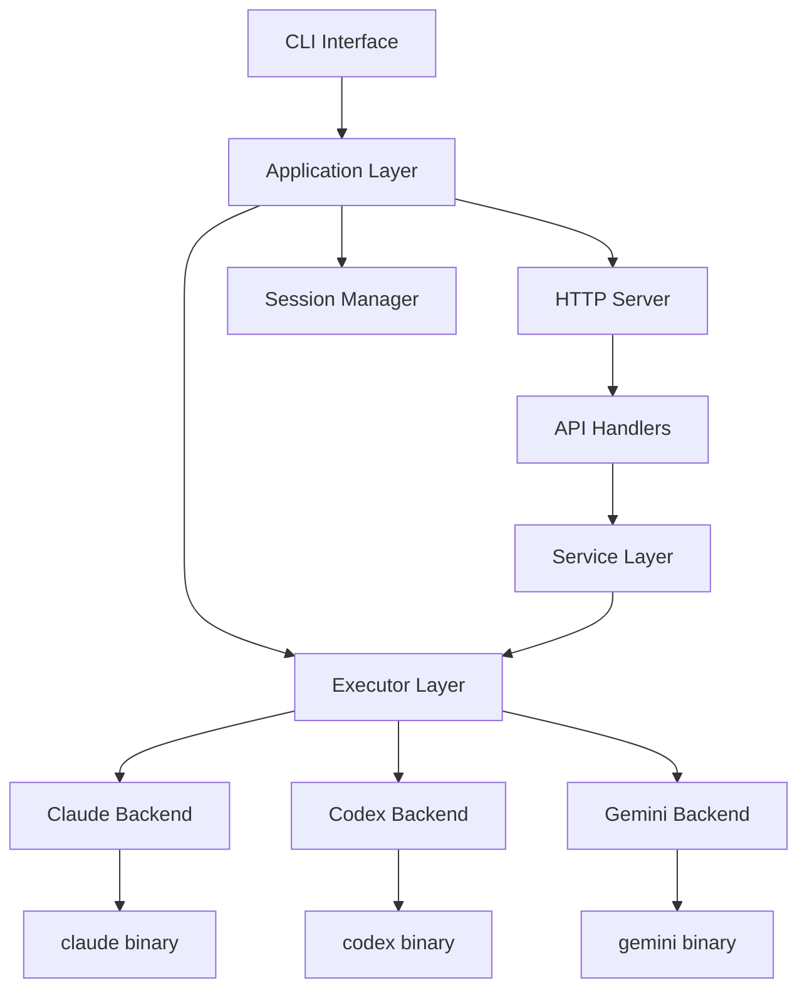
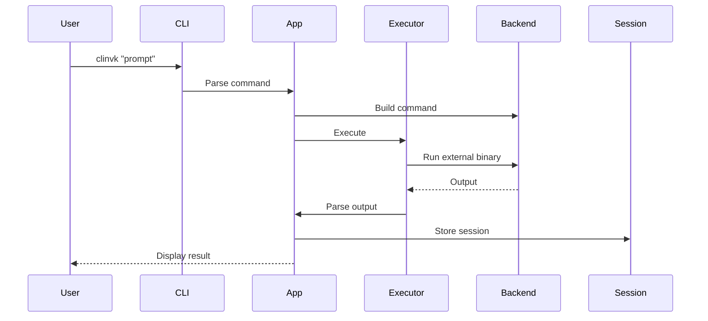
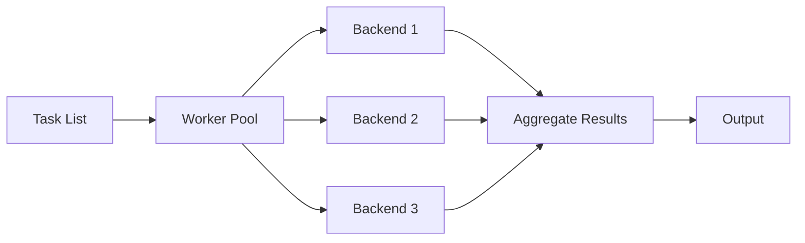
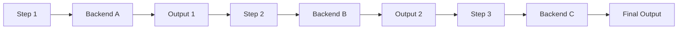

# Architecture Overview

This document describes the architecture of clinvk.

## System Architecture



## Layer Overview

### Entry Point (`cmd/clinvk/`)

The main entry point initializes the CLI application and delegates to the app layer.

### Application Layer (`internal/app/`)

Implements CLI commands and orchestrates other modules:

| File | Purpose |
|------|---------|
| `app.go` | Root command, global flags, prompt execution |
| `cmd_parallel.go` | Concurrent multi-task execution |
| `cmd_chain.go` | Sequential pipeline execution |
| `cmd_compare.go` | Multi-backend comparison |
| `cmd_serve.go` | HTTP server startup |
| `cmd_sessions.go` | Session management commands |
| `cmd_config.go` | Configuration commands |
| `cmd_version.go` | Version command |

### Backend Layer (`internal/backend/`)

Provides a unified interface for different AI CLI tools:

```go
type Backend interface {
    Name() string
    IsAvailable() bool
    BuildCommand(prompt string, opts *Options) *exec.Cmd
    ResumeCommand(sessionID, prompt string, opts *Options) *exec.Cmd
    BuildCommandUnified(prompt string, opts *UnifiedOptions) *exec.Cmd
    ResumeCommandUnified(sessionID, prompt string, opts *UnifiedOptions) *exec.Cmd
    ParseOutput(rawOutput string) string
    ParseJSONResponse(rawOutput string) (*UnifiedResponse, error)
    SeparateStderr() bool
}
```

Implementations:

- `claude.go` - Claude Code backend
- `codex.go` - Codex CLI backend
- `gemini.go` - Gemini CLI backend

### Executor Layer (`internal/executor/`)

Handles actual execution of backend commands:

| File | Purpose |
|------|---------|
| `executor.go` | Command execution with PTY support |
| `signal.go` | Signal forwarding |
| `signal_unix.go` | Unix signal handling |
| `signal_windows.go` | Windows signal handling |

### Server Layer (`internal/server/`)

HTTP API server with multiple API styles:

```
/api/v1/          - Custom RESTful API
/openai/v1/       - OpenAI-compatible API
/anthropic/v1/    - Anthropic-compatible API
```

Components:

- `server.go` - Server setup and routing
- `handlers/` - Request handlers
- `service/` - Business logic & orchestration
- `core/` - Backend execution core (stateless)

### Session Layer (`internal/session/`)

Manages persistent sessions:

```go
type Session struct {
    ID        string
    Backend   string
    Model     string
    Workdir   string
    CreatedAt time.Time
    UpdatedAt time.Time
    Metadata  map[string]any
}
```

Storage: JSON files in `~/.clinvk/sessions/`

### Configuration (`internal/config/`)

Handles configuration loading with cascade:

```
CLI Flags > Environment Variables > Config File > Defaults
```

## Data Flow

### Single Prompt Execution



### Parallel Execution



### Chain Execution



## Key Design Decisions

### 1. Backend Abstraction

All backends implement a common interface, enabling:

- Easy addition of new backends
- Consistent behavior across backends
- Backend-agnostic orchestration

### 2. Configuration Cascade

Priority: CLI flags > env vars > config file > defaults

This allows:

- Quick overrides via CLI
- Environment-specific configuration
- Persistent preferences in config file

### 3. Session Persistence

Sessions stored as JSON files for:

- Resumability across invocations
- Easy debugging and inspection
- No database dependency

### 4. HTTP API Compatibility

Multiple API styles for integration:

- Custom API for full functionality
- OpenAI-compatible for existing tooling
- Anthropic-compatible for Claude clients

### 5. Streaming Output

Real-time output streaming via:

- Subprocess stdout/stderr pipes
- Chunk-based parsing utilities

## Security Considerations

### Subprocess Execution

- Commands are built programmatically, not shell-interpreted
- Working directory is validated
- Timeouts prevent runaway processes

### Configuration

- Config file uses restrictive permissions
- No sensitive data stored in sessions
- API keys handled by underlying CLI tools

### HTTP Server

- Bind to localhost by default
- No authentication (intended for local use)
- Request validation via huma/v2

## Performance Considerations

### Parallel Execution

- Configurable worker pool size
- Fail-fast option for early termination
- Memory-efficient result aggregation

### Session Store

- Indexed lookups for common queries
- Pagination for large session lists
- Lazy loading of session content

### Output Parsing

- Streaming parse for large outputs
- Efficient JSON unmarshaling
- Compiled regex patterns
