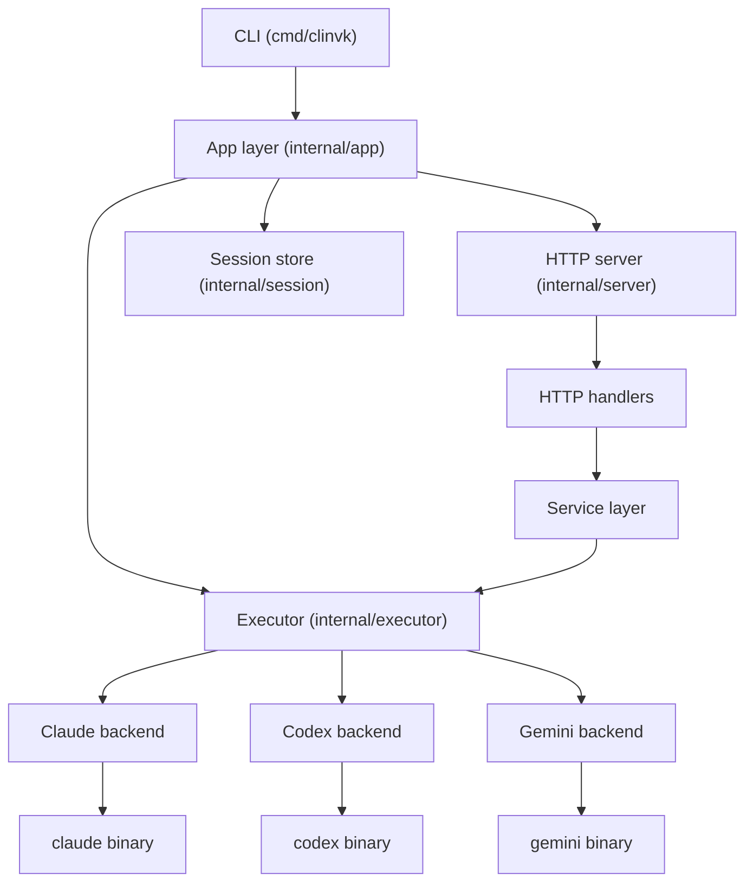
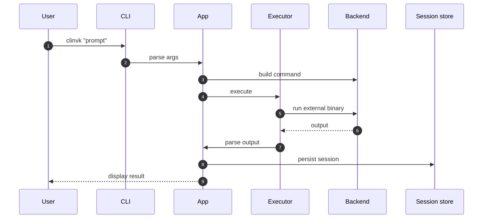
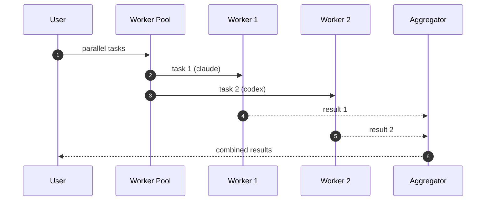
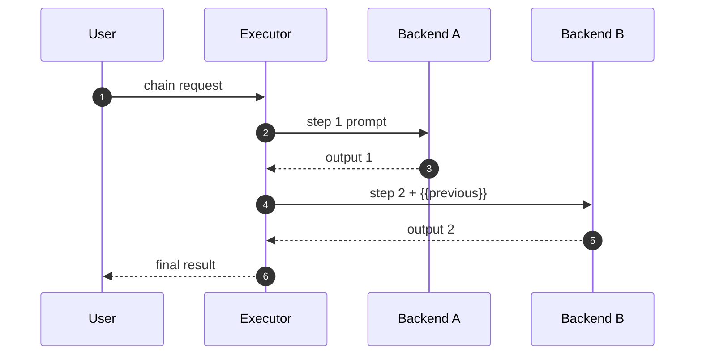

# Architecture Overview

Technical architecture details for clinvk developers.

## System Architecture



## Project Structure

```text
cmd/clinvk/           Entry point
internal/
├── app/              CLI commands and orchestration
├── backend/          Backend implementations (claude, codex, gemini)
├── executor/         Command execution with PTY support
├── server/           HTTP API server
├── session/          Session persistence
└── config/           Configuration loading

```

## Layer Overview

### Entry Point (`cmd/clinvk/`)

Initializes the CLI application and delegates to the app layer.

### Application Layer (`internal/app/`)

Implements CLI commands:

| File | Purpose |
|------|---------|
| `app.go` | Root command, global flags, prompt execution |
| `cmd_parallel.go` | Concurrent multi-task execution |
| `cmd_chain.go` | Sequential pipeline execution |
| `cmd_compare.go` | Multi-backend comparison |
| `cmd_serve.go` | HTTP server startup |
| `cmd_sessions.go` | Session management |
| `cmd_config.go` | Configuration commands |

### Backend Layer (`internal/backend/`)

Unified interface for AI CLI tools:

```go
type Backend interface {
    Name() string
    IsAvailable() bool
    BuildCommand(prompt string, opts *Options) *exec.Cmd
    ResumeCommand(sessionID, prompt string, opts *Options) *exec.Cmd
    ParseOutput(rawOutput string) string
    ParseJSONResponse(rawOutput string) (*UnifiedResponse, error)
}
```

Implementations: `claude.go`, `codex.go`, `gemini.go`

### Executor Layer (`internal/executor/`)

Handles command execution:

| File | Purpose |
|------|---------|
| `executor.go` | Command execution with PTY support |
| `signal.go` | Signal forwarding |
| `signal_unix.go` | Unix signal handling |
| `signal_windows.go` | Windows signal handling |

### Server Layer (`internal/server/`)

HTTP API with multiple styles:

```text
/api/v1/          Custom RESTful API
/openai/v1/       OpenAI-compatible API
/anthropic/v1/    Anthropic-compatible API
```

Components:

- `server.go` - Server setup and routing
- `handlers/` - Request handlers
- `service/` - Business logic
- `core/` - Backend execution core

### Session Layer (`internal/session/`)

```go
type Session struct {
    ID        string
    Backend   string
    Model     string
    Workdir   string
    CreatedAt time.Time
    UpdatedAt time.Time
    Metadata  map[string]any
}
```

Storage: JSON files in `~/.clinvk/sessions/`

### Configuration (`internal/config/`)

Configuration loading with cascade priority:

1. **CLI Flags** - Immediate overrides for one-off changes
2. **Environment Variables** - Environment-specific settings
3. **Config File** (`~/.clinvk/config.yaml`) - Persistent preferences
4. **Defaults** - Sensible fallbacks

## Data Flow

### Single Prompt Execution

The standard flow for a single prompt. The App layer coordinates between Backend (command building), Executor (running), and Session store (persistence).



### Parallel Execution

Parallel execution distributes tasks across a worker pool. Each worker independently executes its assigned backend, and results are aggregated after all complete (or on first failure with `--fail-fast`).



### Chain Execution

Chain execution pipelines output through multiple backends sequentially. Each step receives the previous step's output via `{{previous}}` placeholder, enabling multi-stage processing.



## Key Design Decisions

### 1. Backend Abstraction

All backends implement a common interface, enabling:

- Easy addition of new backends
- Consistent behavior across backends
- Backend-agnostic orchestration

### 2. Session Persistence

Sessions stored as JSON files for:

- Resumability across invocations
- Easy debugging and inspection
- No database dependency

### 3. HTTP API Compatibility

Multiple API styles for integration:

- Custom API for full functionality
- OpenAI-compatible for existing tooling
- Anthropic-compatible for Claude clients

### 4. Streaming Output

Real-time output via subprocess stdout/stderr pipes with chunk-based parsing.

## Security Considerations

### Subprocess Execution

- Commands built programmatically, not shell-interpreted
- Working directory validated
- Timeouts prevent runaway processes

### Configuration

- Config file uses restrictive permissions
- No sensitive data in sessions
- API keys handled by underlying CLI tools

### HTTP Server

- Binds to localhost by default
- No built-in authentication (intended for local use)
- Request validation via huma/v2

## Performance

### Parallel Execution

- Configurable worker pool size
- Fail-fast option for early termination
- Memory-efficient result aggregation

### Session Store

- Indexed lookups for common queries
- Pagination for large session lists
- Lazy loading of session content
