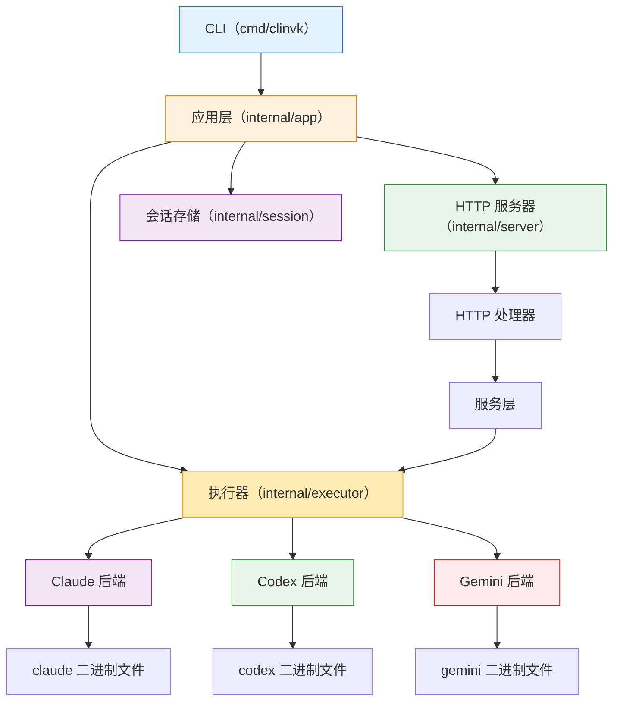

# 架构概述

本文档描述 clinvk 的架构。

## 系统架构



## 层级概述

### 入口点 (`cmd/clinvk/`)

主入口点初始化 CLI 应用并委托给应用层。

### 应用层 (`internal/app/`)

实现 CLI 命令并协调其他模块：

| 文件 | 用途 |
|------|------|
| `app.go` | 根命令、全局标志、提示执行 |
| `cmd_parallel.go` | 并发多任务执行 |
| `cmd_chain.go` | 顺序管道执行 |
| `cmd_compare.go` | 多后端对比 |
| `cmd_serve.go` | HTTP 服务器启动 |
| `cmd_sessions.go` | 会话管理命令 |
| `cmd_config.go` | 配置命令 |

### 后端层 (`internal/backend/`)

为不同 AI CLI 工具提供统一接口：

```go
type Backend interface {
    Name() string
    IsAvailable() bool
    BuildCommand(prompt string, opts *Options) *exec.Cmd
    ResumeCommand(sessionID, prompt string, opts *Options) *exec.Cmd
    ParseOutput(rawOutput string) string
}
```

### 执行器层 (`internal/executor/`)

处理后端命令的实际执行。

### 服务器层 (`internal/server/`)

HTTP API 服务器，支持多种 API 风格：

```
/api/v1/          - 自定义 RESTful API
/openai/v1/       - OpenAI 兼容 API
/anthropic/v1/    - Anthropic 兼容 API
```

### 会话层 (`internal/session/`)

管理持久化会话。存储在 `~/.clinvk/sessions/` 中的 JSON 文件。

## 关键设计决策

### 1. 后端抽象

所有后端实现通用接口，实现：

- 轻松添加新后端
- 跨后端一致的行为
- 与后端无关的编排

### 2. 配置级联

优先级：CLI 参数 > 环境变量 > 配置文件 > 默认值

### 3. 会话持久化

会话存储为 JSON 文件：

- 跨调用可恢复性
- 易于调试和检查
- 无数据库依赖

### 4. HTTP API 兼容性

多种 API 风格用于集成：

- 自定义 API 用于完整功能
- OpenAI 兼容用于现有工具
- Anthropic 兼容用于 Claude 客户端
