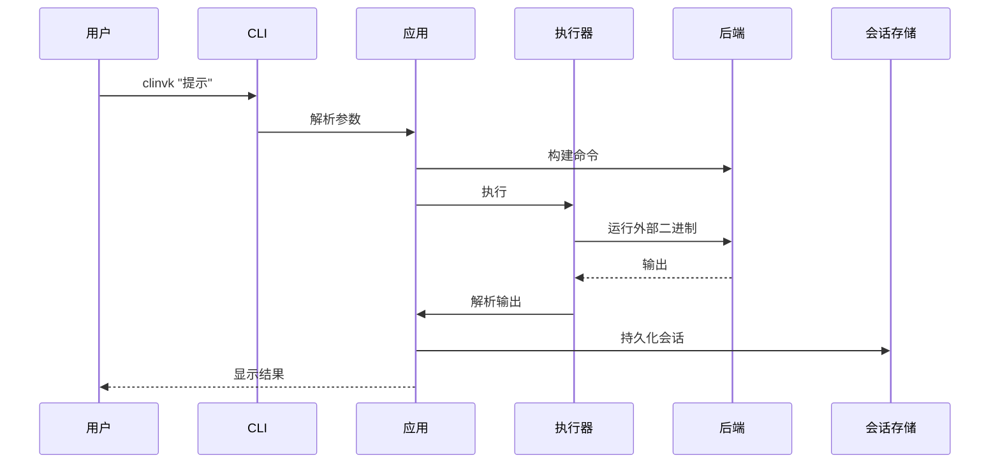

# 架构概述

clinvk 开发者技术架构细节。

## 系统架构


## 项目结构

```
cmd/clinvk/           入口点
internal/
├── app/              CLI 命令和编排
├── backend/          后端实现 (claude, codex, gemini)
├── executor/         带 PTY 支持的命令执行
├── server/           HTTP API 服务器
├── session/          会话持久化
└── config/           配置加载
```

## 层级概述

### 入口点 (`cmd/clinvk/`)

初始化 CLI 应用并委托给应用层。

### 应用层 (`internal/app/`)

实现 CLI 命令：

| 文件 | 用途 |
|------|------|
| `app.go` | 根命令、全局标志、提示执行 |
| `cmd_parallel.go` | 并发多任务执行 |
| `cmd_chain.go` | 顺序管道执行 |
| `cmd_compare.go` | 多后端对比 |
| `cmd_serve.go` | HTTP 服务器启动 |
| `cmd_sessions.go` | 会话管理 |
| `cmd_config.go` | 配置命令 |

### 后端层 (`internal/backend/`)

AI CLI 工具的统一接口：

```go
type Backend interface {
    Name() string
    IsAvailable() bool
    BuildCommand(prompt string, opts *Options) *exec.Cmd
    ResumeCommand(sessionID, prompt string, opts *Options) *exec.Cmd
    ParseOutput(rawOutput string) string
    ParseJSONResponse(rawOutput string) (*UnifiedResponse, error)
}
```

实现：`claude.go`、`codex.go`、`gemini.go`

### 执行器层 (`internal/executor/`)

处理命令执行：

| 文件 | 用途 |
|------|------|
| `executor.go` | 带 PTY 支持的命令执行 |
| `signal.go` | 信号转发 |
| `signal_unix.go` | Unix 信号处理 |
| `signal_windows.go` | Windows 信号处理 |

### 服务器层 (`internal/server/`)

HTTP API，支持多种风格：

```
/api/v1/          自定义 RESTful API
/openai/v1/       OpenAI 兼容 API
/anthropic/v1/    Anthropic 兼容 API
```

组件：
- `server.go` - 服务器设置和路由
- `handlers/` - 请求处理器
- `service/` - 业务逻辑
- `core/` - 后端执行核心

### 会话层 (`internal/session/`)

```go
type Session struct {
    ID        string
    Backend   string
    Model     string
    Workdir   string
    CreatedAt time.Time
    UpdatedAt time.Time
    Metadata  map[string]any
}
```

存储：`~/.clinvk/sessions/` 中的 JSON 文件

### 配置 (`internal/config/`)

优先级：CLI 参数 > 环境变量 > 配置文件 > 默认值

## 数据流

### 单个提示执行



## 关键设计决策

### 1. 后端抽象

所有后端实现通用接口：
- 轻松添加新后端
- 跨后端一致行为
- 与后端无关的编排

### 2. 会话持久化

会话存储为 JSON 文件：
- 跨调用可恢复
- 易于调试和检查
- 无数据库依赖

### 3. HTTP API 兼容性

多种 API 风格用于集成：
- 自定义 API 用于完整功能
- OpenAI 兼容用于现有工具
- Anthropic 兼容用于 Claude 客户端

### 4. 流式输出

通过子进程 stdout/stderr 管道实时输出，使用分块解析。

## 安全考虑

### 子进程执行
- 命令以编程方式构建，非 shell 解释
- 工作目录经过验证
- 超时防止进程失控

### 配置
- 配置文件使用严格权限
- 会话中不存储敏感数据
- API 密钥由底层 CLI 工具处理

### HTTP 服务器
- 默认绑定到 localhost
- 无内置认证（用于本地使用）
- 通过 huma/v2 进行请求验证

## 性能

### 并行执行
- 可配置的工作池大小
- 快速失败选项提前终止
- 内存高效的结果聚合

### 会话存储
- 常见查询的索引查找
- 大会话列表分页
- 会话内容延迟加载
