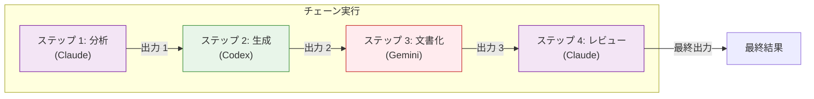

# チェーン実行

複数バックエンドを順番に使い、前段の出力を次のステップへ渡しながらプロンプトをパイプライン化します。チェーン実行により、バックエンドごとの強みを活かした多段ワークフローを構築できます。

## 概要

`chain` コマンドは、ステップを順番に実行し、あるステップの出力を次のステップへ引き継ぎます。これにより、次のような複雑なワークフローが可能になります。

- ステップごとに別のバックエンドを利用できる
- 前段の出力を後続ステップで参照できる
- 失敗時の挙動を制御できる（失敗で停止、継続など）
- パイプライン全体を 1 つの単位として実行できる

**主なメリット:**

- **多段処理:** 複雑なタスクを管理しやすいステップに分割
- **バックエンド特化:** ステージごとに最適なバックエンドを選択
- **コンテキスト保持:** ステップ間でリッチなコンテキストを受け渡し
- **ワークフロー自動化:** 再現性のある複雑プロセスを定義

## チェーンのアーキテクチャ

### 仕組み



**実行フロー:**

1. **ステップ 1** がプロンプトを実行し、出力 1 を生成
2. **ステップ 2** が `{{previous}}` 経由で出力 1 を受け取り、出力 2 を生成
3. **ステップ 3** が `{{previous}}` 経由で出力 2 を受け取り、出力 3 を生成
4. **ステップ 4** が `{{previous}}` 経由で出力 3 を受け取り、最終出力を生成
5. **集約:** すべての出力を収集して表示

### 状態の受け渡し

並列実行が独立タスクであるのに対し、チェーン実行は状態（前段の出力）を維持します。

```mermaid
flowchart LR
    S1["ステップ 1 の出力"] -->|{{previous}}| S2["ステップ 2 の入力"]
    S2 -->|{{previous}}| S3["ステップ 3 の入力"]
    S3 -->|{{previous}}| S4["最終出力"]

    style S1 fill:#e3f2fd,stroke:#1976d2
    style S2 fill:#fff3e0,stroke:#f57c00
    style S3 fill:#e8f5e9,stroke:#388e3c
    style S4 fill:#f3e5f5,stroke:#7b1fa2
```

## パイプライン JSON 形式

### 基本構造

`pipeline.json` を作成します。

```json
{
  "steps": [
    {
      "name": "initial-review",
      "backend": "claude",
      "prompt": "Review this code for bugs"
    },
    {
      "name": "security-check",
      "backend": "gemini",
      "prompt": "Check for security issues in: {{previous}}"
    },
    {
      "name": "final-summary",
      "backend": "codex",
      "prompt": "Summarize the findings: {{previous}}"
    }
  ]
}
```

### ステップ定義（フル）

```json
{
  "steps": [
    {
      "name": "step-name",
      "backend": "claude",
      "prompt": "Task description",
      "model": "claude-opus-4-5-20251101",
      "workdir": "/path/to/project",
      "approval_mode": "auto",
      "sandbox_mode": "workspace",
      "max_turns": 10
    }
  ]
}
```

### ステップフィールドリファレンス

| フィールド | 型 | 必須 | 説明 |
|-------|------|----------|-------------|
| `name` | string | いいえ | 出力/デバッグ用のステップ識別子 |
| `backend` | string | はい | 使用するバックエンド（`claude`, `codex`, `gemini`） |
| `prompt` | string | はい | プロンプト（`{{previous}}` をサポート） |
| `model` | string | いいえ | モデルの上書き |
| `workdir` | string | いいえ | 作業ディレクトリ |
| `approval_mode` | string | いいえ | `default`, `auto`, `none`, `always` |
| `sandbox_mode` | string | いいえ | `default`, `read-only`, `workspace`, `full` |
| `max_turns` | int | いいえ | エージェント的なターン数の上限 |

### トップレベルオプション

```json
{
  "steps": [...],
  "stop_on_failure": true,
  "pass_working_dir": false
}
```

| フィールド | 型 | デフォルト | 説明 |
|-------|------|---------|-------------|
| `stop_on_failure` | bool | `true` | 最初の失敗でチェーンを停止 |
| `pass_working_dir` | bool | `false` | 作業ディレクトリをステップ間で引き継ぐ |

!!! note "ステートレス専用"
    チェーンは常にステートレス（ephemeral）で実行されます。セッションは保存されず、`{{session}}` はサポートされません。

## 変数置換

### `{{previous}}` 変数

プロンプト中で `{{previous}}` を使うと、直前ステップの出力を参照できます。

```json
{
  "steps": [
    {
      "name": "analyze",
      "backend": "claude",
      "prompt": "Analyze this codebase structure"
    },
    {
      "name": "recommend",
      "backend": "gemini",
      "prompt": "Based on this analysis: {{previous}}\\n\\nRecommend improvements"
    },
    {
      "name": "implement",
      "backend": "codex",
      "prompt": "Implement these recommendations: {{previous}}"
    }
  ]
}
```

**置換の流れ:**

1. ステップ 1 が「The codebase uses MVC pattern with...」のような出力を生成
2. ステップ 2 は `Based on this analysis: ...` の中に `{{previous}}` が展開された入力を受け取る
3. ステップ 2 が改善案を生成
4. ステップ 3 は「Implement these recommendations: ...」でステップ 2 の出力を受け取る

### 置換の挙動

- **全出力を挿入:** 直前ステップの出力全体が挿入されます
- **リテラル置換:** エスケープや整形は行いません
- **コンテキスト長:** 出力が長いとプロンプトも大きくなります
- **初回:** 最初のステップは `{{previous}}` を持ちません（空文字扱い）

## チェーンを実行する

### 基本実行

```bash
clinvk chain --file pipeline.json
```

### JSON 出力

プログラム処理向けの構造化結果を取得できます。

```bash
clinvk chain --file pipeline.json --json
```

**出力例:**

```json
{
  "total_steps": 2,
  "completed_steps": 2,
  "failed_step": 0,
  "total_duration_seconds": 3.5,
  "results": [
    {
      "step": 1,
      "name": "initial-review",
      "backend": "claude",
      "output": "Found several issues...",
      "duration_seconds": 2.0,
      "exit_code": 0
    },
    {
      "step": 2,
      "name": "security-check",
      "backend": "gemini",
      "output": "No critical vulnerabilities...",
      "duration_seconds": 1.5,
      "exit_code": 0
    }
  ]
}
```

## エラーハンドリング戦略

### 戦略 1: 失敗で停止（デフォルト）

いずれかのステップが失敗すると、その時点でチェーンは停止します。

```json
{
  "steps": [
    {"name": "validate", "backend": "claude", "prompt": "Validate the input"},
    {"name": "process", "backend": "codex", "prompt": "Process: {{previous}}"}
  ],
  "stop_on_failure": true
}
```

**向いているケース:**

- ステップ間の依存関係が強い（後続が前段の成功を前提）
- バリデーションに通らないと先へ進めない
- エラーがリカバリ不能

### 戦略 2: 失敗しても継続する

!!! warning "現状未サポート"
    `stop_on_failure: false` は受け付けますが無視されます。チェーン実行は常に「最初の失敗で停止」です。

**回避策:** 失敗しても継続したい独立タスクは並列実行を使ってください。

### エラー出力

ステップが失敗すると、チェーンは次のようにエラーを報告します。

```text
Step 1 (analyze): Completed (2.1s)
Step 2 (implement): Failed - Backend error: rate limit exceeded

Chain failed at step 2
```

`--json` の場合:

```json
{
  "results": [
    {"name": "analyze", "exit_code": 0, "error": ""},
    {"name": "implement", "exit_code": 1, "error": "rate limit exceeded"}
  ]
}
```

## 実用例

### 例 1: 分析 → 修正 → テスト

開発の一連ワークフロー:

```json
{
  "steps": [
    {
      "name": "analyze",
      "backend": "claude",
      "prompt": "Analyze the auth module for bugs and issues. List each problem with file and line number.",
      "workdir": "/project"
    },
    {
      "name": "fix",
      "backend": "codex",
      "prompt": "Fix all the issues identified in this analysis: {{previous}}\\n\\nMake minimal, targeted fixes.",
      "workdir": "/project",
      "approval_mode": "auto"
    },
    {
      "name": "test",
      "backend": "claude",
      "prompt": "Run the tests and verify the fixes. Report any remaining issues: {{previous}}",
      "workdir": "/project"
    }
  ]
}
```

### 例 2: コードレビューのパイプライン

複数観点の包括レビュー:

```json
{
  "steps": [
    {
      "name": "functionality-review",
      "backend": "claude",
      "prompt": "Review this code for correctness and logic errors"
    },
    {
      "name": "security-review",
      "backend": "gemini",
      "prompt": "Review the code for security vulnerabilities. Previous analysis: {{previous}}"
    },
    {
      "name": "performance-review",
      "backend": "codex",
      "prompt": "Review the code for performance issues. Previous findings: {{previous}}"
    },
    {
      "name": "summary",
      "backend": "claude",
      "prompt": "Create a summary report from all reviews: {{previous}}"
    }
  ]
}
```

### 例 3: ドキュメント生成

エンドツーエンドの文書化ワークフロー:

```json
{
  "steps": [
    {
      "name": "analyze",
      "backend": "claude",
      "prompt": "Analyze the API structure in this codebase. Identify all endpoints, request/response formats, and authentication methods."
    },
    {
      "name": "document",
      "backend": "codex",
      "prompt": "Generate API documentation in Markdown format based on this analysis: {{previous}}"
    },
    {
      "name": "examples",
      "backend": "gemini",
      "prompt": "Add practical usage examples to this documentation: {{previous}}"
    }
  ]
}
```

### 例 4: 反復的な改善

複数回の反復でコードを洗練します。

```json
{
  "steps": [
    {
      "name": "draft",
      "backend": "codex",
      "prompt": "Write a function to parse CSV files with error handling"
    },
    {
      "name": "review",
      "backend": "claude",
      "prompt": "Review and suggest improvements to this code: {{previous}}"
    },
    {
      "name": "refine",
      "backend": "codex",
      "prompt": "Apply these improvements and produce the final code: {{previous}}"
    }
  ]
}
```

### 例 5: 多言語翻訳

複数言語への翻訳をステップ化します。

```json
{
  "steps": [
    {
      "name": "extract",
      "backend": "claude",
      "prompt": "Extract all user-facing strings from the codebase"
    },
    {
      "name": "translate-es",
      "backend": "gemini",
      "prompt": "Translate these strings to Spanish: {{previous}}"
    },
    {
      "name": "translate-fr",
      "backend": "gemini",
      "prompt": "Translate these strings to French: {{previous}}"
    },
    {
      "name": "validate",
      "backend": "claude",
      "prompt": "Validate the translations for accuracy and consistency: {{previous}}"
    }
  ]
}
```

## ステップ間の状態受け渡し

### 作業ディレクトリの引き継ぎ

デフォルトでは、各ステップは自身の作業ディレクトリを使います。引き継ぎを有効化するには次のようにします。

```json
{
  "steps": [
    {
      "name": "setup",
      "backend": "claude",
      "prompt": "Create the project structure",
      "workdir": "/tmp/project"
    },
    {
      "name": "implement",
      "backend": "codex",
      "prompt": "Implement the core logic"
    }
  ],
  "pass_working_dir": true
}
```

**`pass_working_dir: true` の場合:**

- ステップ 2 がステップ 1 の `/tmp/project` を継承します
- ステップ 1 が作成/変更した内容がステップ 2 から見えます

### コンテキストの累積

各ステップは直前ステップの出力全体を受け取ります。

```text
Step 1: "Analysis: 3 issues found"
        ↓
Step 2: "Based on: Analysis: 3 issues found
         Implementation: Fixed 2 issues"
        ↓
Step 3: "Based on: Based on: Analysis: 3 issues found
         Implementation: Fixed 2 issues
         Review: 1 issue remains"
```

**コンテキスト長の管理:**

- ステップ出力は簡潔にする
- 出力を絞る具体的なプロンプトにする
- 出力が長い場合は要約ステップを挟む

## 条件付き実行パターン

### パターン 1: バリデーションゲート

最初のステップを検証として使います。

```json
{
  "steps": [
    {
      "name": "validate",
      "backend": "claude",
      "prompt": "Validate that the codebase follows Go best practices. If not, list the violations."
    },
    {
      "name": "fix",
      "backend": "codex",
      "prompt": "Fix the violations identified: {{previous}}"
    }
  ]
}
```

検証が「No violations」と返した場合、そのメッセージが修正ステップへ渡ります。

### パターン 2: 分岐ロジック

バックエンドの能力を使って意思決定します。

```json
{
  "steps": [
    {
      "name": "assess",
      "backend": "claude",
      "prompt": "Assess the complexity of this task. Reply with 'simple' or 'complex'."
    },
    {
      "name": "implement",
      "backend": "codex",
      "prompt": "Implement the solution. Assessment was: {{previous}}"
    }
  ]
}
```

### パターン 3: フォールバックチェーン

複数アプローチを順に試します。

```json
{
  "steps": [
    {
      "name": "try-codex",
      "backend": "codex",
      "prompt": "Generate the implementation"
    },
    {
      "name": "review-claude",
      "backend": "claude",
      "prompt": "Review this implementation for issues: {{previous}}"
    },
    {
      "name": "fix-if-needed",
      "backend": "codex",
      "prompt": "If issues were found, fix them. Review: {{previous}}"
    }
  ]
}
```

## ベストプラクティス

!!! tip "わかりやすいステップ名にする"
    良いステップ名は出力の理解とデバッグに役立ちます。`analyze`, `generate`, `review`, `fix` のような動詞を使ってください。

!!! tip "まずシンプルに始める"
    まずは 2〜3 ステップから始め、必要に応じて増やしてください。複雑なチェーンはデバッグが難しくなります。

!!! tip "コンテキスト長に注意する"
    `{{previous}}` を使うと、前段の出力がプロンプト長に加算されます。長いプロンプトはトークン上限に達することがあります。

!!! tip "バックエンドを使い分ける"
    それぞれの強みを活かしてください。例: 推論は Claude、コード生成は Codex、広い知識は Gemini。

!!! tip "各ステップを単独で試す"
    連結する前に、各ステップのプロンプトを単独で実行し、期待通りの出力になることを確認してください。

!!! tip "出力が大きい場合に備える"
    大きな出力を次へ渡す場合は、次のステップに渡す前に要約ステップを追加することを検討してください。

## 他コマンドとの比較

| 機能 | チェーン | 並列 | 比較 |
|---------|-------|----------|---------|
| 実行 | 順次 | 同時 | 同時 |
| データフロー | 前段出力が利用可能 | 独立 | 独立 |
| ユースケース | 多段ワークフロー | 独立タスク | 多観点の分析 |
| 速度 | 各ステップ時間の合計 | 最長ステップ時間 | 最長ステップ時間 |
| 失敗時の挙動 | 失敗で停止 | 設定可能 | 残りを継続 |

## トラブルシューティング

### ステップ出力が長すぎる

**問題:** `{{previous}}` が非常に長い文字列に展開され、トークン制限に達する

**対処:**

1. 要約ステップを追加する:

```json
{
  "steps": [
    {"name": "analyze", "backend": "claude", "prompt": "Analyze the codebase"},
    {"name": "summarize", "backend": "claude", "prompt": "Summarize this analysis in 3 bullet points: {{previous}}"},
    {"name": "implement", "backend": "codex", "prompt": "Implement based on: {{previous}}"}
  ]
}
```

2. 出力を絞るよう、より具体的なプロンプトにする

### ステップが黙って失敗するように見える

**問題:** 成功したように見えるが、出力が空/想定外になる

**対処:**

1. `--json` 出力でステップ結果を正確に確認する
2. バリデーションステップを追加する
3. 問題のステップを単体で切り出し、コマンド構築を確認する: `clinvk --dry-run -b <backend> "<step prompt>"`

### 作業ディレクトリの問題

**問題:** 前段が作成したファイルを後段が見つけられない

**対処:**

1. `pass_working_dir: true` を有効化する
2. 絶対パスを使う
3. 権限を確認する

## 次のステップ

- [並列実行](parallel.md) - 独立タスクを同時に実行
- [バックエンド比較](compare.md) - 応答を並べて比較
- [セッション管理](sessions.md) - 会話コンテキストの管理
