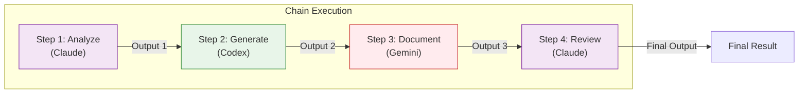

# Chain Execution

Pipeline prompts through multiple backends sequentially, with each step building on the previous output. Chain execution enables complex multi-stage workflows where different backends contribute their strengths.

## Overview

The `chain` command executes a series of steps in order, passing output from one step to the next. This enables complex workflows where:

- Each step can use a different backend
- Output from previous steps is available to subsequent steps
- Steps can be conditional (stop on failure or continue)
- The entire pipeline runs as a single unit

**Key Benefits:**

- **Multi-Stage Processing:** Break complex tasks into manageable steps
- **Backend Specialization:** Use the best backend for each stage
- **Context Preservation:** Pass rich context between steps
- **Workflow Automation:** Define repeatable, complex processes

## Chain Architecture

### How It Works



**Execution Flow:**

1. **Step 1** runs with its prompt, produces Output 1
2. **Step 2** receives Output 1 via `{{previous}}`, produces Output 2
3. **Step 3** receives Output 2 via `{{previous}}`, produces Output 3
4. **Step 4** receives Output 3 via `{{previous}}`, produces final output
5. **Aggregation:** All outputs are collected and presented

### State Passing

Unlike parallel execution where tasks are independent, chain execution maintains state:

```mermaid
flowchart LR
    S1["Step 1 Output"] -->|{{previous}}| S2["Step 2 Input"]
    S2 -->|{{previous}}| S3["Step 3 Input"]
    S3 -->|{{previous}}| S4["Final Output"]

    style S1 fill:#e3f2fd,stroke:#1976d2
    style S2 fill:#fff3e0,stroke:#f57c00
    style S3 fill:#e8f5e9,stroke:#388e3c
    style S4 fill:#f3e5f5,stroke:#7b1fa2
```

## Pipeline JSON Format

### Basic Structure

Create a `pipeline.json` file:

```json
{
  "steps": [
    {
      "name": "initial-review",
      "backend": "claude",
      "prompt": "Review this code for bugs"
    },
    {
      "name": "security-check",
      "backend": "gemini",
      "prompt": "Check for security issues in: {{previous}}"
    },
    {
      "name": "final-summary",
      "backend": "codex",
      "prompt": "Summarize the findings: {{previous}}"
    }
  ]
}
```

### Complete Step Specification

```json
{
  "steps": [
    {
      "name": "step-name",
      "backend": "claude",
      "prompt": "Task description",
      "model": "claude-opus-4-5-20251101",
      "workdir": "/path/to/project",
      "approval_mode": "auto",
      "sandbox_mode": "workspace",
      "max_turns": 10
    }
  ]
}
```

### Step Fields Reference

| Field | Type | Required | Description |
|-------|------|----------|-------------|
| `name` | string | No | Step identifier for output and debugging |
| `backend` | string | Yes | Backend to use (`claude`, `codex`, `gemini`) |
| `prompt` | string | Yes | The prompt (supports `{{previous}}`) |
| `model` | string | No | Model override |
| `workdir` | string | No | Working directory |
| `approval_mode` | string | No | `default`, `auto`, `none`, `always` |
| `sandbox_mode` | string | No | `default`, `read-only`, `workspace`, `full` |
| `max_turns` | int | No | Maximum agentic turns |

### Top-Level Options

```json
{
  "steps": [...],
  "stop_on_failure": true,
  "pass_working_dir": false
}
```

| Field | Type | Default | Description |
|-------|------|---------|-------------|
| `stop_on_failure` | bool | `true` | Stop chain on first failure |
| `pass_working_dir` | bool | `false` | Pass working directory between steps |

!!! note "Ephemeral Only"
    Chain always runs in ephemeral mode - no sessions are persisted, and `{{session}}` is not supported.

## Variable Substitution

### The `{{previous}}` Variable

Use `{{previous}}` in prompts to reference the previous step's output:

```json
{
  "steps": [
    {
      "name": "analyze",
      "backend": "claude",
      "prompt": "Analyze this codebase structure"
    },
    {
      "name": "recommend",
      "backend": "gemini",
      "prompt": "Based on this analysis: {{previous}}\n\nRecommend improvements"
    },
    {
      "name": "implement",
      "backend": "codex",
      "prompt": "Implement these recommendations: {{previous}}"
    }
  ]
}
```

**How Substitution Works:**

1. Step 1 produces: "The codebase uses MVC pattern with..."
2. Step 2 receives: "Based on this analysis: The codebase uses MVC pattern with...\n\nRecommend improvements"
3. Step 2 produces recommendations
4. Step 3 receives: "Implement these recommendations: [recommendations from step 2]"

### Substitution Behavior

- **Full Output:** The entire output from the previous step is inserted
- **Literal Substitution:** No escaping or formatting is applied
- **Context Length:** Be mindful that long outputs increase prompt size
- **Empty Previous:** First step has no `{{previous}}` (treated as empty string)

## Running the Chain

### Basic Execution

```bash
clinvk chain --file pipeline.json
```

### With JSON Output

Get structured results for programmatic use:

```bash
clinvk chain --file pipeline.json --json
```

**Output:**

```json
{
  "total_steps": 2,
  "completed_steps": 2,
  "failed_step": 0,
  "total_duration_seconds": 3.5,
  "results": [
    {
      "step": 1,
      "name": "initial-review",
      "backend": "claude",
      "output": "Found several issues...",
      "duration_seconds": 2.0,
      "exit_code": 0
    },
    {
      "step": 2,
      "name": "security-check",
      "backend": "gemini",
      "output": "No critical vulnerabilities...",
      "duration_seconds": 1.5,
      "exit_code": 0
    }
  ]
}
```

## Error Handling Strategies

### Strategy 1: Stop on Failure (Default)

The chain stops immediately when any step fails:

```json
{
  "steps": [
    {"name": "validate", "backend": "claude", "prompt": "Validate the input"},
    {"name": "process", "backend": "codex", "prompt": "Process: {{previous}}"}
  ],
  "stop_on_failure": true
}
```

**Use When:**

- Steps have dependencies (later steps need earlier success)
- Validation must pass before processing
- Errors are not recoverable

### Strategy 2: Continue on Failure

!!! warning "Not Currently Supported"
    The `stop_on_failure: false` setting is accepted but ignored. The CLI always stops on first failure for chain execution.

**Workaround:** Use parallel execution for independent tasks that should continue despite failures.

### Error Output

When a step fails, the chain reports the error:

```text
Step 1 (analyze): Completed (2.1s)
Step 2 (implement): Failed - Backend error: rate limit exceeded

Chain failed at step 2
```

With `--json`:

```json
{
  "results": [
    {"name": "analyze", "exit_code": 0, "error": ""},
    {"name": "implement", "exit_code": 1, "error": "rate limit exceeded"}
  ]
}
```

## Real-World Examples

### Example 1: Analyze → Fix → Test Workflow

A complete development workflow:

```json
{
  "steps": [
    {
      "name": "analyze",
      "backend": "claude",
      "prompt": "Analyze the auth module for bugs and issues. List each problem with file and line number.",
      "workdir": "/project"
    },
    {
      "name": "fix",
      "backend": "codex",
      "prompt": "Fix all the issues identified in this analysis: {{previous}}\n\nMake minimal, targeted fixes.",
      "workdir": "/project",
      "approval_mode": "auto"
    },
    {
      "name": "test",
      "backend": "claude",
      "prompt": "Run the tests and verify the fixes. Report any remaining issues: {{previous}}",
      "workdir": "/project"
    }
  ]
}
```

### Example 2: Code Review Pipeline

Comprehensive multi-perspective review:

```json
{
  "steps": [
    {
      "name": "functionality-review",
      "backend": "claude",
      "prompt": "Review this code for correctness and logic errors"
    },
    {
      "name": "security-review",
      "backend": "gemini",
      "prompt": "Review the code for security vulnerabilities. Previous analysis: {{previous}}"
    },
    {
      "name": "performance-review",
      "backend": "codex",
      "prompt": "Review the code for performance issues. Previous findings: {{previous}}"
    },
    {
      "name": "summary",
      "backend": "claude",
      "prompt": "Create a summary report from all reviews: {{previous}}"
    }
  ]
}
```

### Example 3: Documentation Generation

End-to-end documentation workflow:

```json
{
  "steps": [
    {
      "name": "analyze",
      "backend": "claude",
      "prompt": "Analyze the API structure in this codebase. Identify all endpoints, request/response formats, and authentication methods."
    },
    {
      "name": "document",
      "backend": "codex",
      "prompt": "Generate API documentation in Markdown format based on this analysis: {{previous}}"
    },
    {
      "name": "examples",
      "backend": "gemini",
      "prompt": "Add practical usage examples to this documentation: {{previous}}"
    }
  ]
}
```

### Example 4: Iterative Refinement

Refine code through multiple iterations:

```json
{
  "steps": [
    {
      "name": "draft",
      "backend": "codex",
      "prompt": "Write a function to parse CSV files with error handling"
    },
    {
      "name": "review",
      "backend": "claude",
      "prompt": "Review and suggest improvements to this code: {{previous}}"
    },
    {
      "name": "refine",
      "backend": "codex",
      "prompt": "Apply these improvements and produce the final code: {{previous}}"
    }
  ]
}
```

### Example 5: Multi-Language Translation

Translate documentation through multiple languages:

```json
{
  "steps": [
    {
      "name": "extract",
      "backend": "claude",
      "prompt": "Extract all user-facing strings from the codebase"
    },
    {
      "name": "translate-es",
      "backend": "gemini",
      "prompt": "Translate these strings to Spanish: {{previous}}"
    },
    {
      "name": "translate-fr",
      "backend": "gemini",
      "prompt": "Translate these strings to French: {{previous}}"
    },
    {
      "name": "validate",
      "backend": "claude",
      "prompt": "Validate the translations for accuracy and consistency: {{previous}}"
    }
  ]
}
```

## State Passing Between Steps

### Working Directory Propagation

By default, each step uses its own working directory. Enable propagation:

```json
{
  "steps": [
    {
      "name": "setup",
      "backend": "claude",
      "prompt": "Create the project structure",
      "workdir": "/tmp/project"
    },
    {
      "name": "implement",
      "backend": "codex",
      "prompt": "Implement the core logic"
    }
  ],
  "pass_working_dir": true
}
```

**With `pass_working_dir: true`:**

- Step 2 inherits `/tmp/project` from Step 1
- Changes made by Step 1 are visible to Step 2

### Context Accumulation

Each step receives the full output of the previous step:

```text
Step 1: "Analysis: 3 issues found"
        ↓
Step 2: "Based on: Analysis: 3 issues found
         Implementation: Fixed 2 issues"
        ↓
Step 3: "Based on: Based on: Analysis: 3 issues found
         Implementation: Fixed 2 issues
         Review: 1 issue remains"
```

**Managing Context Length:**

- Keep step outputs concise
- Use specific prompts to limit output
- Consider summarization steps for long outputs

## Conditional Execution Patterns

### Pattern 1: Validation Gate

Use the first step as a validation check:

```json
{
  "steps": [
    {
      "name": "validate",
      "backend": "claude",
      "prompt": "Validate that the codebase follows Go best practices. If not, list the violations."
    },
    {
      "name": "fix",
      "backend": "codex",
      "prompt": "Fix the violations identified: {{previous}}"
    }
  ]
}
```

If validation passes with "No violations", the fix step receives that message.

### Pattern 2: Branching Logic

Use backend capabilities to make decisions:

```json
{
  "steps": [
    {
      "name": "assess",
      "backend": "claude",
      "prompt": "Assess the complexity of this task. Reply with 'simple' or 'complex'."
    },
    {
      "name": "implement",
      "backend": "codex",
      "prompt": "Implement the solution. Assessment was: {{previous}}"
    }
  ]
}
```

### Pattern 3: Fallback Chain

Try different approaches in sequence:

```json
{
  "steps": [
    {
      "name": "try-codex",
      "backend": "codex",
      "prompt": "Generate the implementation"
    },
    {
      "name": "review-claude",
      "backend": "claude",
      "prompt": "Review this implementation for issues: {{previous}}"
    },
    {
      "name": "fix-if-needed",
      "backend": "codex",
      "prompt": "If issues were found, fix them. Review: {{previous}}"
    }
  ]
}
```

## Best Practices

!!! tip "Use Descriptive Step Names"
    Good step names make output easier to understand and debug. Use action verbs: `analyze`, `generate`, `review`, `fix`.

!!! tip "Start Simple"
    Begin with 2-3 steps and add more as needed. Complex chains can be harder to debug.

!!! tip "Consider Context Length"
    When using `{{previous}}`, be mindful that output from earlier steps adds to the prompt length. Long prompts may hit token limits.

!!! tip "Use Different Backends"
    Leverage each backend's strengths - Claude for reasoning, Codex for code generation, Gemini for broad knowledge.

!!! tip "Test Each Step Independently"
    Before chaining, test each step's prompt independently to ensure it produces the expected output.

!!! tip "Handle Large Outputs"
    For steps that produce large outputs, consider adding a summarization step before passing to the next step.

## Comparison with Other Commands

| Feature | Chain | Parallel | Compare |
|---------|-------|----------|---------|
| Execution | Sequential | Concurrent | Concurrent |
| Data Flow | Previous output available | Independent | Independent |
| Use Case | Multi-stage workflows | Independent tasks | Multi-perspective analysis |
| Speed | Sum of step times | Max step time | Max step time |
| Failure Handling | Stop on failure | Configurable | Continue with remaining |

## Troubleshooting

### Step Output Too Long

**Problem:** `{{previous}}` expands to a very long string, hitting token limits

**Solutions:**

1. Add a summarization step:

```json
{
  "steps": [
    {"name": "analyze", "backend": "claude", "prompt": "Analyze the codebase"},
    {"name": "summarize", "backend": "claude", "prompt": "Summarize this analysis in 3 bullet points: {{previous}}"},
    {"name": "implement", "backend": "codex", "prompt": "Implement based on: {{previous}}"}
  ]
}
```

2. Use more specific prompts to limit output

### Step Fails Silently

**Problem:** A step appears to succeed but produces empty or unexpected output

**Solutions:**

1. Use `--json` output to see exact step results
2. Add validation steps
3. Use verbose mode: `clinvk chain --file pipeline.json --verbose`

### Working Directory Issues

**Problem:** Steps can't find files created by previous steps

**Solutions:**

1. Enable `pass_working_dir: true`
2. Use absolute paths
3. Verify permissions

## Next Steps

- [Parallel Execution](parallel.md) - Run independent tasks concurrently
- [Backend Comparison](compare.md) - Compare responses side-by-side
- [Session Management](sessions.md) - Manage conversation context
