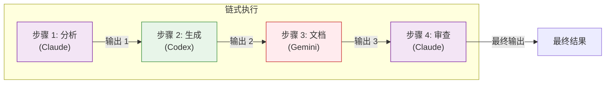

# 链式执行

通过多个后端顺序传递提示，每个步骤基于前一个输出构建。链式执行使复杂的多阶段工作流成为可能，不同后端可以发挥各自的优势。

## 概述

`chain` 命令按顺序执行一系列步骤，将一个步骤的输出传递给下一个。这支持复杂的工作流：

- 每个步骤可以使用不同的后端
- 前面步骤的输出对后续步骤可用
- 步骤可以是条件性的（失败时停止或继续）
- 整个管道作为单个单元运行

**主要优势：**

- **多阶段处理：** 将复杂任务分解为可管理的步骤
- **后端专业化：** 为每个阶段使用最佳后端
- **上下文保留：** 在步骤之间传递丰富的上下文
- **工作流自动化：** 定义可重复的复杂流程

## 链式架构

### 工作原理



**执行流程：**

1. **步骤 1** 运行其提示，产生输出 1
2. **步骤 2** 通过 `{{previous}}` 接收输出 1，产生输出 2
3. **步骤 3** 通过 `{{previous}}` 接收输出 2，产生输出 3
4. **步骤 4** 通过 `{{previous}}` 接收输出 3，产生最终输出
5. **聚合：** 收集并呈现所有输出

### 状态传递

与任务独立的并行执行不同，链式执行维护状态：

```mermaid
flowchart LR
    S1["步骤 1 输出"] -->|{{previous}}| S2["步骤 2 输入"]
    S2 -->|{{previous}}| S3["步骤 3 输入"]
    S3 -->|{{previous}}| S4["最终输出"]

    style S1 fill:#e3f2fd,stroke:#1976d2
    style S2 fill:#fff3e0,stroke:#f57c00
    style S3 fill:#e8f5e9,stroke:#388e3c
    style S4 fill:#f3e5f5,stroke:#7b1fa2
```

## Pipeline JSON 格式

### 基本结构

创建 `pipeline.json` 文件：

```json
{
  "steps": [
    {
      "name": "initial-review",
      "backend": "claude",
      "prompt": "审查这段代码的 bug"
    },
    {
      "name": "security-check",
      "backend": "gemini",
      "prompt": "检查安全问题：{{previous}}"
    },
    {
      "name": "final-summary",
      "backend": "codex",
      "prompt": "总结发现：{{previous}}"
    }
  ]
}
```

### 完整步骤规范

```json
{
  "steps": [
    {
      "name": "step-name",
      "backend": "claude",
      "prompt": "任务描述",
      "model": "claude-opus-4-5-20251101",
      "workdir": "/path/to/project",
      "approval_mode": "auto",
      "sandbox_mode": "workspace",
      "max_turns": 10
    }
  ]
}
```

### 步骤字段参考

| 字段 | 类型 | 必需 | 描述 |
|------|------|------|------|
| `name` | string | 否 | 用于输出和调试的步骤标识符 |
| `backend` | string | 是 | 使用的后端 (`claude`, `codex`, `gemini`) |
| `prompt` | string | 是 | 提示（支持 `{{previous}}`） |
| `model` | string | 否 | 模型覆盖 |
| `workdir` | string | 否 | 工作目录 |
| `approval_mode` | string | 否 | `default`, `auto`, `none`, `always` |
| `sandbox_mode` | string | 否 | `default`, `read-only`, `workspace`, `full` |
| `max_turns` | int | 否 | 最大代理轮次 |

### 顶级选项

```json
{
  "steps": [...],
  "stop_on_failure": true,
  "pass_working_dir": false
}
```

| 字段 | 类型 | 默认值 | 描述 |
|------|------|--------|------|
| `stop_on_failure` | bool | `true` | 第一次失败时停止链 |
| `pass_working_dir` | bool | `false` | 在步骤之间传递工作目录 |

!!! note "仅临时模式"
    chain 只能以临时模式运行 - 不保存会话，也不支持 `{{session}}`。

## 变量替换

### `{{previous}}` 变量

在提示中使用 `{{previous}}` 引用上一步的输出：

```json
{
  "steps": [
    {
      "name": "analyze",
      "backend": "claude",
      "prompt": "分析这个代码库结构"
    },
    {
      "name": "recommend",
      "backend": "gemini",
      "prompt": "基于这个分析：{{previous}}\n\n推荐改进方案"
    },
    {
      "name": "implement",
      "backend": "codex",
      "prompt": "实现这些推荐：{{previous}}"
    }
  ]
}
```

**替换的工作原理：**

1. 步骤 1 产生："代码库使用 MVC 模式，..."
2. 步骤 2 接收："基于这个分析：代码库使用 MVC 模式，...\n\n推荐改进方案"
3. 步骤 2 产生推荐
4. 步骤 3 接收："实现这些推荐：[步骤 2 的推荐]"

### 替换行为

- **完整输出：** 上一步的整个输出被插入
- **字面替换：** 不应用转义或格式化
- **上下文长度：** 注意长输出会增加提示大小
- **空 previous：** 第一步没有 `{{previous}}`（视为空字符串）

## 运行链

### 基本执行

```bash
clinvk chain --file pipeline.json
```

### 使用 JSON 输出

获取结构化结果以便程序使用：

```bash
clinvk chain --file pipeline.json --json
```

**输出：**

```json
{
  "total_steps": 2,
  "completed_steps": 2,
  "failed_step": 0,
  "total_duration_seconds": 3.5,
  "results": [
    {
      "step": 1,
      "name": "initial-review",
      "backend": "claude",
      "output": "发现了几个问题...",
      "duration_seconds": 2.0,
      "exit_code": 0
    },
    {
      "step": 2,
      "name": "security-check",
      "backend": "gemini",
      "output": "没有关键漏洞...",
      "duration_seconds": 1.5,
      "exit_code": 0
    }
  ]
}
```

## 错误处理策略

### 策略 1：失败即停（默认）

任何步骤失败时链立即停止：

```json
{
  "steps": [
    {"name": "validate", "backend": "claude", "prompt": "验证输入"},
    {"name": "process", "backend": "codex", "prompt": "处理：{{previous}}"}
  ],
  "stop_on_failure": true
}
```

**何时使用：**

- 步骤有依赖关系（后面的步骤需要前面的成功）
- 验证必须在处理前通过
- 错误不可恢复

### 策略 2：失败继续

!!! warning "当前不支持"
    `stop_on_failure: false` 设置被接受但会被忽略。CLI 始终会在链式执行中第一次失败时停止。

**解决方法：** 对应该继续的独立任务使用并行执行。

### 错误输出

当步骤失败时，链报告错误：

```text
Step 1 (analyze): Completed (2.1s)
Step 2 (implement): Failed - Backend error: rate limit exceeded

Chain failed at step 2
```

使用 `--json`：

```json
{
  "results": [
    {"name": "analyze", "exit_code": 0, "error": ""},
    {"name": "implement", "exit_code": 1, "error": "rate limit exceeded"}
  ]
}
```

## 真实示例

### 示例 1：分析 → 修复 → 测试工作流

完整的开发工作流：

```json
{
  "steps": [
    {
      "name": "analyze",
      "backend": "claude",
      "prompt": "分析 auth 模块的 bug 和问题。列出每个问题的文件和行号。",
      "workdir": "/project"
    },
    {
      "name": "fix",
      "backend": "codex",
      "prompt": "修复此分析中识别的所有问题：{{previous}}\n\n进行最小化、有针对性的修复。",
      "workdir": "/project",
      "approval_mode": "auto"
    },
    {
      "name": "test",
      "backend": "claude",
      "prompt": "运行测试并验证修复。报告任何剩余问题：{{previous}}",
      "workdir": "/project"
    }
  ]
}
```

### 示例 2：代码审查管道

全面的多视角审查：

```json
{
  "steps": [
    {
      "name": "functionality-review",
      "backend": "claude",
      "prompt": "审查这段代码的正确性和逻辑错误"
    },
    {
      "name": "security-review",
      "backend": "gemini",
      "prompt": "审查代码的安全漏洞。之前的分析：{{previous}}"
    },
    {
      "name": "performance-review",
      "backend": "codex",
      "prompt": "审查代码的性能问题。之前的发现：{{previous}}"
    },
    {
      "name": "summary",
      "backend": "claude",
      "prompt": "从所有审查中创建摘要报告：{{previous}}"
    }
  ]
}
```

### 示例 3：文档生成

端到端文档工作流：

```json
{
  "steps": [
    {
      "name": "analyze",
      "backend": "claude",
      "prompt": "分析此代码库中的 API 结构。识别所有端点、请求/响应格式和认证方法。"
    },
    {
      "name": "document",
      "backend": "codex",
      "prompt": "基于此分析生成 Markdown 格式的 API 文档：{{previous}}"
    },
    {
      "name": "examples",
      "backend": "gemini",
      "prompt": "为此文档添加实用的使用示例：{{previous}}"
    }
  ]
}
```

### 示例 4：迭代细化

通过多次迭代细化代码：

```json
{
  "steps": [
    {
      "name": "draft",
      "backend": "codex",
      "prompt": "编写一个带错误处理的 CSV 文件解析函数"
    },
    {
      "name": "review",
      "backend": "claude",
      "prompt": "审查此代码并提出改进建议：{{previous}}"
    },
    {
      "name": "refine",
      "backend": "codex",
      "prompt": "应用这些改进并生成最终代码：{{previous}}"
    }
  ]
}
```

### 示例 5：多语言翻译

将文档翻译成多种语言：

```json
{
  "steps": [
    {
      "name": "extract",
      "backend": "claude",
      "prompt": "从代码库中提取所有面向用户的字符串"
    },
    {
      "name": "translate-es",
      "backend": "gemini",
      "prompt": "将这些字符串翻译成西班牙语：{{previous}}"
    },
    {
      "name": "translate-fr",
      "backend": "gemini",
      "prompt": "将这些字符串翻译成法语：{{previous}}"
    },
    {
      "name": "validate",
      "backend": "claude",
      "prompt": "验证翻译的准确性和一致性：{{previous}}"
    }
  ]
}
```

## 步骤之间的状态传递

### 工作目录传播

默认情况下，每个步骤使用自己的工作目录。启用传播：

```json
{
  "steps": [
    {
      "name": "setup",
      "backend": "claude",
      "prompt": "创建项目结构",
      "workdir": "/tmp/project"
    },
    {
      "name": "implement",
      "backend": "codex",
      "prompt": "实现核心逻辑"
    }
  ],
  "pass_working_dir": true
}
```

**使用 `pass_working_dir: true`：**

- 步骤 2 从步骤 1 继承 `/tmp/project`
- 步骤 1 所做的更改对步骤 2 可见

### 上下文累积

每个步骤接收上一步的完整输出：

```text
步骤 1："分析：发现 3 个问题"
        ↓
步骤 2："基于：分析：发现 3 个问题
         实现：修复了 2 个问题"
        ↓
步骤 3："基于：基于：分析：发现 3 个问题
         实现：修复了 2 个问题
         审查：还剩 1 个问题"
```

**管理上下文长度：**

- 保持步骤输出简洁
- 使用特定提示限制输出
- 考虑为长输出添加摘要步骤

## 条件执行模式

### 模式 1：验证门

使用第一步作为验证检查：

```json
{
  "steps": [
    {
      "name": "validate",
      "backend": "claude",
      "prompt": "验证代码库是否遵循 Go 最佳实践。如果没有，列出违规项。"
    },
    {
      "name": "fix",
      "backend": "codex",
      "prompt": "修复识别的违规项：{{previous}}"
    }
  ]
}
```

如果验证通过并显示"无违规"，修复步骤会收到该消息。

### 模式 2：分支逻辑

使用后端能力做出决策：

```json
{
  "steps": [
    {
      "name": "assess",
      "backend": "claude",
      "prompt": "评估此任务的复杂性。回复 'simple' 或 'complex'。"
    },
    {
      "name": "implement",
      "backend": "codex",
      "prompt": "实现解决方案。评估结果是：{{previous}}"
    }
  ]
}
```

### 模式 3：回退链

按顺序尝试不同方法：

```json
{
  "steps": [
    {
      "name": "try-codex",
      "backend": "codex",
      "prompt": "生成实现"
    },
    {
      "name": "review-claude",
      "backend": "claude",
      "prompt": "审查此实现的问题：{{previous}}"
    },
    {
      "name": "fix-if-needed",
      "backend": "codex",
      "prompt": "如果发现问题，修复它们。审查：{{previous}}"
    }
  ]
}
```

## 最佳实践

!!! tip "使用描述性步骤名称"
    好的步骤名称使输出更容易理解和调试。使用动作动词：`analyze`、`generate`、`review`、`fix`。

!!! tip "从简单开始"
    从 2-3 个步骤开始，根据需要添加更多。复杂的链更难调试。

!!! tip "注意上下文长度"
    使用 `{{previous}}` 时，注意早期步骤的输出会增加提示长度。长提示可能达到 token 限制。

!!! tip "使用不同后端"
    利用每个后端的优势 - Claude 用于推理，Codex 用于代码生成，Gemini 用于广泛知识。

!!! tip "独立测试每个步骤"
    在链式之前，独立测试每个步骤的提示以确保产生预期输出。

!!! tip "处理大输出"
    对于产生大输出的步骤，考虑在传递给下一步之前添加摘要步骤。

## 与其他命令的对比

| 特性 | 链式 | 并行 | 对比 |
|------|------|------|------|
| 执行 | 顺序 | 并发 | 并发 |
| 数据流 | 上一步输出可用 | 独立 | 独立 |
| 使用场景 | 多阶段工作流 | 独立任务 | 多视角分析 |
| 速度 | 步骤时间之和 | 最长时间 | 最长时间 |
| 失败处理 | 失败即停 | 可配置 | 继续处理剩余 |

## 故障排查

### 步骤输出太长

**问题：** `{{previous}}` 扩展到很长的字符串，达到 token 限制

**解决方案：**

1. 添加摘要步骤：

```json
{
  "steps": [
    {"name": "analyze", "backend": "claude", "prompt": "分析代码库"},
    {"name": "summarize", "backend": "claude", "prompt": "用 3 个要点摘要此分析：{{previous}}"},
    {"name": "implement", "backend": "codex", "prompt": "基于以下内容实现：{{previous}}"}
  ]
}
```

2. 使用更具体的提示限制输出

### 步骤静默失败

**问题：** 步骤似乎成功但产生空或意外输出

**解决方案：**

1. 使用 `--json` 输出查看确切的步骤结果
2. 添加验证步骤
3. 使用详细模式：`clinvk chain --file pipeline.json --verbose`

### 工作目录问题

**问题：** 步骤找不到上一步创建的文件

**解决方案：**

1. 启用 `pass_working_dir: true`
2. 使用绝对路径
3. 验证权限

## 下一步

- [并行执行](parallel.md) - 并发运行独立任务
- [后端对比](compare.md) - 并排比较响应
- [会话管理](sessions.md) - 管理对话上下文
