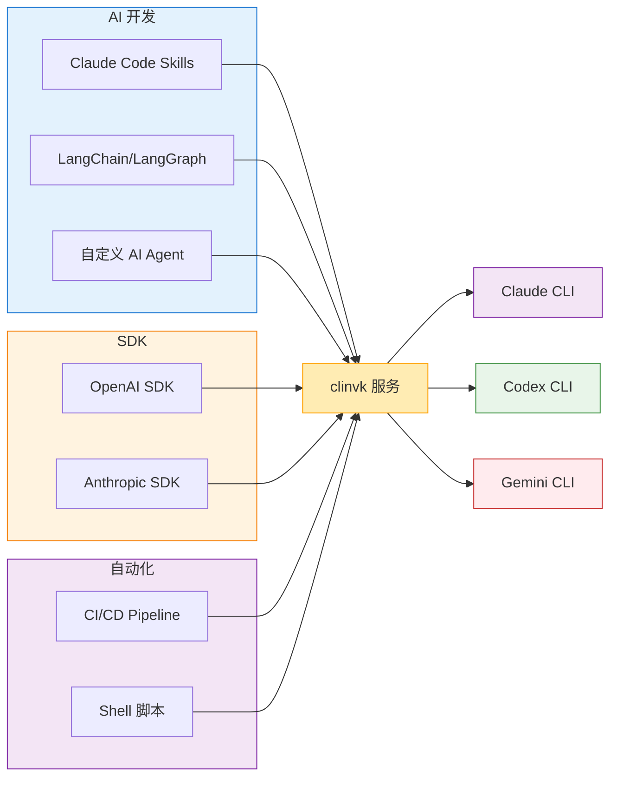

# 集成指南

clinvk 设计为与 AI 开发工作流无缝集成，从 Claude Code Skills 到 LangChain agent 再到 CI/CD 流水线。

## 集成概览



## 集成方式

| 方式 | 用例 | API 端点 |
|------|------|----------|
| [Claude Code Skills](claude-code-skills.md) | 用多后端能力扩展 Claude | `/api/v1/*` |
| [LangChain/LangGraph](langchain-langgraph.md) | AI 框架集成 | `/openai/v1/*` |
| [CI/CD](ci-cd/index.md) | 自动化代码审查、文档 | `/api/v1/*` |
| [客户端库](../../reference/api/index.md) | Python、TypeScript、Go 客户端 | 所有端点 |
| [MCP 服务器](mcp-server.md) | Model Context Protocol 集成 | 未来 |

## 快速集成示例

### Claude Code Skill

```bash
# 在你的 skill 脚本中
curl -s http://localhost:8080/api/v1/prompt \
  -H "Content-Type: application/json" \
  -d '{"backend": "gemini", "prompt": "分析这个数据"}'
```

### LangChain

```python
from langchain_openai import ChatOpenAI

llm = ChatOpenAI(
    base_url="http://localhost:8080/openai/v1",
    model="claude",
    api_key="not-needed"
)
```

### OpenAI SDK

```python
from openai import OpenAI

client = OpenAI(
    base_url="http://localhost:8080/openai/v1",
    api_key="not-needed"
)
```

### GitHub Actions

```yaml
- name: AI 代码审查
  run: |
    payload=$(jq -n --arg prompt "审查：\n${{ steps.diff.outputs.changes }}" '{backend:"claude", prompt:$prompt}')
    curl -sS -X POST http://localhost:8080/api/v1/prompt \
      -H "Content-Type: application/json" \
      -d "$payload"
```

## 前提条件

集成之前，确保：

1. **clinvk 已安装**：见 [安装](../../tutorials/getting-started.md)
2. **后端 CLI 可用**：至少有 `claude`、`codex` 或 `gemini` 之一
3. **服务器正在运行**：`clinvk serve --port 8080`

## 选择正确的端点

| 你的情况 | 推荐端点 |
|---------|---------|
| 使用 OpenAI SDK 或 LangChain | `/openai/v1/*` |
| 使用 Anthropic SDK | `/anthropic/v1/*` |
| 构建 Claude Code Skills | `/api/v1/*` |
| 需要并行/链式执行 | `/api/v1/*` |
| 简单 REST 集成 | `/api/v1/*` |

## 下一步

选择你的集成路径：

- **AI Agent 开发**：从 [Claude Code Skills](claude-code-skills.md) 开始
- **框架集成**：见 [LangChain/LangGraph](langchain-langgraph.md)
- **自动化**：查看 [CI/CD 集成](ci-cd/index.md)
- **自定义开发**：查阅 [客户端库](../../reference/api/index.md)
