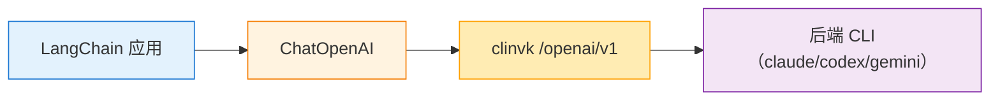

# LangChain / LangGraph 集成

本指南解释如何将 clinvk 与 LangChain 和 LangGraph 集成，用于构建 AI 驱动的应用和 agent。

## 概述

clinvk 的 OpenAI 兼容端点 (`/openai/v1/*`) 允许与 LangChain 和其他支持 OpenAI API 格式的 AI 框架无缝集成。



## OpenAI SDK 兼容性

clinvk 与 OpenAI Python SDK 完全兼容：

```python
from openai import OpenAI

# 将 clinvk 配置为 base URL
client = OpenAI(
    base_url="http://localhost:8080/openai/v1",
    api_key="not-needed"  # clinvk 不需要 API key
)

# 通过设置模型名称使用任何后端
response = client.chat.completions.create(
    model="claude",  # 后端名称：claude、codex 或 gemini
    messages=[
        {"role": "system", "content": "你是一个有帮助的助手。"},
        {"role": "user", "content": "解释这段代码片段。"}
    ]
)

print(response.choices[0].message.content)
```

## LangChain 集成

### 基本聊天模型

```python
from langchain_openai import ChatOpenAI
from langchain_core.messages import HumanMessage, SystemMessage

# 用 clinvk 端点初始化
llm = ChatOpenAI(
    base_url="http://localhost:8080/openai/v1",
    model="claude",
    api_key="not-needed",
    temperature=0.7
)

# 简单调用
messages = [
    SystemMessage(content="你是一个代码审查专家。"),
    HumanMessage(content="审查这个函数的 bug。")
]

response = llm.invoke(messages)
print(response.content)
```

### 使用 Chain

```python
from langchain_openai import ChatOpenAI
from langchain_core.prompts import ChatPromptTemplate
from langchain_core.output_parsers import StrOutputParser

# 设置
llm = ChatOpenAI(
    base_url="http://localhost:8080/openai/v1",
    model="claude",
    api_key="not-needed"
)

# 创建 chain
prompt = ChatPromptTemplate.from_messages([
    ("system", "你是一个代码文档专家。"),
    ("user", "为这段代码生成文档：\n{code}")
])

chain = prompt | llm | StrOutputParser()

# 执行
result = chain.invoke({"code": "def hello(): return 'world'"})
print(result)
```

### 在一个应用中使用多个后端

```python
from langchain_openai import ChatOpenAI

# 为不同后端创建多个 LLM 实例
claude_llm = ChatOpenAI(
    base_url="http://localhost:8080/openai/v1",
    model="claude",
    api_key="not-needed"
)

codex_llm = ChatOpenAI(
    base_url="http://localhost:8080/openai/v1",
    model="codex",
    api_key="not-needed"
)

gemini_llm = ChatOpenAI(
    base_url="http://localhost:8080/openai/v1",
    model="gemini",
    api_key="not-needed"
)

# 为不同任务使用不同后端
architecture_review = claude_llm.invoke("审查架构...")
code_generation = codex_llm.invoke("生成一个函数...")
data_analysis = gemini_llm.invoke("分析这个数据集...")
```

## LangGraph Agent 集成

### 带工具的基本 Agent

```python
from langchain_openai import ChatOpenAI
from langchain.tools import tool
from langgraph.prebuilt import create_react_agent
import httpx

# 定义使用 clinvk 并行执行的工具
@tool
def parallel_code_review(code: str) -> dict:
    """使用多个 AI 后端并行审查代码。"""
    response = httpx.post(
        "http://localhost:8080/api/v1/parallel",
        json={
            "tasks": [
                {
                    "backend": "claude",
                    "prompt": f"审查架构和设计：\n{code}"
                },
                {
                    "backend": "codex",
                    "prompt": f"审查性能问题：\n{code}"
                },
                {
                    "backend": "gemini",
                    "prompt": f"审查安全漏洞：\n{code}"
                }
            ]
        },
        timeout=120
    )
    return response.json()

@tool
def chain_documentation(code: str) -> str:
    """通过多步骤流水线生成文档。"""
    response = httpx.post(
        "http://localhost:8080/api/v1/chain",
        json={
            "steps": [
                {
                    "name": "analyze",
                    "backend": "claude",
                    "prompt": f"分析此代码结构：\n{code}"
                },
                {
                    "name": "document",
                    "backend": "codex",
                    "prompt": "基于此生成 API 文档: {{previous}}"
                }
            ]
        },
        timeout=120
    )
    results = response.json()
    return results["results"][-1]["output"]

# 创建 agent
llm = ChatOpenAI(
    base_url="http://localhost:8080/openai/v1",
    model="claude",
    api_key="not-needed"
)

agent = create_react_agent(llm, [parallel_code_review, chain_documentation])

# 运行 agent
result = agent.invoke({
    "messages": [{"role": "user", "content": "审查这段代码: def add(a, b): return a + b"}]
})
```

### 自定义 Agent Graph

```python
from typing import Annotated, TypedDict
from langgraph.graph import StateGraph, END
from langchain_openai import ChatOpenAI

class AgentState(TypedDict):
    code: str
    architecture_review: str
    performance_review: str
    security_review: str
    final_report: str

def review_architecture(state: AgentState) -> AgentState:
    llm = ChatOpenAI(
        base_url="http://localhost:8080/openai/v1",
        model="claude",
        api_key="not-needed"
    )
    result = llm.invoke(f"审查架构：\n{state['code']}")
    return {"architecture_review": result.content}

def review_performance(state: AgentState) -> AgentState:
    llm = ChatOpenAI(
        base_url="http://localhost:8080/openai/v1",
        model="codex",
        api_key="not-needed"
    )
    result = llm.invoke(f"审查性能：\n{state['code']}")
    return {"performance_review": result.content}

def review_security(state: AgentState) -> AgentState:
    llm = ChatOpenAI(
        base_url="http://localhost:8080/openai/v1",
        model="gemini",
        api_key="not-needed"
    )
    result = llm.invoke(f"审查安全：\n{state['code']}")
    return {"security_review": result.content}

def generate_report(state: AgentState) -> AgentState:
    llm = ChatOpenAI(
        base_url="http://localhost:8080/openai/v1",
        model="claude",
        api_key="not-needed"
    )
    prompt = f"""基于这些审查生成最终报告：

架构: {state['architecture_review']}
性能: {state['performance_review']}
安全: {state['security_review']}
"""
    result = llm.invoke(prompt)
    return {"final_report": result.content}

# 构建 graph
workflow = StateGraph(AgentState)

workflow.add_node("architecture", review_architecture)
workflow.add_node("performance", review_performance)
workflow.add_node("security", review_security)
workflow.add_node("report", generate_report)

workflow.set_entry_point("architecture")
workflow.add_edge("architecture", "performance")
workflow.add_edge("performance", "security")
workflow.add_edge("security", "report")
workflow.add_edge("report", END)

app = workflow.compile()

# 运行
result = app.invoke({"code": "def process(data): return data * 2"})
print(result["final_report"])
```

## 流式响应

### OpenAI SDK 流式传输

```python
from openai import OpenAI

client = OpenAI(
    base_url="http://localhost:8080/openai/v1",
    api_key="not-needed"
)

# 流式传输响应
stream = client.chat.completions.create(
    model="claude",
    messages=[{"role": "user", "content": "写一段长解释..."}],
    stream=True
)

for chunk in stream:
    if chunk.choices[0].delta.content:
        print(chunk.choices[0].delta.content, end="", flush=True)
```

### LangChain 流式传输

```python
from langchain_openai import ChatOpenAI
from langchain_core.messages import HumanMessage

llm = ChatOpenAI(
    base_url="http://localhost:8080/openai/v1",
    model="claude",
    api_key="not-needed",
    streaming=True
)

for chunk in llm.stream([HumanMessage(content="解释递归...")]):
    print(chunk.content, end="", flush=True)
```

## 异步支持

```python
import asyncio
from openai import AsyncOpenAI

async def main():
    client = AsyncOpenAI(
        base_url="http://localhost:8080/openai/v1",
        api_key="not-needed"
    )

    # 异步完成
    response = await client.chat.completions.create(
        model="claude",
        messages=[{"role": "user", "content": "你好！"}]
    )
    print(response.choices[0].message.content)

    # 异步流式传输
    stream = await client.chat.completions.create(
        model="claude",
        messages=[{"role": "user", "content": "讲个故事..."}],
        stream=True
    )

    async for chunk in stream:
        if chunk.choices[0].delta.content:
            print(chunk.choices[0].delta.content, end="")

asyncio.run(main())
```

## 错误处理

```python
from openai import OpenAI, APIError, APIConnectionError

client = OpenAI(
    base_url="http://localhost:8080/openai/v1",
    api_key="not-needed"
)

try:
    response = client.chat.completions.create(
        model="claude",
        messages=[{"role": "user", "content": "你好"}]
    )
except APIConnectionError:
    print("无法连接到 clinvk 服务器。它在运行吗？")
except APIError as e:
    print(f"API 错误: {e.message}")
```

## 最佳实践

### 1. 连接池

```python
import httpx

# 复用客户端进行多次请求
client = httpx.Client(
    base_url="http://localhost:8080",
    timeout=120
)

# 在应用中使用
response = client.post("/api/v1/prompt", json={...})
```

### 2. 超时配置

```python
from langchain_openai import ChatOpenAI

llm = ChatOpenAI(
    base_url="http://localhost:8080/openai/v1",
    model="claude",
    api_key="not-needed",
    request_timeout=120  # 长任务 2 分钟
)
```

### 3. 后端选择策略

| 任务 | 推荐后端 | 原因 |
|------|---------|------|
| 复杂推理 | `claude` | 强大的分析能力 |
| 代码生成 | `codex` | 针对代码优化 |
| 数据分析 | `gemini` | 擅长处理结构化数据 |
| 通用任务 | `claude` | 通用默认选择 |

## 下一步

- [CI/CD 集成](ci-cd/) - 在流水线中自动化
- [客户端库](openai-sdk.md) - 其他语言绑定
- [REST API 参考](../../reference/api/rest.md) - 完整 API 文档
