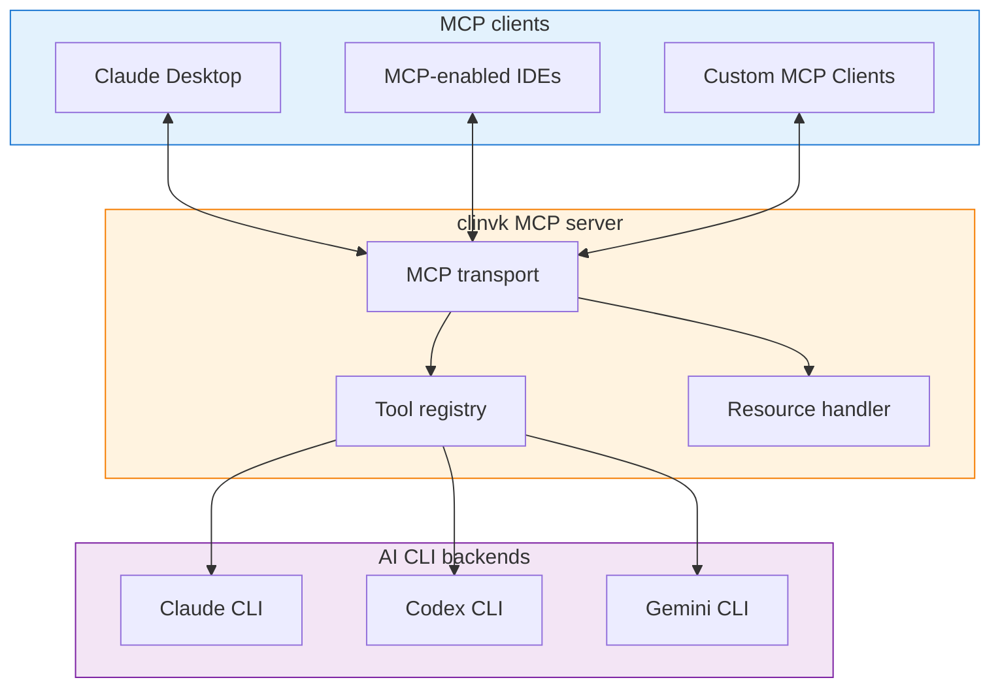

# MCP Server Integration

!!! note "Future Feature"
    MCP (Model Context Protocol) server support is planned for a future release. This document describes the intended design and usage patterns.

## Overview

The Model Context Protocol (MCP) is a standard for connecting AI models with external tools and data sources. clinvk plans to support MCP to enable:

- Direct integration with Claude Desktop
- Standardized tool calling interface
- Ecosystem compatibility with MCP-enabled tools

## Planned Architecture



## Planned Tools

### `clinvk_prompt`

Execute a prompt with a specified backend.

```json
{
  "name": "clinvk_prompt",
  "description": "Execute a prompt using an AI CLI backend",
  "inputSchema": {
    "type": "object",
    "properties": {
      "backend": {
        "type": "string",
        "enum": ["claude", "codex", "gemini"],
        "description": "AI backend to use"
      },
      "prompt": {
        "type": "string",
        "description": "The prompt to send"
      },
      "session_id": {
        "type": "string",
        "description": "Optional session ID for context"
      }
    },
    "required": ["backend", "prompt"]
  }
}
```

### `clinvk_parallel`

Execute multiple prompts in parallel.

```json
{
  "name": "clinvk_parallel",
  "description": "Execute multiple prompts across backends in parallel",
  "inputSchema": {
    "type": "object",
    "properties": {
      "tasks": {
        "type": "array",
        "items": {
          "type": "object",
          "properties": {
            "backend": {"type": "string"},
            "prompt": {"type": "string"}
          }
        }
      }
    },
    "required": ["tasks"]
  }
}
```

### `clinvk_chain`

Execute a chain of prompts sequentially.

```json
{
  "name": "clinvk_chain",
  "description": "Execute prompts in sequence, passing results forward",
  "inputSchema": {
    "type": "object",
    "properties": {
      "steps": {
        "type": "array",
        "items": {
          "type": "object",
          "properties": {
            "name": {"type": "string"},
            "backend": {"type": "string"},
            "prompt": {"type": "string"}
          }
        }
      }
    },
    "required": ["steps"]
  }
}
```

## Planned Usage

### Claude Desktop Configuration

```json
{
  "mcpServers": {
    "clinvk": {
      "command": "clinvk",
      "args": ["mcp", "--port", "stdio"],
      "env": {
        "CLINVK_BACKEND": "claude"
      }
    }
  }
}
```

### Starting the MCP Server

```bash
# Stdio transport (for Claude Desktop)
clinvk mcp --transport stdio

# HTTP transport (for network clients)
clinvk mcp --transport http --port 3000
```

## Use Cases

### 1. Multi-Backend Code Review in Claude Desktop

Claude Desktop could use clinvk to get perspectives from multiple AI models:

```yaml
User: Review this code from multiple perspectives

Claude: I'll use the clinvk_parallel tool to get reviews from different AI models.

[Calls clinvk_parallel with Claude, Codex, and Gemini tasks]

Here are the combined perspectives:
- Architecture (Claude): ...
- Performance (Codex): ...
- Security (Gemini): ...
```

### 2. Documentation Pipeline

```yaml
User: Generate documentation for this codebase

Claude: I'll use the clinvk_chain tool to create documentation through a pipeline.

[Calls clinvk_chain with analyze → generate → polish steps]

Here's the polished documentation: ...
```

### 3. Specialized Task Routing

```yaml
User: Optimize this SQL query

Claude: I'll route this to Gemini, which excels at data analysis.

[Calls clinvk_prompt with backend="gemini"]

Gemini suggests these optimizations: ...
```

## Development Status

| Feature | Status |
|---------|--------|
| MCP Protocol Support | Planned |
| Stdio Transport | Planned |
| HTTP Transport | Planned |
| Tool Registration | Planned |
| Resource Support | Under Consideration |

## Related Resources

- [Model Context Protocol Specification](https://spec.modelcontextprotocol.io/)
- [Claude Desktop MCP Guide](https://docs.anthropic.com/claude/docs/mcp)
- [REST API Reference](../reference/api/rest.md) - Current HTTP API

## Feedback

We welcome feedback on the MCP integration design. Please open an issue on [GitHub](https://github.com/signalridge/clinvoker/issues) with your suggestions or use cases.
