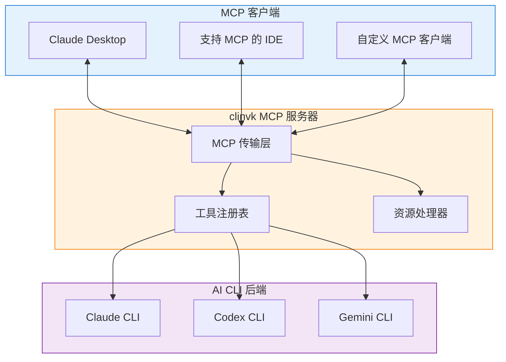

# MCP 服务器集成

!!! note "未来功能"
    MCP（Model Context Protocol）服务器支持计划在未来版本中发布。本文档描述了预期的设计和使用模式。

## 概述

Model Context Protocol（MCP）是一个将 AI 模型与外部工具和数据源连接的标准。clinvk 计划支持 MCP 以实现：

- 与 Claude Desktop 直接集成
- 标准化的工具调用接口
- 与 MCP 启用工具的生态系统兼容性

## 计划架构



## 计划工具

### `clinvk_prompt`

使用指定后端执行提示。

```json
{
  "name": "clinvk_prompt",
  "description": "使用 AI CLI 后端执行提示",
  "inputSchema": {
    "type": "object",
    "properties": {
      "backend": {
        "type": "string",
        "enum": ["claude", "codex", "gemini"],
        "description": "要使用的 AI 后端"
      },
      "prompt": {
        "type": "string",
        "description": "要发送的提示"
      },
      "session_id": {
        "type": "string",
        "description": "可选的会话 ID 用于上下文"
      }
    },
    "required": ["backend", "prompt"]
  }
}
```

### `clinvk_parallel`

并行执行多个提示。

```json
{
  "name": "clinvk_parallel",
  "description": "跨后端并行执行多个提示",
  "inputSchema": {
    "type": "object",
    "properties": {
      "tasks": {
        "type": "array",
        "items": {
          "type": "object",
          "properties": {
            "backend": {"type": "string"},
            "prompt": {"type": "string"}
          }
        }
      }
    },
    "required": ["tasks"]
  }
}
```

### `clinvk_chain`

顺序执行提示链。

```json
{
  "name": "clinvk_chain",
  "description": "顺序执行提示，传递结果",
  "inputSchema": {
    "type": "object",
    "properties": {
      "steps": {
        "type": "array",
        "items": {
          "type": "object",
          "properties": {
            "name": {"type": "string"},
            "backend": {"type": "string"},
            "prompt": {"type": "string"}
          }
        }
      }
    },
    "required": ["steps"]
  }
}
```

## 计划用法

### Claude Desktop 配置

```json
{
  "mcpServers": {
    "clinvk": {
      "command": "clinvk",
      "args": ["mcp", "--port", "stdio"],
      "env": {
        "CLINVK_BACKEND": "claude"
      }
    }
  }
}
```

### 启动 MCP 服务器

```bash
# Stdio 传输（用于 Claude Desktop）
clinvk mcp --transport stdio

# HTTP 传输（用于网络客户端）
clinvk mcp --transport http --port 3000
```

## 使用场景

### 1. Claude Desktop 中的多后端代码审查

Claude Desktop 可以使用 clinvk 获取多个 AI 模型的视角：

```text
用户：从多个角度审查这段代码

Claude：我将使用 clinvk_parallel 工具从不同 AI 模型获取审查。

[使用 Claude、Codex 和 Gemini 任务调用 clinvk_parallel]

这是综合视角：
- 架构（Claude）：...
- 性能（Codex）：...
- 安全（Gemini）：...
```

### 2. 文档流水线

```text
用户：为这个代码库生成文档

Claude：我将使用 clinvk_chain 工具通过流水线创建文档。

[使用 analyze → generate → polish 步骤调用 clinvk_chain]

这是精修后的文档：...
```

### 3. 专业任务路由

```text
用户：优化这个 SQL 查询

Claude：我将把这个路由到擅长数据分析的 Gemini。

[使用 backend="gemini" 调用 clinvk_prompt]

Gemini 建议这些优化：...
```

## 开发状态

| 功能 | 状态 |
|------|------|
| MCP 协议支持 | 计划中 |
| Stdio 传输 | 计划中 |
| HTTP 传输 | 计划中 |
| 工具注册 | 计划中 |
| 资源支持 | 考虑中 |

## 相关资源

- [Model Context Protocol 规范](https://spec.modelcontextprotocol.io/)
- [Claude Desktop MCP 指南](https://docs.anthropic.com/claude/docs/mcp)
- [REST API 参考](../reference/api/rest.md) - 当前 HTTP API

## 反馈

我们欢迎对 MCP 集成设计的反馈。请在 [GitHub](https://github.com/signalridge/clinvoker/issues) 上提交 issue，分享您的建议或使用场景。
