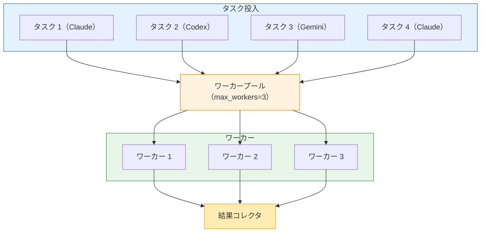

# 並列実行

複数の AI タスクを同時に実行して、時間を節約し生産性を高めます。このガイドでは、並列実行のアーキテクチャ、タスクファイル形式、エラーハンドリング戦略、実践パターンを扱います。

## 概要

`parallel` コマンドは、1 つ以上のバックエンドに対して複数タスクを同時に実行します。順次実行と異なり、並列タスクは同時に進むため、総実行時間は「全タスクの合計」ではなく「最も遅いタスク」に概ね支配されます。

**主なメリット:**

- **時間短縮:** 独立タスクを同時に実行
- **多観点の分析:** 異なる AI モデルの観点を同時に取得
- **バッチ処理:** 複数ファイル/コンポーネントを効率よく処理
- **リソース最適化:** レート制限内でスループットを最大化

## 並列実行のアーキテクチャ

### 仕組み



**実行フロー:**

1. **タスク解析:** JSON タスクファイルをパースし検証
2. **ワーカープール:** タスクをワーカーへ分配（最大 `max_workers`）
3. **同時実行:** 各ワーカーが担当タスクを実行
4. **結果収集:** 完了した順に結果を収集
5. **集約:** 最終出力を整形して表示

### 並行モデル

clinvk の並列実行はワーカープールパターンです。

- **ワーカープールサイズ:** `--max-parallel` または設定の `max_workers` で制御
- **タスクキュー:** ワーカーが空くまでタスクはキューで待機
- **独立実行:** 各タスクは自身のバックエンドプロセスで隔離して実行
- **結果順:** 出力上の結果はタスクのインデックス順を維持

## JSON タスクファイル形式

### 基本構造

```json
{
  "tasks": [
    {
      "backend": "claude",
      "prompt": "review the auth module"
    },
    {
      "backend": "codex",
      "prompt": "add logging to the API"
    },
    {
      "backend": "gemini",
      "prompt": "generate tests for utils"
    }
  ]
}
```

### タスク定義（フル）

```json
{
  "tasks": [
    {
      "backend": "claude",
      "prompt": "review the code",
      "model": "claude-opus-4-5-20251101",
      "workdir": "/path/to/project",
      "approval_mode": "auto",
      "sandbox_mode": "workspace",
      "output_format": "json",
      "max_tokens": 4096,
      "max_turns": 10,
      "system_prompt": "You are a code reviewer."
    }
  ]
}
```

### タスクフィールドリファレンス

| フィールド | 型 | 必須 | 説明 |
|-------|------|----------|-------------|
| `backend` | string | はい | 使用するバックエンド（`claude`, `codex`, `gemini`） |
| `prompt` | string | はい | 実行するプロンプト |
| `model` | string | いいえ | モデルの上書き |
| `workdir` | string | いいえ | タスクの作業ディレクトリ |
| `approval_mode` | string | いいえ | `default`, `auto`, `none`, `always` |
| `sandbox_mode` | string | いいえ | `default`, `read-only`, `workspace`, `full` |
| `output_format` | string | いいえ | 受け付けますが CLI の parallel では無視されます（予約） |
| `max_tokens` | int | いいえ | 最大応答トークン数 |
| `max_turns` | int | いいえ | エージェント的なターン数の上限 |
| `system_prompt` | string | いいえ | カスタムシステムプロンプト |

### トップレベルオプション

すべてのタスクに適用されるオプションを指定できます。

```json
{
  "tasks": [...],
  "max_parallel": 3,
  "fail_fast": true
}
```

| フィールド | 型 | デフォルト | 説明 |
|-------|------|---------|-------------|
| `max_parallel` | int | 3 | 最大同時タスク数 |
| `fail_fast` | bool | false | 最初の失敗で停止 |

**優先順位:** CLI フラグがファイル設定を上書きし、ファイル設定が config のデフォルトを上書きします。

## タスクを実行する

### ファイルから実行

```bash
clinvk parallel --file tasks.json
```

### 標準入力から実行

動的生成したタスク定義をパイプできます。

```bash
cat tasks.json | clinvk parallel

# もしくは動的生成
./generate-tasks.py | clinvk parallel
```

### 実行オプション

#### 並列ワーカー数を制限する

リソース使用量を調整するために並行度を制御します。

```bash
# 同時に最大 2 タスクまで
clinvk parallel --file tasks.json --max-parallel 2
```

**制限したほうがよいケース:**

- **レート制限:** バックエンド API 制限内に収める
- **リソース制約:** CPU/メモリが限られている
- **ネットワーク帯域:** 接続を飽和させない
- **コスト管理:** 同時 API 呼び出し数を抑える

#### Fail-Fast モード

最初の失敗で全タスクを停止します。

```bash
clinvk parallel --file tasks.json --fail-fast
```

**Fail-Fast が向くケース:**

- タスク間に依存関係がある（後続が前段の成功を必要）
- 検証バッチで、失敗が 1 つでもあると無効
- CI/CD で部分成功を許容できない

**トレードオフ:**

- **Pros:** 失敗検知が早く、リソースを節約
- **Cons:** 複数の問題を取りこぼす可能性があり、フィードバックが不完全

#### エラーがあっても継続（デフォルト）

個々の失敗に関わらず全タスクを実行します。

```bash
clinvk parallel --file tasks.json
# または明示的に
clinvk parallel --file tasks.json --max-parallel 3
```

**向いているケース:**

- 独立タスク（依存関係なし）
- すべての項目に対するフィードバックが欲しい
- バッチ処理で部分成功を許容できる

## 出力形式

### テキスト出力（デフォルト）

進捗と結果を完了順に表示します。

```text
Running 3 tasks (max 3 parallel)...

[1] The auth module looks good...
[2] Added logging statements...
[3] Generated 5 test cases...

Results
============================================================

BACKEND      STATUS   DURATION   TASK

------------------------------------------------------------

1    claude       OK       2.50s      review the auth module
2    codex        OK       3.20s      add logging to the API
3    gemini       OK       2.80s      generate tests for utils
------------------------------------------------------------

Total: 3 tasks, 3 completed, 0 failed (3.20s)
```

### JSON 出力

プログラム処理向けの構造化出力です。

```bash
clinvk parallel --file tasks.json --json
```

```json
{
  "total_tasks": 3,
  "completed": 3,
  "failed": 0,
  "total_duration_seconds": 3.2,
  "results": [
    {
      "index": 0,
      "backend": "claude",
      "output": "The auth module looks good...",
      "duration_seconds": 2.5,
      "exit_code": 0
    },
    {
      "index": 1,
      "backend": "codex",
      "output": "Added logging statements...",
      "duration_seconds": 3.2,
      "exit_code": 0
    },
    {
      "index": 2,
      "backend": "gemini",
      "output": "Generated 5 test cases...",
      "duration_seconds": 2.8,
      "exit_code": 0
    }
  ]
}
```

### Quiet モード

タスク出力を抑制して、サマリのみ表示します。

```bash
clinvk parallel --file tasks.json --quiet
```

**出力例:**

```text
Total: 3 tasks, 3 completed, 0 failed (3.20s)
```

**向いている用途:** CI/CD、cron、ステータスだけ必要な場合

## 結果集約のパターン

### パターン 1: 全結果を集める

```bash
clinvk parallel --file tasks.json --json | jq '.results[].output'
```

### パターン 2: 成功のみ抽出

```bash
clinvk parallel --file tasks.json --json | \
  jq '.results[] | select(.exit_code == 0) | .output'
```

### パターン 3: 失敗時の処理

```bash
#!/bin/bash

result=$(clinvk parallel --file tasks.json --json)
failed=$(echo "$result" | jq '.failed')

if [ "$failed" -gt 0 ]; then
  echo "Warning: $failed tasks failed"
  echo "$result" | jq '.results[] | select(.exit_code != 0)'
  exit 1
fi
```

## 実用例

### セキュリティ監査パイプライン

複数バックエンドで包括的なセキュリティチェックを行います。

```json
{
  "tasks": [
    {
      "backend": "claude",
      "prompt": "Review this codebase for security vulnerabilities, focusing on injection attacks and authentication issues",
      "approval_mode": "auto",
      "sandbox_mode": "read-only"
    },
    {
      "backend": "gemini",
      "prompt": "Analyze this code for common security anti-patterns and OWASP Top 10 issues",
      "approval_mode": "auto",
      "sandbox_mode": "read-only"
    },
    {
      "backend": "codex",
      "prompt": "Check for hardcoded secrets, API keys, and credentials in the codebase",
      "approval_mode": "auto",
      "sandbox_mode": "read-only"
    }
  ],
  "max_parallel": 3
}
```

```bash
clinvk parallel --file security-audit.json --json > security-report.json
```

### 多観点のコードレビュー

コード変更に対して多様な観点を得ます。

```json
{
  "tasks": [
    {
      "backend": "claude",
      "prompt": "Review this PR for architectural issues and design patterns"
    },
    {
      "backend": "gemini",
      "prompt": "Review this PR for security vulnerabilities"
    },
    {
      "backend": "codex",
      "prompt": "Review this PR for performance issues"
    }
  ]
}
```

### テスト生成のバッチ

複数モジュールに対してテストを生成します。

```json
{
  "tasks": [
    {"backend": "codex", "prompt": "generate unit tests for auth.go"},
    {"backend": "codex", "prompt": "generate unit tests for user.go"},
    {"backend": "codex", "prompt": "generate unit tests for api.go"}
  ],
  "max_parallel": 3
}
```

### 複数プロジェクトのタスク

複数プロジェクトで依存関係更新を行います。

```json
{
  "tasks": [
    {
      "backend": "claude",
      "prompt": "update dependencies and check for breaking changes",
      "workdir": "/projects/frontend"
    },
    {
      "backend": "claude",
      "prompt": "update dependencies and check for breaking changes",
      "workdir": "/projects/backend"
    },
    {
      "backend": "claude",
      "prompt": "update dependencies and check for breaking changes",
      "workdir": "/projects/worker"
    }
  ]
}
```

## チェーン実行と組み合わせる

複雑なワークフローでは、チェーンの途中で並列を組み合わせられます。

```json
{
  "steps": [
    {
      "name": "analyze",
      "backend": "claude",
      "prompt": "Analyze the codebase structure"
    },
    {
      "name": "generate-tests",
      "backend": "claude",
      "prompt": "Create a tasks.json file with test generation tasks for all modules based on: {{previous}}"
    }
  ]
}
```

生成されたタスクを実行します。

```bash
clinvk chain --file analyze.json --json | \
  jq -r '.results[-1].output' > generated-tasks.json
clinvk parallel --file generated-tasks.json
```

## リソース制限とチューニング

### ワーカープールサイズの目安

| シナリオ | 推奨 `max_workers` | 理由 |
|----------|--------------------------|--------|
| ローカル開発 | 2-3 | 速度とリソースのバランス |
| CI/CD | 3-5 | フィードバックを速めつつ、リソースを制御 |
| 大量バッチ | 5-10 | スループット最大化 |
| レート制限が厳しい API | 1-2 | 制限内に収める |

### メモリの考慮

並列タスクごとに別のバックエンドプロセスが起動します。

```text
メモリ使用量 ≈ ベース +（タスク数 × バックエンドのメモリ）

例:
- ベース（clinvk）: 50MB
- Claude プロセス: 200MB
- 並列 3 タスク: 50 +（3 × 200）= 650MB
```

### レート制限

バックエンドにはレート制限がある場合があります。対策例:

1. **ワーカーを減らす:** `max_parallel` を下げる
2. **順次モード:** `--max-parallel 1` を使う
3. **バックオフ:** スクリプト側でリトライ/待機を実装
4. **バックエンド分散:** 複数バックエンドに負荷分散

## 設定

`~/.clinvk/config.yaml` における並列設定のデフォルト例:

```yaml
parallel:
  # 最大同時タスク数
  max_workers: 3

  # 最初の失敗で停止
  fail_fast: false

  # すべてのタスク出力をまとめる
  aggregate_output: true
```

## エラーシナリオと対処

### シナリオ 1: 一部失敗

**問題:** いくつかのタスクが失敗し、他は成功する

**対処:**

```bash
# 失敗があっても継続（デフォルト）
clinvk parallel --file tasks.json

# 失敗結果だけ抽出
clinvk parallel --file tasks.json --json | \
  jq '.results[] | select(.exit_code != 0) | {index, backend, error}'
```

### シナリオ 2: レート制限

**問題:** API のレート制限に到達する

**対処:**

```bash
# 並行度を下げる
clinvk parallel --file tasks.json --max-parallel 1

# もしくは順次モード
clinvk parallel --file tasks.json --max-parallel 1
```

### シナリオ 3: リソース枯渇

**問題:** メモリ/CPU が不足する

**対処:**

```bash
# リソースに合わせてワーカー数を制限
clinvk parallel --file tasks.json --max-parallel 2

# バッチに分割
head -n 10 tasks.json > batch1.json
clinvk parallel --file batch1.json
```

### シナリオ 4: 依存関係のあるタスク

**問題:** タスク B がタスク A の成功に依存する

**対処:**

```bash
# fail-fast を使う
clinvk parallel --file tasks.json --fail-fast

# 依存関係がある場合はチェーンを使う
clinvk chain --file dependent-tasks.json
```

## ベストプラクティス

!!! tip "まずは 2〜3 ワーカーから"
    保守的な並行度から始め、マシン性能とバックエンドのレート制限に応じて増やしてください。

!!! tip "自動化では JSON を使う"
    スクリプトや CI/CD と連携する場合は、解析しやすい `--json` 出力を使ってください。

!!! tip "類似タスクをまとめる"
    バックエンドごとにタスクを整理すると、コンテキスト切り替えとリソース利用の面で有利です。

!!! tip "失敗を優雅に扱う"
    長時間のバッチでは、部分失敗が起こりうる前提でワークフローを設計してください。

!!! tip "リソース使用量を監視する"
    特に大きなモデルで多数並列にするときは、メモリ/CPU を監視してください。

## 他コマンドとの比較

| 機能 | 並列 | チェーン | 比較 |
|---------|----------|-------|---------|
| 実行 | 同時 | 順次 | 同時 |
| データフロー | 独立 | 受け渡しあり | 独立 |
| ユースケース | バッチ処理 | 多段ワークフロー | 多観点の分析 |
| 失敗時の挙動 | 設定可能 | 失敗で停止 | 残りを継続 |

## 次のステップ

- [チェーン実行](chains.md) - データフロー付きの順次パイプライン
- [バックエンド比較](compare.md) - 応答を並べて比較
- [セッション管理](sessions.md) - 会話コンテキストの管理
