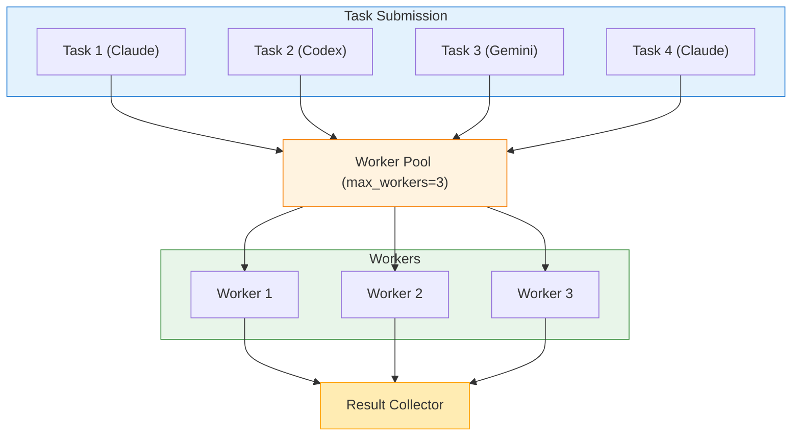

# Parallel Execution

Run multiple AI tasks concurrently to save time and increase productivity. This guide covers the parallel execution architecture, task file format, error handling strategies, and real-world patterns.

## Overview

The `parallel` command executes multiple tasks simultaneously across one or more backends. Unlike sequential execution, parallel tasks run concurrently, with the total execution time equal to the slowest task rather than the sum of all tasks.

**Key Benefits:**

- **Time Savings:** Run independent tasks simultaneously
- **Multi-Perspective Analysis:** Get insights from different AI models at once
- **Batch Processing:** Process multiple files or components efficiently
- **Resource Optimization:** Maximize throughput within rate limits

## Parallel Execution Architecture

### How It Works



**Execution Flow:**

1. **Task Parsing:** JSON task file is parsed and validated
2. **Worker Pool:** Tasks are distributed to workers (up to `max_workers`)
3. **Concurrent Execution:** Each worker runs its assigned task
4. **Result Collection:** Results are gathered as tasks complete
5. **Aggregation:** Final output is formatted and displayed

### Concurrency Model

clinvk uses a worker pool pattern for parallel execution:

- **Worker Pool Size:** Controlled by `--max-parallel` or `max_workers` config
- **Task Queue:** Tasks wait in a queue until a worker is available
- **Independent Execution:** Each task runs in isolation with its own backend process
- **Result Ordering:** Results maintain task index order in output

## JSON Task File Format

### Basic Structure

```json
{
  "tasks": [
    {
      "backend": "claude",
      "prompt": "review the auth module"
    },
    {
      "backend": "codex",
      "prompt": "add logging to the API"
    },
    {
      "backend": "gemini",
      "prompt": "generate tests for utils"
    }
  ]
}
```

### Complete Task Specification

```json
{
  "tasks": [
    {
      "backend": "claude",
      "prompt": "review the code",
      "model": "claude-opus-4-5-20251101",
      "workdir": "/path/to/project",
      "approval_mode": "auto",
      "sandbox_mode": "workspace",
      "output_format": "json",
      "max_tokens": 4096,
      "max_turns": 10,
      "system_prompt": "You are a code reviewer."
    }
  ]
}
```

### Task Fields Reference

| Field | Type | Required | Description |
|-------|------|----------|-------------|
| `backend` | string | Yes | Backend to use (`claude`, `codex`, `gemini`) |
| `prompt` | string | Yes | The prompt to execute |
| `model` | string | No | Model override |
| `workdir` | string | No | Working directory for the task |
| `approval_mode` | string | No | `default`, `auto`, `none`, `always` |
| `sandbox_mode` | string | No | `default`, `read-only`, `workspace`, `full` |
| `output_format` | string | No | Accepted but ignored in CLI parallel (reserved) |
| `max_tokens` | int | No | Maximum response tokens |
| `max_turns` | int | No | Maximum agentic turns |
| `system_prompt` | string | No | Custom system prompt |

### Top-Level Options

Specify options that apply to all tasks:

```json
{
  "tasks": [...],
  "max_parallel": 3,
  "fail_fast": true
}
```

| Field | Type | Default | Description |
|-------|------|---------|-------------|
| `max_parallel` | int | 3 | Maximum concurrent tasks |
| `fail_fast` | bool | false | Stop on first failure |

**Priority:** CLI flags override file-level settings, which override config defaults.

## Running Tasks

### From File

```bash
clinvk parallel --file tasks.json
```

### From Stdin

Pipe task definitions for dynamic generation:

```bash
cat tasks.json | clinvk parallel

# Or generate dynamically
./generate-tasks.py | clinvk parallel
```

### Execution Options

#### Limit Parallel Workers

Control concurrency to manage resource usage:

```bash
# Run at most 2 tasks at a time
clinvk parallel --file tasks.json --max-parallel 2
```

**When to Limit Workers:**

- **Rate Limits:** Stay within backend API limits
- **Resource Constraints:** Limited CPU/memory
- **Network Bandwidth:** Avoid overwhelming connections
- **Cost Control:** Limit concurrent API calls

#### Fail-Fast Mode

Stop all tasks on the first failure:

```bash
clinvk parallel --file tasks.json --fail-fast
```

**Use Cases for Fail-Fast:**

- Tasks have dependencies (later tasks need earlier ones to succeed)
- Validation tasks where any failure invalidates the batch
- CI/CD pipelines where partial success is not acceptable

**Trade-offs:**

- **Pros:** Faster failure detection, resource savings
- **Cons:** May miss multiple issues, less complete feedback

#### Continue-on-Error (Default)

Run all tasks regardless of individual failures:

```bash
clinvk parallel --file tasks.json
# or explicitly
clinvk parallel --file tasks.json --max-parallel 3
```

**Use Cases for Continue-on-Error:**

- Independent tasks (no dependencies)
- Getting complete feedback on all items
- Batch processing where partial success is acceptable

## Output Formats

### Text Output (Default)

Shows progress and results as tasks complete:

```text
Running 3 tasks (max 3 parallel)...

[1] The auth module looks good...
[2] Added logging statements...
[3] Generated 5 test cases...

Results
============================================================

BACKEND      STATUS   DURATION   TASK

------------------------------------------------------------

1    claude       OK       2.50s      review the auth module
2    codex        OK       3.20s      add logging to the API
3    gemini       OK       2.80s      generate tests for utils
------------------------------------------------------------

Total: 3 tasks, 3 completed, 0 failed (3.20s)
```

### JSON Output

Structured output for programmatic processing:

```bash
clinvk parallel --file tasks.json --json
```

```json
{
  "total_tasks": 3,
  "completed": 3,
  "failed": 0,
  "total_duration_seconds": 3.2,
  "results": [
    {
      "index": 0,
      "backend": "claude",
      "output": "The auth module looks good...",
      "duration_seconds": 2.5,
      "exit_code": 0
    },
    {
      "index": 1,
      "backend": "codex",
      "output": "Added logging statements...",
      "duration_seconds": 3.2,
      "exit_code": 0
    },
    {
      "index": 2,
      "backend": "gemini",
      "output": "Generated 5 test cases...",
      "duration_seconds": 2.8,
      "exit_code": 0
    }
  ]
}
```

### Quiet Mode

Suppress task output, show only summary:

```bash
clinvk parallel --file tasks.json --quiet
```

**Output:**

```text
Total: 3 tasks, 3 completed, 0 failed (3.20s)
```

**Best for:** CI/CD pipelines, cron jobs, when only status matters

## Result Aggregation Patterns

### Pattern 1: Collect All Results

Process all outputs together:

```bash
clinvk parallel --file tasks.json --json | jq '.results[].output'
```

### Pattern 2: Filter by Status

Process only successful results:

```bash
clinvk parallel --file tasks.json --json | \
  jq '.results[] | select(.exit_code == 0) | .output'
```

### Pattern 3: Error Handling

Check for failures and react:

```bash
#!/bin/bash

result=$(clinvk parallel --file tasks.json --json)
failed=$(echo "$result" | jq '.failed')

if [ "$failed" -gt 0 ]; then
  echo "Warning: $failed tasks failed"
  echo "$result" | jq '.results[] | select(.exit_code != 0)'
  exit 1
fi
```

## Real-World Examples

### Security Audit Pipeline

Run comprehensive security checks across multiple backends:

```json
{
  "tasks": [
    {
      "backend": "claude",
      "prompt": "Review this codebase for security vulnerabilities, focusing on injection attacks and authentication issues",
      "approval_mode": "auto",
      "sandbox_mode": "read-only"
    },
    {
      "backend": "gemini",
      "prompt": "Analyze this code for common security anti-patterns and OWASP Top 10 issues",
      "approval_mode": "auto",
      "sandbox_mode": "read-only"
    },
    {
      "backend": "codex",
      "prompt": "Check for hardcoded secrets, API keys, and credentials in the codebase",
      "approval_mode": "auto",
      "sandbox_mode": "read-only"
    }
  ],
  "max_parallel": 3
}
```

```bash
clinvk parallel --file security-audit.json --json > security-report.json
```

### Multi-Perspective Code Review

Get diverse insights on code changes:

```json
{
  "tasks": [
    {
      "backend": "claude",
      "prompt": "Review this PR for architectural issues and design patterns"
    },
    {
      "backend": "gemini",
      "prompt": "Review this PR for security vulnerabilities"
    },
    {
      "backend": "codex",
      "prompt": "Review this PR for performance issues"
    }
  ]
}
```

### Batch Test Generation

Generate tests for multiple modules:

```json
{
  "tasks": [
    {"backend": "codex", "prompt": "generate unit tests for auth.go"},
    {"backend": "codex", "prompt": "generate unit tests for user.go"},
    {"backend": "codex", "prompt": "generate unit tests for api.go"}
  ],
  "max_parallel": 3
}
```

### Multi-Project Tasks

Update dependencies across multiple projects:

```json
{
  "tasks": [
    {
      "backend": "claude",
      "prompt": "update dependencies and check for breaking changes",
      "workdir": "/projects/frontend"
    },
    {
      "backend": "claude",
      "prompt": "update dependencies and check for breaking changes",
      "workdir": "/projects/backend"
    },
    {
      "backend": "claude",
      "prompt": "update dependencies and check for breaking changes",
      "workdir": "/projects/worker"
    }
  ]
}
```

## Combining with Chain Execution

Use parallel within chain steps for complex workflows:

```json
{
  "steps": [
    {
      "name": "analyze",
      "backend": "claude",
      "prompt": "Analyze the codebase structure"
    },
    {
      "name": "generate-tests",
      "backend": "claude",
      "prompt": "Create a tasks.json file with test generation tasks for all modules based on: {{previous}}"
    }
  ]
}
```

Then run the generated tasks:

```bash
clinvk chain --file analyze.json --json | \
  jq -r '.results[-1].output' > generated-tasks.json
clinvk parallel --file generated-tasks.json
```

## Resource Limits and Tuning

### Worker Pool Sizing

| Scenario | Recommended `max_workers` | Reason |
|----------|--------------------------|--------|
| Local development | 2-3 | Balance speed and resource use |
| CI/CD pipeline | 3-5 | Faster feedback, controlled resources |
| High-volume batch | 5-10 | Maximize throughput |
| Rate-limited APIs | 1-2 | Stay within limits |

### Memory Considerations

Each parallel task spawns a separate backend process:

```text
Memory Usage ≈ Base + (Tasks × Backend Memory)

Example:
- Base clinvk: 50MB
- Claude process: 200MB
- 3 parallel tasks: 50 + (3 × 200) = 650MB
```

### Rate Limiting

Backends may have rate limits. Strategies:

1. **Reduce Workers:** Lower `max_parallel` to stay within limits
2. **Sequential Mode:** Use `--max-parallel 1` for strict limits
3. **Backoff:** Implement retry logic in scripts
4. **Mixed Backends:** Distribute load across different backends

## Configuration

Default parallel execution settings in `~/.clinvk/config.yaml`:

```yaml
parallel:
  # Maximum concurrent tasks
  max_workers: 3

  # Stop on first failure
  fail_fast: false

  # Combine output from all tasks
  aggregate_output: true
```

## Error Scenarios and Solutions

### Scenario 1: Partial Failures

**Problem:** Some tasks fail while others succeed

**Solution:**

```bash
# Continue despite failures (default)
clinvk parallel --file tasks.json

# Then process results
clinvk parallel --file tasks.json --json | \
  jq '.results[] | select(.exit_code != 0) | {index, backend, error}'
```

### Scenario 2: Rate Limiting

**Problem:** Hitting API rate limits

**Solution:**

```bash
# Reduce concurrency
clinvk parallel --file tasks.json --max-parallel 1

# Or use sequential mode
clinvk parallel --file tasks.json --max-parallel 1
```

### Scenario 3: Resource Exhaustion

**Problem:** System runs out of memory/CPU

**Solution:**

```bash
# Limit workers based on available resources
clinvk parallel --file tasks.json --max-parallel 2

# Process in batches
head -n 10 tasks.json > batch1.json
clinvk parallel --file batch1.json
```

### Scenario 4: Dependency Failures

**Problem:** Task B depends on Task A succeeding

**Solution:**

```bash
# Use fail-fast mode
clinvk parallel --file tasks.json --fail-fast

# Or use chain execution for dependencies
clinvk chain --file dependent-tasks.json
```

## Best Practices

!!! tip "Start with 2-3 Workers"
    Begin with conservative concurrency and increase based on your system's capacity and backend rate limits.

!!! tip "Use JSON for Automation"
    When integrating into scripts or CI/CD, always use `--json` output for reliable parsing.

!!! tip "Group Similar Tasks"
    Organize tasks by backend to optimize context switching and resource usage.

!!! tip "Handle Failures Gracefully"
    Design your workflows to handle partial failures, especially for long-running batch jobs.

!!! tip "Monitor Resource Usage"
    Watch memory and CPU usage when running many parallel tasks, especially with large models.

## Comparison with Other Commands

| Feature | Parallel | Chain | Compare |
|---------|----------|-------|---------|
| Execution | Concurrent | Sequential | Concurrent |
| Data Flow | Independent | Pass-through | Independent |
| Use Case | Batch processing | Multi-stage workflows | Multi-perspective analysis |
| Failure Handling | Configurable | Stop on failure | Continue with remaining |

## Next Steps

- [Chain Execution](chains.md) - Sequential pipelines with data flow
- [Backend Comparison](compare.md) - Compare responses side-by-side
- [Session Management](sessions.md) - Manage conversation context
