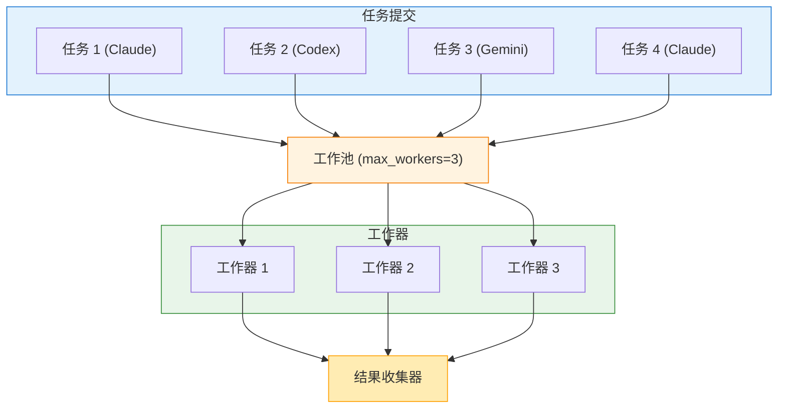

# 并行执行

并发运行多个 AI 任务以节省时间并提高生产力。本指南涵盖并行执行架构、任务文件格式、错误处理策略和实际模式。

## 概述

`parallel` 命令在一个或多个后端上同时执行多个任务。与顺序执行不同，并行任务并发运行，总执行时间等于最慢的任务，而不是所有任务的总和。

**主要优势：**

- **节省时间：** 同时运行独立任务
- **多视角分析：** 一次从不同的 AI 模型获取洞察
- **批处理：** 高效处理多个文件或组件
- **资源优化：** 在速率限制内最大化吞吐量

## 并行执行架构

### 工作原理



**执行流程：**

1. **任务解析：** 解析并验证 JSON 任务文件
2. **工作池：** 任务被分发到工作器（最多 `max_workers` 个）
3. **并发执行：** 每个工作器运行其分配的任务
4. **结果收集：** 任务完成时收集结果
5. **聚合：** 格式化并显示最终输出

### 并发模型

clinvk 使用工作池模式进行并行执行：

- **工作池大小：** 由 `--max-parallel` 或 `max_workers` 配置控制
- **任务队列：** 任务在队列中等待，直到有工作器可用
- **独立执行：** 每个任务在其自己的后端进程中独立运行
- **结果排序：** 结果在输出中保持任务索引顺序

## JSON 任务文件格式

### 基本结构

```json
{
  "tasks": [
    {
      "backend": "claude",
      "prompt": "审查 auth 模块"
    },
    {
      "backend": "codex",
      "prompt": "为 API 添加日志"
    },
    {
      "backend": "gemini",
      "prompt": "为 utils 生成测试"
    }
  ]
}
```

### 完整任务规范

```json
{
  "tasks": [
    {
      "backend": "claude",
      "prompt": "审查代码",
      "model": "claude-opus-4-5-20251101",
      "workdir": "/path/to/project",
      "approval_mode": "auto",
      "sandbox_mode": "workspace",
      "output_format": "json",
      "max_tokens": 4096,
      "max_turns": 10,
      "system_prompt": "你是一个代码审查员。"
    }
  ]
}
```

### 任务字段参考

| 字段 | 类型 | 必需 | 描述 |
|------|------|------|------|
| `backend` | string | 是 | 使用的后端 (`claude`, `codex`, `gemini`) |
| `prompt` | string | 是 | 要执行的提示 |
| `model` | string | 否 | 模型覆盖 |
| `workdir` | string | 否 | 任务的工作目录 |
| `approval_mode` | string | 否 | `default`, `auto`, `none`, `always` |
| `sandbox_mode` | string | 否 | `default`, `read-only`, `workspace`, `full` |
| `output_format` | string | 否 | 可填写但 CLI parallel 会忽略（预留） |
| `max_tokens` | int | 否 | 最大响应 token 数 |
| `max_turns` | int | 否 | 最大代理轮次 |
| `system_prompt` | string | 否 | 自定义系统提示 |

### 顶级选项

指定应用于所有任务的选项：

```json
{
  "tasks": [...],
  "max_parallel": 3,
  "fail_fast": true
}
```

| 字段 | 类型 | 默认值 | 描述 |
|------|------|--------|------|
| `max_parallel` | int | 3 | 最大并发任务数 |
| `fail_fast` | bool | false | 第一个失败时停止 |

**优先级：** CLI 参数覆盖文件级设置，文件级设置覆盖配置默认值。

## 运行任务

### 从文件

```bash
clinvk parallel --file tasks.json
```

### 从标准输入

管道传递任务定义以进行动态生成：

```bash
cat tasks.json | clinvk parallel

# 或动态生成
./generate-tasks.py | clinvk parallel
```

### 执行选项

#### 限制并行工作器

控制并发以管理资源使用：

```bash
# 最多同时运行 2 个任务
clinvk parallel --file tasks.json --max-parallel 2
```

**何时限制工作器：**

- **速率限制：** 保持在后端 API 限制内
- **资源约束：** CPU/内存有限
- **网络带宽：** 避免压垮连接
- **成本控制：** 限制并发 API 调用

#### 快速失败模式

在第一个失败时停止所有任务：

```bash
clinvk parallel --file tasks.json --fail-fast
```

**快速失败的使用场景：**

- 任务有依赖关系（后面的任务需要前面的成功）
- 验证任务，任何失败都会使批次无效
- 部分成功不可接受的 CI/CD 流水线

**权衡：**

- **优点：** 更快的失败检测，节省资源
- **缺点：** 可能错过多个问题，反馈不够完整

#### 错误继续（默认）

无论单个任务是否失败，都运行所有任务：

```bash
clinvk parallel --file tasks.json
# 或显式
clinvk parallel --file tasks.json --max-parallel 3
```

**错误继续的使用场景：**

- 独立任务（无依赖）
- 获取所有项目的完整反馈
- 部分成功可接受的批处理

## 输出格式

### 文本输出（默认）

显示任务完成时的进度和结果：

```text
Running 3 tasks (max 3 parallel)...

[1] auth 模块看起来不错...
[2] 添加了日志语句...
[3] 生成了 5 个测试用例...

Results
============================================================

BACKEND      STATUS   DURATION   TASK

------------------------------------------------------------

1    claude       OK       2.50s      审查 auth 模块
2    codex        OK       3.20s      为 API 添加日志
3    gemini       OK       2.80s      为 utils 生成测试
------------------------------------------------------------

Total: 3 tasks, 3 completed, 0 failed (3.20s)
```

### JSON 输出

用于程序化处理的结构化输出：

```bash
clinvk parallel --file tasks.json --json
```

```json
{
  "total_tasks": 3,
  "completed": 3,
  "failed": 0,
  "total_duration_seconds": 3.2,
  "results": [
    {
      "index": 0,
      "backend": "claude",
      "output": "auth 模块看起来不错...",
      "duration_seconds": 2.5,
      "exit_code": 0
    },
    {
      "index": 1,
      "backend": "codex",
      "output": "添加了日志语句...",
      "duration_seconds": 3.2,
      "exit_code": 0
    },
    {
      "index": 2,
      "backend": "gemini",
      "output": "生成了 5 个测试用例...",
      "duration_seconds": 2.8,
      "exit_code": 0
    }
  ]
}
```

### 静默模式

抑制任务输出，只显示摘要：

```bash
clinvk parallel --file tasks.json --quiet
```

**输出：**

```text
Total: 3 tasks, 3 completed, 0 failed (3.20s)
```

**适用于：** CI/CD 流水线、cron 任务、当只需要状态时

## 结果聚合模式

### 模式 1：收集所有结果

一起处理所有输出：

```bash
clinvk parallel --file tasks.json --json | jq '.results[].output'
```

### 模式 2：按状态过滤

只处理成功的结果：

```bash
clinvk parallel --file tasks.json --json | \
  jq '.results[] | select(.exit_code == 0) | .output'
```

### 模式 3：错误处理

检查失败并作出反应：

```bash
#!/bin/bash

result=$(clinvk parallel --file tasks.json --json)
failed=$(echo "$result" | jq '.failed')

if [ "$failed" -gt 0 ]; then
  echo "警告: $failed 个任务失败"
  echo "$result" | jq '.results[] | select(.exit_code != 0)'
  exit 1
fi
```

## 真实示例

### 安全审计流水线

跨多个后端运行全面的安全检查：

```json
{
  "tasks": [
    {
      "backend": "claude",
      "prompt": "审查此代码库的安全漏洞，重点关注注入攻击和认证问题",
      "approval_mode": "auto",
      "sandbox_mode": "read-only"
    },
    {
      "backend": "gemini",
      "prompt": "分析此代码的常见安全反模式和 OWASP Top 10 问题",
      "approval_mode": "auto",
      "sandbox_mode": "read-only"
    },
    {
      "backend": "codex",
      "prompt": "检查代码库中的硬编码密钥、API 密钥和凭证",
      "approval_mode": "auto",
      "sandbox_mode": "read-only"
    }
  ],
  "max_parallel": 3
}
```

```bash
clinvk parallel --file security-audit.json --json > security-report.json
```

### 多视角代码审查

获取对代码更改的多样化洞察：

```json
{
  "tasks": [
    {
      "backend": "claude",
      "prompt": "审查此 PR 的架构问题和设计模式"
    },
    {
      "backend": "gemini",
      "prompt": "审查此 PR 的安全漏洞"
    },
    {
      "backend": "codex",
      "prompt": "审查此 PR 的性能问题"
    }
  ]
}
```

### 批量测试生成

为多个模块生成测试：

```json
{
  "tasks": [
    {"backend": "codex", "prompt": "为 auth.go 生成单元测试"},
    {"backend": "codex", "prompt": "为 user.go 生成单元测试"},
    {"backend": "codex", "prompt": "为 api.go 生成单元测试"}
  ],
  "max_parallel": 3
}
```

### 多项目任务

更新多个项目的依赖：

```json
{
  "tasks": [
    {
      "backend": "claude",
      "prompt": "更新依赖并检查破坏性变更",
      "workdir": "/projects/frontend"
    },
    {
      "backend": "claude",
      "prompt": "更新依赖并检查破坏性变更",
      "workdir": "/projects/backend"
    },
    {
      "backend": "claude",
      "prompt": "更新依赖并检查破坏性变更",
      "workdir": "/projects/worker"
    }
  ]
}
```

## 与链式执行结合

在链步骤中使用并行处理复杂工作流：

```json
{
  "steps": [
    {
      "name": "analyze",
      "backend": "claude",
      "prompt": "分析代码库结构"
    },
    {
      "name": "generate-tests",
      "backend": "claude",
      "prompt": "基于以下内容创建包含所有模块测试生成任务的 tasks.json 文件：{{previous}}"
    }
  ]
}
```

然后运行生成的任务：

```bash
clinvk chain --file analyze.json --json | \
  jq -r '.results[-1].output' > generated-tasks.json
clinvk parallel --file generated-tasks.json
```

## 资源限制和调优

### 工作池大小

| 场景 | 推荐 `max_workers` | 原因 |
|------|-------------------|------|
| 本地开发 | 2-3 | 平衡速度和资源使用 |
| CI/CD 流水线 | 3-5 | 更快的反馈，受控资源 |
| 高容量批处理 | 5-10 | 最大化吞吐量 |
| 速率受限 API | 1-2 | 保持在限制内 |

### 内存考虑

每个并行任务都会生成一个单独的后端进程：

```text
内存使用 ≈ 基础 + (任务数 × 后端内存)

示例：
- 基础 clinvk: 50MB
- Claude 进程: 200MB
- 3 个并行任务: 50 + (3 × 200) = 650MB
```

### 速率限制

后端可能有速率限制。策略：

1. **减少工作器：** 降低 `max_parallel` 以保持在限制内
2. **顺序模式：** 对于严格限制使用 `--max-parallel 1`
3. **退避：** 在脚本中实现重试逻辑
4. **混合后端：** 跨不同后端分配负载

## 配置

`~/.clinvk/config.yaml` 中的默认并行执行设置：

```yaml
parallel:
  # 最大并发任务数
  max_workers: 3

  # 第一个失败时停止
  fail_fast: false

  # 合并所有任务的输出
  aggregate_output: true
```

## 错误场景和解决方案

### 场景 1：部分失败

**问题：** 一些任务失败，而其他任务成功

**解决方案：**

```bash
# 尽管失败也继续（默认）
clinvk parallel --file tasks.json

# 然后处理结果
clinvk parallel --file tasks.json --json | \
  jq '.results[] | select(.exit_code != 0) | {index, backend, error}'
```

### 场景 2：速率限制

**问题：** 达到 API 速率限制

**解决方案：**

```bash
# 降低并发
clinvk parallel --file tasks.json --max-parallel 1

# 或使用顺序模式
clinvk parallel --file tasks.json --max-parallel 1
```

### 场景 3：资源耗尽

**问题：** 系统内存/CPU 不足

**解决方案：**

```bash
# 根据可用资源限制工作器
clinvk parallel --file tasks.json --max-parallel 2

# 分批处理
head -n 10 tasks.json > batch1.json
clinvk parallel --file batch1.json
```

### 场景 4：依赖失败

**问题：** 任务 B 依赖于任务 A 成功

**解决方案：**

```bash
# 使用快速失败模式
clinvk parallel --file tasks.json --fail-fast

# 或对依赖使用链式执行
clinvk chain --file dependent-tasks.json
```

## 最佳实践

!!! tip "从 2-3 个工作器开始"
    从保守的并发开始，根据系统容量和后端速率限制增加。

!!! tip "脚本使用 JSON"
    集成到脚本或 CI/CD 时，始终使用 `--json` 输出以便可靠解析。

!!! tip "分组相似任务"
    按后端组织任务以优化上下文切换和资源使用。

!!! tip "优雅处理失败"
    设计工作流以处理部分失败，特别是对于长时间运行的批处理作业。

!!! tip "监控资源使用"
    运行许多并行任务时监控内存和 CPU 使用，特别是使用大模型时。

## 与其他命令的对比

| 特性 | 并行 | 链式 | 对比 |
|------|------|------|------|
| 执行 | 并发 | 顺序 | 并发 |
| 数据流 | 独立 | 透传 | 独立 |
| 使用场景 | 批处理 | 多阶段工作流 | 多视角分析 |
| 失败处理 | 可配置 | 失败即停 | 继续处理剩余 |

## 下一步

- [链式执行](chains.md) - 带数据流的顺序管道
- [后端对比](compare.md) - 并排比较响应
- [会话管理](sessions.md) - 管理对话上下文
