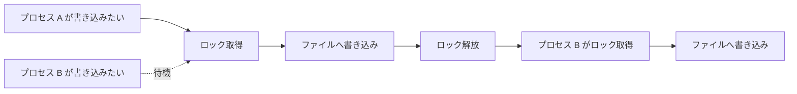
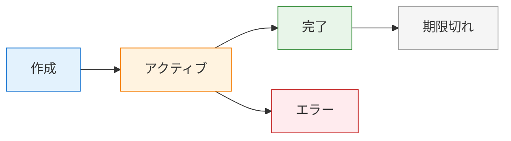

# セッション管理

clinvk はセッションを自動で追跡するため、会話を再開してコンテキストを維持できます。このガイドでは、セッション保存の内部、ライフサイクル管理、上級機能を扱います。

## 概要

**セッション** は AI バックエンドとの会話を表します。`--ephemeral` を使わない限り、clinvk でプロンプトを実行するたびにセッションが作成され、後で再利用できるよう保存されます。

**主なメリット:**

- **コンテキスト保持:** 繰り返し説明せずに会話を継続
- **履歴の追跡:** 過去のやり取りや結果を確認
- **マルチプロジェクト対応:** プロジェクト/ディレクトリごとにセッションを分離
- **監査ログ:** トークン使用量や実行履歴を追跡

## セッション保存の内部

### ファイル構成

セッションは `~/.clinvk/sessions/` に JSON ファイルとして保存されます。

```bash
~/.clinvk/
├── config.yaml
└── sessions/
    ├── abc123def.json
    ├── def456ghi.json
    └── ghi789jkl.json
```

### JSON 形式

各セッションファイルには次のような内容が入ります。

```json
{
  "id": "abc123def",
  "backend": "claude",
  "backend_session_id": "sess_abc123",
  "model": "claude-opus-4-5-20251101",
  "status": "active",
  "created_at": "2025-01-27T10:00:00Z",
  "last_used_at": "2025-01-27T11:30:00Z",
  "workdir": "/projects/myapp",
  "prompt": "fix the bug in auth.go",
  "token_usage": {
    "input": 1234,
    "output": 5678,
    "cached": 500,
    "total": 6912
  },
  "tags": ["bugfix", "auth"],
  "metadata": {
    "exit_code": 0,
    "duration_seconds": 2.5
  }
}
```

### フィールド説明

| フィールド | 説明 |
|-------|-------------|
| `id` | clinvk のセッション ID（短く、人が読みやすい） |
| `backend` | 使用した AI バックエンド |
| `backend_session_id` | バックエンド内部のセッション ID（再開に必要） |
| `model` | セッションで使用したモデル |
| `status` | `active`, `completed`, `error` |
| `created_at` | セッション作成時刻 |
| `last_used_at` | 最終アクティビティ時刻 |
| `workdir` | セッションの作業ディレクトリ |
| `prompt` | 初回プロンプト（非常に長い場合は切り詰め） |
| `token_usage` | トークン消費統計 |
| `tags` | ユーザー定義または自動付与のタグ |
| `metadata` | 追加の実行メタデータ |

## プロセス間ロック機構

### ロックが必要な理由

複数の clinvk プロセスが同時に動くと、同じセッションストアに同時アクセスする可能性があります。clinvk は破損を防ぐために、ファイルベースのロックを実装しています。



### ロックの挙動

- **排他ロック:** 書き込み操作は排他ロックを取得
- **共有ロック:** 読み取り操作は共有ロックを使用
- **タイムアウト:** デッドロックを避けるため 30 秒でタイムアウト
- **復旧:** 古いロックは自動でクリーンアップ

### ロックファイルの場所

```text
~/.clinvk/sessions/.lock
```

!!! note "実装の詳細"
    ロック機構は、Unix では POSIX の advisory file lock を、Windows では Windows のファイルロック API を使用します。

## セッションのライフサイクル

### 状態遷移



**状態:**

| 状態 | 説明 |
|-------|-------------|
| `created` | セッション作成直後の初期状態 |
| `active` | バックエンドのセッション ID を持ち、再開可能 |
| `completed` | 正常終了 |
| `error` | エラーで終了 |
| `expired` | 保持期間を超え、クリーンアップされた |

### ライフサイクルイベント

1. **作成:** プロンプト実行でセッション作成
2. **アクティベーション:** バックエンドがセッション ID を返す（再開可能になる）
3. **継続:** 新しいプロンプトが既存セッションに追加される
4. **完了:** 最終プロンプト後に完了としてマーク
5. **クリーンアップ:** 保持ポリシーに従って古いセッションを削除

## セッション一覧

### 基本の一覧表示

すべてのセッションを表示します。

```bash
clinvk sessions list
```

**出力例:**

```text
ID        BACKEND   STATUS     LAST USED       TOKENS       TITLE/PROMPT
abc123    claude    active     5 minutes ago   1234         fix the bug in auth.go
def456    codex     completed  2 hours ago     5678         implement user registration
ghi789    gemini    active     1 day ago       890          explain algorithm
```

### セッションのフィルタ

#### バックエンドで絞り込み

```bash
clinvk sessions list --backend claude
```

#### ステータスで絞り込み

```bash
clinvk sessions list --status active
```

#### 件数を制限

```bash
clinvk sessions list --limit 10
```

#### 条件を組み合わせる

```bash
clinvk sessions list --backend claude --status active --limit 5
```

### JSON 出力

プログラム処理向け:

```bash
clinvk sessions list --json
```

```json
[
  {
    "id": "abc123",
    "backend": "claude",
    "status": "active",
    "last_used": "2025-01-27T11:30:00Z",
    "tokens": 1234,
    "prompt": "fix the bug in auth.go"
  }
]
```

## セッションの再開

### 直前のセッションを再開する

最後の会話をすぐ継続する方法です。

```bash
clinvk resume --last
```

追記プロンプトを付けることもできます。

```bash
clinvk resume --last "add error handling"
```

### 対話ピッカー

最近のセッションから選択できます。

```bash
clinvk resume --interactive
```

`clinvk resume` を引数なしで実行すると、デフォルトで対話ピッカーが開きます。

### ID 指定で再開する

特定セッションを再開します。

```bash
clinvk resume abc123
clinvk resume abc123 "continue with tests"
```

### カレントディレクトリのセッションだけを対象にする

```bash
clinvk resume --here
```

### バックエンドで絞り込む

```bash
clinvk resume --backend claude
```

### 再開の要件

!!! important "バックエンドセッション ID が必要"
    再開可能にするには `backend_session_id` が必要です。`--ephemeral` で作成されたセッションは再開できません。

**再開可能かどうかの確認:**

```bash
clinvk sessions show abc123
```

出力内の `backend_session_id` を確認してください。

## クイック継続（--continue）

単純に続けるだけなら `--continue` フラグを使います。

```bash
clinvk "implement the feature"
clinvk -c "now add tests"
clinvk -c "update the documentation"
```

**仕組み:**

1. clinvk が直近の「再開可能」セッションを探す
2. そのセッションへ新しいプロンプトを追加
3. AI は会話全体のコンテキストを利用

**スコープ:**

- ディレクトリでのスコープはしません（ディレクトリ限定なら `resume --here`）
- 全ディレクトリ横断で最も新しいセッションを使用
- `backend_session_id` を持つセッションにのみ有効

## セッション詳細

### セッション情報を表示する

```bash
clinvk sessions show abc123
```

**出力例:**

```yaml
ID:                abc123
Backend:           claude
Model:             claude-opus-4-5-20251101
Status:            active
Created:           2025-01-27T10:00:00Z
Last Used:         2025-01-27T11:30:00Z (30 minutes ago)
Working Directory: /projects/myapp
Backend Session:   sess_abc123
Token Usage:
  Input:           1,234
  Output:          5,678
  Cached:          500
  Total:           6,912
Tags:              bugfix, auth
```

### セッション状態を確認する

```bash
# セッションが存在するか確認
clinvk sessions show abc123 > /dev/null 2>&1 && echo "Exists" || echo "Not found"

# 特定フィールドを取得
clinvk sessions show abc123 --json | jq '.status'
```

## セッションのフォーク

フォークは、既存セッションのコンテキストを引き継ぎつつ、別の会話ブランチとして新しいセッションを作成します。

```bash
# セッションからフォーク
clinvk sessions fork abc123

# 新しいプロンプト付きでフォーク
clinvk sessions fork abc123 "explore alternative approach"
```

**ユースケース:**

- 同じ起点から別アプローチを試す
- A/B テスト用のブランチを作る
- 元を残しつつ実験する

**フォークの挙動:**

- 新規セッションは別の ID を持つ
- 元のコンテキストをコピー
- 元セッションは変更されない
- 新しいセッションは独立して再開可能

## セッションメタデータとタグ

### タグを付ける

タグはセッションの整理と検索に役立ちます。

```bash
# 作成時に付与（設定から）
clinvk config set session.default_tags '["project-x", "feature-y"]'

# 既存セッションへ追加
clinvk sessions tag abc123 "urgent"
```

### デフォルトタグ

`~/.clinvk/config.yaml` で自動付与タグを設定できます。

```yaml
session:
  default_tags:
    - "clinvk"
    - "${USER}"
```

### タグで絞り込む

```bash
# 特定タグを含むセッション一覧
clinvk sessions list --tag "urgent"

# 複数タグ（AND 条件）
clinvk sessions list --tag "project-x" --tag "bugfix"
```

## 検索機能

### プロンプト内容で検索する

```bash
# 出力を grep で検索
clinvk sessions list | grep "auth"

# JSON 出力を jq でフィルタ
clinvk sessions list --json | jq '.[] | select(.prompt | contains("auth"))'
```

### 期間で検索する

```bash
# 直近 24 時間
clinvk sessions list --json | \
  jq '.[] | select(.last_used > (now - 86400 | todate))'

# 特定日
clinvk sessions list --json | \
  jq '.[] | select(.created_at | startswith("2025-01-27"))'
```

## クリーンアップ戦略

### 自動クリーンアップ

`~/.clinvk/config.yaml` で自動クリーンアップを設定します。

```yaml
session:
  # セッション保持日数（0 = 永久に保持）
  retention_days: 30
```

`retention_days` より古いセッションは、次のタイミングで自動削除されます。

- 新しいセッション作成時（定期チェック）
- `clean` コマンドを明示的に実行したとき

### 手動クリーンアップ

#### 古いセッションを削除する

指定期間より古いセッションを削除します。

```bash
# 30 日より古いセッションを削除
clinvk sessions clean --older-than 30d

# 7 日より古いセッションを削除
clinvk sessions clean --older-than 7d

# 設定の保持期間を使用
clinvk sessions clean
```

#### 特定セッションを削除する

```bash
clinvk sessions delete abc123
```

#### まとめて削除する

```bash
# 完了したセッションをすべて削除
clinvk sessions list --status completed --json | \
  jq -r '.[].id' | \
  xargs -I {} clinvk sessions delete {}

# バックエンドごとに削除
clinvk sessions list --backend codex --json | \
  jq -r '.[].id' | \
  xargs -I {} clinvk sessions delete {}
```

### クリーンアップのベストプラクティス

!!! tip "適切な保持期間にする"
    多くの用途では 30 日がよいデフォルトです。コンプライアンス要件やディスク容量に合わせて調整してください。

!!! tip "バックアップ前に掃除する"
    ホームディレクトリをバックアップする前に `clinvk sessions clean` を実行すると、バックアップ容量を減らせます。

!!! tip "重要なセッションはアーカイブする"
    クリーンアップ前に重要なセッションをエクスポートできます。
    ```bash
    clinvk sessions show abc123 --json > important-session.json
    ```

## 設定

### セッション設定

`~/.clinvk/config.yaml` で設定します。

```yaml
session:
  # セッション保持日数（0 = 永久に保持）
  retention_days: 30

  # セッションメタデータにトークン使用量を保存
  store_token_usage: true

  # 新規セッションへ自動付与するタグ
  default_tags: []
```

### 再開の挙動

既定では `clinvk [prompt]` は新しいセッションを開始します。`-c`/`--continue` で再開できます。

```bash
# 新しいセッション（デフォルト）
clinvk "fix the bug in auth.go"

# 最後のセッションを明示的に再開
clinvk -c "continue working on it"

# resume コマンドでも可
clinvk resume --last "continue working"
```

## トークン使用量の追跡

### トークン追跡を有効化する

```yaml
session:
  store_token_usage: true
```

### トークン使用量を確認する

```bash
# セッション単位
clinvk sessions show abc123

# 合計
clinvk sessions list --json | \
  jq '[.[].token_usage.total] | add'

# バックエンド別
clinvk sessions list --json | \
  jq 'group_by(.backend) | map({backend: .[0].backend, total: [.[].token_usage.total] | add})'
```

### トークン予算管理

コストを監視/制御します。

```bash
#!/bin/bash

# 月間使用量を確認
monthly_tokens=$(clinvk sessions list --json | \
  jq '[.[] | select(.created_at | startswith("'$(date +%Y-%m)'") ) | .token_usage.total] | add')

if [ "$monthly_tokens" -gt 1000000 ]; then
  echo "Warning: Token usage high ($monthly_tokens)"
fi
```

## ステートレスモード

セッションを作成したくない場合は、ephemeral モードを使います。

```bash
clinvk --ephemeral "quick question that doesn't need history"
```

**ephemeral モードが向く場面:**

| シナリオ | 理由 |
|----------|--------|
| ちょっとした単発質問 | 履歴が不要 |
| CI/CD スクリプト | セッションが溜まらない |
| テスト/デバッグ | 毎回クリーンな状態 |
| 公開/共有環境 | プライバシー、保持しない |
| 大量自動化 | 保存のオーバーヘッド削減 |

## トラブルシューティング

### セッションが再開できない

**問題:** `clinvk resume --last` が失敗する

**対処:**

1. バックエンド ID があるか確認:
   ```bash
   clinvk sessions show <id> | grep backend_session_id
   ```

2. ステータスを確認:
   ```bash
   clinvk sessions list --status active
   ```

3. ロックファイルを確認:
   ```bash
   ls -la ~/.clinvk/sessions/.lock
   ```

### セッションストアが破損している

**問題:** セッション一覧にエラーが出る

**対処:**

1. JSON の妥当性を確認:
   ```bash
   for f in ~/.clinvk/sessions/*.json; do
     jq empty "$f" 2>/dev/null || echo "Invalid: $f"
   done
   ```

2. 破損ファイルを削除:
   ```bash
   rm ~/.clinvk/sessions/corrupted-file.json
   ```

3. セッションストアをリセット（バックアップ推奨）:
   ```bash
   mv ~/.clinvk/sessions ~/.clinvk/sessions.backup
   mkdir ~/.clinvk/sessions
   ```

### ディスク使用量が多い

**問題:** セッションストアが容量を消費している

**対処:**

1. 保持期間を短くする:
   ```yaml
   session:
     retention_days: 7
   ```

2. 古いセッションを削除:
   ```bash
   clinvk sessions clean
   ```

3. 大きいセッションを探す:
   ```bash
   ls -lhS ~/.clinvk/sessions/*.json | head -10
   ```

## ベストプラクティス

!!! tip "ディレクトリで絞り込む"
    複数プロジェクトで作業する場合は、`clinvk resume --here` でカレントディレクトリのセッションだけを表示できます。

!!! tip "定期的にクリーンアップする"
    `clinvk sessions clean` を cron やワークフローに組み込み、定期的に実行してください。

!!! tip "トークン追跡を有効化する"
    `store_token_usage: true` を有効化すると、使用量を把握しやすくなります。

!!! tip "重要なセッションにタグを付ける"
    タグで重要セッションを簡単に見つけられます。

!!! tip "自動化では ephemeral を使う"
    自動化スクリプトでは `--ephemeral` を使い、セッションが溜まらないようにしてください。

## 次のステップ

- [基本的な使い方](basic-usage.md) - `--continue` フラグ
- [設定](../reference/configuration.md) - セッション関連の設定
- [並列実行](parallel.md) - 複数タスクの同時実行
