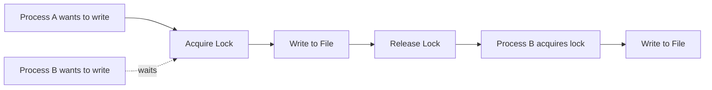
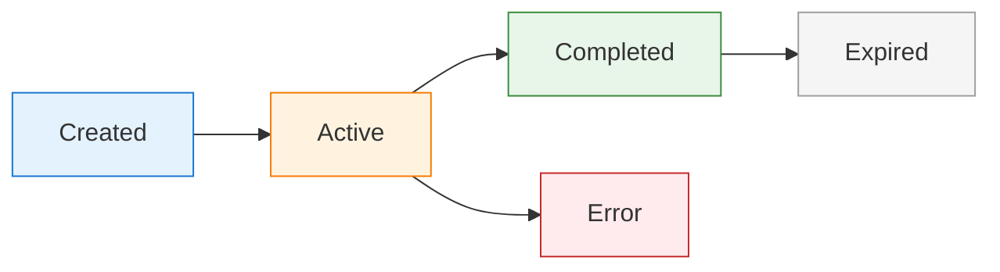

# Session Management

clinvk automatically tracks sessions so you can resume conversations and maintain context across invocations. This guide covers session storage internals, lifecycle management, and advanced features.

## Overview

A **session** represents a conversation with an AI backend. Each time you run a prompt with clinvk (unless using `--ephemeral` mode), a session is created and stored for later retrieval.

**Key Benefits:**

- **Context Preservation:** Continue conversations without repeating context
- **History Tracking:** Review past interactions and their outcomes
- **Multi-Project Support:** Separate sessions per project/directory
- **Audit Trail:** Track token usage and execution history

## Session Storage Internals

### File Structure

Sessions are stored as JSON files in `~/.clinvk/sessions/`:

```bash
~/.clinvk/
├── config.yaml
└── sessions/
    ├── abc123def.json
    ├── def456ghi.json
    └── ghi789jkl.json
```

### JSON Format

Each session file contains:

```json
{
  "id": "abc123def",
  "backend": "claude",
  "backend_session_id": "sess_abc123",
  "model": "claude-opus-4-5-20251101",
  "status": "active",
  "created_at": "2025-01-27T10:00:00Z",
  "last_used_at": "2025-01-27T11:30:00Z",
  "workdir": "/projects/myapp",
  "prompt": "fix the bug in auth.go",
  "token_usage": {
    "input": 1234,
    "output": 5678,
    "cached": 500,
    "total": 6912
  },
  "tags": ["bugfix", "auth"],
  "metadata": {
    "exit_code": 0,
    "duration_seconds": 2.5
  }
}
```

### Field Descriptions

| Field | Description |
|-------|-------------|
| `id` | clinvk session ID (short, human-readable) |
| `backend` | Which AI backend was used |
| `backend_session_id` | Backend's internal session ID (required for resume) |
| `model` | Model used for the session |
| `status` | `active`, `completed`, `error` |
| `created_at` | Session creation timestamp |
| `last_used_at` | Last activity timestamp |
| `workdir` | Working directory for the session |
| `prompt` | Initial prompt (truncated if very long) |
| `token_usage` | Token consumption statistics |
| `tags` | User-defined or auto-assigned tags |
| `metadata` | Additional execution metadata |

## Cross-Process Locking Mechanism

### Why Locking is Needed

When multiple clinvk processes run simultaneously, they might try to access the same session store. clinvk implements file-based locking to prevent corruption:



### Lock Behavior

- **Exclusive Locks:** Write operations acquire exclusive locks
- **Shared Locks:** Read operations use shared locks
- **Timeout:** Locks timeout after 30 seconds to prevent deadlocks
- **Recovery:** Stale locks are automatically cleaned up

### Lock File Location

```text
~/.clinvk/sessions/.lock
```

!!! note "Implementation Detail"
    The locking mechanism uses POSIX advisory file locks on Unix systems and Windows file locking APIs on Windows.

## Session Lifecycle

### State Transitions



**States:**

| State | Description |
|-------|-------------|
| `created` | Initial state when session is first created |
| `active` | Session has a backend session ID and can be resumed |
| `completed` | Session finished successfully |
| `error` | Session ended with an error |
| `expired` | Session exceeded retention period and was cleaned up |

### Lifecycle Events

1. **Creation:** Session created when prompt is executed
2. **Activation:** Backend provides session ID (enables resume)
3. **Continuation:** New prompts append to existing session
4. **Completion:** Session marked complete after final prompt
5. **Cleanup:** Old sessions removed based on retention policy

## Listing Sessions

### Basic Listing

View all your sessions:

```bash
clinvk sessions list
```

**Output:**

```text
ID        BACKEND   STATUS     LAST USED       TOKENS       TITLE/PROMPT
abc123    claude    active     5 minutes ago   1234         fix the bug in auth.go
def456    codex     completed  2 hours ago     5678         implement user registration
ghi789    gemini    active     1 day ago       890          explain algorithm
```

### Filtering Sessions

#### By Backend

```bash
clinvk sessions list --backend claude
```

#### By Status

```bash
clinvk sessions list --status active
```

#### Limit Results

```bash
clinvk sessions list --limit 10
```

#### Combined Filters

```bash
clinvk sessions list --backend claude --status active --limit 5
```

### JSON Output

For programmatic processing:

```bash
clinvk sessions list --json
```

```json
[
  {
    "id": "abc123",
    "backend": "claude",
    "status": "active",
    "last_used": "2025-01-27T11:30:00Z",
    "tokens": 1234,
    "prompt": "fix the bug in auth.go"
  }
]
```

## Resuming Sessions

### Resume Last Session

The quickest way to continue your last conversation:

```bash
clinvk resume --last
```

Or with a follow-up prompt:

```bash
clinvk resume --last "add error handling"
```

### Interactive Picker

Browse and select from recent sessions:

```bash
clinvk resume --interactive
```

If you run `clinvk resume` with no arguments, the interactive picker opens by default.

### Resume by ID

Resume a specific session:

```bash
clinvk resume abc123
clinvk resume abc123 "continue with tests"
```

### Resume from Current Directory

Only show sessions from the current working directory:

```bash
clinvk resume --here
```

### Filter by Backend

```bash
clinvk resume --backend claude
```

### Resume Requirements

!!! important "Backend Session ID Required"
    A session must have a `backend_session_id` to be resumable. Sessions created in `--ephemeral` mode cannot be resumed.

**Check if a session is resumable:**

```bash
clinvk sessions show abc123
```

Look for `backend_session_id` in the output.

## Quick Continue

For simple continuation, use the `--continue` flag:

```bash
clinvk "implement the feature"
clinvk -c "now add tests"
clinvk -c "update the documentation"
```

**How it works:**

1. clinvk finds the most recent resumable session
2. Appends the new prompt to that session
3. The AI has full context of the conversation

**Scope:**

- Not scoped to directory (use `resume --here` for directory-scoped resume)
- Finds the most recent session across all directories
- Only works with sessions that have `backend_session_id`

## Session Details

### View Session Information

```bash
clinvk sessions show abc123
```

**Output:**

```yaml
ID:                abc123
Backend:           claude
Model:             claude-opus-4-5-20251101
Status:            active
Created:           2025-01-27T10:00:00Z
Last Used:         2025-01-27T11:30:00Z (30 minutes ago)
Working Directory: /projects/myapp
Backend Session:   sess_abc123
Token Usage:
  Input:           1,234
  Output:          5,678
  Cached:          500
  Total:           6,912
Tags:              bugfix, auth
```

### Check Session Status

```bash
# Check if specific session exists
clinvk sessions show abc123 > /dev/null 2>&1 && echo "Exists" || echo "Not found"

# Get specific field
clinvk sessions show abc123 --json | jq '.status'
```

## Session Forking

Forking creates a new session based on an existing one, preserving the context but creating a separate conversation branch:

```bash
# Fork from a session
clinvk sessions fork abc123

# Fork with a new prompt
clinvk sessions fork abc123 "explore alternative approach"
```

**Use Cases:**

- Try different approaches from the same starting point
- Create branches for A/B testing
- Preserve original while experimenting

**Fork Behavior:**

- New session gets a new ID
- Copies context from original session
- Original session remains unchanged
- New session can be resumed independently

## Session Metadata and Tagging

### Adding Tags

Tags help organize and find sessions:

```bash
# Add tags when creating (via config)
clinvk config set session.default_tags '["project-x", "feature-y"]'

# Or add to existing session
clinvk sessions tag abc123 "urgent"
```

### Default Tags

Configure automatic tags in `~/.clinvk/config.yaml`:

```yaml
session:
  default_tags:
    - "clinvk"
    - "${USER}"
```

### Tag-Based Filtering

```bash
# List sessions with specific tag
clinvk sessions list --tag "urgent"

# Multiple tags (AND logic)
clinvk sessions list --tag "project-x" --tag "bugfix"
```

## Search Functionality

### Search by Prompt Content

```bash
# Search in prompts
clinvk sessions list | grep "auth"

# Using JSON output with jq
clinvk sessions list --json | jq '.[] | select(.prompt | contains("auth"))'
```

### Search by Date Range

```bash
# Sessions from last 24 hours
clinvk sessions list --json | \
  jq '.[] | select(.last_used > (now - 86400 | todate))'

# Sessions from specific date
clinvk sessions list --json | \
  jq '.[] | select(.created_at | startswith("2025-01-27"))'
```

## Cleanup Strategies

### Automatic Cleanup

Configure automatic cleanup in `~/.clinvk/config.yaml`:

```yaml
session:
  # Days to keep sessions (0 = keep forever)
  retention_days: 30
```

Sessions older than `retention_days` are automatically removed during:
- New session creation (periodic check)
- Explicit `clean` command execution

### Manual Cleanup

#### Clean Old Sessions

Remove sessions older than a specified period:

```bash
# Delete sessions older than 30 days
clinvk sessions clean --older-than 30d

# Delete sessions older than 7 days
clinvk sessions clean --older-than 7d

# Use config default retention period
clinvk sessions clean
```

#### Delete Specific Session

```bash
clinvk sessions delete abc123
```

#### Bulk Deletion

```bash
# Delete all completed sessions
clinvk sessions list --status completed --json | \
  jq -r '.[].id' | \
  xargs -I {} clinvk sessions delete {}

# Delete sessions by backend
clinvk sessions list --backend codex --json | \
  jq -r '.[].id' | \
  xargs -I {} clinvk sessions delete {}
```

### Cleanup Best Practices

!!! tip "Set Reasonable Retention"
    30 days is a good default for most use cases. Adjust based on your compliance needs and disk space.

!!! tip "Clean Before Backups"
    Run `clinvk sessions clean` before backing up your home directory to reduce backup size.

!!! tip "Archive Important Sessions"
    Export important sessions before cleanup:
    ```bash
    clinvk sessions show abc123 --json > important-session.json
    ```

## Configuration

### Session Settings

Configure in `~/.clinvk/config.yaml`:

```yaml
session:
  # Automatically resume the most recent resumable session
  # when running `clinvk [prompt]` without --ephemeral
  auto_resume: true

  # Days to keep sessions (0 = keep forever)
  retention_days: 30

  # Store token usage in session metadata
  store_token_usage: true

  # Tags automatically added to new sessions
  default_tags: []
```

### Auto-Resume Behavior

When `auto_resume: true`:

```bash
# This will resume the last session if it exists
clinvk "continue working on the feature"

# Same as:
clinvk resume --last "continue working on the feature"
```

**Priority:**

1. Explicit `--continue` or `resume` command
2. `auto_resume` configuration
3. Create new session (default)

## Token Usage Tracking

### Enabling Token Tracking

```yaml
session:
  store_token_usage: true
```

### Viewing Token Usage

```bash
# Per session
clinvk sessions show abc123

# Aggregate usage
clinvk sessions list --json | \
  jq '[.[].token_usage.total] | add'

# Usage by backend
clinvk sessions list --json | \
  jq 'group_by(.backend) | map({backend: .[0].backend, total: [.[].token_usage.total] | add})'
```

### Token Budgeting

Monitor and control costs:

```bash
#!/bin/bash

# Check monthly usage
monthly_tokens=$(clinvk sessions list --json | \
  jq '[.[] | select(.created_at | startswith("'$(date +%Y-%m)'") ) | .token_usage.total] | add')

if [ "$monthly_tokens" -gt 1000000 ]; then
  echo "Warning: Token usage high ($monthly_tokens)"
fi
```

## Stateless Mode

If you don't want to create a session, use ephemeral mode:

```bash
clinvk --ephemeral "quick question that doesn't need history"
```

**When to Use Ephemeral Mode:**

| Scenario | Reason |
|----------|--------|
| Quick one-off queries | No need for history |
| CI/CD scripts | Avoid session accumulation |
| Testing/debugging | Clean state every time |
| Public/shared systems | Privacy, no data retention |
| High-volume automation | Reduce storage overhead |

## Troubleshooting

### Session Not Resuming

**Problem:** `clinvk resume --last` fails

**Solutions:**

1. Check if session has backend ID:
   ```bash
   clinvk sessions show <id> | grep backend_session_id
   ```

2. Verify session status:
   ```bash
   clinvk sessions list --status active
   ```

3. Check for lock files:
   ```bash
   ls -la ~/.clinvk/sessions/.lock
   ```

### Session Store Corruption

**Problem:** Sessions list shows errors

**Solutions:**

1. Check JSON validity:
   ```bash
   for f in ~/.clinvk/sessions/*.json; do
     jq empty "$f" 2>/dev/null || echo "Invalid: $f"
   done
   ```

2. Remove corrupted files:
   ```bash
   rm ~/.clinvk/sessions/corrupted-file.json
   ```

3. Reset session store (backup first!):
   ```bash
   mv ~/.clinvk/sessions ~/.clinvk/sessions.backup
   mkdir ~/.clinvk/sessions
   ```

### High Disk Usage

**Problem:** Session store consuming too much space

**Solutions:**

1. Reduce retention period:
   ```yaml
   session:
     retention_days: 7
   ```

2. Clean old sessions:
   ```bash
   clinvk sessions clean
   ```

3. Check for large sessions:
   ```bash
   ls -lhS ~/.clinvk/sessions/*.json | head -10
   ```

## Best Practices

!!! tip "Use Directory Filtering"
    When working on multiple projects, use `clinvk resume --here` to only see sessions from the current directory.

!!! tip "Clean Regularly"
    Set up automatic cleanup with `clinvk sessions clean` in a cron job or as part of your workflow.

!!! tip "Enable Token Tracking"
    Enable `store_token_usage: true` in config to track your usage across sessions.

!!! tip "Tag Important Sessions"
    Use tags to mark important sessions for easy retrieval later.

!!! tip "Use Ephemeral for Scripts"
    Always use `--ephemeral` in automation scripts to avoid session accumulation.

## Next Steps

- [Basic Usage](basic-usage.md) - Learn about the `--continue` flag
- [Configuration](../reference/configuration.md) - Configure session settings
- [Parallel Execution](parallel.md) - Run multiple tasks concurrently
