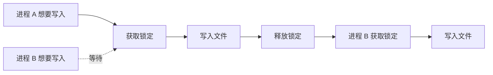
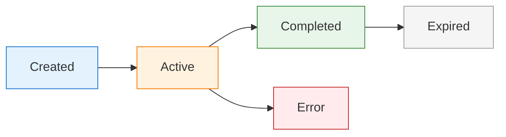

# 会话管理

clinvk 自动跟踪会话，以便您可以恢复对话并在调用之间保持上下文。本指南涵盖会话存储内部结构、生命周期管理和高级功能。

## 概述

**会话**代表与 AI 后端的对话。每次使用 clinvk 运行提示时（除非使用 `--ephemeral` 模式），都会创建一个会话并存储以供以后检索。

**主要优势：**

- **上下文保留：** 无需重复上下文即可继续对话
- **历史跟踪：** 查看过去的交互及其结果
- **多项目支持：** 每个项目/目录的独立会话
- **审计追踪：** 跟踪 token 使用和执行历史

## 会话存储内部结构

### 文件结构

会话以 JSON 文件形式存储在 `~/.clinvk/sessions/` 中：

```bash
~/.clinvk/
├── config.yaml
└── sessions/
    ├── abc123def.json
    ├── def456ghi.json
    └── ghi789jkl.json
```

### JSON 格式

每个会话文件包含：

```json
{
  "id": "abc123def",
  "backend": "claude",
  "backend_session_id": "sess_abc123",
  "model": "claude-opus-4-5-20251101",
  "status": "active",
  "created_at": "2025-01-27T10:00:00Z",
  "last_used_at": "2025-01-27T11:30:00Z",
  "workdir": "/projects/myapp",
  "prompt": "fix the bug in auth.go",
  "token_usage": {
    "input": 1234,
    "output": 5678,
    "cached": 500,
    "total": 6912
  },
  "tags": ["bugfix", "auth"],
  "metadata": {
    "exit_code": 0,
    "duration_seconds": 2.5
  }
}
```

### 字段描述

| 字段 | 描述 |
|------|------|
| `id` | clinvk 会话 ID（简短、人类可读） |
| `backend` | 使用的 AI 后端 |
| `backend_session_id` | 后端的内部会话 ID（恢复必需） |
| `model` | 会话使用的模型 |
| `status` | `active`, `completed`, `error` |
| `created_at` | 会话创建时间戳 |
| `last_used_at` | 最后活动时间戳 |
| `workdir` | 会话的工作目录 |
| `prompt` | 初始提示（过长则截断） |
| `token_usage` | Token 消耗统计 |
| `tags` | 用户定义或自动分配的标签 |
| `metadata` | 额外的执行元数据 |

## 跨进程锁定机制

### 为什么需要锁定

当多个 clinvk 进程同时运行时，它们可能尝试访问同一会话存储。clinvk 实现基于文件的锁定以防止损坏：



### 锁定行为

- **独占锁定：** 写操作获取独占锁定
- **共享锁定：** 读操作使用共享锁定
- **超时：** 锁定在 30 秒后超时以防止死锁
- **恢复：** 自动清理过期的锁定

### 锁定文件位置

```text
~/.clinvk/sessions/.lock
```

!!! note "实现细节"
    锁定机制在 Unix 系统上使用 POSIX 建议文件锁，在 Windows 上使用 Windows 文件锁定 API。

## 会话生命周期

### 状态转换



**状态：**

| 状态 | 描述 |
|------|------|
| `created` | 会话首次创建时的初始状态 |
| `active` | 会话具有后端会话 ID 且可以恢复 |
| `completed` | 会话成功完成 |
| `error` | 会话以错误结束 |
| `expired` | 会话超过保留期并被清理 |

### 生命周期事件

1. **创建：** 执行提示时创建会话
2. **激活：** 后端提供会话 ID（启用恢复）
3. **继续：** 新提示附加到现有会话
4. **完成：** 最终提示后会话标记为完成
5. **清理：** 根据保留策略删除旧会话

## 列出会话

### 基本列表

查看所有会话：

```bash
clinvk sessions list
```

**输出：**

```text
ID        BACKEND   STATUS     LAST USED       TOKENS       TITLE/PROMPT
abc123    claude    active     5 minutes ago   1234         fix the bug in auth.go
def456    codex     completed  2 hours ago     5678         implement user registration
ghi789    gemini    active     1 day ago       890          explain algorithm
```

### 筛选会话

#### 按后端

```bash
clinvk sessions list --backend claude
```

#### 按状态

```bash
clinvk sessions list --status active
```

#### 限制结果

```bash
clinvk sessions list --limit 10
```

#### 组合筛选

```bash
clinvk sessions list --backend claude --status active --limit 5
```

### JSON 输出

用于程序化处理：

```bash
clinvk sessions list --json
```

```json
[
  {
    "id": "abc123",
    "backend": "claude",
    "status": "active",
    "last_used": "2025-01-27T11:30:00Z",
    "tokens": 1234,
    "prompt": "fix the bug in auth.go"
  }
]
```

## 恢复会话

### 恢复上一个会话

继续上一次对话的最快方式：

```bash
clinvk resume --last
```

或带上后续提示：

```bash
clinvk resume --last "添加错误处理"
```

### 交互式选择器

浏览并选择最近的会话：

```bash
clinvk resume --interactive
```

如果不带参数执行 `clinvk resume`，也会默认进入交互选择。

### 按 ID 恢复

恢复特定会话：

```bash
clinvk resume abc123
clinvk resume abc123 "继续测试"
```

### 从当前目录恢复

只显示当前工作目录的会话：

```bash
clinvk resume --here
```

### 按后端筛选

```bash
clinvk resume --backend claude
```

### 恢复要求

!!! important "需要后端会话 ID"
    会话必须具有 `backend_session_id` 才能恢复。`--ephemeral` 模式创建的会话无法恢复。

**检查会话是否可恢复：**

```bash
clinvk sessions show abc123
```

在输出中查找 `backend_session_id`。

## 快速继续

对于简单的继续，使用 `--continue` 参数：

```bash
clinvk "实现功能"
clinvk -c "现在添加测试"
clinvk -c "更新文档"
```

**工作原理：**

1. clinvk 查找最近的可恢复会话
2. 将新提示附加到该会话
3. AI 拥有对话的完整上下文

**范围：**

- 与目录无关（使用 `resume --here` 按目录筛选恢复）
- 查找所有目录中最近的会话
- 只对具有 `backend_session_id` 的会话有效

## 会话详情

### 查看会话信息

```bash
clinvk sessions show abc123
```

**输出：**

```yaml
ID:                abc123
Backend:           claude
Model:             claude-opus-4-5-20251101
Status:            active
Created:           2025-01-27T10:00:00Z
Last Used:         2025-01-27T11:30:00Z (30 minutes ago)
Working Directory: /projects/myapp
Backend Session:   sess_abc123
Token Usage:
  Input:           1,234
  Output:          5,678
  Cached:          500
  Total:           6,912
Tags:              bugfix, auth
```

### 检查会话状态

```bash
# 检查特定会话是否存在
clinvk sessions show <id> > /dev/null 2>&1 && echo "Exists" || echo "Not found"

# 获取特定字段
clinvk sessions show abc123 --json | jq '.status'
```

## 会话 Fork

Fork 基于现有会话创建新会话，保留上下文但创建单独的对话分支：

```bash
# 从会话 fork
clinvk sessions fork abc123

# Fork 并带上新提示
clinvk sessions fork abc123 "探索替代方案"
```

**使用场景：**

- 从同一起点尝试不同方法
- 为 A/B 测试创建分支
- 在实验时保留原始会话

**Fork 行为：**

- 新会话获得新 ID
- 从原始会话复制上下文
- 原始会话保持不变
- 新会话可以独立恢复

## 会话元数据和标签

### 添加标签

标签帮助组织和查找会话：

```bash
# 创建时添加标签（通过配置）
clinvk config set session.default_tags '["project-x", "feature-y"]'

# 或添加到现有会话
clinvk sessions tag abc123 "urgent"
```

### 默认标签

在 `~/.clinvk/config.yaml` 中配置自动标签：

```yaml
session:
  default_tags:
    - "clinvk"
    - "${USER}"
```

### 基于标签的筛选

```bash
# 列出带特定标签的会话
clinvk sessions list --tag "urgent"

# 多个标签（AND 逻辑）
clinvk sessions list --tag "project-x" --tag "bugfix"
```

## 搜索功能

### 按提示内容搜索

```bash
# 在提示中搜索
clinvk sessions list | grep "auth"

# 使用 JSON 输出和 jq
clinvk sessions list --json | jq '.[] | select(.prompt | contains("auth"))'
```

### 按日期范围搜索

```bash
# 最近 24 小时的会话
clinvk sessions list --json | \
  jq '.[] | select(.last_used > (now - 86400 | todate))'

# 特定日期的会话
clinvk sessions list --json | \
  jq '.[] | select(.created_at | startswith("2025-01-27"))'
```

## 清理策略

### 自动清理

在 `~/.clinvk/config.yaml` 中配置自动清理：

```yaml
session:
  # 保留会话的天数（0 = 永久保留）
  retention_days: 30
```

超过 `retention_days` 的会话会在以下情况下自动删除：
- 创建新会话时（定期检查）
- 执行显式 `clean` 命令

### 手动清理

#### 清理旧会话

删除指定时间之前的会话：

```bash
# 删除 30 天前的会话
clinvk sessions clean --older-than 30d

# 删除 7 天前的会话
clinvk sessions clean --older-than 7d

# 使用配置的默认保留期限
clinvk sessions clean
```

#### 删除特定会话

```bash
clinvk sessions delete abc123
```

#### 批量删除

```bash
# 删除所有已完成的会话
clinvk sessions list --status completed --json | \
  jq -r '.[].id' | \
  xargs -I {} clinvk sessions delete {}

# 按后端删除会话
clinvk sessions list --backend codex --json | \
  jq -r '.[].id' | \
  xargs -I {} clinvk sessions delete {}
```

### 清理最佳实践

!!! tip "设置合理的保留期"
    30 天是大多数用例的良好默认值。根据合规需求和磁盘空间进行调整。

!!! tip "备份前清理"
    在备份主目录之前运行 `clinvk sessions clean` 以减少备份大小。

!!! tip "归档重要会话"
    清理前导出重要会话：
    ```bash
    clinvk sessions show abc123 --json > important-session.json
    ```

## 配置

### 会话设置

在 `~/.clinvk/config.yaml` 中配置：

```yaml
session:
  # 运行 `clinvk [prompt]` 时自动恢复最近可恢复会话
  # 不带 --ephemeral
  auto_resume: true

  # 会话保留天数（0 = 永久保留）
  retention_days: 30

  # 在会话元数据中存储 token 使用量
  store_token_usage: true

  # 自动添加到新会话的标签
  default_tags: []
```

### 自动恢复行为

当 `auto_resume: true` 时：

```bash
# 如果存在上一个会话，这将恢复它
clinvk "继续处理功能"

# 等同于：
clinvk resume --last "继续处理功能"
```

**优先级：**

1. 显式 `--continue` 或 `resume` 命令
2. `auto_resume` 配置
3. 创建新会话（默认）

## Token 使用跟踪

### 启用 Token 跟踪

```yaml
session:
  store_token_usage: true
```

### 查看 Token 使用

```bash
# 每个会话
clinvk sessions show abc123

# 总使用量
clinvk sessions list --json | \
  jq '[.[].token_usage.total] | add'

# 按后端使用
clinvk sessions list --json | \
  jq 'group_by(.backend) | map({backend: .[0].backend, total: [.[].token_usage.total] | add})'
```

### Token 预算

监控和控制成本：

```bash
#!/bin/bash

# 检查月度使用
monthly_tokens=$(clinvk sessions list --json | \
  jq '[.[] | select(.created_at | startswith("'$(date +%Y-%m)'") ) | .token_usage.total] | add')

if [ "$monthly_tokens" -gt 1000000 ]; then
  echo "警告: Token 使用较高 ($monthly_tokens)"
fi
```

## 无状态模式

如果不想创建会话，使用临时模式：

```bash
clinvk --ephemeral "不需要历史记录的快速问题"
```

**何时使用临时模式：**

| 场景 | 原因 |
|------|------|
| 快速一次性查询 | 不需要历史记录 |
| CI/CD 脚本 | 避免会话累积 |
| 测试/调试 | 每次都有干净状态 |
| 公共/共享系统 | 隐私，不保留数据 |
| 高容量自动化 | 减少存储开销 |

## 故障排查

### 会话未恢复

**问题：** `clinvk resume --last` 失败

**解决方案：**

1. 检查会话是否有后端 ID：
   ```bash
   clinvk sessions show <id> | grep backend_session_id
   ```

2. 验证会话状态：
   ```bash
   clinvk sessions list --status active
   ```

3. 检查锁定文件：
   ```bash
   ls -la ~/.clinvk/sessions/.lock
   ```

### 会话存储损坏

**问题：** 会话列表显示错误

**解决方案：**

1. 检查 JSON 有效性：
   ```bash
   for f in ~/.clinvk/sessions/*.json; do
     jq empty "$f" 2>/dev/null || echo "Invalid: $f"
   done
   ```

2. 删除损坏的文件：
   ```bash
   rm ~/.clinvk/sessions/corrupted-file.json
   ```

3. 重置会话存储（先备份！）：
   ```bash
   mv ~/.clinvk/sessions ~/.clinvk/sessions.backup
   mkdir ~/.clinvk/sessions
   ```

### 高磁盘使用

**问题：** 会话存储占用太多空间

**解决方案：**

1. 减少保留期：
   ```yaml
   session:
     retention_days: 7
   ```

2. 清理旧会话：
   ```bash
   clinvk sessions clean
   ```

3. 检查大会话：
   ```bash
   ls -lhS ~/.clinvk/sessions/*.json | head -10
   ```

## 最佳实践

!!! tip "使用目录筛选"
    在多个项目上工作时，使用 `clinvk resume --here` 只查看当前目录的会话。

!!! tip "定期清理"
    在 cron 任务中或作为工作流的一部分使用 `clinvk sessions clean` 设置自动清理。

!!! tip "启用 Token 跟踪"
    在配置中启用 `store_token_usage: true` 以跟踪跨会话的使用量。

!!! tip "标记重要会话"
    使用标签标记重要会话以便以后轻松检索。

!!! tip "脚本使用临时模式"
    在自动化脚本中始终使用 `--ephemeral` 以避免会话累积。

## 下一步

- [基本用法](basic-usage.md) - 了解 `--continue` 参数
- [配置](../reference/configuration.md) - 配置会话设置
- [并行执行](parallel.md) - 并发运行多个任务
