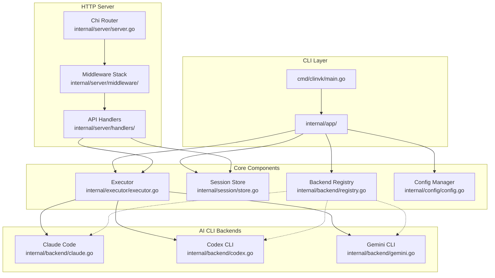

# clinvoker

[](https://github.com/signalridge/clinvoker)
[](concepts/license.md)

## clinvoker とは？

clinvoker は、複数の AI CLI バックエンドを「プログラム可能な基盤」へ変換する統合 CLI ラッパーです。Claude Code / Codex CLI / Gemini CLI を 1 つのインターフェースでオーケストレーションしつつ、OpenAI SDK と Anthropic SDK との完全な互換性も維持します。AI 駆動の自動化を構築する場合でも、既存アプリケーションへ組み込む場合でも、複数モデルの複雑なワークフローを管理する場合でも、clinvoker は対話型 CLI ツールと本番運用向け API の間のギャップを埋めます。

- **慣れた SDK をどの CLI バックエンドでも利用** - OpenAI / Anthropic SDK のドロップイン互換により、既存アプリは変更なしで動作します
- **マルチバックエンドのワークフローをオーケストレーション** - 最適なモデルへタスクをルーティングしたり、バックエンド横断で比較したり、複数の AI ステップをチェーンして一貫したパイプラインを構築できます
- **永続セッションを維持** - プロセス間のファイルロックにより、CLI 呼び出しやサーバー再起動をまたいでセッション状態が保持されます
- **HTTP API サーバーとして提供** - 任意の CLI バックエンドを REST API に変換し、レート制限・認証・メトリクスを組み込みで提供します

## アーキテクチャ

clinvoker は、コアコンポーネントを共有しつつ、CLI の関心事と HTTP API の機能を分離するレイヤードアーキテクチャを採用しています。設計では、モジュール性、テスト容易性、責務の明確な分離を重視しています。



**CLI Layer** (`cmd/clinvk/main.go`, `internal/app/`)
: Cobra フレームワークによるエントリポイントとコマンド定義。フラグ解析、設定の初期化、プロンプト実行・セッション管理・ワークフローのオーケストレーション向けコマンドルーティングを担当します。

**Backend Registry** (`internal/backend/registry.go`)
: バックエンドの登録と探索を管理するスレッドセーフなレジストリ。利用可否のキャッシュ付きチェックを提供し、複数ゴルーチンからの同時アクセスをサポートします。

**Session Store** (`internal/session/store.go`)
: プロセス間ファイルロックを用いた永続セッション管理。セッションのメタデータ、再開（resume）用のバックエンドセッション ID を保持し、CLI/HTTP の両コンテキストにまたがるセッションライフサイクルを扱います。

**Executor** (`internal/executor/executor.go`)
: 対話型 CLI ツール向けに PTY をサポートするプロセス実行エンジン。stdin/stdout/stderr のストリーミング、シグナル管理、タイムアウト処理を担当します。

**Config Manager** (`internal/config/config.go`)
: Viper ベースの設定管理。YAML 設定ファイル、環境変数、コマンドラインフラグをサポートし、バリデーションやホットリロード機能も含みます。

**Chi Router** (`internal/server/server.go`)
: go-chi/chi を用いた HTTP ルーター。リクエスト ID、実 IP の抽出、リカバリー、ロギング、レート制限、認証、CORS などのミドルウェアをチェーンします。

**Middleware Stack** (`internal/server/middleware/`)
: API キー認証、レート制限、リクエストサイズ制限、メトリクス収集、分散トレーシングなどを含む、合成可能なミドルウェア群。

**API Handlers** (`internal/server/handlers/`)
: Huma ベースの HTTP ハンドラー。OpenAI 互換 / Anthropic 互換のエンドポイント、カスタム REST API、ストリーミング応答を提供します。

## コア機能

### マルチバックエンドのオーケストレーション

clinvoker は AI CLI ツール間の差異を抽象化し、統一インターフェースを提供します。バックエンドシステムが、各 CLI ツール向けのコマンド構築、出力の解析、セッション管理を担当します。タスクの内容に応じて得意なバックエンドへルーティングしたり、同じプロンプトを複数バックエンドで実行して比較したり、あるバックエンドの出力を別のバックエンドへ渡すチェーンを構築したりできます。

### HTTP API への変換

内蔵の HTTP サーバーにより、任意の CLI バックエンドを REST API に変換できます。OpenAI 互換 / Anthropic 互換のエンドポイントを提供するため、OpenAI SDK を使用している既存アプリケーションは clinvoker を指すだけで、Claude Code / Codex CLI / Gemini CLI へ即座にアクセスできます（コード変更は不要）。API はストリーミング応答、関数呼び出しパターン、適切なエラーハンドリングをサポートします。

### セッション永続化

セッションはプロセス間ファイルロックを用いてディスクへ永続化されます。CLI で会話を開始して HTTP API で継続したり、数日後にセッションを再開したりできます。各セッションは、バックエンドセッション ID、作業ディレクトリ、モデル設定、会話履歴メタデータを保持します。

### 並列実行とチェーン実行

`parallel` コマンドは複数バックエンドに対して同時にプロンプトを実行し、比較用に結果を集約します。`chain` コマンドはステップごとに異なるバックエンドを使える逐次ワークフローを作成し、「Claude が設計し、Codex が実装し、Gemini がレビューする」といったパターンを実現できます。

## クイックスタート

### インストール

```bash
curl -sSL https://raw.githubusercontent.com/signalridge/clinvoker/main/install.sh | bash
```

### 基本的な使い方

Run a prompt with the default backend:

```bash
clinvk "Explain the architecture of this codebase"
```

Specify a backend and model:

```bash
clinvk --backend claude --model claude-opus-4-5-20251101 "Refactor this function for better error handling"
```

Use Codex CLI:

```bash
clinvk --backend codex --model o3 "Generate unit tests for auth.go"
```

### SDK 連携の例

Use clinvoker as a drop-in replacement for OpenAI API:

```python
from openai import OpenAI

client = OpenAI(
    base_url="http://localhost:8080/openai/v1",
    api_key="your-api-key"
)

response = client.chat.completions.create(
    model="claude-opus-4-5-20251101",
    messages=[{"role": "user", "content": "Hello, world!"}]
)
print(response.choices[0].message.content)
```

## 機能比較

| 機能 | clinvoker | AgentAPI | Aider | 直接 CLI |
|---------|:---------:|:--------:|:-----:|:----------:|
| マルチバックエンド対応 | ✓ | ✓ | ✓ | ✗ |
| OpenAI SDK 互換 | ✓ | ✓ | ✗ | ✗ |
| Anthropic SDK 互換 | ✓ | ✗ | ✗ | ✗ |
| セッション永続化 | ✓ | ✗ | ✓ | ✗ |
| 並列実行 | ✓ | ✗ | ✗ | ✗ |
| チェーンワークフロー | ✓ | ✗ | ✗ | ✗ |
| バックエンド比較 | ✓ | ✗ | ✗ | ✗ |
| レート制限 | ✓ | ✗ | ✗ | ✗ |
| API キー認証 | ✓ | ✗ | ✗ | ✗ |
| セルフホスト | ✓ | ✓ | ✓ | N/A |

## 対応バックエンド

| バックエンド | CLI ツール | モデル | 得意分野 |
|---------|----------|--------|----------|
| Claude Code | `claude` | claude-opus-4-5-20251101, claude-sonnet-4-20250514 | 複雑な推論、アーキテクチャ判断、詳細な分析 |
| Codex CLI | `codex` | o3, o3-mini, o4-mini | コード生成、素早い実装、反復的な開発 |
| Gemini CLI | `gemini` | gemini-2.5-pro, gemini-2.5-flash | 調査、要約、クリエイティブ作業、マルチモーダル入力 |

## 次のステップ

<div class="grid cards" markdown>

-   **はじめに**

    ---

    clinvk をインストールして、5 分以内に最初のプロンプトを実行しましょう。バックエンド選択、セッション管理、設定の基本を学びます。

    [:octicons-arrow-right-24: はじめに](tutorials/getting-started.md)

-   **アーキテクチャ**

    ---

    clinvoker の設計原則、コンポーネント間の相互作用、新しいバックエンドを追加するための拡張ポイントを深掘りします。

    [:octicons-arrow-right-24: アーキテクチャ](concepts/architecture.md)

-   **ハウツーガイド**

    ---

    並列実行、チェーンワークフロー、CI/CD 統合、バックエンド設定など、具体的なタスクに役立つ実践ガイドです。

    [:octicons-arrow-right-24: ハウツーガイド](guides/index.md)

-   **API リファレンス**

    ---

    OpenAI 互換 / Anthropic 互換のエンドポイント、認証、例を含む REST API ドキュメント一式です。

    [:octicons-arrow-right-24: API リファレンス](reference/api/rest.md)

</div>

## コミュニティ

- **GitHub**: [signalridge/clinvoker](https://github.com/signalridge/clinvoker)
- **Issues**: [バグ報告・機能要望](https://github.com/signalridge/clinvoker/issues)
- **Contributing**: [開発ガイド](concepts/contributing.md)
