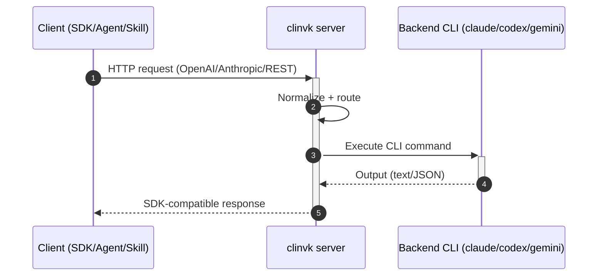

# clinvoker

Unified AI CLI wrapper for orchestrating multiple AI CLI backends with session persistence, parallel task execution, HTTP API server, and unified output formatting.

## Why clinvoker?

### The Challenge

When working with AI programming assistants, you often face these limitations:

- **Single Model Lock-in**: Stuck with one AI's capabilities when different models excel at different tasks
- **No SDK for CLI Tools**: Can't easily integrate Claude Code, Codex CLI, or Gemini CLI into your applications
- **Manual Orchestration**: Complex workflows require switching between tools manually
- **No Framework Integration**: Can't use familiar SDKs (OpenAI, Anthropic) with CLI tools

### The Solution

clinvk transforms AI CLI tools into a programmable infrastructure with three core capabilities:

#### 1. Skills Integration - Extend AI Agent Capabilities

Build Claude Code Skills that call other AI backends for specialized tasks:

```bash
# A Claude Code Skill calling Gemini for data analysis
clinvk -b gemini --ephemeral "analyze this dataset..."
```

**Use cases:**

- Claude analyzing code, then Codex generating fixes
- Multi-model code review from different perspectives
- Specialized tasks routed to the best-suited model

#### 2. HTTP API Transformation - SDK Compatibility

Use your favorite SDK while leveraging any CLI backend:

```python
from openai import OpenAI

# Use OpenAI SDK, actually calling Claude CLI
client = OpenAI(base_url="http://localhost:8080/openai/v1")
response = client.chat.completions.create(
    model="claude",  # Maps to Claude CLI backend
    messages=[{"role": "user", "content": "Review this code"}]
)
```

**Compatible with:**

- OpenAI SDK (Python, TypeScript, Go)
- Anthropic SDK
- LangChain / LangGraph
- Any HTTP client

#### 3. Orchestration - Multi-Backend Workflows

Coordinate multiple AI backends for complex tasks:

=== "Parallel: Multi-Perspective Review"

    ```bash
    # Claude reviews architecture, Codex reviews performance, Gemini reviews security
    clinvk parallel -f tasks.json
    ```

    ```json
    {
      "tasks": [
        {"backend": "claude", "prompt": "Review architecture for this code:\n\n<PASTE CODE OR DIFF HERE>"},
        {"backend": "codex", "prompt": "Review performance for this code:\n\n<PASTE CODE OR DIFF HERE>"},
        {"backend": "gemini", "prompt": "Review security for this code:\n\n<PASTE CODE OR DIFF HERE>"}
      ]
    }
    ```

=== "Chain: Pipeline Processing"

    ```bash
    # Claude analyzes → Codex fixes → Claude reviews
    clinvk chain -f pipeline.json
    ```

    ```json
    {
      "steps": [
        {"name": "analyze", "backend": "claude", "prompt": "Analyze this code"},
        {"name": "fix", "backend": "codex", "prompt": "Fix issues: {{previous}}"},
        {"name": "review", "backend": "claude", "prompt": "Review fixes: {{previous}}"}
      ]
    }
    ```

### How It Works



## Features

| Feature | Description |
|---------|-------------|
| **Multi-Backend Support** | Seamlessly switch between Claude Code, Codex CLI, and Gemini CLI |
| **SDK Compatibility** | OpenAI and Anthropic compatible API endpoints |
| **Session Persistence** | Automatic session tracking with resume capability and cross-process file locking |
| **Parallel Execution** | Run multiple AI tasks concurrently with fail-fast support |
| **Chain Execution** | Pipeline prompts through multiple backends sequentially |
| **Backend Comparison** | Compare responses from multiple backends side-by-side |
| **HTTP API Server** | RESTful API with rate limiting, request size limiting, and CORS support |
| **Security** | API key authentication, trusted proxy support, and working directory restrictions |
| **Observability** | Distributed tracing, Prometheus metrics endpoint, and structured logging |

## Quick Start

```bash
# Run with default backend (Claude Code)
clinvk "fix the bug in auth.go"

# Specify a backend
clinvk --backend codex "implement user registration"

# Start HTTP API server
clinvk serve --port 8080

# Compare backends
clinvk compare --all-backends "explain this code"

# Parallel execution
clinvk parallel -f tasks.json

# Chain execution
clinvk chain -f pipeline.json
```

## Use Case Comparison

| Scenario | Traditional Approach | clinvk Approach |
|----------|---------------------|-----------------|
| AI Skill calling other AIs | Not supported | HTTP API call |
| LangChain integration | Custom code per model | OpenAI-compatible endpoint |
| CI/CD code review | Shell scripts | REST API + parallel execution |
| Multi-model comparison | Manual execution | `clinvk compare` |
| Agent orchestration | Complex wiring | Chain/parallel execution |

## Supported Backends

| Backend | CLI Tool | Description |
|---------|----------|-------------|
| Claude Code | `claude` | Anthropic's AI coding assistant |
| Codex CLI | `codex` | OpenAI's code-focused CLI |
| Gemini CLI | `gemini` | Google's Gemini AI CLI |

## Next Steps

- [Installation](guide/installation.md) - Install clinvk on your system
- [Quick Start](guide/quick-start.md) - Get up and running in minutes
- [Architecture](about/architecture.md) - Learn about clinvk's architecture and design
- [Integration Guide](integration/index.md) - Connect clinvk to your tools
- [Parallel & Chain Execution](guide/parallel-execution.md) - Multi-backend workflow patterns
- [HTTP API](guide/http-server.md) - Use the REST API server
