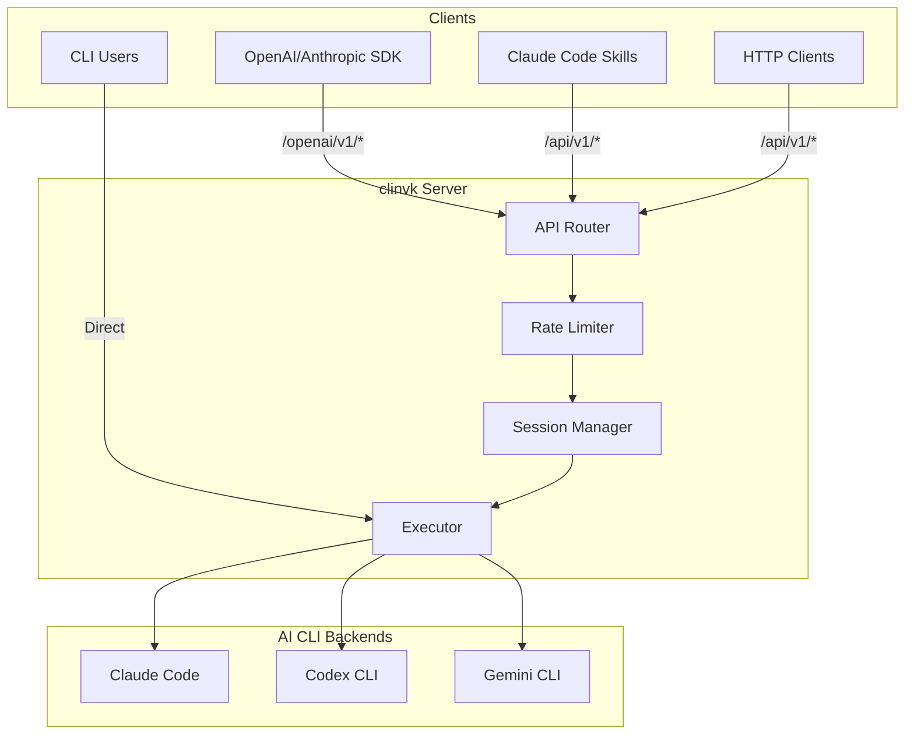

# clinvoker

<div align="center">

Unified AI CLI wrapper for orchestrating multiple AI CLI backends

[](https://github.com/signalridge/clinvoker)
[](about/license.md)

</div>

## Installation

```bash
curl -sSL https://raw.githubusercontent.com/signalridge/clinvoker/main/install.sh | bash
```

Or install from source:

```bash
go install github.com/signalridge/clinvoker/cmd/clinvk@latest
```

## Three Core Capabilities

<div class="grid cards" markdown>

-   :material-lightning-bolt-circle:{ .lg .middle } __Skills Integration__

    ---

    Claude Code Skills calling other AI backends for specialized tasks.
    Route tasks to the best-suited model automatically.

    [:octicons-arrow-right-24: Learn more](use-cases/ai-team-collaboration.md)

-   :material-api:{ .lg .middle } __HTTP API Transformation__

    ---

    Use OpenAI/Anthropic SDKs with any CLI backend. Drop-in compatibility
    with existing applications and frameworks.

    [:octicons-arrow-right-24: API Reference](reference/api/rest-api.md)

-   :material-source-branch:{ .lg .middle } __Orchestration__

    ---

    Parallel execution, chain workflows, and backend comparison.
    Build complex AI pipelines with simple commands.

    [:octicons-arrow-right-24: See examples](use-cases/index.md)

</div>

## Quick Start

### 1. First Prompt

```bash
# Run with default backend (Claude Code)
clinvk "fix the bug in auth.go"

# Specify a backend
clinvk --backend codex "implement user registration"
```

### 2. Compare Backends

```bash
# Run the same prompt on all backends
clinvk compare --all-backends "explain this code"
```

### 3. Start HTTP Server

```bash
# Start the API server
clinvk serve --port 8080

# Test with curl
curl -X POST http://localhost:8080/api/v1/prompt \
  -H "Content-Type: application/json" \
  -d '{"backend":"claude","prompt":"Hello"}'
```

## Use Cases Gallery

<div class="grid cards" markdown>

-   :material-account-group:{ .lg .middle } __AI Team Collaboration__

    ---

    Simulate a multi-AI development team with Claude as architect,
    Codex as implementer, and Gemini as reviewer.

    [:octicons-arrow-right-24: Explore](use-cases/ai-team-collaboration.md)

-   :material-file-code:{ .lg .middle } __Automated Code Review__

    ---

    CI/CD pipeline that sends PR diffs to multiple backends for
    comprehensive architecture, performance, and security reviews.

    [:octicons-arrow-right-24: Explore](use-cases/automated-code-review.md)

-   :material-book-search:{ .lg .middle } __Multi-Model Research__

    ---

    Complex technical research with multiple perspectives.
    Compare answers and synthesize comprehensive reports.

    [:octicons-arrow-right-24: Explore](use-cases/multi-model-research.md)

-   :material-file-document:{ .lg .middle } __Smart Documentation__

    ---

    Automatically generate architecture docs, API references,
    and usage examples from your codebase.

    [:octicons-arrow-right-24: Explore](use-cases/smart-documentation.md)

-   :material-test-tube:{ .lg .middle } __Test Generation Pipeline__

    ---

    End-to-end test generation: from test case design to
    implementation to coverage review.

    [:octicons-arrow-right-24: Explore](use-cases/test-generation-pipeline.md)

-   :material-server:{ .lg .middle } __API Gateway Pattern__

    ---

    Deploy clinvk as a unified AI gateway for your organization.
    Centralized routing, authentication, and monitoring.

    [:octicons-arrow-right-24: Explore](use-cases/api-gateway-pattern.md)

-   :material-alert:{ .lg .middle } __Incident Response War Room__

    ---

    Triage production incidents with parallel analysis and a synthesis chain.

    [:octicons-arrow-right-24: Explore](use-cases/incident-response-war-room.md)

</div>

## Architecture



## Feature Comparison

| Feature | clinvoker | Direct CLI | Other Wrappers |
|---------|:---------:|:----------:|:--------------:|
| Multi-backend support | :material-check:{ .green } | :material-close:{ .red } | Limited |
| OpenAI SDK compatible | :material-check:{ .green } | :material-close:{ .red } | Sometimes |
| Session persistence | :material-check:{ .green } | :material-close:{ .red } | Rare |
| Parallel execution | :material-check:{ .green } | :material-close:{ .red } | :material-close:{ .red } |
| Chain workflows | :material-check:{ .green } | :material-close:{ .red } | :material-close:{ .red } |
| Backend comparison | :material-check:{ .green } | Manual | :material-close:{ .red } |
| Rate limiting | :material-check:{ .green } | :material-close:{ .red } | Varies |
| Self-hosted | :material-check:{ .green } | N/A | Varies |

## Supported Backends

| Backend | CLI Tool | Best For |
|---------|----------|----------|
| :material-robot: Claude Code | `claude` | Complex reasoning, architecture, analysis |
| :material-code-tags: Codex CLI | `codex` | Code generation, quick implementations |
| :material-google: Gemini CLI | `gemini` | Research, summarization, creative tasks |

## Next Steps

<div class="grid cards" markdown>

-   :material-rocket:{ .lg .middle } __Getting Started__

    ---

    Install clinvk and run your first prompt in under 5 minutes.

    [:octicons-arrow-right-24: Installation](getting-started/installation.md)

-   :material-school:{ .lg .middle } __Tutorials__

    ---

    Step-by-step guides for common use cases and integrations.

    [:octicons-arrow-right-24: Tutorials](tutorials/index.md)

-   :material-book-open:{ .lg .middle } __How-To Guides__

    ---

    Practical guides for specific tasks and configurations.

    [:octicons-arrow-right-24: How-To](how-to/index.md)

-   :material-code-braces:{ .lg .middle } __API Reference__

    ---

    Complete REST API documentation with examples.

    [:octicons-arrow-right-24: Reference](reference/index.md)

</div>

## Community

- **GitHub**: [signalridge/clinvoker](https://github.com/signalridge/clinvoker)
- **Issues**: [Report bugs or request features](https://github.com/signalridge/clinvoker/issues)
- **Contributing**: [Development guide](development/contributing.md)
