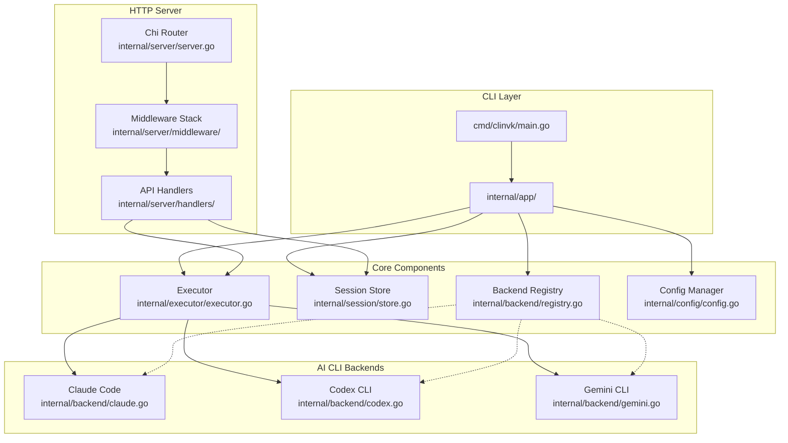

# clinvoker

[](https://github.com/signalridge/clinvoker)
[](concepts/license.md)

## What is clinvoker?

clinvoker is a unified AI CLI wrapper that transforms multiple AI CLI backends into programmable infrastructure. It provides a single interface to orchestrate Claude Code, Codex CLI, and Gemini CLI while maintaining full compatibility with OpenAI and Anthropic SDKs. Whether you are building AI-powered automation, integrating with existing applications, or managing complex multi-model workflows, clinvoker bridges the gap between interactive CLI tools and production-ready APIs.

- **Use familiar SDKs with any CLI backend** - Drop-in compatibility with OpenAI and Anthropic SDKs means existing applications work without modification
- **Orchestrate multi-backend workflows** - Route tasks to the most appropriate model, run comparisons across backends, or chain multiple AI steps into cohesive pipelines
- **Maintain persistent sessions** - Cross-process file locking ensures session state persists across CLI invocations and server restarts
- **Deploy as HTTP API server** - Transform any CLI backend into a REST API with built-in rate limiting, authentication, and metrics

## Architecture

clinvoker follows a layered architecture that separates CLI concerns from HTTP API functionality while sharing core components. The design emphasizes modularity, testability, and clear separation of responsibilities.



**CLI Layer** (`cmd/clinvk/main.go`, `internal/app/`)
: Entry point and command definitions using Cobra framework. Handles flag parsing, configuration initialization, and command routing for prompt execution, session management, and workflow orchestration.

**Backend Registry** (`internal/backend/registry.go`)
: Thread-safe registry managing backend registration and discovery. Provides cached availability checks and supports concurrent access from multiple goroutines.

**Session Store** (`internal/session/store.go`)
: Persistent session management with cross-process file locking. Maintains session metadata, backend session IDs for resume functionality, and handles session lifecycle across CLI and HTTP contexts.

**Executor** (`internal/executor/executor.go`)
: Process execution engine with PTY support for interactive CLI tools. Handles stdin/stdout/stderr streaming, signal management, and timeout handling.

**Config Manager** (`internal/config/config.go`)
: Viper-based configuration management supporting YAML config files, environment variables, and command-line flags. Includes validation and hot-reload capabilities.

**Chi Router** (`internal/server/server.go`)
: HTTP router using go-chi/chi with middleware chaining for request ID, real IP extraction, recovery, logging, rate limiting, authentication, and CORS.

**Middleware Stack** (`internal/server/middleware/`)
: Composable middleware components including API key authentication, rate limiting, request size limits, metrics collection, and distributed tracing.

**API Handlers** (`internal/server/handlers/`)
: Huma-based HTTP handlers providing OpenAI-compatible and Anthropic-compatible endpoints, custom REST API, and streaming responses.

## Core Features

### Multi-Backend Orchestration

clinvoker abstracts the differences between AI CLI tools into a unified interface. The backend system handles command building, output parsing, and session management for each supported CLI tool. You can route tasks to specific backends based on their strengths, run the same prompt across multiple backends for comparison, or build chains where the output of one backend feeds into another.

### HTTP API Transformation

The built-in HTTP server transforms any CLI backend into a REST API with OpenAI-compatible and Anthropic-compatible endpoints. Existing applications using OpenAI SDKs can point to clinvoker and immediately access Claude Code, Codex CLI, or Gemini CLI without code changes. The API supports streaming responses, function calling patterns, and proper error handling.

### Session Persistence

Sessions are persisted to disk with cross-process file locking, allowing you to start a conversation via CLI and continue it through the HTTP API, or resume a session days later. Each session maintains the backend session ID, working directory, model configuration, and conversation history metadata.

### Parallel and Chain Execution

The `parallel` command executes prompts across multiple backends simultaneously, aggregating results for comparison. The `chain` command creates sequential workflows where each step can use a different backend, enabling patterns like "Claude architects, Codex implements, Gemini reviews."

## Quick Start

### Installation

```bash
curl -sSL https://raw.githubusercontent.com/signalridge/clinvoker/main/install.sh | bash
```

### Basic Usage

Run a prompt with the default backend:

```bash
clinvk "Explain the architecture of this codebase"
```

Specify a backend and model:

```bash
clinvk --backend claude --model claude-opus-4-5-20251101 "Refactor this function for better error handling"
```

Use Codex CLI:

```bash
clinvk --backend codex --model o3 "Generate unit tests for auth.go"
```

### SDK Integration Example

Use clinvoker as a drop-in replacement for OpenAI API:

```python
from openai import OpenAI

client = OpenAI(
    base_url="http://localhost:8080/openai/v1",
    api_key="your-api-key"
)

response = client.chat.completions.create(
    model="claude-opus-4-5-20251101",
    messages=[{"role": "user", "content": "Hello, world!"}]
)
print(response.choices[0].message.content)
```

## Feature Comparison

| Feature | clinvoker | AgentAPI | Aider | Direct CLI |
|---------|:---------:|:--------:|:-----:|:----------:|
| Multi-backend support | ✓ | ✓ | ✓ | ✗ |
| OpenAI SDK compatible | ✓ | ✓ | ✗ | ✗ |
| Anthropic SDK compatible | ✓ | ✗ | ✗ | ✗ |
| Session persistence | ✓ | ✗ | ✓ | ✗ |
| Parallel execution | ✓ | ✗ | ✗ | ✗ |
| Chain workflows | ✓ | ✗ | ✗ | ✗ |
| Backend comparison | ✓ | ✗ | ✗ | ✗ |
| Rate limiting | ✓ | ✗ | ✗ | ✗ |
| API key authentication | ✓ | ✗ | ✗ | ✗ |
| Self-hosted | ✓ | ✓ | ✓ | N/A |

## Supported Backends

| Backend | CLI Tool | Models | Best For |
|---------|----------|--------|----------|
| Claude Code | `claude` | claude-opus-4-5-20251101, claude-sonnet-4-20250514 | Complex reasoning, architecture decisions, detailed analysis |
| Codex CLI | `codex` | o3, o3-mini, o4-mini | Code generation, quick implementations, iterative development |
| Gemini CLI | `gemini` | gemini-2.5-pro, gemini-2.5-flash | Research, summarization, creative tasks, multimodal inputs |

## Next Steps

<div class="grid cards" markdown>

-   **Getting Started**

    ---

    Install clinvk and run your first prompt in under 5 minutes. Learn the basics of backend selection, session management, and configuration.

    [:octicons-arrow-right-24: Getting Started](tutorials/getting-started.md)

-   **Architecture**

    ---

    Deep dive into clinvoker's design principles, component interactions, and extension points for adding new backends.

    [:octicons-arrow-right-24: Architecture](concepts/architecture.md)

-   **How-To Guides**

    ---

    Practical guides for specific tasks including parallel execution, chain workflows, CI/CD integration, and backend configuration.

    [:octicons-arrow-right-24: How-To Guides](guides/index.md)

-   **API Reference**

    ---

    Complete REST API documentation with OpenAI-compatible and Anthropic-compatible endpoints, authentication, and examples.

    [:octicons-arrow-right-24: API Reference](reference/api/rest.md)

</div>

## Community

- **GitHub**: [signalridge/clinvoker](https://github.com/signalridge/clinvoker)
- **Issues**: [Report bugs or request features](https://github.com/signalridge/clinvoker/issues)
- **Contributing**: [Development guide](concepts/contributing.md)
