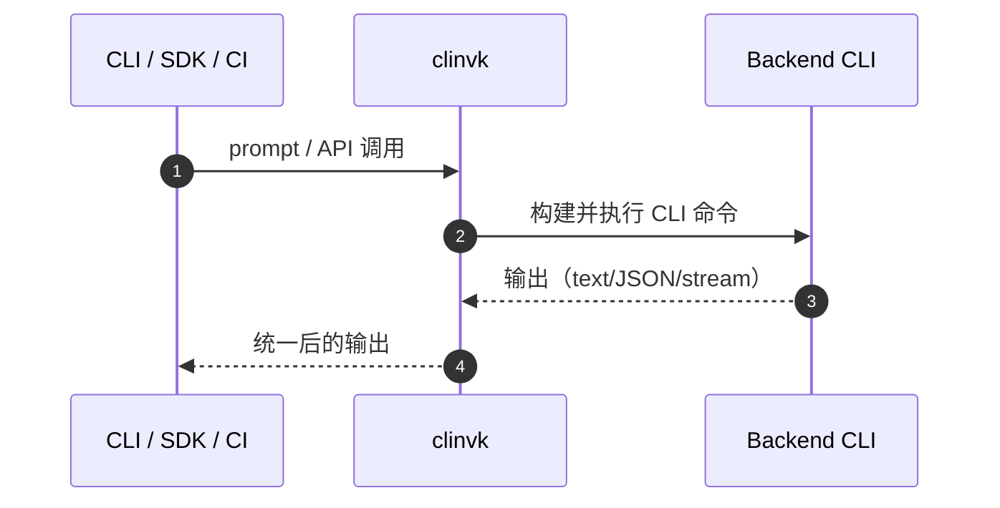

# clinvk

统一的 AI CLI 编排器：把 Claude Code、Codex CLI、Gemini CLI 组合成一个命令，并提供会话、编排与 HTTP API。

## 你将获得

- **一个 CLI 管理多后端** — 通过 `--backend` 或配置切换
- **会话持久化** — 跨多次运行继续对话
- **并行 / 链式编排** — 组合多后端完成复杂任务
- **HTTP 服务器** — 自定义 REST API + OpenAI/Anthropic 兼容端点
- **统一输出** — 文本 / JSON / 流式事件

## 快速开始

```bash
# 使用默认后端（来自配置，或回退到 claude）
clinvk "修复 auth.go 的 bug"

# 指定后端
clinvk -b codex "优化这个函数"

# 启动 API 服务器
clinvk serve --port 8080
```

## 工作原理



## 典型场景

- `parallel` 多模型并行评审
- `chain` 修复 → 复核流水线
- `compare` 高风险改动对比验证
- 通过 HTTP Server 接入 CI

查看 [典型用例](guide/use-cases.md)。

## 支持的后端

| Backend | CLI 命令 | 备注 |
|---------|----------|------|
| Claude Code | `claude` | 支持会话与 `--no-session-persistence` |
| Codex CLI | `codex` | 使用 `codex exec --json` 执行 |
| Gemini CLI | `gemini` | 支持 `--output-format` 与会话清理 |

## 下一步

- [安装](guide/installation.md)
- [快速开始](guide/quick-start.md)
- [基础使用](guide/basic-usage.md)
- [HTTP 服务器](guide/http-server.md)
- [参考手册](reference/index.md)
