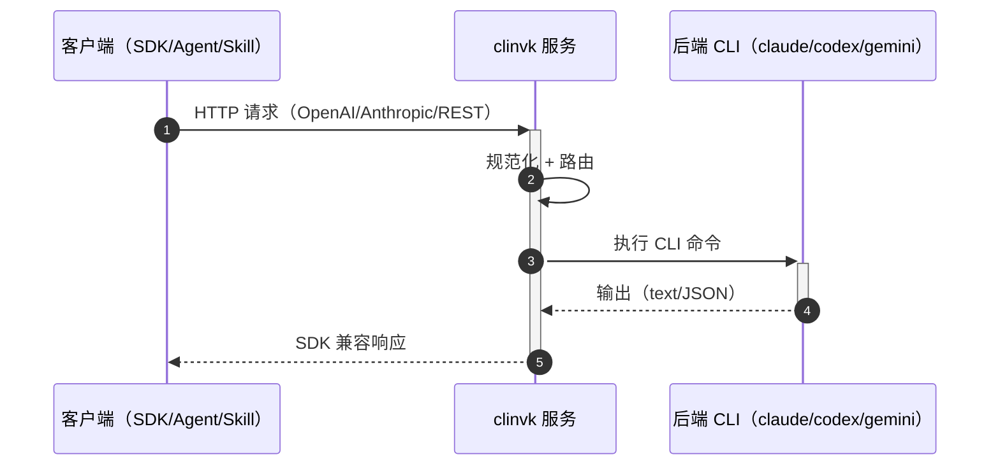

# clinvoker

统一的 AI CLI 封装工具，用于编排多个 AI CLI 后端，支持会话持久化、并行任务执行、HTTP API 服务器和统一输出格式化。

## 为什么选择 clinvoker？

### 面临的挑战

在使用 AI 编程助手时，你经常会遇到这些限制：

- **单模型锁定**：被局限于一个 AI 的能力，而不同模型擅长不同任务
- **CLI 工具没有 SDK**：无法轻松将 Claude Code、Codex CLI 或 Gemini CLI 集成到你的应用中
- **手动编排**：复杂的工作流需要在工具之间手动切换
- **没有框架集成**：无法使用熟悉的 SDK（OpenAI、Anthropic）调用 CLI 工具

### 解决方案

clinvk 将 AI CLI 工具转换为可编程的基础设施，提供三个核心能力：

#### 1. Skills 集成 - 扩展 AI Agent 能力

构建 Claude Code Skills，调用其他 AI 后端执行专业任务：

```bash
# Claude Code Skill 调用 Gemini 进行数据分析
clinvk -b gemini --ephemeral "分析这个数据集..."
```

**使用场景：**
- Claude 分析代码，然后 Codex 生成修复
- 多模型从不同视角进行代码审查
- 将专业任务路由到最适合的模型

#### 2. HTTP API 转换 - SDK 兼容性

使用你喜欢的 SDK，同时利用任何 CLI 后端：

```python
from openai import OpenAI

# 使用 OpenAI SDK，实际调用 Claude CLI
client = OpenAI(base_url="http://localhost:8080/openai/v1")
response = client.chat.completions.create(
    model="claude",  # 映射到 Claude CLI 后端
    messages=[{"role": "user", "content": "审查这段代码"}]
)
```

**兼容：**
- OpenAI SDK（Python、TypeScript、Go）
- Anthropic SDK
- LangChain / LangGraph
- 任何 HTTP 客户端

#### 3. 编排能力 - 多后端工作流

协调多个 AI 后端完成复杂任务：

=== "并行：多视角审查"

    ```bash
    # Claude 查架构，Codex 查性能，Gemini 查安全
    clinvk parallel -f tasks.json
    ```

    ```json
    {
      "tasks": [
        {"backend": "claude", "prompt": "审查这段代码/变更的架构:\n\n<粘贴代码或 diff>"},
        {"backend": "codex", "prompt": "审查这段代码/变更的性能:\n\n<粘贴代码或 diff>"},
        {"backend": "gemini", "prompt": "审查这段代码/变更的安全:\n\n<粘贴代码或 diff>"}
      ]
    }
    ```

=== "链式：流水线处理"

    ```bash
    # Claude 分析 → Codex 修复 → Claude 审查
    clinvk chain -f pipeline.json
    ```

    ```json
    {
      "steps": [
        {"name": "analyze", "backend": "claude", "prompt": "分析这段代码"},
        {"name": "fix", "backend": "codex", "prompt": "修复问题: {{previous}}"},
        {"name": "review", "backend": "claude", "prompt": "审查修复: {{previous}}"}
      ]
    }
    ```

### 工作原理



## 功能特性

| 功能 | 描述 |
|------|------|
| **多后端支持** | 在 Claude Code、Codex CLI 和 Gemini CLI 之间无缝切换 |
| **SDK 兼容性** | OpenAI 和 Anthropic 兼容的 API 端点 |
| **会话持久化** | 自动会话跟踪，支持恢复功能 |
| **并行执行** | 并发运行多个 AI 任务，支持快速失败 |
| **链式执行** | 通过多个后端顺序传递提示 |
| **后端对比** | 并排比较多个后端的响应 |
| **HTTP API 服务器** | RESTful API，可与任何工具或框架集成 |

## 快速开始

```bash
# 使用默认后端运行（Claude Code）
clinvk "修复 auth.go 中的 bug"

# 指定后端
clinvk --backend codex "实现用户注册"

# 启动 HTTP API 服务器
clinvk serve --port 8080

# 对比后端
clinvk compare --all-backends "解释这段代码"

# 并行执行
clinvk parallel -f tasks.json

# 链式执行
clinvk chain -f pipeline.json
```

## 使用场景对比

| 场景 | 传统方式 | clinvk 方式 |
|------|---------|-------------|
| AI Skill 调用其他 AI | 不支持 | HTTP API 调用 |
| LangChain 集成 | 每个模型单独编码 | OpenAI 兼容端点 |
| CI/CD 代码审查 | Shell 脚本 | REST API + 并行执行 |
| 多模型对比 | 手动执行 | `clinvk compare` |
| Agent 编排 | 复杂连接 | 链式/并行执行 |

## 支持的后端

| 后端 | CLI 工具 | 描述 |
|------|----------|------|
| Claude Code | `claude` | Anthropic 的 AI 编程助手 |
| Codex CLI | `codex` | OpenAI 的代码专注 CLI |
| Gemini CLI | `gemini` | Google 的 Gemini AI CLI |

## 下一步

- [安装](guide/installation.md) - 在您的系统上安装 clinvk
- [快速开始](guide/quick-start.md) - 几分钟内上手使用
- [架构](about/architecture.md) - 了解 clinvk 的架构和设计
- [集成指南](integration/index.md) - 将 clinvk 连接到你的工具
- [并行与链式执行](guide/parallel-execution.md) - 多后端工作流模式
- [HTTP API](guide/http-server.md) - 使用 REST API 服务器
