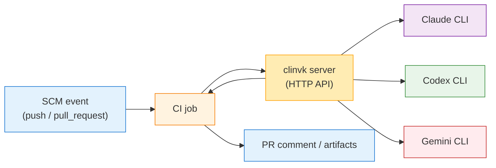

# CI/CD Integration

This guide explains how to integrate clinvk into CI/CD pipelines for automated code review, documentation generation, and other AI-powered tasks.

## Overview

clinvk can be integrated into CI/CD workflows to:

- Automatically review pull requests
- Generate documentation for changed code
- Perform security analysis
- Run multi-perspective code audits



## Prerequisites - Authentication

!!! warning "Important: Backend Authentication Required"
    clinvk does NOT handle authentication. The underlying CLI tools must be authenticated in your CI environment.

### Required Secrets

| Backend | Environment Variable | How to Get |
|---------|---------------------|------------|
| Claude | `ANTHROPIC_API_KEY` | [Anthropic Console](https://console.anthropic.com/) |
| Codex | `OPENAI_API_KEY` | [OpenAI Platform](https://platform.openai.com/) |
| Gemini | `GOOGLE_API_KEY` | [Google AI Studio](https://makersuite.google.com/) |

### Setup in GitHub Actions

```yaml
env:
  ANTHROPIC_API_KEY: ${{ secrets.ANTHROPIC_API_KEY }}
  OPENAI_API_KEY: ${{ secrets.OPENAI_API_KEY }}
  GOOGLE_API_KEY: ${{ secrets.GOOGLE_API_KEY }}
```

### Setup in GitLab CI

```yaml
variables:
  ANTHROPIC_API_KEY: $ANTHROPIC_API_KEY  # Set in CI/CD Settings
  OPENAI_API_KEY: $OPENAI_API_KEY
```

## GitHub Actions

### Basic Code Review

```yaml
name: AI Code Review

on:
  pull_request:
    types: [opened, synchronize]

jobs:
  review:
    runs-on: ubuntu-latest

    services:
      clinvk:
        image: ghcr.io/signalridge/clinvk:latest
        ports:
          - 8080:8080
        env:
          CLAUDE_CLI_PATH: /usr/local/bin/claude

    steps:
      - name: Checkout
        uses: actions/checkout@v4
        with:
          fetch-depth: 0

      - name: Get changed files
        id: changed
        run: |
          FILES=$(git diff --name-only ${{ github.event.pull_request.base.sha }} ${{ github.sha }} | tr '\n' ' ')
          echo "files=$FILES" >> $GITHUB_OUTPUT

      - name: Wait for clinvk
        run: |
          for i in {1..30}; do
            curl -s http://localhost:8080/health && break
            sleep 1
          done

      - name: AI Review
        id: review
        run: |
          DIFF=$(git diff ${{ github.event.pull_request.base.sha }} ${{ github.sha }})

          RESULT=$(curl -s -X POST http://localhost:8080/api/v1/prompt \
            -H "Content-Type: application/json" \
            -d "{
              \"backend\": \"claude\",
              \"prompt\": \"Review these code changes for bugs, security issues, and improvements:\\n\\n$DIFF\",
              \"ephemeral\": true
            }")

          echo "review<<EOF" >> $GITHUB_OUTPUT
          echo "$RESULT" | jq -r '.output' >> $GITHUB_OUTPUT
          echo "EOF" >> $GITHUB_OUTPUT

      - name: Post Review Comment
        uses: actions/github-script@v7
        with:
          script: |
            github.rest.issues.createComment({
              issue_number: context.issue.number,
              owner: context.repo.owner,
              repo: context.repo.repo,
              body: `## AI Code Review\n\n${{ steps.review.outputs.review }}`
            })
```

### Multi-Model Review

```yaml
name: Multi-Model Code Review

on:
  pull_request:

jobs:
  multi-review:
    runs-on: ubuntu-latest

    services:
      clinvk:
        image: ghcr.io/signalridge/clinvk:latest
        ports:
          - 8080:8080

    steps:
      - uses: actions/checkout@v4
        with:
          fetch-depth: 0

      - name: Get Diff
        id: diff
        run: |
          DIFF=$(git diff ${{ github.event.pull_request.base.sha }} ${{ github.sha }} | head -c 10000)
          echo "diff<<EOF" >> $GITHUB_OUTPUT
          echo "$DIFF" >> $GITHUB_OUTPUT
          echo "EOF" >> $GITHUB_OUTPUT

      - name: Parallel Review
        id: parallel
        run: |
          RESULT=$(curl -s -X POST http://localhost:8080/api/v1/parallel \
            -H "Content-Type: application/json" \
            -d '{
              "tasks": [
                {
                  "backend": "claude",
                  "prompt": "Review architecture and design patterns:\n${{ steps.diff.outputs.diff }}"
                },
                {
                  "backend": "codex",
                  "prompt": "Review for performance issues:\n${{ steps.diff.outputs.diff }}"
                },
                {
                  "backend": "gemini",
                  "prompt": "Review for security vulnerabilities:\n${{ steps.diff.outputs.diff }}"
                }
              ]
            }')

          echo "$RESULT" > review-results.json

      - name: Format and Post Results
        uses: actions/github-script@v7
        with:
          script: |
            const fs = require('fs');
            const results = JSON.parse(fs.readFileSync('review-results.json', 'utf8'));

            const body = `## Multi-Model Code Review

            ### Architecture Review (Claude)
            ${results.results[0].output || results.results[0].error}

            ### Performance Review (Codex)
            ${results.results[1].output || results.results[1].error}

            ### Security Review (Gemini)
            ${results.results[2].output || results.results[2].error}
            `;

            github.rest.issues.createComment({
              issue_number: context.issue.number,
              owner: context.repo.owner,
              repo: context.repo.repo,
              body: body
            });
```

### Documentation Generation

```yaml
name: Generate Documentation

on:
  push:
    branches: [main]
    paths:
      - 'src/**/*.ts'
      - 'src/**/*.py'

jobs:
  docs:
    runs-on: ubuntu-latest

    services:
      clinvk:
        image: ghcr.io/signalridge/clinvk:latest
        ports:
          - 8080:8080

    steps:
      - uses: actions/checkout@v4

      - name: Generate API Docs
        run: |
          for file in src/**/*.ts; do
            CODE=$(cat "$file")

            DOC=$(curl -s -X POST http://localhost:8080/api/v1/chain \
              -H "Content-Type: application/json" \
              -d "{
                \"steps\": [
                  {
                    \"name\": \"analyze\",
                    \"backend\": \"claude\",
                    \"prompt\": \"Analyze this TypeScript file structure:\\n$CODE\"
                  },
                  {
                    \"name\": \"document\",
                    \"backend\": \"codex\",
                    \"prompt\": \"Generate API documentation in Markdown:\\n{{previous}}\"
                  }
                ]
              }" | jq -r '.results[-1].output')

            echo "$DOC" > "docs/api/$(basename $file .ts).md"
          done

      - name: Commit Documentation
        run: |
          git config user.name "github-actions[bot]"
          git config user.email "github-actions[bot]@users.noreply.github.com"
          git add docs/
          git diff --staged --quiet || git commit -m "docs: auto-generate API documentation"
          git push
```

## GitLab CI

### Basic Integration

```yaml
# .gitlab-ci.yml
stages:
  - review

variables:
  CLINVK_URL: http://clinvk:8080

services:
  - name: ghcr.io/signalridge/clinvk:latest
    alias: clinvk

ai-review:
  stage: review
  script:
    - |
      DIFF=$(git diff $CI_MERGE_REQUEST_DIFF_BASE_SHA HEAD)

      RESULT=$(curl -s -X POST $CLINVK_URL/api/v1/prompt \
        -H "Content-Type: application/json" \
        -d "{
          \"backend\": \"claude\",
          \"prompt\": \"Review this code:\\n$DIFF\"
        }")

      echo "$RESULT" | jq -r '.output' > review.txt

    - cat review.txt
  artifacts:
    paths:
      - review.txt
  only:
    - merge_requests
```

## Jenkins

### Jenkinsfile

```groovy
pipeline {
    agent any

    environment {
        CLINVK_URL = 'http://localhost:8080'
    }

    stages {
        stage('Start clinvk') {
            steps {
                sh 'docker run -d --name clinvk -p 8080:8080 ghcr.io/signalridge/clinvk:latest'
                sh 'sleep 5'  // Wait for startup
            }
        }

        stage('AI Review') {
            steps {
                script {
                    def diff = sh(script: 'git diff HEAD~1', returnStdout: true).trim()

                    def response = sh(script: """
                        curl -s -X POST ${CLINVK_URL}/api/v1/prompt \\
                          -H "Content-Type: application/json" \\
                          -d '{"backend": "claude", "prompt": "Review:\\n${diff}"}'
                    """, returnStdout: true)

                    echo "Review Result: ${response}"
                }
            }
        }
    }

    post {
        always {
            sh 'docker stop clinvk || true'
            sh 'docker rm clinvk || true'
        }
    }
}
```

## Self-Hosted Runner Setup

For production use, run clinvk as a persistent service:

```bash
# /etc/systemd/system/clinvk.service
[Unit]
Description=clinvk AI CLI Server
After=network.target

[Service]
Type=simple
User=ci
ExecStart=/usr/local/bin/clinvk serve --port 8080 --host 0.0.0.0
Restart=always
RestartSec=10

[Install]
WantedBy=multi-user.target
```

```bash
# Enable and start
sudo systemctl enable clinvk
sudo systemctl start clinvk
```

## Best Practices

### 1. Use Ephemeral Sessions

```bash
curl -X POST http://localhost:8080/api/v1/prompt \
  -d '{"backend": "claude", "prompt": "...", "ephemeral": true}'
```

### 2. Set Timeouts

```yaml
- name: AI Review
  timeout-minutes: 10
  run: |
    curl --max-time 300 -X POST http://localhost:8080/api/v1/prompt ...
```

### 3. Handle Large Diffs

```bash
# Truncate large diffs
DIFF=$(git diff HEAD~1 | head -c 50000)
```

### 4. Cache clinvk Image

```yaml
services:
  clinvk:
    image: ghcr.io/signalridge/clinvk:latest
    # Add image pull policy for caching
```

### 5. Error Handling

```bash
RESPONSE=$(curl -s -w "\n%{http_code}" -X POST http://localhost:8080/api/v1/prompt ...)
HTTP_CODE=$(echo "$RESPONSE" | tail -1)

if [ "$HTTP_CODE" != "200" ]; then
  echo "AI review failed with code $HTTP_CODE"
  exit 1
fi
```

## Security Considerations

1. **Network Isolation**: Run clinvk in a private network
2. **No Secrets in Prompts**: Don't include API keys or passwords in prompts
3. **Rate Limiting**: Implement rate limits for API calls
4. **Audit Logging**: Log all AI interactions for compliance

## Next Steps

- [Client Libraries](client-libraries.md) - Language-specific SDKs
- [REST API Reference](../reference/api/rest-api.md) - Complete API docs
- [Troubleshooting](../development/troubleshooting.md) - Common issues
