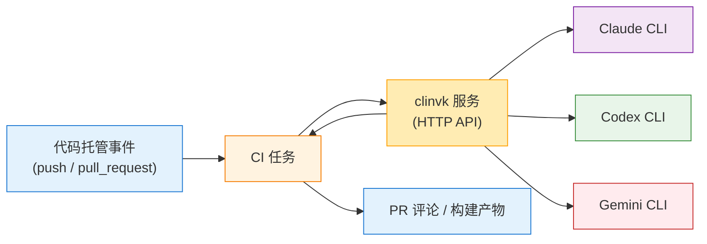

# CI/CD 集成

本指南解释如何将 clinvk 集成到 CI/CD 流水线中，实现自动化代码审查、文档生成和其他 AI 驱动的任务。

## 概述

clinvk 可以集成到 CI/CD 工作流中实现：

- 自动审查 Pull Request
- 为变更的代码生成文档
- 执行安全分析
- 运行多视角代码审计



## 前提条件 - 认证

!!! warning "重要：后端认证必需"
    clinvk 本身不处理认证。底层 CLI 工具必须在你的 CI 环境中完成认证。

### 必需的 Secrets

| 后端 | 环境变量 | 获取方式 |
|------|---------|---------|
| Claude | `ANTHROPIC_API_KEY` | [Anthropic Console](https://console.anthropic.com/) |
| Codex | `OPENAI_API_KEY` | [OpenAI Platform](https://platform.openai.com/) |
| Gemini | `GOOGLE_API_KEY` | [Google AI Studio](https://makersuite.google.com/) |

### GitHub Actions 中配置

```yaml
env:
  ANTHROPIC_API_KEY: ${{ secrets.ANTHROPIC_API_KEY }}
  OPENAI_API_KEY: ${{ secrets.OPENAI_API_KEY }}
  GOOGLE_API_KEY: ${{ secrets.GOOGLE_API_KEY }}
```

### GitLab CI 中配置

```yaml
variables:
  ANTHROPIC_API_KEY: $ANTHROPIC_API_KEY  # 在 CI/CD Settings 中设置
  OPENAI_API_KEY: $OPENAI_API_KEY
```

## GitHub Actions

### 基础代码审查

```yaml
name: AI 代码审查

on:
  pull_request:
    types: [opened, synchronize]

jobs:
  review:
    runs-on: ubuntu-latest

    services:
      clinvk:
        image: ghcr.io/signalridge/clinvk:latest
        ports:
          - 8080:8080
        env:
          CLAUDE_CLI_PATH: /usr/local/bin/claude

    steps:
      - name: Checkout
        uses: actions/checkout@v4
        with:
          fetch-depth: 0

      - name: 获取变更文件
        id: changed
        run: |
          FILES=$(git diff --name-only ${{ github.event.pull_request.base.sha }} ${{ github.sha }} | tr '\n' ' ')
          echo "files=$FILES" >> $GITHUB_OUTPUT

      - name: 等待 clinvk
        run: |
          for i in {1..30}; do
            curl -s http://localhost:8080/health && break
            sleep 1
          done

      - name: AI 审查
        id: review
        run: |
          DIFF=$(git diff ${{ github.event.pull_request.base.sha }} ${{ github.sha }})

          RESULT=$(curl -s -X POST http://localhost:8080/api/v1/prompt \
            -H "Content-Type: application/json" \
            -d "{
              \"backend\": \"claude\",
              \"prompt\": \"审查这些代码变更，检查 bug、安全问题和改进建议：\\n\\n$DIFF\",
              \"session_mode\": \"ephemeral\"
            }")

          echo "review<<EOF" >> $GITHUB_OUTPUT
          echo "$RESULT" | jq -r '.result' >> $GITHUB_OUTPUT
          echo "EOF" >> $GITHUB_OUTPUT

      - name: 发布审查评论
        uses: actions/github-script@v7
        with:
          script: |
            github.rest.issues.createComment({
              issue_number: context.issue.number,
              owner: context.repo.owner,
              repo: context.repo.repo,
              body: `## AI 代码审查\n\n${{ steps.review.outputs.review }}`
            })
```

### 多模型审查

```yaml
name: 多模型代码审查

on:
  pull_request:

jobs:
  multi-review:
    runs-on: ubuntu-latest

    services:
      clinvk:
        image: ghcr.io/signalridge/clinvk:latest
        ports:
          - 8080:8080

    steps:
      - uses: actions/checkout@v4
        with:
          fetch-depth: 0

      - name: 获取 Diff
        id: diff
        run: |
          DIFF=$(git diff ${{ github.event.pull_request.base.sha }} ${{ github.sha }} | head -c 10000)
          echo "diff<<EOF" >> $GITHUB_OUTPUT
          echo "$DIFF" >> $GITHUB_OUTPUT
          echo "EOF" >> $GITHUB_OUTPUT

      - name: 并行审查
        id: parallel
        run: |
          RESULT=$(curl -s -X POST http://localhost:8080/api/v1/parallel \
            -H "Content-Type: application/json" \
            -d '{
              "tasks": [
                {
                  "backend": "claude",
                  "prompt": "审查架构和设计模式:\n${{ steps.diff.outputs.diff }}"
                },
                {
                  "backend": "codex",
                  "prompt": "审查性能问题:\n${{ steps.diff.outputs.diff }}"
                },
                {
                  "backend": "gemini",
                  "prompt": "审查安全漏洞:\n${{ steps.diff.outputs.diff }}"
                }
              ]
            }')

          echo "$RESULT" > review-results.json

      - name: 格式化并发布结果
        uses: actions/github-script@v7
        with:
          script: |
            const fs = require('fs');
            const results = JSON.parse(fs.readFileSync('review-results.json', 'utf8'));

            const body = `## 多模型代码审查

            ### 架构审查 (Claude)
            ${results.results[0].result || results.results[0].error}

            ### 性能审查 (Codex)
            ${results.results[1].result || results.results[1].error}

            ### 安全审查 (Gemini)
            ${results.results[2].result || results.results[2].error}
            `;

            github.rest.issues.createComment({
              issue_number: context.issue.number,
              owner: context.repo.owner,
              repo: context.repo.repo,
              body: body
            });
```

### 文档生成

```yaml
name: 生成文档

on:
  push:
    branches: [main]
    paths:
      - 'src/**/*.ts'
      - 'src/**/*.py'

jobs:
  docs:
    runs-on: ubuntu-latest

    services:
      clinvk:
        image: ghcr.io/signalridge/clinvk:latest
        ports:
          - 8080:8080

    steps:
      - uses: actions/checkout@v4

      - name: 生成 API 文档
        run: |
          for file in src/**/*.ts; do
            CODE=$(cat "$file")

            DOC=$(curl -s -X POST http://localhost:8080/api/v1/chain \
              -H "Content-Type: application/json" \
              -d "{
                \"steps\": [
                  {
                    \"name\": \"analyze\",
                    \"backend\": \"claude\",
                    \"prompt\": \"分析此 TypeScript 文件结构:\\n$CODE\"
                  },
                  {
                    \"name\": \"document\",
                    \"backend\": \"codex\",
                    \"prompt\": \"以 Markdown 格式生成 API 文档:\\n{{previous}}\"
                  }
                ]
              }" | jq -r '.results[-1].result')

            echo "$DOC" > "docs/api/$(basename $file .ts).md"
          done

      - name: 提交文档
        run: |
          git config user.name "github-actions[bot]"
          git config user.email "github-actions[bot]@users.noreply.github.com"
          git add docs/
          git diff --staged --quiet || git commit -m "docs: 自动生成 API 文档"
          git push
```

## GitLab CI

### 基础集成

```yaml
# .gitlab-ci.yml
stages:
  - review

variables:
  CLINVK_URL: http://clinvk:8080

services:
  - name: ghcr.io/signalridge/clinvk:latest
    alias: clinvk

ai-review:
  stage: review
  script:
    - |
      DIFF=$(git diff $CI_MERGE_REQUEST_DIFF_BASE_SHA HEAD)

      RESULT=$(curl -s -X POST $CLINVK_URL/api/v1/prompt \
        -H "Content-Type: application/json" \
        -d "{
          \"backend\": \"claude\",
          \"prompt\": \"审查此代码:\\n$DIFF\"
        }")

      echo "$RESULT" | jq -r '.result' > review.txt

    - cat review.txt
  artifacts:
    paths:
      - review.txt
  only:
    - merge_requests
```

## Jenkins

### Jenkinsfile

```groovy
pipeline {
    agent any

    environment {
        CLINVK_URL = 'http://localhost:8080'
    }

    stages {
        stage('启动 clinvk') {
            steps {
                sh 'docker run -d --name clinvk -p 8080:8080 ghcr.io/signalridge/clinvk:latest'
                sh 'sleep 5'  // 等待启动
            }
        }

        stage('AI 审查') {
            steps {
                script {
                    def diff = sh(script: 'git diff HEAD~1', returnStdout: true).trim()

                    def response = sh(script: """
                        curl -s -X POST ${CLINVK_URL}/api/v1/prompt \\
                          -H "Content-Type: application/json" \\
                          -d '{"backend": "claude", "prompt": "审查:\\n${diff}"}'
                    """, returnStdout: true)

                    echo "审查结果: ${response}"
                }
            }
        }
    }

    post {
        always {
            sh 'docker stop clinvk || true'
            sh 'docker rm clinvk || true'
        }
    }
}
```

## 自托管 Runner 设置

生产环境中，将 clinvk 作为持久服务运行：

```bash
# /etc/systemd/system/clinvk.service
[Unit]
Description=clinvk AI CLI 服务器
After=network.target

[Service]
Type=simple
User=ci
ExecStart=/usr/local/bin/clinvk serve --port 8080 --host 0.0.0.0
Restart=always
RestartSec=10

[Install]
WantedBy=multi-user.target
```

```bash
# 启用并启动
sudo systemctl enable clinvk
sudo systemctl start clinvk
```

## 最佳实践

### 1. 使用 Ephemeral 会话

```bash
curl -X POST http://localhost:8080/api/v1/prompt \
  -d '{"backend": "claude", "prompt": "...", "session_mode": "ephemeral"}'
```

### 2. 设置超时

```yaml
- name: AI 审查
  timeout-minutes: 10
  run: |
    curl --max-time 300 -X POST http://localhost:8080/api/v1/prompt ...
```

### 3. 处理大型 Diff

```bash
# 截断大型 diff
DIFF=$(git diff HEAD~1 | head -c 50000)
```

### 4. 缓存 clinvk 镜像

```yaml
services:
  clinvk:
    image: ghcr.io/signalridge/clinvk:latest
    # 添加镜像拉取策略以缓存
```

### 5. 错误处理

```bash
RESPONSE=$(curl -s -w "\n%{http_code}" -X POST http://localhost:8080/api/v1/prompt ...)
HTTP_CODE=$(echo "$RESPONSE" | tail -1)

if [ "$HTTP_CODE" != "200" ]; then
  echo "AI 审查失败，代码 $HTTP_CODE"
  exit 1
fi
```

## 安全考虑

1. **网络隔离**：在私有网络中运行 clinvk
2. **提示中不含密钥**：不要在提示中包含 API 密钥或密码
3. **速率限制**：对 API 调用实施速率限制
4. **审计日志**：记录所有 AI 交互以符合合规要求

## 下一步

- [客户端库](client-libraries.md) - 特定语言的 SDK
- [REST API 参考](../reference/rest-api.md) - 完整 API 文档
- [故障排除](../development/troubleshooting.md) - 常见问题
