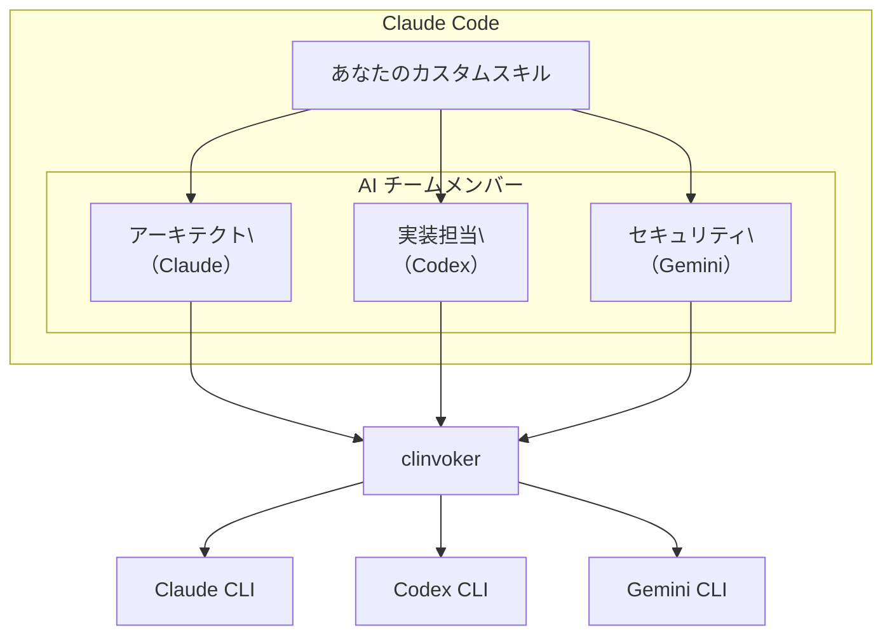

# チュートリアル: AI スキルの構築

clinvk（clinvoker）を使って他の AI バックエンドを呼び出し、Claude Code 自体の中で複雑なマルチエージェント・ワークフローを実現する Claude Code Skills の作り方を説明します。

## Claude Code Skills とは？

Claude Code Skills は、JSON 設定ファイルを通じて Claude Code に追加できるカスタム機能です。次のことができます。

- 専用の振る舞いとプロンプトを定義する
- 特定のツールやコマンドへのアクセスを許可する
- よくある作業の再利用可能なワークフローを作る

### スキルのアーキテクチャ



### Skills と clinvoker を組み合わせる理由

Claude Code Skills と clinvoker を組み合わせると、次のようなことができます。

1. **複数バックエンドにアクセス**: Claude Code をオーケストレータとして使い、コード生成は Codex、セキュリティ分析は Gemini といった使い分けができます
2. **コンテキスト保持**: Claude Code のセッション管理により、バックエンド呼び出しをまたいでも文脈を保ちやすくなります
3. **統一インターフェース**: 利用者は 1 つのスキルを使うだけで、裏側では複数 AI が協調して動きます
4. **専門性の活用**: タスクを最適なバックエンドへ自動ルーティングできます

---

## 前提条件

AI スキルを作る前に、次を確認してください。

- Claude Code がインストール/設定済み
- clinvoker がインストール済み（`clinvk` コマンドが利用可能）
- 少なくとも 2 つのバックエンドが設定済み（Claude/Codex/Gemini のいずれか）
- JSON 設定の基本理解

セットアップ確認:

```bash
# Claude Code
claude --version

# clinvoker
clinvk version

# 利用可能バックエンド
clinvk config show
```

---

## Claude Code Skills の構造

### スキル定義

Claude Code Skill は次のような形です。

```json
{
  "name": "skill-name",
  "description": "What this skill does",
  "prompt": "Instructions for Claude when using this skill",
  "tools": ["allowed", "tools"],
  "mention": {
    "prefix": "@mention-prefix"
  }
}
```

| フィールド | 説明 | 必須 |
|-------|-------------|----------|
| `name` | スキルの一意 ID | はい |
| `description` | 人が読める説明 | はい |
| `prompt` | スキル用のシステムプロンプト | はい |
| `tools` | 許可するツール/コマンドの配列 | いいえ |
| `mention` | @mention の設定 | いいえ |

### ツール統合

`tools` 配列に `clinvk` を含めると、Claude Code は clinvoker コマンドを実行できます。

```json
{
  "tools": ["clinvk", "jq", "git"]
}
```

これは、あなたの環境でこれらのコマンドを実行する権限をスキルに付与することを意味します。

---

## ステップ 1: 基本のマルチバックエンドスキルを作る

複数バックエンドを協調させる最初のスキルを作成します。

```bash
mkdir -p .claude/skills
```

`.claude/skills/ai-team.json` を作成します。

```json
{
  "name": "ai-team",
  "description": "Collaborate with AI team members (Claude, Codex, Gemini) to solve complex problems",
  "prompt": "You are coordinating an AI development team with three specialists:\n\n1. **Claude** (System Architect) - Best for design, architecture, and complex reasoning\n2. **Codex** (Implementer) - Best for writing, refactoring, and optimizing code\n3. **Gemini** (Security & Research) - Best for security analysis, documentation, and research\n\nWhen the user asks you to implement a feature or solve a problem:\n\n1. **First**, consult Claude to create an architecture/design plan\n2. **Then**, use Codex to implement the solution\n3. **Finally**, use Gemini to review for security issues\n4. **Synthesize** all feedback into a final recommendation\n\nUse the clinvk command to call different backends:\n- `clinvk -b claude \"<prompt>\"` - For architecture and design\n- `clinvk -b codex \"<prompt>\"` - For implementation\n- `clinvk -b gemini \"<prompt>\"` - For security and research\n\nAlways explain which team member you're consulting and why. Present the final solution with:\n- Architecture decisions and rationale\n- Implementation details\n- Security considerations\n- Any trade-offs made",
  "tools": ["clinvk"]
}
```

### このスキルの動き

1. `/ai-team` を呼ぶと、Claude Code はこのスキルのプロンプトをロードします
2. スキルは Claude に「コーディネータとして振る舞う」よう指示します
3. Claude は `clinvk` を使って専門タスクを他バックエンドへ依頼します
4. 返ってきた結果を統合し、包括的な回答を作ります

---

## ステップ 2: AI Team スキルをテストする

プロジェクトディレクトリで Claude Code を起動します。

```bash
claude
```

スキルを呼び出します。

```text
/ai-team I need to implement a secure user authentication system in Go
```

Claude は次を行うはずです。

1. `clinvk -b claude ...` で設計/アーキテクチャ案を作る
2. `clinvk -b codex ...` で実装の方向性やコードを作る
3. `clinvk -b gemini ...` でセキュリティ観点のレビューをする
4. 最終的に統合した提案を提示する

---

## ステップ 3: 並列レビュー用スキルを作る

3 バックエンドで同時にコードレビューを走らせるスキルを作成します。

`.claude/skills/multi-review.json` を作成します。

```json
{
  "name": "multi-review",
  "description": "Run parallel code reviews across Claude, Codex, and Gemini and synthesize results",
  "prompt": "You will perform a multi-backend code review using clinvoker parallel execution.\n\n## Workflow\n\n1. Ask the user to paste code or describe changes.\n2. Create a tasks.json with 3 tasks:\n   - Claude: architecture/correctness review\n   - Codex: implementation/edge cases review\n   - Gemini: security/performance review\n3. Execute: clinvk parallel --file tasks.json --json\n4. Parse results and present:\n\n## Review Summary\n[Key findings in 2-3 sentences]\n\n### Critical Issues\n- [Issue] - Found by: [backends]\n\n### Architecture (Claude)\n[Feedback]\n\n### Implementation (Codex)\n[Feedback]\n\n### Security (Gemini)\n[Feedback]\n\n### Recommendations\n1. [Priority] [Recommendation]\n",
  "tools": ["clinvk", "jq"]
}
```

### 使用例

```text
/multi-review
```

その後、プロンプトに従ってコードを貼り付けます。Claude は次を行います。

1. 並列レビュー用のタスクファイルを作成
2. `clinvk parallel` を実行して同時レビュー
3. JSON 結果をパース
4. 統合したレビュー結果を提示

---

## ステップ 4: バックエンドルータ・スキルを作る

ユーザーの要求に応じて最適なバックエンドへ自動ルーティングするスキルを作成します。

`.claude/skills/backend-router.json` を作成します。

```json
{
  "name": "backend-router",
  "description": "Automatically route tasks to the best AI backend for the job",
  "prompt": "You are an intelligent task router. Analyze the user's request and route it to the most appropriate AI backend.\n\n## Routing Rules\n\n| Task Type | Best Backend | Reason |\n|-----------|--------------|--------|\n| Architecture, design, complex reasoning | Claude | Deep reasoning, safety focus |\n| Code generation, refactoring, debugging | Codex | Optimized for coding tasks |\n| Security analysis, research, documentation | Gemini | Broad knowledge, security focus |\n| Quick questions, explanations | Default | Fastest response |\n\n## How to Route\n\n1. **Analyze** the user's request\n2. **Determine** the best backend using the rules above\n3. **Execute** using clinvoker:\n   ```bash\n   clinvk -b <backend> \"<optimized prompt>\"\n   ```\n4. **Present** the result with context about why you chose that backend\n\n## Examples\n\nUser: \"Design a microservices architecture\"\n- Route to: Claude\n- Reason: Requires architectural thinking and trade-off analysis\n\nUser: \"Implement a quicksort algorithm\"\n- Route to: Codex\n- Reason: Straightforward implementation task\n\nUser: \"Check this code for SQL injection\"\n- Route to: Gemini\n- Reason: Security-focused analysis\n\nAlways explain your routing decision to help the user understand backend strengths.",
  "tools": ["clinvk"]
}
```

---

## ステップ 5: セッション管理を使う上級スキル

複数セッションをまたいでコンテキストを保つスキルを作成します。

`.claude/skills/long-term-project.json` を作成します。

```json
{
  "name": "long-term-project",
  "description": "Manage long-term projects with persistent sessions across multiple AI backends",
  "prompt": "You help manage long-term coding projects using clinvoker's session persistence and multiple backends.\n\n## Capabilities\n\n1. **Session Management**:\n   - List active sessions: `clinvk sessions list`\n   - Resume previous work: `clinvk resume --last`\n   - Continue specific session: `clinvk resume <session-id>`\n\n2. **Multi-Backend Coordination**:\n   - Switch backends based on task phase\n   - Maintain context across backend switches\n   - Aggregate results from multiple sources\n\n## Workflow\n\nWhen starting work:\n1. Check for existing sessions: `clinvk sessions list`\n2. If found, ask user whether to resume\n3. If resuming: `clinvk resume --last`\n4. If new: Proceed with new session\n\nDuring work:\n- Use Claude for planning and architecture decisions\n- Use Codex for implementation phases\n- Use Gemini for security reviews and documentation\n- Tag sessions appropriately: `clinvk config set session.default_tags [\"project-x\"]`\n\nAt session end:\n- Summarize progress\n- Note any blockers or next steps\n- Suggest which backend to use next\n\n## Best Practices\n\n- Tag sessions with project names\n- Summarize progress at end of each session\n- Use specific session IDs for important work\n- Clean up old sessions periodically: `clinvk sessions cleanup`",
  "tools": ["clinvk"]
}
```

---

## ステップ 6: スキルでのエラーハンドリング

### よくあるエラーパターン

clinvoker を呼ぶスキルを作る場合、次のようなシナリオを扱えるようにしておくと運用しやすくなります。

#### バックエンドが利用できない

```json
{
  "prompt": "When calling clinvoker, handle backend errors:\n\nIf a backend is unavailable:\n1. Try an alternative backend:\n   - If Claude fails, try Gemini for analysis\n   - If Codex fails, try Claude for implementation\n2. Inform the user about the fallback\n3. Adjust expectations based on available backends\n\nExample error handling:\n```bash\n# Try primary backend\nresult=$(clinvk -b claude \"analyze this\" 2>&1) || {\n  # Fallback to Gemini\n  echo \"Claude unavailable, using Gemini...\"\n  result=$(clinvk -b gemini \"analyze this\" 2>&1)\n}\n```"
}
```

#### タイムアウト対応

```json
{
  "prompt": "Handle timeouts gracefully:\n\n1. Set appropriate timeouts for long tasks:\n   ```bash\n   clinvk -b claude --timeout 300 \"complex analysis\"\n   ```\n\n2. If timeout occurs:\n   - Break task into smaller chunks\n   - Use a faster backend\n   - Ask user if they want to continue\n\n3. For critical tasks, retry with exponential backoff"
}
```

---

## ステップ 7: ローカルでスキルをテストする

### スキルごとにテストする

`test-skills.sh` のような簡単な確認スクリプトを用意できます。

```bash
#!/bin/bash
# Test script for AI Skills

echo "Testing AI Team Skill..."
claude -c "echo 'Test'" 2>/dev/null || echo "Claude Code not running"

echo ""
echo "Testing clinvoker integration..."
clinvk -b claude --dry-run "test" > /dev/null && echo "clinvk OK" || echo "clinvk FAILED"

echo ""
echo "Testing backend availability..."
clinvk config show | grep -E "claude|codex|gemini"

echo ""
echo "All tests complete!"
```

### 手動テストチェックリスト

次のシナリオで各スキルを確認してください。

| スキル | テストケース | 期待結果 |
|-------|-----------|-----------------|
| ai-team | "Design an API" | 3 バックエンドを利用 |
| multi-review | コードを貼り付け | 並列レビューが実行される |
| backend-router | 複数タスク | 適切なバックエンドが選ばれる |
| long-term-project | セッション再開 | セッションが復元される |

---

## ステップ 8: 連携パターン

### パターン 1: 順次チェーン

バックエンド間で出力を渡しながら順番に実行します。

```json
{
  "prompt": "For sequential workflows:\n\n1. Step 1 - Design (Claude):\n   ```bash\n   design=$(clinvk -b claude \"Design a caching layer\")\n   ```\n\n2. Step 2 - Implement (Codex):\n   ```bash\n   code=$(clinvk -b codex \"Implement: $design\")\n   ```\n\n3. Step 3 - Review (Gemini):\n   ```bash\n   review=$(clinvk -b gemini \"Review: $code\")\n   ```\n\n4. Present all three results"
}
```

### パターン 2: 並列集約

並列に実行して結果を統合します。

```json
{
  "prompt": "For parallel analysis:\n\n```bash\necho '{\"tasks\":[\n  {\"backend\":\"claude\",\"prompt\":\"Analyze architecture\"},\n  {\"backend\":\"codex\",\"prompt\":\"Analyze performance\"},\n  {\"backend\":\"gemini\",\"prompt\":\"Analyze security\"}\n]}' | clinvk parallel -f - -o json | jq '.results[]'\n```\n\nAggregate findings and present unified view"
}
```

### パターン 3: フォールバックチェーン

成功するまでバックエンドを順に試します。

```json
{
  "prompt": "For resilient execution:\n\n```bash\n# Try backends in order\nfor backend in claude gemini codex; do\n  result=$(clinvk -b $backend \"task\" 2>&1) && break\ndone\n```\n\nPresent the successful result"
}
```

---

## デプロイ時の考慮

### バージョン管理

スキルをリポジトリに含めて管理できます。

```bash
# スキル用ディレクトリ作成
mkdir -p .claude/skills

# 追加
git add .claude/skills/
git commit -m "Add AI team skills for multi-backend workflows"
```

### スキルを共有する

チームでスキルを共有する例:

```bash
# エクスポート
tar czf ai-skills.tar.gz .claude/skills/

# 取り込み
tar xzf ai-skills.tar.gz
```

### 組織全体で配布する

1. 共有スキル用のリポジトリを用意する
2. symlink でスキルをリンクする:
   ```bash
   ln -s /shared/skills/* .claude/skills/
   ```
3. チームの wiki 等に使い方をまとめる

---

## ベストプラクティス

### 1. 役割分担を明確にする

各バックエンドの得意分野を明確にします。

```json
{
  "prompt": "Backend roles:\n- Claude: Architecture, reasoning, safety-critical decisions\n- Codex: Implementation, code generation, debugging\n- Gemini: Security, research, documentation"
}
```

### 2. エラーハンドリングを明示する

フォールバック手順を含めます。

```json
{
  "prompt": "If a backend fails:\n1. Try alternative backend\n2. Inform user of the change\n3. Adjust approach accordingly"
}
```

### 3. 構造化出力を要求する

パースしやすい形式で返すようにします。

```json
{
  "prompt": "Format results as:\n## Backend: <name>\n### Output\n<content>\n### Confidence\n<high/medium/low>"
}
```

### 4. セッションを意識する

マルチステップ作業ではセッションを活用します。

```json
{
  "prompt": "For multi-step tasks:\n1. Check existing sessions\n2. Resume if relevant\n3. Tag new sessions appropriately"
}
```

---

## トラブルシューティング

### スキルが表示されない

Claude Code にスキルが出てこない場合:

```bash
# 置き場所を確認
ls -la .claude/skills/

# JSON を検証
jq . .claude/skills/your-skill.json

# Claude Code を再起動
exit
claude
```

### clinvoker が見つからない

Claude が clinvoker を見つけられない場合:

```bash
# PATH にあるか確認
which clinvoker

# tools に追加
{
  "tools": ["clinvk", "jq"]
}

# 必要ならフルパスを使う
{
  "prompt": "Use full path: /usr/local/bin/clinvk"
}
```

### バックエンドエラー

バックエンド固有のエラーを扱います。

```json
{
  "prompt": "If you get 'backend not available':\n1. Check available backends: clinvk config show\n2. Use available backend\n3. Inform user of limitation"
}
```

---

## 次のステップ

- 永続的なワークフローには [セッション管理](../guides/sessions.md) を参照
- プログラム的な実行には [LangChain 連携](langchain-integration.md) を参照
- レビュー自動化には [マルチバックエンドのコードレビュー](multi-backend-code-review.md) を参照
- 内部構造は [アーキテクチャ概要](../concepts/architecture.md) を参照

---

## まとめ

このチュートリアルで学んだこと:

1. clinvoker を活用する Claude Code Skills の作り方
2. Claude Code 内から複数バックエンドを協調させる方法
3. エラーハンドリングとフォールバック戦略の組み込み方
4. 用途別スキル（レビュー、ルーティング、プロジェクト管理）の設計
5. スキルのテストとデプロイ

Claude Code Skills と clinvoker を組み合わせることで、各 AI アシスタントの強みを活かした強力なマルチエージェント・ワークフローを、統一されたユーザー体験のまま構築できます。
