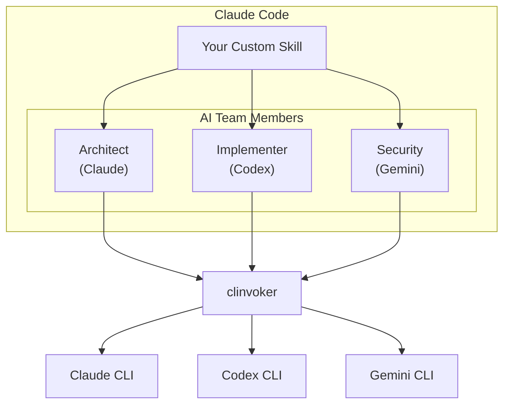

# Tutorial: Building AI Skills

Learn how to create Claude Code Skills that leverage clinvoker to call other AI backends, enabling complex multi-agent workflows within Claude Code itself.

## What Are Claude Code Skills?

Claude Code Skills are custom capabilities you can add to Claude Code through JSON configuration files. They allow you to:

- Define specialized behaviors and prompts
- Grant access to specific tools and commands
- Create reusable workflows for common tasks

### Skills Architecture



### Why Combine Skills with clinvoker?

By combining Claude Code Skills with clinvoker, you can:

1. **Access Multiple Backends**: Use Claude Code as the orchestrator while leveraging Codex for code generation and Gemini for security analysis
2. **Maintain Context**: Claude Code's session management preserves context across backend calls
3. **Unified Interface**: Users interact with a single skill while multiple AIs work behind the scenes
4. **Specialized Expertise**: Route tasks to the most appropriate backend automatically

---

## Prerequisites

Before building AI Skills, ensure you have:

- Claude Code installed and configured
- clinvoker installed (`clinvk` command available)
- At least two backends configured (Claude, Codex, and/or Gemini)
- Basic understanding of JSON configuration

Verify your setup:

```bash
# Check Claude Code
claude --version

# Check clinvoker
clinvk version

# Check available backends
clinvk config show
```

---

## Claude Code Skills Architecture

### Skill Structure

A Claude Code Skill consists of:

```json
{
  "name": "skill-name",
  "description": "What this skill does",
  "prompt": "Instructions for Claude when using this skill",
  "tools": ["allowed", "tools"],
  "mention": {
    "prefix": "@mention-prefix"
  }
}
```

| Field | Description | Required |
|-------|-------------|----------|
| `name` | Unique identifier for the skill | Yes |
| `description` | Human-readable description | Yes |
| `prompt` | System prompt for the skill | Yes |
| `tools` | Array of allowed tools/commands | No |
| `mention` | Configuration for @mentions | No |

### Tool Integration

When you include `clinvk` in the `tools` array, Claude Code can execute clinvoker commands:

```json
{
  "tools": ["clinvk", "jq", "git"]
}
```

This grants the skill permission to run these commands in your environment.

---

## Step 1: Create a Basic Multi-Backend Skill

Create your first skill that coordinates multiple backends:

```bash
mkdir -p .claude/skills
```

Create `.claude/skills/ai-team.json`:

```json
{
  "name": "ai-team",
  "description": "Collaborate with AI team members (Claude, Codex, Gemini) to solve complex problems",
  "prompt": "You are coordinating an AI development team with three specialists:\n\n1. **Claude** (System Architect) - Best for design, architecture, and complex reasoning\n2. **Codex** (Implementer) - Best for writing, refactoring, and optimizing code\n3. **Gemini** (Security & Research) - Best for security analysis, documentation, and research\n\nWhen the user asks you to implement a feature or solve a problem:\n\n1. **First**, consult Claude to create an architecture/design plan\n2. **Then**, use Codex to implement the solution\n3. **Finally**, use Gemini to review for security issues\n4. **Synthesize** all feedback into a final recommendation\n\nUse the clinvk command to call different backends:\n- `clinvk -b claude \"<prompt>\"` - For architecture and design\n- `clinvk -b codex \"<prompt>\"` - For implementation\n- `clinvk -b gemini \"<prompt>\"` - For security and research\n\nAlways explain which team member you're consulting and why. Present the final solution with:\n- Architecture decisions and rationale\n- Implementation details\n- Security considerations\n- Any trade-offs made",
  "tools": ["clinvk"]
}
```

### How This Skill Works

1. When you invoke `/ai-team`, Claude Code loads this skill's prompt
2. The skill instructs Claude to act as a coordinator
3. Claude uses `clinvk` to call other backends for specialized tasks
4. Results are synthesized into a comprehensive solution

---

## Step 2: Test the AI Team Skill

Start Claude Code in your project directory:

```bash
claude
```

Invoke the skill:

```text
/ai-team I need to implement a secure user authentication system in Go
```

Claude should:

1. Call `clinvk -b claude "Design a secure authentication system architecture in Go"`
2. Call `clinvk -b codex "Implement the authentication system based on [architecture]"`
3. Call `clinvk -b gemini "Review this authentication code for security vulnerabilities"`
4. Present a comprehensive solution combining all inputs

---

## Step 3: Create a Code Review Skill

Create a specialized skill for multi-backend code reviews:

Create `.claude/skills/multi-review.json`:

```json
{
  "name": "multi-review",
  "description": "Get comprehensive code reviews from multiple AI perspectives",
  "prompt": "You are a code review coordinator. When the user shares code:\n\n1. **Create parallel review tasks** for:\n   - **Claude**: Architecture, design patterns, and maintainability\n   - **Codex**: Implementation quality, performance, and optimization\n   - **Gemini**: Security vulnerabilities and best practices\n\n2. **Execute parallel review** using clinvoker:\n   ```bash\n   echo '{\"tasks\":[\n     {\"backend\":\"claude\",\"prompt\":\"Review architecture...\"},\n     {\"backend\":\"codex\",\"prompt\":\"Review implementation...\"},\n     {\"backend\":\"gemini\",\"prompt\":\"Security audit...\"}\n   ]}' | clinvk parallel -f -\n   ```\n\n3. **Synthesize the feedback** into a structured report:\n   - Executive Summary (key findings)\n   - Detailed Feedback by category\n   - Prioritized Recommendations\n   - Positive highlights\n\n4. **Highlight critical issues** found by multiple backends\n\nFormat your response as:\n```\n## Code Review Report\n\n### Summary\n[Key findings in 2-3 sentences]\n\n### Critical Issues\n- [Issue] - Found by: [backends]\n\n### Architecture (Claude)\n[Feedback]\n\n### Implementation (Codex)\n[Feedback]\n\n### Security (Gemini)\n[Feedback]\n\n### Recommendations\n1. [Priority] [Recommendation]\n```",
  "tools": ["clinvk", "jq"]
}
```

### Usage Example

```text
/multi-review
```

Then paste your code when prompted. Claude will:

1. Create a parallel review task file
2. Execute `clinvk parallel` to run all reviews simultaneously
3. Parse the JSON results
4. Present a unified review report

---

## Step 4: Create a Backend Router Skill

Create a skill that automatically routes tasks to the most appropriate backend:

Create `.claude/skills/backend-router.json`:

```json
{
  "name": "backend-router",
  "description": "Automatically route tasks to the best AI backend for the job",
  "prompt": "You are an intelligent task router. Analyze the user's request and route it to the most appropriate AI backend.\n\n## Routing Rules\n\n| Task Type | Best Backend | Reason |\n|-----------|--------------|--------|\n| Architecture, design, complex reasoning | Claude | Deep reasoning, safety focus |\n| Code generation, refactoring, debugging | Codex | Optimized for coding tasks |\n| Security analysis, research, documentation | Gemini | Broad knowledge, security focus |\n| Quick questions, explanations | Default | Fastest response |\n\n## How to Route\n\n1. **Analyze** the user's request\n2. **Determine** the best backend using the rules above\n3. **Execute** using clinvoker:\n   ```bash\n   clinvk -b <backend> \"<optimized prompt>\"\n   ```\n4. **Present** the result with context about why you chose that backend\n\n## Examples\n\nUser: \"Design a microservices architecture\"\n- Route to: Claude\n- Reason: Requires architectural thinking and trade-off analysis\n\nUser: \"Implement a quicksort algorithm\"\n- Route to: Codex\n- Reason: Straightforward implementation task\n\nUser: \"Check this code for SQL injection\"\n- Route to: Gemini\n- Reason: Security-focused analysis\n\nAlways explain your routing decision to help the user understand backend strengths.",
  "tools": ["clinvk"]
}
```

---

## Step 5: Advanced Skill with Session Management

Create a skill that maintains context across multiple sessions:

Create `.claude/skills/long-term-project.json`:

```json
{
  "name": "long-term-project",
  "description": "Manage long-term projects with persistent sessions across multiple AI backends",
  "prompt": "You help manage long-term coding projects using clinvoker's session persistence and multiple backends.\n\n## Capabilities\n\n1. **Session Management**:\n   - List active sessions: `clinvk sessions list`\n   - Resume previous work: `clinvk resume --last`\n   - Continue specific session: `clinvk resume <session-id>`\n\n2. **Multi-Backend Coordination**:\n   - Switch backends based on task phase\n   - Maintain context across backend switches\n   - Aggregate results from multiple sources\n\n## Workflow\n\nWhen starting work:\n1. Check for existing sessions: `clinvk sessions list`\n2. If found, ask user whether to resume\n3. If resuming: `clinvk resume --last`\n4. If new: Proceed with new session\n\nDuring work:\n- Use Claude for planning and architecture decisions\n- Use Codex for implementation phases\n- Use Gemini for security reviews and documentation\n- Tag sessions appropriately: `clinvk config set session.default_tags [\"project-x\"]`\n\nAt session end:\n- Summarize progress\n- Note any blockers or next steps\n- Suggest which backend to use next\n\n## Best Practices\n\n- Tag sessions with project names\n- Summarize progress at end of each session\n- Use specific session IDs for important work\n- Clean up old sessions periodically: `clinvk sessions cleanup`",
  "tools": ["clinvk"]
}
```

---

## Step 6: Error Handling in Skills

### Common Error Patterns

When building skills that call clinvoker, handle these scenarios:

#### Backend Unavailable

```json
{
  "prompt": "When calling clinvoker, handle backend errors:\n\nIf a backend is unavailable:\n1. Try an alternative backend:\n   - If Claude fails, try Gemini for analysis\n   - If Codex fails, try Claude for implementation\n2. Inform the user about the fallback\n3. Adjust expectations based on available backends\n\nExample error handling:\n```bash\n# Try primary backend\nresult=$(clinvk -b claude \"analyze this\" 2>&1) || {\n  # Fallback to Gemini\n  echo \"Claude unavailable, using Gemini...\"\n  result=$(clinvk -b gemini \"analyze this\" 2>&1)\n}\n```"
}
```

#### Timeout Handling

```json
{
  "prompt": "Handle timeouts gracefully:\n\n1. Set appropriate timeouts for long tasks:\n   ```bash\n   clinvk -b claude --timeout 300 \"complex analysis\"\n   ```\n\n2. If timeout occurs:\n   - Break task into smaller chunks\n   - Use a faster backend\n   - Ask user if they want to continue\n\n3. For critical tasks, retry with exponential backoff"
}
```

---

## Step 7: Testing Skills Locally

### Test Each Skill

Create a test script `test-skills.sh`:

```bash
#!/bin/bash
# Test script for AI Skills

echo "Testing AI Team Skill..."
claude -c "echo 'Test'" 2>/dev/null || echo "Claude Code not running"

echo ""
echo "Testing clinvoker integration..."
clinvk -b claude --dry-run "test" > /dev/null && echo "clinvk OK" || echo "clinvk FAILED"

echo ""
echo "Testing backend availability..."
clinvk config show | grep -E "claude|codex|gemini"

echo ""
echo "All tests complete!"
```

### Manual Testing Checklist

Test each skill with these scenarios:

| Skill | Test Case | Expected Result |
|-------|-----------|-----------------|
| ai-team | "Design an API" | Uses all 3 backends |
| multi-review | Paste code | Parallel review executed |
| backend-router | Various tasks | Correct backend chosen |
| long-term-project | Resume session | Session restored |

---

## Step 8: Integration Patterns

### Pattern 1: Sequential Chain

Execute tasks in sequence, passing output between backends:

```json
{
  "prompt": "For sequential workflows:\n\n1. Step 1 - Design (Claude):\n   ```bash\n   design=$(clinvk -b claude \"Design a caching layer\")\n   ```\n\n2. Step 2 - Implement (Codex):\n   ```bash\n   code=$(clinvk -b codex \"Implement: $design\")\n   ```\n\n3. Step 3 - Review (Gemini):\n   ```bash\n   review=$(clinvk -b gemini \"Review: $code\")\n   ```\n\n4. Present all three results"
}
```

### Pattern 2: Parallel Aggregation

Run tasks in parallel and combine results:

```json
{
  "prompt": "For parallel analysis:\n\n```bash\necho '{\"tasks\":[\n  {\"backend\":\"claude\",\"prompt\":\"Analyze architecture\"},\n  {\"backend\":\"codex\",\"prompt\":\"Analyze performance\"},\n  {\"backend\":\"gemini\",\"prompt\":\"Analyze security\"}\n]}' | clinvk parallel -f - -o json | jq '.results[]'\n```\n\nAggregate findings and present unified view"
}
```

### Pattern 3: Fallback Chain

Try backends in order until one succeeds:

```json
{
  "prompt": "For resilient execution:\n\n```bash\n# Try backends in order\nfor backend in claude gemini codex; do\n  result=$(clinvk -b $backend \"task\" 2>&1) && break\ndone\n```\n\nPresent the successful result"
}
```

---

## Deployment Considerations

### Version Control

Store skills in your repository:

```bash
# Create skills directory
mkdir -p .claude/skills

# Add skills
git add .claude/skills/
git commit -m "Add AI team skills for multi-backend workflows"
```

### Sharing Skills

Share skills with your team:

```bash
# Export skills
tar czf ai-skills.tar.gz .claude/skills/

# Others import
tar xzf ai-skills.tar.gz
```

### Organization-Wide Skills

For organization-wide deployment:

1. Create a shared skills repository
2. Use symlinks to link skills:
   ```bash
   ln -s /shared/skills/* .claude/skills/
   ```
3. Document skill usage in your team wiki

---

## Best Practices

### 1. Clear Role Definition

Define what each backend does best:

```json
{
  "prompt": "Backend roles:\n- Claude: Architecture, reasoning, safety-critical decisions\n- Codex: Implementation, code generation, debugging\n- Gemini: Security, research, documentation"
}
```

### 2. Explicit Error Handling

Always include fallback instructions:

```json
{
  "prompt": "If a backend fails:\n1. Try alternative backend\n2. Inform user of the change\n3. Adjust approach accordingly"
}
```

### 3. Structured Output

Request structured output for easier parsing:

```json
{
  "prompt": "Format results as:\n## Backend: <name>\n### Output\n<content>\n### Confidence\n<high/medium/low>"
}
```

### 4. Session Awareness

Use sessions for context preservation:

```json
{
  "prompt": "For multi-step tasks:\n1. Check existing sessions\n2. Resume if relevant\n3. Tag new sessions appropriately"
}
```

---

## Troubleshooting

### Skill Not Appearing

If your skill doesn't appear in Claude Code:

```bash
# Check file location
ls -la .claude/skills/

# Validate JSON
jq . .claude/skills/your-skill.json

# Restart Claude Code
exit
claude
```

### clinvoker Not Found

If Claude can't find clinvoker:

```bash
# Verify clinvoker in PATH
which clinvoker

# Add to skill tools
{
  "tools": ["clinvk", "jq"]
}

# Use full path if needed
{
  "prompt": "Use full path: /usr/local/bin/clinvk"
}
```

### Backend Errors

Handle backend-specific errors:

```json
{
  "prompt": "If you get 'backend not available':\n1. Check available backends: clinvk config show\n2. Use available backend\n3. Inform user of limitation"
}
```

---

## Next Steps

- Learn about [Session Management](../guides/sessions.md) for persistent workflows
- Explore [LangChain Integration](langchain-integration.md) for programmatic workflows
- See [Multi-Backend Code Review](multi-backend-code-review.md) for review automation
- Review [Architecture Overview](../concepts/architecture.md) for deep internals

---

## Summary

You have learned how to:

1. Create Claude Code Skills that leverage clinvoker
2. Coordinate multiple AI backends from within Claude Code
3. Implement error handling and fallback strategies
4. Design skills for different use cases (review, routing, project management)
5. Test and deploy skills effectively

By combining Claude Code Skills with clinvoker, you can create powerful multi-agent workflows that leverage the unique strengths of each AI assistant while maintaining a unified user experience.
