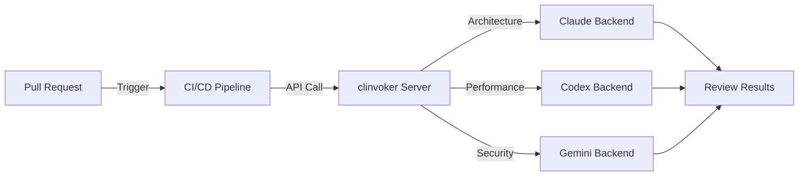

# Tutorial: CI/CD Integration

Learn how to integrate clinvoker into your CI/CD pipelines for automated code review, documentation generation, and AI-assisted testing. This tutorial covers GitHub Actions, GitLab CI, and Jenkins configurations.

## Why Integrate clinvoker into CI/CD?

### Benefits of AI-Powered CI/CD

| Benefit | Description |
|---------|-------------|
| Automated Code Review | Catch issues before human review |
| Consistent Quality | Apply the same standards across all PRs |
| Documentation | Auto-generate docs for changed code |
| Security Scanning | Identify vulnerabilities early |
| Cost Savings | Reduce manual review time |

### Integration Architecture



---

## Prerequisites

Before integrating clinvoker into CI/CD:

- clinvoker installed locally for testing
- Access to a CI/CD platform (GitHub Actions, GitLab CI, or Jenkins)
- API keys configured for your AI backends
- Basic understanding of YAML and shell scripting

### clinvoker Server Setup

For CI/CD, you need a persistent clinvoker server:

```yaml
# docker-compose.ci.yml
services:
  clinvk:
    image: signalridge/clinvoker:latest
    command: serve --port 8080
    environment:
      - CLINVK_API_KEYS=${CLINVK_API_KEYS}
      - CLINVK_BACKEND=claude
    ports:
      - "8080:8080"
    volumes:
      - ./config.yaml:/root/.clinvk/config.yaml
```

Deploy the server:

```bash
export CLINVK_API_KEYS="your-api-key-1,your-api-key-2"
docker-compose -f docker-compose.ci.yml up -d
```

---

## GitHub Actions Integration

### Complete Workflow Example

Create `.github/workflows/ai-code-review.yml`:

```yaml
name: AI Code Review

on:
  pull_request:
    types: [opened, synchronize]
    paths:
      - "**.go"
      - "**.py"
      - "**.js"
      - "**.ts"
      - "**.rs"

env:
  CLINVK_SERVER: ${{ secrets.CLINVK_SERVER_URL }}
  CLINVK_API_KEY: ${{ secrets.CLINVK_API_KEY }}

jobs:
  # Job 1: Architecture Review with Claude
  architecture-review:
    runs-on: ubuntu-latest
    steps:
      - name: Checkout code
        uses: actions/checkout@v4
        with:
          fetch-depth: 0

      - name: Install clinvoker CLI
        run: |
          curl -sSL https://raw.githubusercontent.com/signalridge/clinvoker/main/install.sh | bash
          echo "$HOME/.local/bin" >> $GITHUB_PATH

      - name: Get PR diff
        id: diff
        run: |
          git diff origin/${{ github.base_ref }}...HEAD > pr.diff
          echo "size=$(wc -c < pr.diff)" >> $GITHUB_OUTPUT

      - name: Skip if diff too large
        if: steps.diff.outputs.size > 50000
        run: |
          echo "Diff too large for AI review (>50KB)"
          exit 0

      - name: Run architecture review
        id: review
        run: |
          DIFF=$(cat pr.diff | jq -Rs '.')

          curl -X POST "${CLINVK_SERVER}/api/v1/prompt" \
            -H "Authorization: Bearer ${CLINVK_API_KEY}" \
            -H "Content-Type: application/json" \
            -d "{
              \"backend\": \"claude\",
              \"prompt\": \"Review this PR diff for architecture and design patterns. Focus on: 1) SOLID principles, 2) Design patterns, 3) Code organization. DIFF: ${DIFF}\",
              \"output_format\": \"json\"
            }" > architecture-review.json

          echo "result=$(cat architecture-review.json | jq -c .)" >> $GITHUB_OUTPUT

      - name: Upload review artifact
        uses: actions/upload-artifact@v4
        with:
          name: architecture-review
          path: architecture-review.json

  # Job 2: Performance Review with Codex
  performance-review:
    runs-on: ubuntu-latest
    steps:
      - name: Checkout code
        uses: actions/checkout@v4
        with:
          fetch-depth: 0

      - name: Install clinvoker CLI
        run: |
          curl -sSL https://raw.githubusercontent.com/signalridge/clinvoker/main/install.sh | bash
          echo "$HOME/.local/bin" >> $GITHUB_PATH

      - name: Get PR diff
        run: git diff origin/${{ github.base_ref }}...HEAD > pr.diff

      - name: Run performance review
        run: |
          DIFF=$(cat pr.diff | jq -Rs '.')

          curl -X POST "${CLINVK_SERVER}/api/v1/prompt" \
            -H "Authorization: Bearer ${CLINVK_API_KEY}" \
            -H "Content-Type: application/json" \
            -d "{
              \"backend\": \"codex\",
              \"prompt\": \"Review this PR diff for performance implications. Focus on: 1) Algorithmic complexity, 2) Resource usage, 3) Optimization opportunities. DIFF: ${DIFF}\",
              \"output_format\": \"json\"
            }" > performance-review.json

      - name: Upload review artifact
        uses: actions/upload-artifact@v4
        with:
          name: performance-review
          path: performance-review.json

  # Job 3: Security Review with Gemini
  security-review:
    runs-on: ubuntu-latest
    steps:
      - name: Checkout code
        uses: actions/checkout@v4
        with:
          fetch-depth: 0

      - name: Install clinvoker CLI
        run: |
          curl -sSL https://raw.githubusercontent.com/signalridge/clinvoker/main/install.sh | bash
          echo "$HOME/.local/bin" >> $GITHUB_PATH

      - name: Get PR diff
        run: git diff origin/${{ github.base_ref }}...HEAD > pr.diff

      - name: Run security review
        run: |
          DIFF=$(cat pr.diff | jq -Rs '.')

          curl -X POST "${CLINVK_SERVER}/api/v1/prompt" \
            -H "Authorization: Bearer ${CLINVK_API_KEY}" \
            -H "Content-Type: application/json" \
            -d "{
              \"backend\": \"gemini\",
              \"prompt\": \"Security audit of this PR diff. Focus on: 1) SQL injection, 2) XSS vulnerabilities, 3) Authentication issues, 4) OWASP risks. DIFF: ${DIFF}\",
              \"output_format\": \"json\"
            }" > security-review.json

      - name: Upload review artifact
        uses: actions/upload-artifact@v4
        with:
          name: security-review
          path: security-review.json

  # Job 4: Aggregate and Post Results
  post-review:
    needs: [architecture-review, performance-review, security-review]
    runs-on: ubuntu-latest
    steps:
      - name: Download all artifacts
        uses: actions/download-artifact@v4

      - name: Aggregate reviews
        id: aggregate
        run: |
          # Create combined report
          cat > review-report.md << 'EOF'
          ## AI Code Review Results

          ### Summary
          This PR has been reviewed by three AI backends for comprehensive feedback.

          EOF

          # Add architecture review
          echo "#### Architecture Review (Claude)" >> review-report.md
          jq -r '.output' architecture-review/architecture-review.json >> review-report.md
          echo "" >> review-report.md

          # Add performance review
          echo "#### Performance Review (Codex)" >> review-report.md
          jq -r '.output' performance-review/performance-review.json >> review-report.md
          echo "" >> review-report.md

          # Add security review
          echo "#### Security Review (Gemini)" >> review-report.md
          jq -r '.output' security-review/security-review.json >> review-report.md

          # Check for critical issues
          CRITICAL=$(cat architecture-review/architecture-review.json performance-review/performance-review.json security-review/security-review.json | grep -i "critical" || true)
          if [ -n "$CRITICAL" ]; then
            echo "has_critical=true" >> $GITHUB_OUTPUT
          else
            echo "has_critical=false" >> $GITHUB_OUTPUT
          fi

      - name: Post review comment
        uses: actions/github-script@v7
        with:
          script: |
            const fs = require('fs');
            const body = fs.readFileSync('review-report.md', 'utf8');

            github.rest.issues.createComment({
              issue_number: context.issue.number,
              owner: context.repo.owner,
              repo: context.repo.repo,
              body: body.substring(0, 65536)
            });

      - name: Fail on critical issues
        if: steps.aggregate.outputs.has_critical == 'true'
        run: |
          echo "::error::Critical issues found in AI review"
          exit 1
```

### Pull Request Comment Automation

The workflow automatically posts a comment on the PR:


### Fail Conditions and Exit Codes

clinvoker uses standard exit codes that you can use in CI/CD:

| Exit Code | Meaning | CI/CD Action |
|-----------|---------|--------------|
| 0 | Success | Continue |
| 1 | General error | Fail build |
| 2 | Backend error | Retry or fail |
| 3 | Timeout | Retry with longer timeout |
| 4 | Invalid input | Fail fast |

Configure fail conditions in your workflow:

```yaml
- name: Check for critical issues
  run: |
    # Check if any review found critical issues
    if grep -qi "critical\|severe\|blocker" review-*.json; then
      echo "::error::Critical issues found"
      exit 1
    fi
```

---

## GitLab CI Integration

### Complete Configuration

Create `.gitlab-ci.yml`:

```yaml
stages:
  - review
  - report

variables:
  CLINVK_SERVER: $CLINVK_SERVER_URL
  CLINVK_API_KEY: $CLINVK_API_KEY

# Template for review jobs
.ai_review:
  stage: review
  image: alpine/curl
  before_script:
    - apk add --no-cache jq git bash
    - curl -sSL https://raw.githubusercontent.com/signalridge/clinvoker/main/install.sh | bash
    - export PATH="$PATH:$HOME/.local/bin"
  rules:
    - if: $CI_MERGE_REQUEST_IID

# Architecture Review
architecture-review:
  extends: .ai_review
  script:
    - git fetch origin $CI_MERGE_REQUEST_TARGET_BRANCH_NAME
    - git diff origin/$CI_MERGE_REQUEST_TARGET_BRANCH_NAME...HEAD > mr.diff
    - |
      DIFF=$(cat mr.diff | jq -Rs '.')
      curl -X POST "${CLINVK_SERVER}/api/v1/prompt" \
        -H "Authorization: Bearer ${CLINVK_API_KEY}" \
        -H "Content-Type: application/json" \
        -d "{
          \"backend\": \"claude\",
          \"prompt\": \"Review architecture: ${DIFF}\"
        }" > architecture-review.json
    - cat architecture-review.json | jq -r '.output'
  artifacts:
    paths:
      - architecture-review.json
    expire_in: 1 week

# Performance Review
performance-review:
  extends: .ai_review
  script:
    - git fetch origin $CI_MERGE_REQUEST_TARGET_BRANCH_NAME
    - git diff origin/$CI_MERGE_REQUEST_TARGET_BRANCH_NAME...HEAD > mr.diff
    - |
      DIFF=$(cat mr.diff | jq -Rs '.')
      curl -X POST "${CLINVK_SERVER}/api/v1/prompt" \
        -H "Authorization: Bearer ${CLINVK_API_KEY}" \
        -H "Content-Type: application/json" \
        -d "{
          \"backend\": \"codex\",
          \"prompt\": \"Review performance: ${DIFF}\"
        }" > performance-review.json
  artifacts:
    paths:
      - performance-review.json
    expire_in: 1 week

# Security Review
security-review:
  extends: .ai_review
  script:
    - git fetch origin $CI_MERGE_REQUEST_TARGET_BRANCH_NAME
    - git diff origin/$CI_MERGE_REQUEST_TARGET_BRANCH_NAME...HEAD > mr.diff
    - |
      DIFF=$(cat mr.diff | jq -Rs '.')
      curl -X POST "${CLINVK_SERVER}/api/v1/prompt" \
        -H "Authorization: Bearer ${CLINVK_API_KEY}" \
        -H "Content-Type: application/json" \
        -d "{
          \"backend\": \"gemini\",
          \"prompt\": \"Security audit: ${DIFF}\"
        }" > security-review.json
  artifacts:
    paths:
      - security-review.json
    expire_in: 1 week

# Aggregate and Post Results
post-review:
  stage: report
  image: alpine/jq
  needs: [architecture-review, performance-review, security-review]
  script:
    - |
      echo "## AI Code Review Results" > review-report.md
      echo "" >> review-report.md
      echo "### Architecture (Claude)" >> review-report.md
      jq -r '.output' architecture-review.json >> review-report.md
      echo "" >> review-report.md
      echo "### Performance (Codex)" >> review-report.md
      jq -r '.output' performance-review.json >> review-report.md
      echo "" >> review-report.md
      echo "### Security (Gemini)" >> review-report.md
      jq -r '.output' security-review.json >> review-report.md
    - cat review-report.md
  artifacts:
    paths:
      - review-report.md
    expire_in: 1 week
  rules:
    - if: $CI_MERGE_REQUEST_IID
```

---

## Jenkins Pipeline

### Complete Pipeline Example

Create `Jenkinsfile`:

```groovy
pipeline {
    agent any

    environment {
        CLINVK_SERVER = credentials('clinvk-server-url')
        CLINVK_API_KEY = credentials('clinvk-api-key')
    }

    stages {
        stage('Checkout') {
            steps {
                checkout scm
                sh 'git fetch origin'
            }
        }

        stage('Install clinvoker') {
            steps {
                sh '''
                    curl -sSL https://raw.githubusercontent.com/signalridge/clinvoker/main/install.sh | bash
                    export PATH="$PATH:$HOME/.local/bin"
                    clinvk version
                '''
            }
        }

        stage('Get Diff') {
            when {
                changeRequest()
            }
            steps {
                sh '''
                    git diff origin/${CHANGE_TARGET}...HEAD > pr.diff || true
                    if [ -s pr.diff ]; then
                        echo "Diff size: $(wc -c < pr.diff) bytes"
                    else
                        echo "No changes to review"
                        touch pr.diff
                    fi
                '''
            }
        }

        stage('Parallel AI Review') {
            when {
                changeRequest()
            }
            parallel {
                stage('Architecture Review') {
                    steps {
                        sh '''
                            export PATH="$PATH:$HOME/.local/bin"
                            DIFF=$(cat pr.diff | jq -Rs '.')
                            curl -X POST "${CLINVK_SERVER}/api/v1/prompt" \
                                -H "Authorization: Bearer ${CLINVK_API_KEY}" \
                                -H "Content-Type: application/json" \
                                -d "{
                                    \"backend\": \"claude\",
                                    \"prompt\": \"Architecture review: ${DIFF}\"
                                }" > architecture-review.json
                        '''
                    }
                }
                stage('Performance Review') {
                    steps {
                        sh '''
                            export PATH="$PATH:$HOME/.local/bin"
                            DIFF=$(cat pr.diff | jq -Rs '.')
                            curl -X POST "${CLINVK_SERVER}/api/v1/prompt" \
                                -H "Authorization: Bearer ${CLINVK_API_KEY}" \
                                -H "Content-Type: application/json" \
                                -d "{
                                    \"backend\": \"codex\",
                                    \"prompt\": \"Performance review: ${DIFF}\"
                                }" > performance-review.json
                        '''
                    }
                }
                stage('Security Review') {
                    steps {
                        sh '''
                            export PATH="$PATH:$HOME/.local/bin"
                            DIFF=$(cat pr.diff | jq -Rs '.')
                            curl -X POST "${CLINVK_SERVER}/api/v1/prompt" \
                                -H "Authorization: Bearer ${CLINVK_API_KEY}" \
                                -H "Content-Type: application/json" \
                                -d "{
                                    \"backend\": \"gemini\",
                                    \"prompt\": \"Security audit: ${DIFF}\"
                                }" > security-review.json
                        '''
                    }
                }
            }
        }

        stage('Aggregate Results') {
            when {
                changeRequest()
            }
            steps {
                sh '''
                    echo "# AI Code Review Report" > review-report.md
                    echo "" >> review-report.md

                    if [ -f architecture-review.json ]; then
                        echo "## Architecture Review" >> review-report.md
                        jq -r '.output' architecture-review.json >> review-report.md
                        echo "" >> review-report.md
                    fi

                    if [ -f performance-review.json ]; then
                        echo "## Performance Review" >> review-report.md
                        jq -r '.output' performance-review.json >> review-report.md
                        echo "" >> review-report.md
                    fi

                    if [ -f security-review.json ]; then
                        echo "## Security Review" >> review-report.md
                        jq -r '.output' security-review.json >> review-report.md
                    fi

                    cat review-report.md
                '''
            }
        }

        stage('Check Critical Issues') {
            when {
                changeRequest()
            }
            steps {
                script {
                    def hasCritical = sh(
                        script: 'grep -qi "critical\|severe" *-review.json && echo "true" || echo "false"',
                        returnStdout: true
                    ).trim()

                    if (hasCritical == "true") {
                        error("Critical issues found in AI review")
                    }
                }
            }
        }
    }

    post {
        always {
            archiveArtifacts artifacts: '*-review.json,review-report.md', allowEmptyArchive: true
        }
    }
}
```

---

## Rate Limiting Considerations

### Understanding Rate Limits

AI backends have rate limits that affect CI/CD:

| Backend | Rate Limit | Burst |
|---------|-----------|-------|
| Claude | 40 requests/min | 60 |
| Codex | 60 requests/min | 100 |
| Gemini | 60 requests/min | 100 |

### Rate Limiting Strategies

#### 1. Request Batching

Batch multiple files into single requests:

```yaml
- name: Batch review
  run: |
    # Combine multiple small files
    cat file1.go file2.go file3.go > combined.go
    clinvk -b claude "Review these files: $(cat combined.go)"
```

#### 2. Exponential Backoff

Implement retry logic with backoff:

```yaml
- name: Review with retry
  run: |
    for i in 1 2 3; do
      clinvk -b claude "Review this" && break
      sleep $((2 ** i))
    done
```

#### 3. clinvoker Server Rate Limiting

Configure rate limiting on your clinvoker server:

```yaml
server:
  rate_limit_enabled: true
  rate_limit_rps: 10
  rate_limit_burst: 20
```

---

## Secrets Management Best Practices

### 1. Never Hardcode Secrets

```yaml
# BAD - Never do this
env:
  CLINVK_API_KEY: "sk-12345..."

# GOOD - Use secrets
env:
  CLINVK_API_KEY: ${{ secrets.CLINVK_API_KEY }}
```

### 2. Use Environment-Specific Secrets

```yaml
# Production
- name: Production Review
  if: github.ref == 'refs/heads/main'
  env:
    CLINVK_API_KEY: ${{ secrets.CLINVK_API_KEY_PROD }}

# Development
- name: Development Review
  if: github.ref != 'refs/heads/main'
  env:
    CLINVK_API_KEY: ${{ secrets.CLINVK_API_KEY_DEV }}
```

### 3. Rotate Keys Regularly

```bash
# Set up key rotation reminder
# Rotate every 90 days
# Update in GitHub/GitLab/Jenkins secrets
```

### 4. Limit Key Scope

Create separate API keys for CI/CD:

| Key | Purpose | Permissions |
|-----|---------|-------------|
| ci-readonly | Code review | Read-only |
| ci-full | Full automation | Read-write |

---

## Cost Optimization Strategies

### 1. Diff-Based Reviews Only

```yaml
- name: Check if review needed
  run: |
    # Only review changed files
    CHANGED=$(git diff --name-only origin/main...HEAD | grep -E '\.(go|py|js)$')
    if [ -z "$CHANGED" ]; then
      echo "No code changes to review"
      exit 0
    fi
```

### 2. Size Limits

```yaml
- name: Skip large diffs
  run: |
    SIZE=$(git diff origin/main...HEAD | wc -c)
    if [ $SIZE -gt 50000 ]; then
      echo "Diff too large for AI review"
      exit 0
    fi
```

### 3. Selective Backend Usage

```yaml
# Use cheaper backends for simple tasks
- name: Quick check
  run: |
    clinvk -b codex "Quick review"  # Faster, cheaper

- name: Deep review
  run: |
    clinvk -b claude "Deep analysis"  # More expensive
```

### 4. Caching Results

```yaml
- uses: actions/cache@v4
  with:
    path: .ai-reviews
    key: ai-reviews-${{ hashFiles('**/*.go') }}
```

---

## Troubleshooting

### Issue: Backend Timeout

**Solution**: Increase timeout and add retry:

```yaml
- name: Review with timeout
  run: |
    clinvk -b claude --timeout 300 "Review this"
```

### Issue: Rate Limit Exceeded

**Solution**: Add delays between requests:

```yaml
- name: Rate-limited review
  run: |
    for file in *.go; do
      clinvk -b claude "Review $file"
      sleep 2  # Rate limit buffer
    done
```

### Issue: Secrets Not Available

**Solution**: Check secret configuration:

```bash
# Verify secret is set
echo "Secret length: ${#CLINVK_API_KEY}"
```

---

## Next Steps

- Learn about [Multi-Backend Code Review](multi-backend-code-review.md) for advanced patterns
- Explore [HTTP Server](../guides/http-server.md) for custom deployments
- See [Building AI Skills](building-ai-skills.md) for custom automation
- Review [Configuration Reference](../reference/configuration.md) for all options

---

## Summary

You have learned how to:

1. Set up clinvoker server for CI/CD integration
2. Configure GitHub Actions for automated code review
3. Set up GitLab CI for multi-backend reviews
4. Create Jenkins pipelines with AI integration
5. Implement rate limiting and cost optimization
6. Manage secrets securely
7. Handle common CI/CD integration issues

By integrating clinvoker into your CI/CD pipeline, you can automate code quality checks, catch issues early, and reduce manual review time while maintaining high standards.
