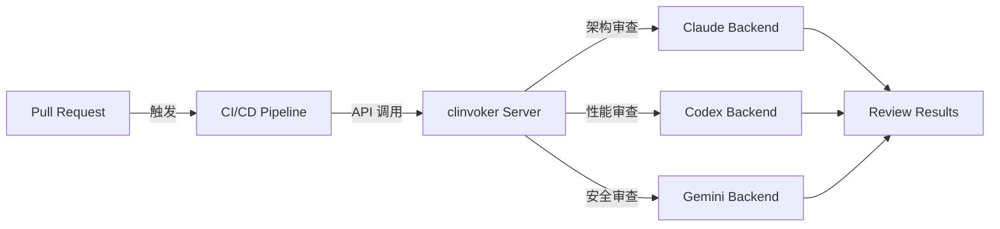

# 教程：CI/CD 集成

学习如何将 clinvoker 集成到您的 CI/CD 流水线中，实现自动化代码审查、文档生成和 AI 辅助测试。本教程涵盖 GitHub Actions、GitLab CI 和 Jenkins 配置。

## 为什么将 clinvoker 集成到 CI/CD？

### AI 驱动 CI/CD 的优势

| 优势 | 描述 |
|------|------|
| 自动化代码审查 | 在人工审查之前发现问题 |
| 一致的质量 | 对所有 PR 应用相同的标准 |
| 文档生成 | 为变更的代码自动生成文档 |
| 安全扫描 | 早期识别漏洞 |
| 成本节约 | 减少人工审查时间 |

### 集成架构



---

## 前置要求

在将 clinvoker 集成到 CI/CD 之前：

- 本地安装 clinvoker 用于测试
- 访问 CI/CD 平台（GitHub Actions、GitLab CI 或 Jenkins）
- 为您的 AI 后端配置 API 密钥
- 对 YAML 和 shell 脚本有基本了解

### clinvoker 服务器设置

对于 CI/CD，您需要一个持久的 clinvoker 服务器：

```yaml
# docker-compose.ci.yml
services:
  clinvk:
    image: signalridge/clinvoker:latest
    command: serve --port 8080
    environment:
      - CLINVK_API_KEYS=${CLINVK_API_KEYS}
      - CLINVK_BACKEND=claude
    ports:
      - "8080:8080"
    volumes:
      - ./config.yaml:/root/.clinvk/config.yaml
```

部署服务器：

```bash
export CLINVK_API_KEYS="your-api-key-1,your-api-key-2"
docker-compose -f docker-compose.ci.yml up -d
```

---

## GitHub Actions 集成

### 完整工作流示例

创建 `.github/workflows/ai-code-review.yml`：

```yaml
name: AI 代码审查

on:
  pull_request:
    types: [opened, synchronize]
    paths:
      - "**.go"
      - "**.py"
      - "**.js"
      - "**.ts"
      - "**.rs"

env:
  CLINVK_SERVER: ${{ secrets.CLINVK_SERVER_URL }}
  CLINVK_API_KEY: ${{ secrets.CLINVK_API_KEY }}

jobs:
  # 任务 1：使用 Claude 进行架构审查
  architecture-review:
    runs-on: ubuntu-latest
    steps:
      - name: 检出代码
        uses: actions/checkout@v4
        with:
          fetch-depth: 0

      - name: 安装 clinvoker CLI
        run: |
          curl -sSL https://raw.githubusercontent.com/signalridge/clinvoker/main/install.sh | bash
          echo "$HOME/.local/bin" >> $GITHUB_PATH

      - name: 获取 PR diff
        id: diff
        run: |
          git diff origin/${{ github.base_ref }}...HEAD > pr.diff
          echo "size=$(wc -c < pr.diff)" >> $GITHUB_OUTPUT

      - name: 如果 diff 太大则跳过
        if: steps.diff.outputs.size > 50000
        run: |
          echo "Diff 太大，不适合 AI 审查 (>50KB)"
          exit 0

      - name: 运行架构审查
        id: review
        run: |
          DIFF=$(cat pr.diff | jq -Rs '.')

          curl -X POST "${CLINVK_SERVER}/api/v1/prompt" \
            -H "Authorization: Bearer ${CLINVK_API_KEY}" \
            -H "Content-Type: application/json" \
            -d "{
              \"backend\": \"claude\",
              \"prompt\": \"审查此 PR diff 的架构和设计模式。关注：1) SOLID 原则，2) 设计模式，3) 代码组织。DIFF: ${DIFF}\",
              \"output_format\": \"json\"
            }" > architecture-review.json

          echo "result=$(cat architecture-review.json | jq -c .)" >> $GITHUB_OUTPUT

      - name: 上传审查产物
        uses: actions/upload-artifact@v4
        with:
          name: architecture-review
          path: architecture-review.json

  # 任务 2：使用 Codex 进行性能审查
  performance-review:
    runs-on: ubuntu-latest
    steps:
      - name: 检出代码
        uses: actions/checkout@v4
        with:
          fetch-depth: 0

      - name: 安装 clinvoker CLI
        run: |
          curl -sSL https://raw.githubusercontent.com/signalridge/clinvoker/main/install.sh | bash
          echo "$HOME/.local/bin" >> $GITHUB_PATH

      - name: 获取 PR diff
        run: git diff origin/${{ github.base_ref }}...HEAD > pr.diff

      - name: 运行性能审查
        run: |
          DIFF=$(cat pr.diff | jq -Rs '.')

          curl -X POST "${CLINVK_SERVER}/api/v1/prompt" \
            -H "Authorization: Bearer ${CLINVK_API_KEY}" \
            -H "Content-Type: application/json" \
            -d "{
              \"backend\": \"codex\",
              \"prompt\": \"审查此 PR diff 的性能影响。关注：1) 算法复杂度，2) 资源使用，3) 优化机会。DIFF: ${DIFF}\",
              \"output_format\": \"json\"
            }" > performance-review.json

      - name: 上传审查产物
        uses: actions/upload-artifact@v4
        with:
          name: performance-review
          path: performance-review.json

  # 任务 3：使用 Gemini 进行安全审查
  security-review:
    runs-on: ubuntu-latest
    steps:
      - name: 检出代码
        uses: actions/checkout@v4
        with:
          fetch-depth: 0

      - name: 安装 clinvoker CLI
        run: |
          curl -sSL https://raw.githubusercontent.com/signalridge/clinvoker/main/install.sh | bash
          echo "$HOME/.local/bin" >> $GITHUB_PATH

      - name: 获取 PR diff
        run: git diff origin/${{ github.base_ref }}...HEAD > pr.diff

      - name: 运行安全审查
        run: |
          DIFF=$(cat pr.diff | jq -Rs '.')

          curl -X POST "${CLINVK_SERVER}/api/v1/prompt" \
            -H "Authorization: Bearer ${CLINVK_API_KEY}" \
            -H "Content-Type: application/json" \
            -d "{
              \"backend\": \"gemini\",
              \"prompt\": \"对此 PR diff 进行安全审计。关注：1) SQL 注入，2) XSS 漏洞，3) 认证问题，4) OWASP 风险。DIFF: ${DIFF}\",
              \"output_format\": \"json\"
            }" > security-review.json

      - name: 上传审查产物
        uses: actions/upload-artifact@v4
        with:
          name: security-review
          path: security-review.json

  # 任务 4：聚合并发布结果
  post-review:
    needs: [architecture-review, performance-review, security-review]
    runs-on: ubuntu-latest
    steps:
      - name: 下载所有产物
        uses: actions/download-artifact@v4

      - name: 聚合审查
        id: aggregate
        run: |
          # 创建合并报告
          cat > review-report.md << 'EOF'
          ## AI 代码审查结果

          ### 摘要
          此 PR 已由三个 AI 后端审查，提供全面反馈。

          EOF

          # 添加架构审查
          echo "#### 架构审查 (Claude)" >> review-report.md
          jq -r '.output' architecture-review/architecture-review.json >> review-report.md
          echo "" >> review-report.md

          # 添加性能审查
          echo "#### 性能审查 (Codex)" >> review-report.md
          jq -r '.output' performance-review/performance-review.json >> review-report.md
          echo "" >> review-report.md

          # 添加安全审查
          echo "#### 安全审查 (Gemini)" >> review-report.md
          jq -r '.output' security-review/security-review.json >> review-report.md

          # 检查严重问题
          CRITICAL=$(cat architecture-review/architecture-review.json performance-review/performance-review.json security-review/security-review.json | grep -i "critical" || true)
          if [ -n "$CRITICAL" ]; then
            echo "has_critical=true" >> $GITHUB_OUTPUT
          else
            echo "has_critical=false" >> $GITHUB_OUTPUT
          fi

      - name: 发布审查评论
        uses: actions/github-script@v7
        with:
          script: |
            const fs = require('fs');
            const body = fs.readFileSync('review-report.md', 'utf8');

            github.rest.issues.createComment({
              issue_number: context.issue.number,
              owner: context.repo.owner,
              repo: context.repo.repo,
              body: body.substring(0, 65536)
            });

      - name: 发现严重问题时失败
        if: steps.aggregate.outputs.has_critical == 'true'
        run: |
          echo "::error::AI 审查发现严重问题"
          exit 1
```

### Pull Request 评论自动化

工作流自动在 PR 上发布评论：

### 失败条件和退出码

clinvoker 使用标准退出码，您可以在 CI/CD 中使用：

| 退出码 | 含义 | CI/CD 操作 |
|--------|------|-----------|
| 0 | 成功 | 继续 |
| 1 | 一般错误 | 构建失败 |
| 2 | 后端错误 | 重试或失败 |
| 3 | 超时 | 使用更长超时重试 |
| 4 | 无效输入 | 快速失败 |

在工作流中配置失败条件：

```yaml
- name: 检查严重问题
  run: |
    # 检查是否有审查发现严重问题
    if grep -qi "critical\|severe\|blocker" review-*.json; then
      echo "::error::发现严重问题"
      exit 1
    fi
```

---

## GitLab CI 集成

### 完整配置

创建 `.gitlab-ci.yml`：

```yaml
stages:
  - review
  - report

variables:
  CLINVK_SERVER: $CLINVK_SERVER_URL
  CLINVK_API_KEY: $CLINVK_API_KEY

# 审查任务的模板
.ai_review:
  stage: review
  image: alpine/curl
  before_script:
    - apk add --no-cache jq git bash
    - curl -sSL https://raw.githubusercontent.com/signalridge/clinvoker/main/install.sh | bash
    - export PATH="$PATH:$HOME/.local/bin"
  rules:
    - if: $CI_MERGE_REQUEST_IID

# 架构审查
architecture-review:
  extends: .ai_review
  script:
    - git fetch origin $CI_MERGE_REQUEST_TARGET_BRANCH_NAME
    - git diff origin/$CI_MERGE_REQUEST_TARGET_BRANCH_NAME...HEAD > mr.diff
    - |
      DIFF=$(cat mr.diff | jq -Rs '.')
      curl -X POST "${CLINVK_SERVER}/api/v1/prompt" \
        -H "Authorization: Bearer ${CLINVK_API_KEY}" \
        -H "Content-Type: application/json" \
        -d "{
          \"backend\": \"claude\",
          \"prompt\": \"架构审查: ${DIFF}\"
        }" > architecture-review.json
    - cat architecture-review.json | jq -r '.output'
  artifacts:
    paths:
      - architecture-review.json
    expire_in: 1 week

# 性能审查
performance-review:
  extends: .ai_review
  script:
    - git fetch origin $CI_MERGE_REQUEST_TARGET_BRANCH_NAME
    - git diff origin/$CI_MERGE_REQUEST_TARGET_BRANCH_NAME...HEAD > mr.diff
    - |
      DIFF=$(cat mr.diff | jq -Rs '.')
      curl -X POST "${CLINVK_SERVER}/api/v1/prompt" \
        -H "Authorization: Bearer ${CLINVK_API_KEY}" \
        -H "Content-Type: application/json" \
        -d "{
          \"backend\": \"codex\",
          \"prompt\": \"性能审查: ${DIFF}\"
        }" > performance-review.json
  artifacts:
    paths:
      - performance-review.json
    expire_in: 1 week

# 安全审查
security-review:
  extends: .ai_review
  script:
    - git fetch origin $CI_MERGE_REQUEST_TARGET_BRANCH_NAME
    - git diff origin/$CI_MERGE_REQUEST_TARGET_BRANCH_NAME...HEAD > mr.diff
    - |
      DIFF=$(cat mr.diff | jq -Rs '.')
      curl -X POST "${CLINVK_SERVER}/api/v1/prompt" \
        -H "Authorization: Bearer ${CLINVK_API_KEY}" \
        -H "Content-Type: application/json" \
        -d "{
          \"backend\": \"gemini\",
          \"prompt\": \"安全审计: ${DIFF}\"
        }" > security-review.json
  artifacts:
    paths:
      - security-review.json
    expire_in: 1 week

# 聚合并发布结果
post-review:
  stage: report
  image: alpine/jq
  needs: [architecture-review, performance-review, security-review]
  script:
    - |
      echo "## AI 代码审查结果" > review-report.md
      echo "" >> review-report.md
      echo "### 架构 (Claude)" >> review-report.md
      jq -r '.output' architecture-review.json >> review-report.md
      echo "" >> review-report.md
      echo "### 性能 (Codex)" >> review-report.md
      jq -r '.output' performance-review.json >> review-report.md
      echo "" >> review-report.md
      echo "### 安全 (Gemini)" >> review-report.md
      jq -r '.output' security-review.json >> review-report.md
    - cat review-report.md
  artifacts:
    paths:
      - review-report.md
    expire_in: 1 week
  rules:
    - if: $CI_MERGE_REQUEST_IID
```

---

## Jenkins Pipeline

### 完整 Pipeline 示例

创建 `Jenkinsfile`：

```groovy
pipeline {
    agent any

    environment {
        CLINVK_SERVER = credentials('clinvk-server-url')
        CLINVK_API_KEY = credentials('clinvk-api-key')
    }

    stages {
        stage('检出') {
            steps {
                checkout scm
                sh 'git fetch origin'
            }
        }

        stage('安装 clinvoker') {
            steps {
                sh '''
                    curl -sSL https://raw.githubusercontent.com/signalridge/clinvoker/main/install.sh | bash
                    export PATH="$PATH:$HOME/.local/bin"
                    clinvk version
                '''
            }
        }

        stage('获取 Diff') {
            when {
                changeRequest()
            }
            steps {
                sh '''
                    git diff origin/${CHANGE_TARGET}...HEAD > pr.diff || true
                    if [ -s pr.diff ]; then
                        echo "Diff 大小: $(wc -c < pr.diff) 字节"
                    else
                        echo "没有变更需要审查"
                        touch pr.diff
                    fi
                '''
            }
        }

        stage('并行 AI 审查') {
            when {
                changeRequest()
            }
            parallel {
                stage('架构审查') {
                    steps {
                        sh '''
                            export PATH="$PATH:$HOME/.local/bin"
                            DIFF=$(cat pr.diff | jq -Rs '.')
                            curl -X POST "${CLINVK_SERVER}/api/v1/prompt" \
                                -H "Authorization: Bearer ${CLINVK_API_KEY}" \
                                -H "Content-Type: application/json" \
                                -d "{
                                    \"backend\": \"claude\",
                                    \"prompt\": \"架构审查: ${DIFF}\"
                                }" > architecture-review.json
                        '''
                    }
                }
                stage('性能审查') {
                    steps {
                        sh '''
                            export PATH="$PATH:$HOME/.local/bin"
                            DIFF=$(cat pr.diff | jq -Rs '.')
                            curl -X POST "${CLINVK_SERVER}/api/v1/prompt" \
                                -H "Authorization: Bearer ${CLINVK_API_KEY}" \
                                -H "Content-Type: application/json" \
                                -d "{
                                    \"backend\": \"codex\",
                                    \"prompt\": \"性能审查: ${DIFF}\"
                                }" > performance-review.json
                        '''
                    }
                }
                stage('安全审查') {
                    steps {
                        sh '''
                            export PATH="$PATH:$HOME/.local/bin"
                            DIFF=$(cat pr.diff | jq -Rs '.')
                            curl -X POST "${CLINVK_SERVER}/api/v1/prompt" \
                                -H "Authorization: Bearer ${CLINVK_API_KEY}" \
                                -H "Content-Type: application/json" \
                                -d "{
                                    \"backend\": \"gemini\",
                                    \"prompt\": \"安全审计: ${DIFF}\"
                                }" > security-review.json
                        '''
                    }
                }
            }
        }

        stage('聚合结果') {
            when {
                changeRequest()
            }
            steps {
                sh '''
                    echo "# AI 代码审查报告" > review-report.md
                    echo "" >> review-report.md

                    if [ -f architecture-review.json ]; then
                        echo "## 架构审查" >> review-report.md
                        jq -r '.output' architecture-review.json >> review-report.md
                        echo "" >> review-report.md
                    fi

                    if [ -f performance-review.json ]; then
                        echo "## 性能审查" >> review-report.md
                        jq -r '.output' performance-review.json >> review-report.md
                        echo "" >> review-report.md
                    fi

                    if [ -f security-review.json ]; then
                        echo "## 安全审查" >> review-report.md
                        jq -r '.output' security-review.json >> review-report.md
                    fi

                    cat review-report.md
                '''
            }
        }

        stage('检查严重问题') {
            when {
                changeRequest()
            }
            steps {
                script {
                    def hasCritical = sh(
                        script: 'grep -qi "critical\|severe" *-review.json && echo "true" || echo "false"',
                        returnStdout: true
                    ).trim()

                    if (hasCritical == "true") {
                        error("AI 审查发现严重问题")
                    }
                }
            }
        }
    }

    post {
        always {
            archiveArtifacts artifacts: '*-review.json,review-report.md', allowEmptyArchive: true
        }
    }
}
```

---

## 速率限制考虑

### 了解速率限制

AI 后端有速率限制影响 CI/CD：

| 后端 | 速率限制 | 突发 |
|------|---------|------|
| Claude | 40 请求/分钟 | 60 |
| Codex | 60 请求/分钟 | 100 |
| Gemini | 60 请求/分钟 | 100 |

### 速率限制策略

#### 1. 请求批处理

将多个文件批处理到单个请求：

```yaml
- name: 批处理审查
  run: |
    # 合并多个小文件
    cat file1.go file2.go file3.go > combined.go
    clinvk -b claude "审查这些文件: $(cat combined.go)"
```

#### 2. 指数退避

使用退避实现重试逻辑：

```yaml
- name: 带重试的审查
  run: |
    for i in 1 2 3; do
      clinvk -b claude "审查此文件" && break
      sleep $((2 ** i))
    done
```

#### 3. clinvoker 服务器速率限制

在 clinvoker 服务器上配置速率限制：

```yaml
server:
  rate_limit_enabled: true
  rate_limit_rps: 10
  rate_limit_burst: 20
```

---

## 密钥管理最佳实践

### 1. 永远不要硬编码密钥

```yaml
# 错误 - 永远不要这样做
env:
  CLINVK_API_KEY: "sk-12345..."

# 正确 - 使用 secrets
env:
  CLINVK_API_KEY: ${{ secrets.CLINVK_API_KEY }}
```

### 2. 使用环境特定的密钥

```yaml
# 生产环境
- name: 生产审查
  if: github.ref == 'refs/heads/main'
  env:
    CLINVK_API_KEY: ${{ secrets.CLINVK_API_KEY_PROD }}

# 开发环境
- name: 开发审查
  if: github.ref != 'refs/heads/main'
  env:
    CLINVK_API_KEY: ${{ secrets.CLINVK_API_KEY_DEV }}
```

### 3. 定期轮换密钥

```bash
# 设置密钥轮换提醒
# 每 90 天轮换一次
# 在 GitHub/GitLab/Jenkins secrets 中更新
```

### 4. 限制密钥范围

为 CI/CD 创建单独的 API 密钥：

| 密钥 | 用途 | 权限 |
|------|------|------|
| ci-readonly | 代码审查 | 只读 |
| ci-full | 完整自动化 | 读写 |

---

## 成本优化策略

### 1. 仅基于 Diff 的审查

```yaml
- name: 检查是否需要审查
  run: |
    # 仅审查变更的文件
    CHANGED=$(git diff --name-only origin/main...HEAD | grep -E '\.(go|py|js)$')
    if [ -z "$CHANGED" ]; then
      echo "没有代码变更需要审查"
      exit 0
    fi
```

### 2. 大小限制

```yaml
- name: 跳过大 diff
  run: |
    SIZE=$(git diff origin/main...HEAD | wc -c)
    if [ $SIZE -gt 50000 ]; then
      echo "Diff 太大，不适合 AI 审查"
      exit 0
    fi
```

### 3. 选择性后端使用

```yaml
# 对简单任务使用更便宜的后端
- name: 快速检查
  run: |
    clinvk -b codex "快速审查"  # 更快，更便宜

- name: 深度审查
  run: |
    clinvk -b claude "深度分析"  # 更昂贵
```

### 4. 缓存结果

```yaml
- uses: actions/cache@v4
  with:
    path: .ai-reviews
    key: ai-reviews-${{ hashFiles('**/*.go') }}
```

---

## 故障排除

### 问题：后端超时

**解决方案**：增加超时并添加重试：

```yaml
- name: 带超时的审查
  run: |
    clinvk -b claude --timeout 300 "审查此文件"
```

### 问题：超出速率限制

**解决方案**：在请求之间添加延迟：

```yaml
- name: 速率限制审查
  run: |
    for file in *.go; do
      clinvk -b claude "审查 $file"
      sleep 2  # 速率限制缓冲
    done
```

### 问题：密钥不可用

**解决方案**：检查密钥配置：

```bash
# 验证密钥是否设置
echo "密钥长度: ${#CLINVK_API_KEY}"
```

---

## 后续步骤

- 了解[多后端代码审查](multi-backend-code-review.zh.md)以获取高级模式
- 探索[HTTP 服务器](../guides/http-server.zh.md)以获取自定义部署
- 查看[构建 AI Skills](building-ai-skills.zh.md)以获取自定义自动化
- 查看[配置参考](../reference/configuration.zh.md)以获取所有选项

---

## 总结

您已经学会如何：

1. 为 CI/CD 集成设置 clinvoker 服务器
2. 配置 GitHub Actions 进行自动化代码审查
3. 设置 GitLab CI 进行多后端审查
4. 创建带有 AI 集成的 Jenkins 流水线
5. 实现速率限制和成本优化
6. 安全管理密钥
7. 处理常见的 CI/CD 集成问题

通过将 clinvoker 集成到您的 CI/CD 流水线中，您可以自动化代码质量检查、早期发现问题，并在保持高标准的同时减少人工审查时间。
