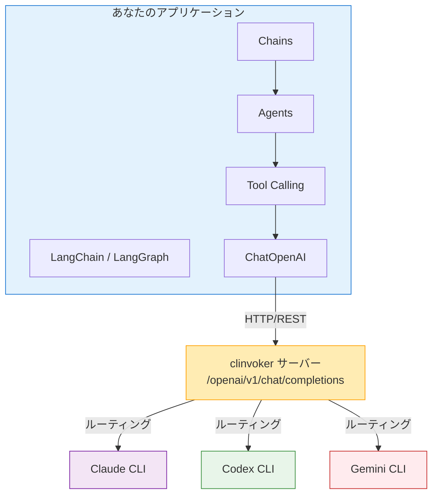

# チュートリアル: LangChain 連携

LangChain と LangGraph を clinvoker と統合し、統一インターフェースを通じて複数バックエンドを活用する高度な AI アプリケーションを構築する方法を説明します。

## LangChain と統合する理由

### 合成可能性（Composability）の強み

LangChain は、LLM を使ったアプリケーションを「合成可能な部品」で組み立てるフレームワークです。clinvoker を組み合わせると、次の利点が得られます。

1. **統一されたバックエンドアクセス**: LangChain の慣れたインターフェースのまま Claude/Codex/Gemini にルーティングできる
2. **チェーン合成**: 複数バックエンドを順次/並列チェーンとして組み合わせられる
3. **エージェントワークフロー**: タスクごとに最適なバックエンドを選ぶ自律エージェントを構築できる
4. **エコシステム互換**: LangChain の豊富なツール/連携を利用できる

### 連携アーキテクチャ



---

## 前提条件

LangChain と統合する前に、次を準備してください。

- Python 3.9 以上
- clinvoker サーバー（ローカル/リモート）が稼働している
- LangChain の基本概念の理解
- AI バックエンド用の API キー設定

### 依存関係のインストール

```bash
pip install langchain langchain-openai langgraph
```

### clinvoker サーバーの確認

clinvoker サーバーにアクセスできることを確認してください。

```bash
# 接続確認
curl http://localhost:8080/health

# 期待されるレスポンス
{"status":"ok"}
```

---

## OpenAI 互換エンドポイントを理解する

### なぜ OpenAI 互換なのか？

clinvoker が OpenAI 互換 API（`/openai/v1`）を提供する理由:

1. **業界標準**: OpenAI API は最も広くサポートされるインターフェースです
2. **LangChain 対応**: LangChain は OpenAI 互換 API を第一級でサポートします
3. **ツール互換**: 多くの AI ツールが OpenAI 形式をサポートします
4. **移行が容易**: 既存の OpenAI コードが最小変更で動きます

### エンドポイント構造

| clinvoker エンドポイント | OpenAI 相当 | 用途 |
|-------------------|-------------------|---------|
| `/openai/v1/chat/completions` | `/v1/chat/completions` | チャット補完 |
| `/openai/v1/models` | `/v1/models` | モデル一覧 |

### モデルマッピング

clinvoker ではモデル名がバックエンドに対応します。

| モデル名 | バックエンド | 得意分野 |
|-----------|---------|----------|
| `claude` | Claude Code | アーキテクチャ、推論 |
| `codex` | Codex CLI | コード生成 |
| `gemini` | Gemini CLI | セキュリティ、調査 |

---

## ステップ 1: 基本の LangChain 連携

### ChatOpenAI を clinvoker に向ける

`basic_integration.py` を作成します。

```python
from langchain_openai import ChatOpenAI
from langchain_core.messages import HumanMessage, SystemMessage

# Configure LangChain to use clinvoker
llm = ChatOpenAI(
    model_name="claude",  # Routes to Claude backend
    openai_api_base="http://localhost:8080/openai/v1",
    openai_api_key="not-needed",  # clinvoker handles auth
    temperature=0.7,
    max_tokens=2000,
)

# Simple invocation
messages = [
    SystemMessage(content="You are a helpful coding assistant."),
    HumanMessage(content="Explain the benefits of microservices architecture.")
]

response = llm.invoke(messages)
print(response.content)
```

### 仕組み

1. LangChain は `openai_api_base` にリクエストを送る
2. clinvoker が OpenAI 形式をバックエンド固有形式へ変換する
3. 指定バックエンド（Claude/Codex/Gemini）が処理する
4. clinvoker が OpenAI 形式でレスポンスを返す
5. LangChain は通常通りレスポンスを受け取る

---

## ステップ 2: マルチバックエンド・チェーン

### 並列チェーン実行

`parallel_chain.py` を作成します。

```python
from langchain_openai import ChatOpenAI
from langchain_core.messages import HumanMessage
from langchain_core.runnables import RunnableParallel

# Define LLMs for different backends
claude_llm = ChatOpenAI(
    model_name="claude",
    openai_api_base="http://localhost:8080/openai/v1",
    openai_api_key="not-needed",
    temperature=0.7,
)

codex_llm = ChatOpenAI(
    model_name="codex",
    openai_api_base="http://localhost:8080/openai/v1",
    openai_api_key="not-needed",
    temperature=0.5,
)

gemini_llm = ChatOpenAI(
    model_name="gemini",
    openai_api_base="http://localhost:8080/openai/v1",
    openai_api_key="not-needed",
    temperature=0.7,
)

# Create parallel review chain
review_chain = RunnableParallel(
    architecture=lambda x: claude_llm.invoke([
        HumanMessage(content=f"Review the architecture:\\n{x['code']}")
    ]),
    implementation=lambda x: codex_llm.invoke([
        HumanMessage(content=f"Review the implementation:\\n{x['code']}")
    ]),
    security=lambda x: gemini_llm.invoke([
        HumanMessage(content=f"Security audit:\\n{x['code']}")
    ]),
)

# Example code to review
code = \"\"\"
def authenticate(user, password):
    query = f\"SELECT * FROM users WHERE user='{user}' AND pass='{password}'\"
    return db.execute(query)
\"\"\"

# Execute parallel review
results = review_chain.invoke({\"code\": code})

print(\"=== Architecture Review (Claude) ===\")
print(results[\"architecture\"].content)
print(\"\\n=== Implementation Review (Codex) ===\")
print(results[\"implementation\"].content)
print(\"\\n=== Security Review (Gemini) ===\")
print(results[\"security\"].content)
```

### 順次チェーン実行

`sequential_chain.py` を作成します。

```python
from langchain_openai import ChatOpenAI
from langchain_core.messages import HumanMessage
from langchain_core.runnables import RunnableSequence

# Define LLMs
claude = ChatOpenAI(
    model_name="claude",
    openai_api_base="http://localhost:8080/openai/v1",
    openai_api_key="not-needed",
)

codex = ChatOpenAI(
    model_name="codex",
    openai_api_base="http://localhost:8080/openai/v1",
    openai_api_key="not-needed",
)

# Create sequential chain: Design -> Implement -> Review
def design_step(inputs):
    \"\"\"Claude designs the architecture\"\"\"
    response = claude.invoke([
        HumanMessage(content=f\"Design a solution for: {inputs['requirement']}\")
    ])
    return {\"design\": response.content, \"requirement\": inputs[\"requirement\"]}

def implement_step(inputs):
    \"\"\"Codex implements based on design\"\"\"
    response = codex.invoke([
        HumanMessage(content=f\"Implement this design:\\n{inputs['design']}\")
    ])
    return {\"implementation\": response.content, \"design\": inputs[\"design\"]}

def review_step(inputs):
    \"\"\"Claude reviews the implementation\"\"\"
    response = claude.invoke([
        HumanMessage(content=f\"Review this implementation:\\n{inputs['implementation']}\")
    ])
    return {
        \"design\": inputs[\"design\"],
        \"implementation\": inputs[\"implementation\"],
        \"review\": response.content
    }

# Build chain
chain = RunnableSequence(
    design_step,
    implement_step,
    review_step
)

# Execute
result = chain.invoke({\"requirement\": \"Create a user authentication system\"})

print(\"=== Design ===\")
print(result[\"design\"])
print(\"\\n=== Implementation ===\")
print(result[\"implementation\"])
print(\"\\n=== Review ===\")
print(result[\"review\"])
```

---

## ステップ 3: LangGraph によるエージェントワークフロー

### マルチエージェントシステムを作る

`langgraph_agent.py` を作成します。

```python
from typing import TypedDict, Annotated
from langgraph.graph import StateGraph, END
from langchain_openai import ChatOpenAI
from langchain_core.messages import HumanMessage

# State definition
class AgentState(TypedDict):
    code: str
    architecture_review: str
    implementation: str
    security_review: str
    final_output: str

# Initialize LLMs
claude = ChatOpenAI(
    model_name="claude",
    openai_api_base="http://localhost:8080/openai/v1",
    openai_api_key="not-needed",
)

codex = ChatOpenAI(
    model_name="codex",
    openai_api_base="http://localhost:8080/openai/v1",
    openai_api_key="not-needed",
)

gemini = ChatOpenAI(
    model_name="gemini",
    openai_api_base="http://localhost:8080/openai/v1",
    openai_api_key="not-needed",
)

# Node functions
def architect_review(state: AgentState):
    \"\"\"Claude reviews architecture\"\"\"
    prompt = f\"\"\"Review this code architecture and suggest improvements:

{state['code']}

Provide specific recommendations for better design patterns and structure.\"\"\"

    response = claude.invoke([HumanMessage(content=prompt)])
    return {\"architecture_review\": response.content}

def implement(state: AgentState):
    \"\"\"Codex implements improvements\"\"\"
    prompt = f\"\"\"Based on this architecture review, implement an improved version:

Architecture Review:
{state['architecture_review']}

Original Code:
{state['code']}

Provide the complete improved implementation.\"\"\"

    response = codex.invoke([HumanMessage(content=prompt)])
    return {\"implementation\": response.content}

def security_check(state: AgentState):
    \"\"\"Gemini checks security\"\"\"
    prompt = f\"\"\"Perform a security audit on this code:

{state['implementation']}

Identify any security vulnerabilities and suggest fixes.\"\"\"

    response = gemini.invoke([HumanMessage(content=prompt)])
    return {\"security_review\": response.content}

def finalize(state: AgentState):
    \"\"\"Claude synthesizes final output\"\"\"
    prompt = f\"\"\"Synthesize a final solution based on:

Architecture Review:
{state['architecture_review']}

Implementation:
{state['implementation']}

Security Review:
{state['security_review']}

Provide a complete, production-ready solution incorporating all feedback.\"\"\"

    response = claude.invoke([HumanMessage(content=prompt)])
    return {\"final_output\": response.content}

# Build the graph
workflow = StateGraph(AgentState)

# Add nodes
workflow.add_node(\"architect\", architect_review)
workflow.add_node(\"implement\", implement)
workflow.add_node(\"security\", security_check)
workflow.add_node(\"finalize\", finalize)

# Define edges
workflow.set_entry_point(\"architect\")
workflow.add_edge(\"architect\", \"implement\")
workflow.add_edge(\"implement\", \"security\")
workflow.add_edge(\"security\", \"finalize\")
workflow.add_edge(\"finalize\", END)

# Compile
app = workflow.compile()

# Execute with example code
result = app.invoke({
    \"code\": \"\"\"
def process_payment(card_number, amount):
    # Process payment
    db.execute(f\"INSERT INTO payments VALUES ('{card_number}', {amount})\")
    return True
\"\"\"
})

print(\"=== Final Solution ===\")
print(result[\"final_output\"])
```

### 条件付きルーティング

`conditional_routing.py` を作成します。

```python
from typing import TypedDict
from langgraph.graph import StateGraph, END
from langchain_openai import ChatOpenAI
from langchain_core.messages import HumanMessage

class RouterState(TypedDict):
    task: str
    task_type: str
    result: str

# Initialize LLMs
claude = ChatOpenAI(
    model_name="claude",
    openai_api_base="http://localhost:8080/openai/v1",
    openai_api_key="not-needed",
)

codex = ChatOpenAI(
    model_name="codex",
    openai_api_base="http://localhost:8080/openai/v1",
    openai_api_key="not-needed",
)

gemini = ChatOpenAI(
    model_name="gemini",
    openai_api_base="http://localhost:8080/openai/v1",
    openai_api_key="not-needed",
)

def classify_task(state: RouterState):
    \"\"\"Claude classifies the task type\"\"\"
    prompt = f\"\"\"Classify this task as one of: architecture, implementation, security, research

Task: {state['task']}

Respond with only the classification.\"\"\"

    response = claude.invoke([HumanMessage(content=prompt)])
    task_type = response.content.strip().lower()

    # Normalize classification
    if \"architect\" in task_type:
        task_type = \"architecture\"
    elif \"implement\" in task_type or \"code\" in task_type:
        task_type = \"implementation\"
    elif \"security\" in task_type:
        task_type = \"security\"
    else:
        task_type = \"research\"

    return {\"task_type\": task_type}

def route_to_backend(state: RouterState):
    \"\"\"Route to appropriate backend based on task type\"\"\"
    task = state[\"task\"]
    task_type = state[\"task_type\"]

    if task_type == \"architecture\":
        response = claude.invoke([HumanMessage(content=task)])
    elif task_type == \"implementation\":
        response = codex.invoke([HumanMessage(content=task)])
    elif task_type == \"security\":
        response = gemini.invoke([HumanMessage(content=task)])
    else:
        # Default to Gemini for research
        response = gemini.invoke([HumanMessage(content=task)])

    return {\"result\": response.content}

# Build graph
workflow = StateGraph(RouterState)
workflow.add_node(\"classify\", classify_task)
workflow.add_node(\"execute\", route_to_backend)

workflow.set_entry_point(\"classify\")
workflow.add_edge(\"classify\", \"execute\")
workflow.add_edge(\"execute\", END)

app = workflow.compile()

# Test with different tasks
tasks = [
    \"Design a microservices architecture for an e-commerce platform\",
    \"Implement a quicksort algorithm in Python\",
    \"Security audit: Check for SQL injection vulnerabilities\",
]

for task in tasks:
    result = app.invoke({\"task\": task})
    print(f\"\\nTask: {task}\")
    print(f\"Type: {result['task_type']}\")
    print(f\"Result: {result['result'][:200]}...\")
```

---

## ステップ 4: ストリーミング応答

### リアルタイムストリーミング

`streaming_example.py` を作成します。

```python
from langchain_openai import ChatOpenAI
from langchain_core.messages import HumanMessage
import sys

# Configure LLM with streaming
llm = ChatOpenAI(
    model_name="claude",
    openai_api_base="http://localhost:8080/openai/v1",
    openai_api_key="not-needed",
    streaming=True,
)

# Stream response
messages = [HumanMessage(content="Write a comprehensive guide to Python async/await")]

print("Streaming response:")
for chunk in llm.stream(messages):
    # chunk.content contains the text delta
    print(chunk.content, end="", flush=True)
    sys.stdout.flush()

print()  # Final newline
```

### コールバックでストリーミングする

`streaming_callbacks.py` を作成します。

```python
from langchain_openai import ChatOpenAI
from langchain_core.messages import HumanMessage
from langchain.callbacks.streaming_stdout import StreamingStdOutCallbackHandler

# Configure with streaming callback
llm = ChatOpenAI(
    model_name="claude",
    openai_api_base="http://localhost:8080/openai/v1",
    openai_api_key="not-needed",
    streaming=True,
    callbacks=[StreamingStdOutCallbackHandler()],
)

# This will automatically stream to stdout
messages = [HumanMessage(content="Explain the SOLID principles")]
response = llm.invoke(messages)
```

---

## ステップ 5: エラーハンドリングパターン

### 指数バックオフ付きリトライ

`error_handling.py` を作成します。

```python
from langchain_openai import ChatOpenAI
from langchain_core.messages import HumanMessage
import time
import random

def invoke_with_retry(llm, messages, max_retries=3):
    \"\"\"Invoke LLM with retry logic\"\"\"
    for attempt in range(max_retries):
        try:
            return llm.invoke(messages)
        except Exception as e:
            if attempt == max_retries - 1:
                raise

            # Exponential backoff with jitter
            wait_time = (2 ** attempt) + random.uniform(0, 1)
            print(f\"Attempt {attempt + 1} failed: {e}. Retrying in {wait_time:.2f}s...\")
            time.sleep(wait_time)

# Usage
llm = ChatOpenAI(
    model_name="claude",
    openai_api_base="http://localhost:8080/openai/v1",
    openai_api_key="not-needed",
)

try:
    response = invoke_with_retry(
        llm,
        [HumanMessage(content="Generate a complex analysis")]
    )
    print(response.content)
except Exception as e:
    print(f"Failed after retries: {e}")
```

### フォールバックチェーン

`fallback_chain.py` を作成します。

```python
from langchain_openai import ChatOpenAI
from langchain_core.messages import HumanMessage

def fallback_invoke(prompt, backends=["claude", "codex", "gemini"]):
    \"\"\"Try backends in order until one succeeds\"\"\"
    for backend in backends:
        try:
            llm = ChatOpenAI(
                model_name=backend,
                openai_api_base="http://localhost:8080/openai/v1",
                openai_api_key="not-needed",
            )
            response = llm.invoke([HumanMessage(content=prompt)])
            print(f"Success with backend: {backend}")
            return response
        except Exception as e:
            print(f"Backend {backend} failed: {e}")
            continue

    raise Exception("All backends failed")

# Usage
response = fallback_invoke("Explain quantum computing")
print(response.content)
```

---

## ステップ 6: カスタムコールバックハンドラ

### トークン使用量の追跡

`custom_callbacks.py` を作成します。

```python
from langchain_core.callbacks import BaseCallbackHandler
from langchain_openai import ChatOpenAI
from langchain_core.messages import HumanMessage
import time

class UsageCallbackHandler(BaseCallbackHandler):
    \"\"\"Custom callback to track usage statistics\"\"\"

    def __init__(self):
        self.start_time = None
        self.token_usage = {"prompt": 0, "completion": 0}
        self.backend = None

    def on_llm_start(self, serialized, prompts, **kwargs):
        self.start_time = time.time()
        # Extract backend from model name
        if serialized and "kwargs" in serialized:
            self.backend = serialized["kwargs"].get("model_name", "unknown")
        print(f"Starting request to {self.backend}...")

    def on_llm_end(self, response, **kwargs):
        duration = time.time() - self.start_time
        print(f"\nRequest completed in {duration:.2f}s")

        # Extract token usage if available
        if hasattr(response, 'llm_output') and response.llm_output:
            token_usage = response.llm_output.get('token_usage', {})
            print(f"Token usage: {token_usage}")

    def on_llm_error(self, error, **kwargs):
        print(f"Error occurred: {error}")

# Usage
handler = UsageCallbackHandler()

llm = ChatOpenAI(
    model_name="claude",
    openai_api_base="http://localhost:8080/openai/v1",
    openai_api_key="not-needed",
    callbacks=[handler],
)

response = llm.invoke([HumanMessage(content="Explain machine learning")])
print(f"\nResponse: {response.content[:200]}...")
```

---

## ベストプラクティス

### 1. コネクションプーリング

性能のため、LLM インスタンスを使い回します。

```python
# Good: Reuse LLM instance
claude_llm = ChatOpenAI(
    model_name="claude",
    openai_api_base="http://localhost:8080/openai/v1",
    openai_api_key="not-needed",
)

# Use the same instance multiple times
for prompt in prompts:
    response = claude_llm.invoke([HumanMessage(content=prompt)])
```

### 2. タイムアウト設定

ユースケースに合わせたタイムアウトを設定します。

```python
llm = ChatOpenAI(
    model_name="claude",
    openai_api_base="http://localhost:8080/openai/v1",
    openai_api_key="not-needed",
    request_timeout=60,  # 60 seconds
)
```

### 3. モデル選択戦略

タスクの性質に応じてバックエンドを選びます。

```python
def get_llm_for_task(task_type: str):
    """Get appropriate LLM based on task type"""
    config = {
        "architecture": ("claude", 0.7),
        "implementation": ("codex", 0.5),
        "security": ("gemini", 0.7),
        "research": ("gemini", 0.8),
    }

    model, temp = config.get(task_type, ("claude", 0.7))

    return ChatOpenAI(
        model_name=model,
        openai_api_base="http://localhost:8080/openai/v1",
        openai_api_key="not-needed",
        temperature=temp,
    )
```

---

## トラブルシューティング

### 接続エラー

接続エラーが出る場合:

```python
import urllib3
urllib3.disable_warnings(urllib3.exceptions.InsecureRequestWarning)

# For self-signed certificates
llm = ChatOpenAI(
    model_name="claude",
    openai_api_base="http://localhost:8080/openai/v1",
    openai_api_key="not-needed",
    # If using HTTPS with self-signed cert
    # http_client=httpx.Client(verify=False),
)
```

### モデルが見つからない

「model not found」が出る場合:

```python
# Verify available models
import requests

response = requests.get("http://localhost:8080/openai/v1/models")
print(response.json())

# Use exact model names from the response
```

### タイムアウト

長時間タスク向け:

```python
llm = ChatOpenAI(
    model_name="claude",
    openai_api_base="http://localhost:8080/openai/v1",
    openai_api_key="not-needed",
    request_timeout=300,  # 5 minutes
    max_retries=3,
)
```

---

## 次のステップ

- Claude Code 連携は [AI スキルの構築](building-ai-skills.md)
- レビュー自動化は [マルチバックエンドのコードレビュー](multi-backend-code-review.md)
- 本番デプロイは [CI/CD 連携](ci-cd-integration.md)
- 内部構造は [アーキテクチャ概要](../concepts/architecture.md)

---

## まとめ

このチュートリアルで学んだこと:

1. LangChain ChatOpenAI を clinvoker の OpenAI 互換エンドポイントへ向ける方法
2. 並列/順次のマルチバックエンドチェーンを構築する方法
3. LangGraph で複数バックエンドを使うエージェントワークフローを作る方法
4. リアルタイム用途のストリーミング応答
5. リトライやフォールバックによるエラーハンドリング
6. 監視/ロギングのためのカスタムコールバック

clinvoker を LangChain と統合することで、LangChain のエコシステムを活かしつつ、タスクに応じて最適な AI バックエンドへルーティングできます。
