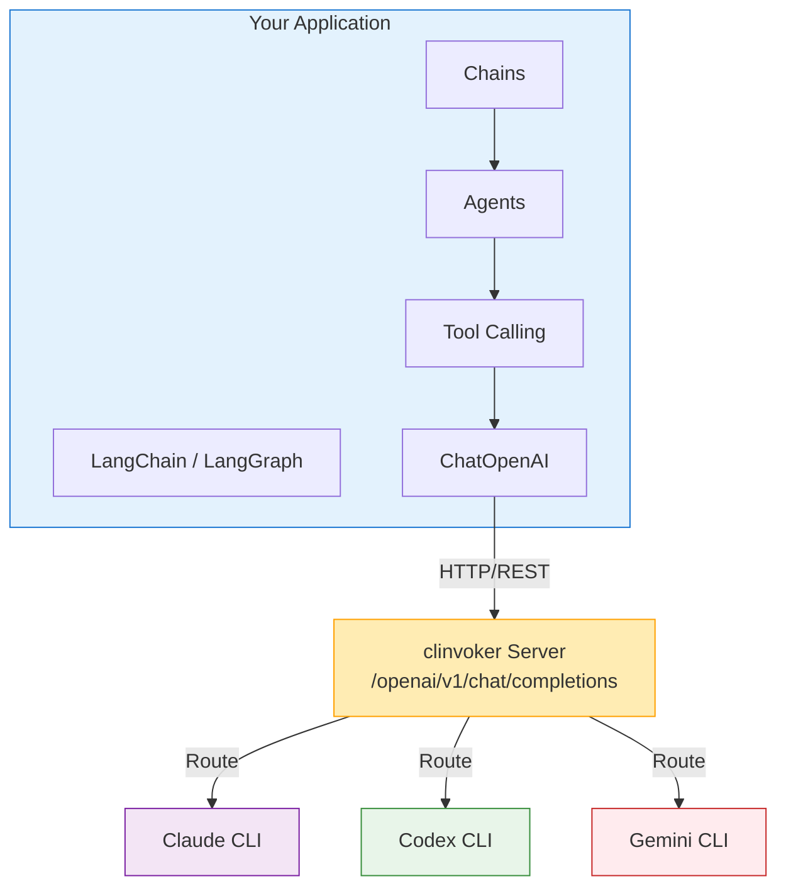

# Tutorial: LangChain Integration

Learn how to integrate clinvoker with LangChain and LangGraph to build sophisticated AI applications that leverage multiple backends through a unified interface.

## Why Integrate with LangChain?

### The Power of Composability

LangChain provides a framework for building applications with LLMs through composable components. By integrating clinvoker, you get:

1. **Unified Backend Access**: Use LangChain's familiar interface while routing to Claude, Codex, or Gemini
2. **Chain Composition**: Combine multiple AI backends in sequential or parallel chains
3. **Agent Workflows**: Build autonomous agents that can choose the best backend for each task
4. **Ecosystem Compatibility**: Access LangChain's rich ecosystem of tools and integrations

### Integration Architecture



---

## Prerequisites

Before integrating with LangChain:

- Python 3.9 or higher installed
- clinvoker server running (local or remote)
- Basic understanding of LangChain concepts
- API keys configured for your AI backends

### Install Dependencies

```bash
pip install langchain langchain-openai langgraph
```

### Verify clinvoker Server

Ensure your clinvoker server is accessible:

```bash
# Test server connection
curl http://localhost:8080/health

# Expected response
{"status":"ok"}
```

---

## Understanding the OpenAI-Compatible Endpoint

### Why OpenAI Compatibility?

clinvoker provides an OpenAI-compatible API endpoint (`/openai/v1`) because:

1. **Industry Standard**: OpenAI's API is the most widely supported interface
2. **LangChain Support**: LangChain has first-class support for OpenAI-compatible APIs
3. **Tool Ecosystem**: Most AI tools support the OpenAI API format
4. **Easy Migration**: Existing OpenAI code works with minimal changes

### Endpoint Structure

| clinvoker Endpoint | OpenAI Equivalent | Purpose |
|-------------------|-------------------|---------|
| `/openai/v1/chat/completions` | `/v1/chat/completions` | Chat completions |
| `/openai/v1/models` | `/v1/models` | List available models |

### Model Mapping

In clinvoker, model names map to backends:

| Model Name | Backend | Best For |
|-----------|---------|----------|
| `claude` | Claude Code | Architecture, reasoning |
| `codex` | Codex CLI | Code generation |
| `gemini` | Gemini CLI | Security, research |

---

## Step 1: Basic LangChain Integration

### Configure ChatOpenAI with clinvoker

Create `basic_integration.py`:

```python
from langchain_openai import ChatOpenAI
from langchain_core.messages import HumanMessage, SystemMessage

# Configure LangChain to use clinvoker
llm = ChatOpenAI(
    model_name="claude",  # Routes to Claude backend
    openai_api_base="http://localhost:8080/openai/v1",
    openai_api_key="not-needed",  # clinvoker handles auth
    temperature=0.7,
    max_tokens=2000,
)

# Simple invocation
messages = [
    SystemMessage(content="You are a helpful coding assistant."),
    HumanMessage(content="Explain the benefits of microservices architecture.")
]

response = llm.invoke(messages)
print(response.content)
```

### How It Works

1. LangChain sends requests to `openai_api_base`
2. clinvoker translates OpenAI format to backend-specific format
3. The specified backend (Claude, Codex, or Gemini) processes the request
4. clinvoker returns the response in OpenAI format
5. LangChain receives and processes the response as usual

---

## Step 2: Multi-Backend Chains

### Parallel Chain Execution

Create `parallel_chain.py`:

```python
from langchain_openai import ChatOpenAI
from langchain_core.messages import HumanMessage
from langchain_core.runnables import RunnableParallel

# Define LLMs for different backends
claude_llm = ChatOpenAI(
    model_name="claude",
    openai_api_base="http://localhost:8080/openai/v1",
    openai_api_key="not-needed",
    temperature=0.7,
)

codex_llm = ChatOpenAI(
    model_name="codex",
    openai_api_base="http://localhost:8080/openai/v1",
    openai_api_key="not-needed",
    temperature=0.5,
)

gemini_llm = ChatOpenAI(
    model_name="gemini",
    openai_api_base="http://localhost:8080/openai/v1",
    openai_api_key="not-needed",
    temperature=0.7,
)

# Create parallel review chain
review_chain = RunnableParallel(
    architecture=lambda x: claude_llm.invoke([
        HumanMessage(content=f"Review the architecture:\n{x['code']}")
    ]),
    implementation=lambda x: codex_llm.invoke([
        HumanMessage(content=f"Review the implementation:\n{x['code']}")
    ]),
    security=lambda x: gemini_llm.invoke([
        HumanMessage(content=f"Security audit:\n{x['code']}")
    ]),
)

# Example code to review
code = """
def authenticate(user, password):
    query = f"SELECT * FROM users WHERE user='{user}' AND pass='{password}'"
    return db.execute(query)
"""

# Execute parallel review
results = review_chain.invoke({"code": code})

print("=== Architecture Review (Claude) ===")
print(results["architecture"].content)
print("\n=== Implementation Review (Codex) ===")
print(results["implementation"].content)
print("\n=== Security Review (Gemini) ===")
print(results["security"].content)
```

### Sequential Chain Execution

Create `sequential_chain.py`:

```python
from langchain_openai import ChatOpenAI
from langchain_core.messages import HumanMessage
from langchain_core.runnables import RunnableSequence

# Define LLMs
claude = ChatOpenAI(
    model_name="claude",
    openai_api_base="http://localhost:8080/openai/v1",
    openai_api_key="not-needed",
)

codex = ChatOpenAI(
    model_name="codex",
    openai_api_base="http://localhost:8080/openai/v1",
    openai_api_key="not-needed",
)

# Create sequential chain: Design -> Implement -> Review
def design_step(inputs):
    """Claude designs the architecture"""
    response = claude.invoke([
        HumanMessage(content=f"Design a solution for: {inputs['requirement']}")
    ])
    return {"design": response.content, "requirement": inputs["requirement"]}

def implement_step(inputs):
    """Codex implements based on design"""
    response = codex.invoke([
        HumanMessage(content=f"Implement this design:\n{inputs['design']}")
    ])
    return {"implementation": response.content, "design": inputs["design"]}

def review_step(inputs):
    """Claude reviews the implementation"""
    response = claude.invoke([
        HumanMessage(content=f"Review this implementation:\n{inputs['implementation']}")
    ])
    return {
        "design": inputs["design"],
        "implementation": inputs["implementation"],
        "review": response.content
    }

# Build chain
chain = RunnableSequence(
    design_step,
    implement_step,
    review_step
)

# Execute
result = chain.invoke({"requirement": "Create a user authentication system"})

print("=== Design ===")
print(result["design"])
print("\n=== Implementation ===")
print(result["implementation"])
print("\n=== Review ===")
print(result["review"])
```

---

## Step 3: LangGraph Agent Workflows

### Building a Multi-Agent System

Create `langgraph_agent.py`:

```python
from typing import TypedDict, Annotated
from langgraph.graph import StateGraph, END
from langchain_openai import ChatOpenAI
from langchain_core.messages import HumanMessage

# State definition
class AgentState(TypedDict):
    code: str
    architecture_review: str
    implementation: str
    security_review: str
    final_output: str

# Initialize LLMs
claude = ChatOpenAI(
    model_name="claude",
    openai_api_base="http://localhost:8080/openai/v1",
    openai_api_key="not-needed",
)

codex = ChatOpenAI(
    model_name="codex",
    openai_api_base="http://localhost:8080/openai/v1",
    openai_api_key="not-needed",
)

gemini = ChatOpenAI(
    model_name="gemini",
    openai_api_base="http://localhost:8080/openai/v1",
    openai_api_key="not-needed",
)

# Node functions
def architect_review(state: AgentState):
    """Claude reviews architecture"""
    prompt = f"""Review this code architecture and suggest improvements:

{state['code']}

Provide specific recommendations for better design patterns and structure."""

    response = claude.invoke([HumanMessage(content=prompt)])
    return {"architecture_review": response.content}

def implement(state: AgentState):
    """Codex implements improvements"""
    prompt = f"""Based on this architecture review, implement an improved version:

Architecture Review:
{state['architecture_review']}

Original Code:
{state['code']}

Provide the complete improved implementation."""

    response = codex.invoke([HumanMessage(content=prompt)])
    return {"implementation": response.content}

def security_check(state: AgentState):
    """Gemini checks security"""
    prompt = f"""Perform a security audit on this code:

{state['implementation']}

Identify any security vulnerabilities and suggest fixes."""

    response = gemini.invoke([HumanMessage(content=prompt)])
    return {"security_review": response.content}

def finalize(state: AgentState):
    """Claude synthesizes final output"""
    prompt = f"""Synthesize a final solution based on:

Architecture Review:
{state['architecture_review']}

Implementation:
{state['implementation']}

Security Review:
{state['security_review']}

Provide a complete, production-ready solution incorporating all feedback."""

    response = claude.invoke([HumanMessage(content=prompt)])
    return {"final_output": response.content}

# Build the graph
workflow = StateGraph(AgentState)

# Add nodes
workflow.add_node("architect", architect_review)
workflow.add_node("implement", implement)
workflow.add_node("security", security_check)
workflow.add_node("finalize", finalize)

# Define edges
workflow.set_entry_point("architect")
workflow.add_edge("architect", "implement")
workflow.add_edge("implement", "security")
workflow.add_edge("security", "finalize")
workflow.add_edge("finalize", END)

# Compile
app = workflow.compile()

# Execute with example code
result = app.invoke({
    "code": """
def process_payment(card_number, amount):
    # Process payment
    db.execute(f"INSERT INTO payments VALUES ('{card_number}', {amount})")
    return True
"""
})

print("=== Final Solution ===")
print(result["final_output"])
```

### Conditional Routing

Create `conditional_routing.py`:

```python
from typing import TypedDict
from langgraph.graph import StateGraph, END
from langchain_openai import ChatOpenAI
from langchain_core.messages import HumanMessage

class RouterState(TypedDict):
    task: str
    task_type: str
    result: str

# Initialize LLMs
claude = ChatOpenAI(
    model_name="claude",
    openai_api_base="http://localhost:8080/openai/v1",
    openai_api_key="not-needed",
)

codex = ChatOpenAI(
    model_name="codex",
    openai_api_base="http://localhost:8080/openai/v1",
    openai_api_key="not-needed",
)

gemini = ChatOpenAI(
    model_name="gemini",
    openai_api_base="http://localhost:8080/openai/v1",
    openai_api_key="not-needed",
)

def classify_task(state: RouterState):
    """Claude classifies the task type"""
    prompt = f"""Classify this task as one of: architecture, implementation, security, research

Task: {state['task']}

Respond with only the classification."""

    response = claude.invoke([HumanMessage(content=prompt)])
    task_type = response.content.strip().lower()

    # Normalize classification
    if "architect" in task_type:
        task_type = "architecture"
    elif "implement" in task_type or "code" in task_type:
        task_type = "implementation"
    elif "security" in task_type:
        task_type = "security"
    else:
        task_type = "research"

    return {"task_type": task_type}

def route_to_backend(state: RouterState):
    """Route to appropriate backend based on task type"""
    task = state["task"]
    task_type = state["task_type"]

    if task_type == "architecture":
        response = claude.invoke([HumanMessage(content=task)])
    elif task_type == "implementation":
        response = codex.invoke([HumanMessage(content=task)])
    elif task_type == "security":
        response = gemini.invoke([HumanMessage(content=task)])
    else:
        # Default to Gemini for research
        response = gemini.invoke([HumanMessage(content=task)])

    return {"result": response.content}

# Build graph
workflow = StateGraph(RouterState)
workflow.add_node("classify", classify_task)
workflow.add_node("execute", route_to_backend)

workflow.set_entry_point("classify")
workflow.add_edge("classify", "execute")
workflow.add_edge("execute", END)

app = workflow.compile()

# Test with different tasks
tasks = [
    "Design a microservices architecture for an e-commerce platform",
    "Implement a quicksort algorithm in Python",
    "Security audit: Check for SQL injection vulnerabilities",
]

for task in tasks:
    result = app.invoke({"task": task})
    print(f"\nTask: {task}")
    print(f"Type: {result['task_type']}")
    print(f"Result: {result['result'][:200]}...")
```

---

## Step 4: Streaming Responses

### Real-Time Streaming

Create `streaming_example.py`:

```python
from langchain_openai import ChatOpenAI
from langchain_core.messages import HumanMessage
import sys

# Configure LLM with streaming
llm = ChatOpenAI(
    model_name="claude",
    openai_api_base="http://localhost:8080/openai/v1",
    openai_api_key="not-needed",
    streaming=True,
)

# Stream response
messages = [HumanMessage(content="Write a comprehensive guide to Python async/await")]

print("Streaming response:")
for chunk in llm.stream(messages):
    # chunk.content contains the text delta
    print(chunk.content, end="", flush=True)
    sys.stdout.flush()

print()  # Final newline
```

### Streaming with Callbacks

Create `streaming_callbacks.py`:

```python
from langchain_openai import ChatOpenAI
from langchain_core.messages import HumanMessage
from langchain.callbacks.streaming_stdout import StreamingStdOutCallbackHandler

# Configure with streaming callback
llm = ChatOpenAI(
    model_name="claude",
    openai_api_base="http://localhost:8080/openai/v1",
    openai_api_key="not-needed",
    streaming=True,
    callbacks=[StreamingStdOutCallbackHandler()],
)

# This will automatically stream to stdout
messages = [HumanMessage(content="Explain the SOLID principles")]
response = llm.invoke(messages)
```

---

## Step 5: Error Handling Patterns

### Retry with Exponential Backoff

Create `error_handling.py`:

```python
from langchain_openai import ChatOpenAI
from langchain_core.messages import HumanMessage
import time
import random

def invoke_with_retry(llm, messages, max_retries=3):
    """Invoke LLM with retry logic"""
    for attempt in range(max_retries):
        try:
            return llm.invoke(messages)
        except Exception as e:
            if attempt == max_retries - 1:
                raise

            # Exponential backoff with jitter
            wait_time = (2 ** attempt) + random.uniform(0, 1)
            print(f"Attempt {attempt + 1} failed: {e}. Retrying in {wait_time:.2f}s...")
            time.sleep(wait_time)

# Usage
llm = ChatOpenAI(
    model_name="claude",
    openai_api_base="http://localhost:8080/openai/v1",
    openai_api_key="not-needed",
)

try:
    response = invoke_with_retry(
        llm,
        [HumanMessage(content="Generate a complex analysis")]
    )
    print(response.content)
except Exception as e:
    print(f"Failed after retries: {e}")
```

### Fallback Chain

Create `fallback_chain.py`:

```python
from langchain_openai import ChatOpenAI
from langchain_core.messages import HumanMessage

def fallback_invoke(prompt, backends=["claude", "codex", "gemini"]):
    """Try backends in order until one succeeds"""
    for backend in backends:
        try:
            llm = ChatOpenAI(
                model_name=backend,
                openai_api_base="http://localhost:8080/openai/v1",
                openai_api_key="not-needed",
            )
            response = llm.invoke([HumanMessage(content=prompt)])
            print(f"Success with backend: {backend}")
            return response
        except Exception as e:
            print(f"Backend {backend} failed: {e}")
            continue

    raise Exception("All backends failed")

# Usage
response = fallback_invoke("Explain quantum computing")
print(response.content)
```

---

## Step 6: Custom Callback Handlers

### Tracking Token Usage

Create `custom_callbacks.py`:

```python
from langchain_core.callbacks import BaseCallbackHandler
from langchain_openai import ChatOpenAI
from langchain_core.messages import HumanMessage
import time

class UsageCallbackHandler(BaseCallbackHandler):
    """Custom callback to track usage statistics"""

    def __init__(self):
        self.start_time = None
        self.token_usage = {"prompt": 0, "completion": 0}
        self.backend = None

    def on_llm_start(self, serialized, prompts, **kwargs):
        self.start_time = time.time()
        # Extract backend from model name
        if serialized and "kwargs" in serialized:
            self.backend = serialized["kwargs"].get("model_name", "unknown")
        print(f"Starting request to {self.backend}...")

    def on_llm_end(self, response, **kwargs):
        duration = time.time() - self.start_time
        print(f"\nRequest completed in {duration:.2f}s")

        # Extract token usage if available
        if hasattr(response, 'llm_output') and response.llm_output:
            token_usage = response.llm_output.get('token_usage', {})
            print(f"Token usage: {token_usage}")

    def on_llm_error(self, error, **kwargs):
        print(f"Error occurred: {error}")

# Usage
handler = UsageCallbackHandler()

llm = ChatOpenAI(
    model_name="claude",
    openai_api_base="http://localhost:8080/openai/v1",
    openai_api_key="not-needed",
    callbacks=[handler],
)

response = llm.invoke([HumanMessage(content="Explain machine learning")])
print(f"\nResponse: {response.content[:200]}...")
```

---

## Best Practices

### 1. Connection Pooling

Reuse LLM instances for better performance:

```python
# Good: Reuse LLM instance
claude_llm = ChatOpenAI(
    model_name="claude",
    openai_api_base="http://localhost:8080/openai/v1",
    openai_api_key="not-needed",
)

# Use the same instance multiple times
for prompt in prompts:
    response = claude_llm.invoke([HumanMessage(content=prompt)])
```

### 2. Timeout Configuration

Set appropriate timeouts for your use case:

```python
llm = ChatOpenAI(
    model_name="claude",
    openai_api_base="http://localhost:8080/openai/v1",
    openai_api_key="not-needed",
    request_timeout=60,  # 60 seconds
)
```

### 3. Model Selection Strategy

Choose backends based on task characteristics:

```python
def get_llm_for_task(task_type: str):
    """Get appropriate LLM based on task type"""
    config = {
        "architecture": ("claude", 0.7),
        "implementation": ("codex", 0.5),
        "security": ("gemini", 0.7),
        "research": ("gemini", 0.8),
    }

    model, temp = config.get(task_type, ("claude", 0.7))

    return ChatOpenAI(
        model_name=model,
        openai_api_base="http://localhost:8080/openai/v1",
        openai_api_key="not-needed",
        temperature=temp,
    )
```

---

## Troubleshooting

### Connection Errors

If you get connection errors:

```python
import urllib3
urllib3.disable_warnings(urllib3.exceptions.InsecureRequestWarning)

# For self-signed certificates
llm = ChatOpenAI(
    model_name="claude",
    openai_api_base="http://localhost:8080/openai/v1",
    openai_api_key="not-needed",
    # If using HTTPS with self-signed cert
    # http_client=httpx.Client(verify=False),
)
```

### Model Not Found

If you get "model not found" errors:

```python
# Verify available models
import requests

response = requests.get("http://localhost:8080/openai/v1/models")
print(response.json())

# Use exact model names from the response
```

### Timeout Issues

For long-running tasks:

```python
llm = ChatOpenAI(
    model_name="claude",
    openai_api_base="http://localhost:8080/openai/v1",
    openai_api_key="not-needed",
    request_timeout=300,  # 5 minutes
    max_retries=3,
)
```

---

## Next Steps

- Learn about [Building AI Skills](building-ai-skills.md) for Claude Code integration
- Explore [Multi-Backend Code Review](multi-backend-code-review.md) for review automation
- See [CI/CD Integration](ci-cd-integration.md) for production deployment
- Review [Architecture Overview](../concepts/architecture.md) for deep internals

---

## Summary

You have learned how to:

1. Configure LangChain ChatOpenAI to use clinvoker's OpenAI-compatible endpoint
2. Build multi-backend chains for parallel and sequential execution
3. Create LangGraph agent workflows with multiple AI backends
4. Implement streaming responses for real-time applications
5. Handle errors with retry logic and fallback chains
6. Create custom callback handlers for monitoring and logging

By integrating clinvoker with LangChain, you can leverage the full power of LangChain's ecosystem while routing to the most appropriate AI backend for each task.
