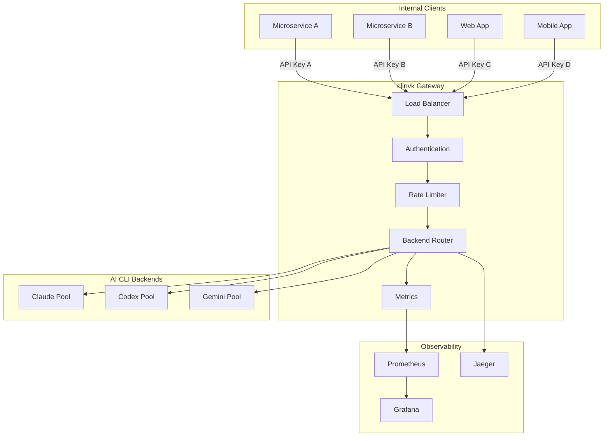

# API Gateway Pattern

Deploy clinvoker as a unified AI gateway for your organization, providing centralized routing, authentication, monitoring, and quota management across all AI backend usage.

## Scenario

Centralize AI backend access across your organization:

- **Single entry point** for all AI requests
- **Backend routing** based on model parameters
- **Unified authentication** and API key management
- **Rate limiting** and quota enforcement
- **Centralized logging** and monitoring
- **Cost tracking** and optimization

## Architecture



## Deployment Options

### Option 1: Single Instance

Simple deployment for small teams:

```yaml title="docker-compose.yml"
services:
  clinvk:
    image: signalridge/clinvoker:latest
    command: serve --port 8080
    environment:
      # API keys (comma-separated)
      - CLINVK_API_KEYS=${CLINVK_API_KEYS}
    volumes:
      - ./config:/root/.clinvk:ro
      - type: bind
        source: /var/run/docker.sock
        target: /var/run/docker.sock
    ports:
      - "8080:8080"
    healthcheck:
      test: ["CMD", "curl", "-f", "http://localhost:8080/health"]
      interval: 30s
      timeout: 10s
      retries: 3

  prometheus:
    image: prom/prometheus:latest
    volumes:
      - ./prometheus.yml:/etc/prometheus/prometheus.yml:ro
    ports:
      - "9090:9090"

  grafana:
    image: grafana/grafana:latest
    ports:
      - "3000:3000"
    volumes:
      - grafana-data:/var/lib/grafana
      - ./grafana/dashboards:/etc/grafana/provisioning/dashboards:ro
      - ./grafana/datasources:/etc/grafana/provisioning/datasources:ro

volumes:
  grafana-data:
```

Configure gateway policies in `config.yaml` (mounted into `/root/.clinvk`):

```yaml title="config.yaml"
server:
  # Optional if you prefer gopass over CLINVK_API_KEYS
  api_keys_gopass_path: "myorg/gateway/api-keys"

  rate_limit_enabled: true
  rate_limit_rps: 10
  rate_limit_burst: 20

  trusted_proxies:
    - "10.0.0.0/8"

  metrics_enabled: true
  cors_allowed_origins:
    - "https://internal.example.com"
```

### Option 2: Kubernetes Deployment

Production deployment with scaling:

```yaml title="k8s-deployment.yaml"
apiVersion: apps/v1
kind: Deployment
metadata:
  name: clinvk-gateway
  namespace: ai-gateway
spec:
  replicas: 3
  selector:
    matchLabels:
      app: clinvk-gateway
  template:
    metadata:
      labels:
        app: clinvk-gateway
    spec:
      containers:
        - name: clinvk
          image: signalridge/clinvoker:latest
          command: ["clinvk", "serve", "--port", "8080"]
          ports:
            - containerPort: 8080
              name: http
          env:
            - name: CLINVK_API_KEYS
              valueFrom:
                secretKeyRef:
                  name: clinvk-secrets
                  key: api-keys
          volumeMounts:
            - name: config
              mountPath: /root/.clinvk
              readOnly: true
          resources:
            requests:
              memory: "256Mi"
              cpu: "250m"
            limits:
              memory: "512Mi"
              cpu: "500m"
          livenessProbe:
            httpGet:
              path: /health
              port: 8080
            initialDelaySeconds: 10
            periodSeconds: 30
          readinessProbe:
            httpGet:
              path: /health
              port: 8080
            initialDelaySeconds: 5
            periodSeconds: 10
      volumes:
        - name: config
          configMap:
            name: clinvk-config
---
apiVersion: v1
kind: Service
metadata:
  name: clinvk-gateway
  namespace: ai-gateway
spec:
  selector:
    app: clinvk-gateway
  ports:
    - port: 80
      targetPort: 8080
  type: ClusterIP
---
apiVersion: networking.k8s.io/v1
kind: Ingress
metadata:
  name: clinvk-gateway
  namespace: ai-gateway
  annotations:
    nginx.ingress.kubernetes.io/rate-limit: "100"
spec:
  rules:
    - host: ai-gateway.company.com
      http:
        paths:
          - path: /
            pathType: Prefix
            backend:
              service:
                name: clinvk-gateway
                port:
                  number: 80
```

## Configuration

### API Key Management

Configure multiple API keys with different permissions:

```yaml title="config.yaml"
server:
  api_keys_gopass_path: "myorg/gateway/api-keys"
  rate_limit_enabled: true
  rate_limit_rps: 10
  rate_limit_burst: 20

  # Per-key rate limits via environment
  # CLINVK_API_KEY_SERVICE_A_RPS=100
  # CLINVK_API_KEY_SERVICE_B_RPS=10
```

### Backend Routing Rules

```yaml title="config.yaml"
default_backend: claude

backends:
  claude:
    enabled: true
    model: claude-sonnet-4
    system_prompt: "You are a helpful assistant."

  codex:
    enabled: true
    model: gpt-4o

  gemini:
    enabled: true
    model: gemini-pro

# Routing rules based on model parameter
routing:
  rules:
    - pattern: "claude.*"
      backend: claude
    - pattern: "gpt.*"
      backend: codex
    - pattern: "gemini.*"
      backend: gemini
```

## Client Integration

### OpenAI SDK

```python
from openai import OpenAI

# Use gateway instead of direct OpenAI
client = OpenAI(
    base_url="https://ai-gateway.company.com/openai/v1",
    api_key="your-gateway-api-key"
)

# Automatically routed based on model
response = client.chat.completions.create(
    model="claude",  # Routed to Claude backend
    messages=[{"role": "user", "content": "Hello"}]
)
```

### Anthropic SDK

```python
from anthropic import Anthropic

client = Anthropic(
    base_url="https://ai-gateway.company.com/anthropic/v1",
    api_key="your-gateway-api-key"
)

response = client.messages.create(
    model="claude-sonnet-4-5-20251101",
    max_tokens=1000,
    messages=[{"role": "user", "content": "Hello"}]
)
```

### Direct REST API

```bash
# List available backends
curl https://ai-gateway.company.com/api/v1/backends \
  -H "Authorization: Bearer $API_KEY"

# Execute prompt
curl -X POST https://ai-gateway.company.com/api/v1/prompt \
  -H "Authorization: Bearer $API_KEY" \
  -H "Content-Type: application/json" \
  -d '{
    "backend": "claude",
    "prompt": "Explain microservices",
    "max_tokens": 500
  }'
```

## Monitoring

### Prometheus Metrics

The gateway exposes metrics at `/metrics`:

```promql
# Request rate by backend
sum(rate(clinvk_requests_total[5m])) by (backend)

# Error rate
sum(rate(clinvk_requests_total{status=~"5.."}[5m]))

# Latency percentiles
histogram_quantile(0.99,
  sum(rate(clinvk_request_duration_seconds_bucket[5m])) by (le, backend)
)

# Rate limit hits
sum(rate(clinvk_rate_limit_hits_total[5m])) by (client)

# Active sessions
clinvk_sessions_active
```

### Grafana Dashboard

```json title="grafana-dashboard.json"
{
  "dashboard": {
    "title": "clinvk Gateway",
    "panels": [
      {
        "title": "Request Rate",
        "targets": [{
          "expr": "sum(rate(clinvk_requests_total[5m])) by (backend)"
        }]
      },
      {
        "title": "Error Rate",
        "targets": [{
          "expr": "sum(rate(clinvk_requests_total{status=~\"5..\"}[5m]))"
        }]
      },
      {
        "title": "Latency (p99)",
        "targets": [{
          "expr": "histogram_quantile(0.99, sum(rate(clinvk_request_duration_seconds_bucket[5m])) by (le))"
        }]
      }
    ]
  }
}
```

## Quota Management

### Per-Client Quotas

```yaml
# quotas.yaml
quotas:
  service-a:
    requests_per_minute: 1000
    requests_per_day: 10000
    tokens_per_day: 1000000

  service-b:
    requests_per_minute: 100
    requests_per_day: 1000
    tokens_per_day: 100000
```

### Usage Tracking

```python
#!/usr/bin/env python3
"""Track and report API usage by client."""

import requests

PROMETHEUS_URL = "http://prometheus:9090"

def get_usage_by_client():
    query = '''
    sum by (api_key) (
      increase(clinvk_requests_total[24h])
    )
    '''

    resp = requests.get(f"{PROMETHEUS_URL}/api/v1/query", params={"query": query})
    data = resp.json()

    for result in data['data']['result']:
        api_key = result['metric']['api_key']
        count = float(result['value'][1])
        print(f"{api_key}: {count:.0f} requests")

if __name__ == "__main__":
    get_usage_by_client()
```

## Best Practices

### 1. High Availability

```yaml
# Deploy multiple replicas with anti-affinity
spec:
  replicas: 3
  affinity:
    podAntiAffinity:
      preferredDuringSchedulingIgnoredDuringExecution:
        - weight: 100
          podAffinityTerm:
            labelSelector:
              matchLabels:
                app: clinvk-gateway
            topologyKey: kubernetes.io/hostname
```

### 2. Security

```yaml
server:
  # Never trust proxy headers by default
  trusted_proxies:
    - "10.0.0.0/8"
    - "172.16.0.0/12"

  # CORS configuration
  cors_allowed_origins:
    - "https://app.company.com"
    - "https://admin.company.com"

  # Request size limits
  max_request_body_bytes: 10485760  # 10MB
```

### 3. Resource Limits

```yaml
resources:
  requests:
    memory: "256Mi"
    cpu: "250m"
  limits:
    memory: "512Mi"
    cpu: "1000m"
```

## Scaling Strategies

### Horizontal Pod Autoscaling

```yaml
apiVersion: autoscaling/v2
kind: HorizontalPodAutoscaler
metadata:
  name: clinvk-gateway
spec:
  scaleTargetRef:
    apiVersion: apps/v1
    kind: Deployment
    name: clinvk-gateway
  minReplicas: 3
  maxReplicas: 20
  metrics:
    - type: Resource
      resource:
        name: cpu
        target:
          type: Utilization
          averageUtilization: 70
    - type: Pods
      pods:
        metric:
          name: clinvk_requests_per_second
        target:
          type: AverageValue
          averageValue: "100"
```

### Backend Pool Scaling

```bash
# Scale individual backends based on queue depth
if [ $(queue_depth claude) -gt 10 ]; then
  scale_backend claude +1
fi
```

## Troubleshooting

### Health Check Failures

```bash
# Check gateway health
curl http://gateway/health | jq

# Check backend availability
curl http://gateway/api/v1/backends

# Review logs
kubectl logs -n ai-gateway deployment/clinvk-gateway
```

### Rate Limit Issues

```bash
# Check current rate limit status
curl http://gateway/metrics | grep clinvk_rate_limit

# Adjust limits by updating the config map and rolling the deployment
kubectl apply -f clinvk-config.yaml
kubectl rollout restart deployment/clinvk-gateway
```

## Related Use Cases

- [Automated Code Review](automated-code-review.md) - CI/CD integration
- [AI Team Collaboration](ai-team-collaboration.md) - Multi-backend workflows
- [Multi-Model Research](multi-model-research.md) - Research gateway usage
